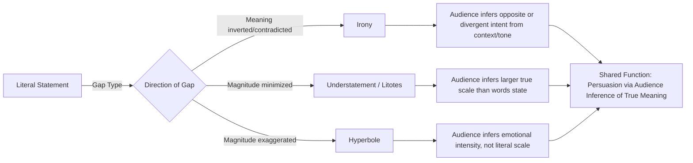

## Irony, Understatement, and Hyperbole

### Definitions and Core Distinctions

**Irony** is a trope in which the intended meaning diverges from — often inverts — the literal or expected meaning, requiring the audience to infer the speaker's true intent from context, tone, or shared knowledge. Classical rhetoric distinguishes several subtypes: **verbal irony** (saying the opposite of what is meant), **situational irony** (an outcome contrary to what was expected, independent of any speaker's utterance), and **dramatic irony** (audience knowledge exceeding a speaker/character's own, primarily a literary/theatrical category with limited direct application to executive rhetoric).

**Understatement (litotes/meiosis)** deliberately represents something as less significant, less intense, or smaller than it actually is, typically to produce an ironic or emphatic effect through contrast between the modest statement and the audience's knowledge of the true scale. **Litotes** specifically refers to understatement achieved through negation of the contrary ("not bad" = good; "no small feat" = a large feat).

**Hyperbole** is deliberate, self-evident exaggeration not intended to be taken literally, used for emphasis, humor, or emotional intensification ("I've told you a thousand times," "this deal will make history").

The three devices share a common rhetorical logic: **the literal statement and the intended meaning are held in productive tension**, and the persuasive effect depends on the audience recognizing and resolving that gap. This differentiates them from metaphor/metonymy (where a substitution is accepted as a working frame) — here, the literal statement is understood as *not* the actual claim, and the gap itself carries meaning (irony's incongruity, understatement's implied magnitude, hyperbole's implied intensity).

### Classical Foundations

Aristotle addressed irony (*eironeia*) primarily as a character disposition — a habitual self-deprecating understatement associated with modesty, contrasted with *alazoneia* (boastfulness). Socratic irony, the philosophical technique of feigned ignorance to expose an interlocutor's unexamined assumptions, is a foundational rhetorical-dialectical use case distinct from purely stylistic verbal irony.

Quintilian (*Institutio Oratoria*, Book VIII–IX) classified irony as a trope in which "a thing is understood to be other than what is actually said," treating it as capable of extending across an entire speech (sustained irony), not merely a single phrase. He treated hyperbole as a legitimate figure of amplification, noting the paradox that hyperbole is persuasive precisely because it is *not* believed literally but signals the speaker's genuine feeling through calculated overstatement. Litotes was recognized in classical and later rhetorical handbooks as a figure of restrained emphasis, common in oratory aiming for an appearance of modesty or credibility (understating one's own achievements to preempt charges of boastfulness — a face-management strategy).

### Structural Taxonomy

| Device | Subtype | Mechanism | Example |
| --- | --- | --- | --- |
| Irony | Verbal irony | Literal meaning inverted or contradicted by context/tone | "Great, another meeting that could've been an email." |
| Irony | Situational irony | Outcome contradicts expectation, independent of speech act | A fire station burning down |
| Irony | Socratic irony | Feigned ignorance to expose flawed reasoning in dialogue | "I don't understand — could you explain why this plan is safe?" |
| Irony | Sarcasm | Irony deployed with intent to mock or wound (register/tone subtype, not purely structural) | "Oh, brilliant plan." (meaning: poor plan) |
| Understatement | Litotes | Negation of the contrary to imply the positive/large | "Not the worst outcome we could've had" |
| Understatement | Meiosis (general) | Direct minimization for ironic or modest effect | "We had a small disagreement" (describing a major conflict) |
| Hyperbole | Amplifying hyperbole | Overstatement to intensify emotional/persuasive weight | "This is the deal of the century." |
| Hyperbole | Comic hyperbole | Overstatement for humor, often self-aware | "I could eat a horse." |
| Hyperbole | Auxesis (adjacent) | Structured amplification through escalating series rather than single exaggerated claim | "Not merely a setback, not merely a crisis, but an existential threat." |

### Persuasive Mechanics

**Irony:**

- **Audience co-creation of meaning**: because irony requires inference, the audience actively participates in constructing the "real" meaning, which increases engagement and often perceived intimacy/shared understanding with the speaker (in-group signaling — "we both know this is absurd").
- **Deniability and risk management**: verbal irony provides plausible deniability ("I was obviously joking") that allows speakers to voice criticism or dissent while retreating from full accountability if challenged — useful in politically sensitive executive contexts (e.g., mild ironic commentary on a rival's strategy).
- **Superiority and credibility signaling**: successfully deployed irony can position the speaker as perceptive and above naive literalism, enhancing ethos among audiences who "get it," though it risks alienating those who don't.

**Understatement/Litotes:**

- **Ethos via modesty**: understating one's own accomplishments preempts accusations of boastfulness, a classical strategy for maintaining credibility while still communicating achievement (the audience infers the true scale, crediting the speaker for restraint).
- **Amplification through contrast**: understating a serious situation ("this is a bit of a setback" for a major crisis) can paradoxically intensify audience perception of severity by creating ironic distance between words and reality — sometimes used for dark humor or composed crisis messaging ("keep calm" register).
- **De-escalation register**: in diplomatic or executive contexts, understatement is used to signal composure and control under pressure, projecting stability to stakeholders.

**Hyperbole:**

- **Emotional signaling over literal claim**: hyperbole functions as an intensity marker rather than a factual claim; audiences generally decode it correctly as non-literal, so its persuasive power rests on emotional transfer, not factual belief.
- **Memorability and quotability**: exaggerated formulations are often more memorable and shareable than precise, hedged claims — valuable in vision statements, marketing, and keynote rhetoric.
- **Risk of credibility erosion**: because hyperbole is inherently non-literal, overuse or context-inappropriate use (e.g., in contexts requiring precise factual claims, such as financial disclosures) can damage credibility if audiences interpret it — or later discover it was interpreted by others — as a literal, falsifiable claim rather than intended emphasis.

**[Inference]** Whether a given hyperbolic or ironic statement is perceived as effective emphasis versus reckless exaggeration is highly context- and audience-dependent (register, culture, prior credibility of speaker), and generalized claims about their net persuasive effect should be treated as tendencies rather than fixed rules.

### Function in Executive and Organizational Communication

**1. Crisis and setback communication (understatement).** Executives facing bad news often use calibrated understatement to project composure without denying reality: "We've had a challenging quarter" instead of "catastrophic quarter" — the moderated language manages stakeholder panic while still acknowledging the issue, though it carries risk of appearing evasive if perceived as excessive minimization.

**2. Vision and motivational rhetoric (hyperbole).** Keynote and product-launch language regularly uses hyperbole for energizing effect: "This will change everything," "the most important thing we've ever built." Effective when audience expectations account for genre convention (launch events are expected to be hyperbolic); risky in contexts demanding precision (regulatory filings, technical specifications, investor guidance with legal exposure).

**3. Internal culture and camaraderie (irony/sarcasm).** Shared ironic commentary among leadership or within teams can build in-group cohesion ("Sure, we'll just also solve world hunger by Friday") but requires careful audience calibration — irony that reads as dismissive of real concerns can damage trust if misjudged.

**4. Competitive positioning (ironic distancing).** Executives sometimes use light irony to comment on competitors or industry trends without direct confrontation, preserving deniability while still communicating a critical stance.

**5. Litigation and disclosure risk (hyperbole caution).** In regulated communication (earnings calls, SEC filings, public statements with legal exposure), hyperbolic language carries real legal risk if a claim could be construed as a material misstatement rather than obvious rhetorical flourish — a key practical constraint distinguishing marketing rhetoric from formal disclosure rhetoric.

### Worked Examples

> **Understatement**: A CEO addressing a significant product recall: "We've identified some issues that need our full attention." (Understates severity to maintain composed tone while signaling seriousness through the phrase "full attention" — audience infers greater severity from context/media coverage than words alone convey.)

> **Hyperbole**: A startup founder at a launch event: "This isn't just a product — it's the future of how humanity will work." (Deliberate, genre-appropriate overstatement intended to generate excitement; audience does not expect literal truth but responds to conveyed conviction and ambition.)

> **Verbal irony**: An executive responding to a competitor's failed product launch in a public forum: "Well, that's certainly one way to handle a rollout." (Literal statement neutral/positive; intended meaning critical — deniability preserved if challenged: "I was simply stating a fact.")

### Risks and Rhetorical Failure Modes

- **Irony misfire**: audiences who miss contextual or tonal cues may take ironic statements literally, producing confusion, reputational risk (a joke read as a genuine claim), or accusations of insincerity when the irony is later explained.
- **Sarcasm and morale damage**: irony deployed with a mocking edge (sarcasm) in leadership communication can be perceived as contemptuous, undermining psychological safety in teams even when the speaker intends humor.
- **Understatement read as denial**: excessive minimization of serious issues can be perceived as dishonest spin rather than composure, particularly if the gap between stated severity and actual severity becomes public knowledge (a major reputational risk in crisis communication).
- **Hyperbole and credibility/legal exposure**: repeated or extreme hyperbole can create a "boy who cried wolf" effect, reducing audience trust in future claims; in regulated contexts, hyperbolic claims about performance, safety, or results can expose the organization to legal liability if construed as factual assertions.
- **Cultural and cross-audience variance**: irony in particular is highly culture- and language-dependent in its conventions and recognizability; global executive communication (multinational audiences, translated remarks) carries elevated risk of irony being lost, misread, or offensive across cultural contexts.

### Relationship to Adjacent Devices

- **Euphemism**: shares understatement's minimizing function but differs by substituting a milder term rather than stating the same claim in reduced-intensity form ("passed away" vs. "we had a difficult loss").
- **Sarcasm**: a tonal/attitudinal deployment of verbal irony specifically intended to mock, distinct from irony's broader neutral or even affectionate uses.
- **Paradox and Oxymoron** (adjacent tropes not covered here in depth): both involve apparent contradiction, but operate at the level of logical/semantic structure rather than speaker-intent-vs-literal-meaning gap.
- **Auxesis/Climax** (as a scheme of amplification): often works alongside hyperbole in structured escalating argument sequences.

### Diagram: Literal-Intended Meaning Gap Across the Three Devices

### Chapter Comparison Table

| Dimension | Irony | Understatement/Litotes | Hyperbole |
| --- | --- | --- | --- |
| Direction of literal-intended gap | Meaning inverted/divergent | Magnitude minimized | Magnitude exaggerated |
| Primary persuasive function | In-group signaling, deniability, critique | Ethos via modesty, composed crisis tone | Emotional intensification, memorability |
| Typical executive use case | Competitive commentary, internal camaraderie | Crisis/setback messaging, humility framing | Vision statements, launches, marketing |
| Key risk | Misfire/literal misreading, sarcasm damaging morale | Perceived as evasive minimization/denial | Credibility erosion, legal/disclosure exposure |
| Cultural portability | Low — highly context/culture dependent | Moderate | Moderate-high (broadly recognized convention) |

### Related Topics

- Socratic Irony and Dialectical Questioning in leadership communication
- Euphemism and Dysphemism as adjacent minimizing/intensifying strategies
- Auxesis and Climax: structured amplification sequences
- Crisis Communication Register and composed-tone strategies
- Legal Risk in Promotional Language: puffery vs. actionable misstatement
- Cross-Cultural Rhetoric: irony recognition across linguistic and cultural contexts
- Ethos Management Through Self-Deprecation and Modesty Framing
- Sarcasm, Psychological Safety, and Team Communication Climate