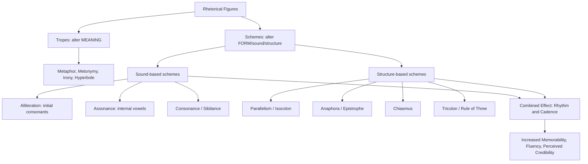

## Alliteration, Assonance, and Rhythm in Language

### Definitions and Core Distinctions

Unlike the tropes covered previously (metaphor, metonymy, irony), which operate on **meaning substitution**, the devices in this item belong to the category of **schemes** — figures that operate on the **sound, arrangement, and pattern of language itself**, with meaning held constant. This is the classical trope/scheme division: tropes alter meaning; schemes alter form.

**Alliteration** is the repetition of initial consonant sounds across nearby stressed syllables or words ("fail forward, fast"). Note the criterion is *sound*, not spelling — "knight" and "night" alliterate; "circle" and "civic" do not despite shared initial letters if pronunciation differs.

**Assonance** is the repetition of vowel sounds within nearby words, regardless of the surrounding consonants ("the tide will rise and guide us"). Related sound-repetition schemes include **consonance** (repetition of consonant sounds anywhere in the word, not just initially: "blank and think") and **sibilance** (a subtype of consonance specific to hissing sounds — s, sh, z: "seven silent seconds").

**Rhythm** in spoken rhetoric refers to the patterned arrangement of stressed and unstressed syllables, pacing, and phrase length that gives a passage a perceptible cadence — encompassing devices like **parallelism** (structural repetition, treated more fully as a scheme of balance rather than sound), **isocolon** (successive clauses of equal length/structure), and prose rhythm more broadly (sentence-length variation, the rule-of-three, climactic ordering).

### Classical Foundations

Classical rhetoric treated sound-based schemes primarily under the category of *elocutio* (style), specifically as *figurae verborum* (figures of words/sound) as distinct from *figurae sententiarum* (figures of thought). Gorgias, the Sophist rhetorician, was noted in antiquity for elaborate sound-patterning ("Gorgianic figures") including antithesis paired with assonance and rhyme-like effects, considered innovative but occasionally criticized (by Aristotle among others) as excessive ornamentation risking substance.

Cicero and Quintilian addressed *compositio* — the arrangement and rhythmic quality of prose — as a serious element of oratorical craft, discussing rhythmic clausulae (patterned rhythmic endings of sentences/cola in Latin oratory) that signaled a sentence's conclusion to the ear and produced a satisfying sense of closure, distinct from poetic meter but drawing on similar principles. This established the ancient recognition that **prose has its own rhythm, separate from poetry, and that skilled rhythmic control is a mark of oratorical mastery**.

### Structural Taxonomy

| Device | Mechanism | Example |
| --- | --- | --- |
| Alliteration | Repeated initial consonant sounds | "Fortune favors the bold" |
| Assonance | Repeated internal vowel sounds | "Deep in the sleepy green valley" |
| Consonance | Repeated consonant sounds anywhere in word | "Mad as a hatter" |
| Sibilance | Repeated hissing consonants (s/sh/z) | "The soft whisper of the sea" |
| Parallelism | Repeated grammatical structure across clauses | "Government of the people, by the people, for the people" |
| Isocolon | Successive clauses of matched length and structure | "Veni, vidi, vici" ("I came, I saw, I conquered") |
| Anaphora (scheme, adjacent) | Repetition of the same word/phrase at the start of successive clauses | "We shall fight on the beaches, we shall fight on the landing grounds..." |
| Epistrophe (adjacent) | Repetition at the end of successive clauses | "...of the people, by the people, for the people" |
| Tricolon / Rule of Three | Three-part rhythmic grouping | "Life, liberty, and the pursuit of happiness" |
| Chiasmus (adjacent) | Reversed grammatical/conceptual structure across parallel clauses | "Ask not what your country can do for you—ask what you can do for your country" |
| Cadence/clausula | Rhythmic patterning at sentence or clause endings | Falling rhythm at a speech's conclusion for a sense of finality |

### Persuasive and Cognitive Mechanics

**Processing fluency and memorability.** Sound-patterned phrases are processed more fluently by the brain, and fluency itself is a documented contributor to perceived truth and likability — the so-called "rhyme-as-reason" effect, in which statements that rhyme or otherwise sound patterned are judged as more credible or apt than semantically identical unpatterned statements, independent of actual truth-value. **[Inference]** The rhyme-as-reason effect (McGlone & Tofighbakhsh, 2000) is a replicated finding in the psycholinguistic literature, but its magnitude and robustness across contexts (e.g., high-stakes vs. trivial claims) should be treated as a documented tendency rather than a guaranteed, universally strong effect.

**Auditory memorability and virality.** Alliterative and rhythmic phrases are easier to encode and recall than unpatterned prose, which is why slogans, mnemonic devices, and quotable political/executive lines lean heavily on these schemes ("Make America Great Again," "Just Do It," "Think Different"). This matters practically for message diffusion: a rhythmically satisfying phrase is more likely to be repeated verbatim by media and audiences, extending message reach beyond the original delivery.

**Emphasis through pacing.** Isocolon and parallelism create rhythmic expectation; when a series of balanced clauses builds toward a final, often shorter or sharper clause (a technique related to climax/bathos structuring), the rhythmic pattern itself signals importance and produces a sense of rhetorical "landing," independent of the semantic content.

**Emotional tone-setting via sound quality.** Sibilance and soft assonance can create a hushed, intimate, or unsettling tone (frequently used in reflective or solemn executive remarks); hard alliteration (plosive consonants: b, p, d, t, k, g) can create an assertive, energetic, percussive quality suited to rallying or confrontational rhetoric.

### Function in Executive and Organizational Communication

**1. Slogan and tagline construction.** Corporate mission statements, product taglines, and internal campaign names disproportionately use alliteration and rhythm for retention: "Fail Fast, Learn Faster," "Customer Obsession," "Move Fast and Break Things" (rhythmic parallel imperative pairing).

**2. Speech cadence and applause lines.** Executive keynote speeches are often structured with rhythmic isocolon or tricolon builds at key transition or closing points to cue audience response (applause, note-taking, quotation), a technique borrowed directly from political oratory.

**3. Internal culture phrases and values statements.** Organizational values are frequently rendered in parallel, rhythmically balanced form for memorability and internal repetition ("Be bold. Be curious. Be kind." — tricolon with matched short imperative clauses).

**4. Risk of perceived style-over-substance.** Overuse of sound-patterned language in serious business communication (earnings calls, crisis statements) can appear evasive or manipulative if audiences sense the rhythm is compensating for a lack of substantive content — a live criticism of "spin" in corporate and political rhetoric.

**5. Naming and branding.** Product and company names frequently exploit alliteration or assonance for memorability and phonetic appeal (e.g., "PayPal," "Coca-Cola," "Best Buy") — a direct commercial application of the same cognitive fluency principle underlying rhetorical sound schemes.

### Worked Example

> Flat/unpatterned version: "We need to be more agile, we need to take more risks, and we need to make decisions faster."
>
> Rhythmically patterned (isocolon + anaphora): "We must move faster. We must risk more. We must decide sooner."
>
> Function: three grammatically parallel, similarly-lengthed clauses beginning with the same phrase ("We must") create a driving, escalating rhythm that is more memorable and more likely to be quoted verbatim than the flat original, while conveying identical propositional content.

### Risks and Rhetorical Failure Modes

- **Style overshadowing substance**: heavily sound-patterned language in high-stakes or serious contexts (layoffs, safety failures, financial restatements) risks appearing glib or manufactured, undermining perceived sincerity.
- **Forced or excessive alliteration**: straining for alliterative effect can produce awkward word choices that sacrifice clarity or precision for sound, a common amateur rhetorical fault ("synergistic strategic solutions" chosen for sound rather than meaning).
- **Overuse diminishing impact**: rhythmic devices rely partly on contrast with surrounding unpatterned prose for their effect; a speech saturated with tricolons and alliteration loses the emphasis value of any single instance (diminishing marginal rhetorical returns).
- **Cross-linguistic non-portability**: sound-based schemes are tied to the phonology of a specific language and rarely translate; a translated speech or global communication effort will typically lose alliterative/rhythmic effects present in the original unless deliberately re-crafted in the target language.
- **Register mismatch**: highly rhythmic, poetic-register language can feel inappropriate or overwrought in technical, financial, or procedural business contexts where plain, direct prose is the expected register.

### Relationship to Adjacent Devices

- **Anaphora/Epistrophe**: schemes of repetition at clause boundaries, frequently combined with isocolon to produce the layered "rhythm" effect discussed above; formally distinct from alliteration/assonance (word-boundary repetition of full words/phrases vs. sound repetition within/across words).
- **Chiasmus**: a structural (syntactic/conceptual) reversal scheme, often reinforced by rhythmic balance but defined by grammatical mirroring rather than sound repetition.
- **Metaphor/Irony (tropes, prior items)**: operate on meaning; the schemes here operate on form/sound while meaning remains constant — the two categories are frequently combined in the same passage (e.g., an extended metaphor delivered in rhythmically balanced tricolon).
- **Onomatopoeia** (adjacent, not covered in depth): sound imitating referent meaning directly, a distinct but related sound-symbolic device.

### Diagram: Trope vs. Scheme — Where Sound Devices Sit

### Chapter Comparison Table

| Dimension | Alliteration/Assonance (sound) | Parallelism/Isocolon (structure) | Combined Rhythm |
| --- | --- | --- | --- |
| Level of operation | Phonetic (sound repetition) | Syntactic (grammatical repetition) | Both — sound and structure reinforcing |
| Primary cognitive effect | Processing fluency, memorability | Expectation-setting, emphasis via balance | Cadence, quotability, applause-cueing |
| Typical executive use | Slogans, taglines, naming | Values statements, speech builds | Keynote closings, rallying calls |
| Key risk | Forced/awkward word choice | Overuse flattens emphasis value | Perceived style-over-substance |
| Cross-cultural portability | Low (language-specific phonology) | Moderate (structural pattern often translatable) | Low-moderate |

### Related Topics

- Anaphora, Epistrophe, and Chiasmus as Structural Repetition Schemes
- The Rhyme-as-Reason Effect and Processing Fluency in Persuasion
- Prose Rhythm and Clausulae in Classical Oratory (Cicero, Quintilian)
- Slogan and Tagline Construction in Corporate Branding
- Tricolon and the Rule of Three in Speech Architecture
- Register and Tone Matching: When Rhythmic Language Helps or Hurts Credibility
- Cross-Linguistic Adaptation of Sound-Based Rhetorical Devices
- Applause Lines and Audience Cueing in Executive Keynote Design