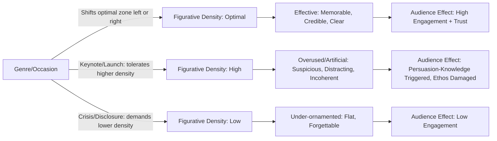

## Avoiding Overuse and Artificiality

### Definitional Framing

This item is not a device in itself but a **meta-rhetorical principle governing the deployment of all tropes and schemes** covered in this chapter (metaphor, simile, metonymy, synecdoche, irony, understatement, hyperbole, alliteration, assonance, and rhythmic schemes). Classical rhetoric names the failure mode this principle guards against **cacozelia** (affected, excessive, or tasteless ornamentation) and, more broadly, situates the concern under the virtue of **decorum** (*aptum* in Latin rhetorical theory) — the fitting match between style, subject, speaker, occasion, and audience.

The core diagnostic question for this item: **at what point does a rhetorical device stop serving the argument and start calling attention to itself as performance?** When that threshold is crossed, the device produces the opposite of its intended effect — audience skepticism, perceived insincerity, or a judgment that the speaker is more concerned with sounding clever than with substance.

### Classical Foundations

Aristotle's *Rhetoric* explicitly warned against excessive ornamentation, arguing that when figurative language becomes too conspicuous, "the personality of the speaker" is exposed as artful in a way that undermines trust — audiences grow suspicious of a speaker who seems to be performing eloquence rather than communicating truthfully. He distinguished between style that is *clear* (the primary virtue) and style that is merely *impressive*, cautioning that pursuit of the latter at the expense of the former is a rhetorical vice.

Cicero's concept of *decorum* held that appropriateness to subject, audience, occasion, and speaker's character was the master criterion governing all stylistic choice — a figure of speech perfectly apt in an epideictic (ceremonial) oration might be wildly inappropriate in a forensic (legal) or deliberative (policy) speech. Quintilian went further, arguing that ornamentation (*ornatus*) is only virtuous when it serves *perspicuitas* (clarity) and the argument's persuasive goal; ornamentation pursued for its own sake he classified as a corruption of eloquence, associating it with sophistic style-over-substance rhetoric that Roman oratorical education explicitly trained against.

The Renaissance and early modern rhetorical tradition coined **cacozelia** and **bombast** as pejorative terms for exactly this failure — language so saturated with figures that it reads as affected, overwrought, or ridiculous rather than persuasive.

### Diagnostic Taxonomy of Overuse and Artificiality Failures

| Failure Mode | Description | Example |
| --- | --- | --- |
| Device saturation | Too many figures per unit of text, exhausting audience attention and diluting each device's individual impact | A single paragraph containing three metaphors, two alliterative phrases, and a tricolon |
| Mixed/incompatible figures | Combining devices whose source domains or registers clash | A war metaphor immediately followed by a garden metaphor for the same referent |
| Register mismatch | A figure's tone doesn't match the occasion's gravity or formality | Hyperbolic, celebratory language in a layoff announcement |
| Forced/strained construction | A device pursued at the cost of natural word choice or clarity | Contorted syntax to preserve alliteration ("Precision-powered, performance-primed products") |
| Clichéd/dead figuration | Once-vivid devices worn down through overuse into meaningless filler | "Think outside the box," "move the needle," "low-hanging fruit" |
| Substance-obscuring ornamentation | Figurative language that substitutes for, rather than clarifies, actual argument or data | An earnings call reframing poor results entirely through metaphor with no concrete figures |
| Audience-exclusionary figuration | Devices requiring cultural, linguistic, or insider knowledge the actual audience lacks | An idiom or sports metaphor unfamiliar to an international audience |
| Inconsistent extended figuration | An extended metaphor whose entailments are not maintained consistently, producing logical incoherence | Introducing a "journey" metaphor for a project, then abruptly switching to "battle" language without transition |

### Cognitive and Persuasive Mechanics of the Failure

**Diminishing returns and habituation.** Each rhetorical device generates its effect partly through contrast with surrounding plain language — a well-placed metaphor stands out precisely because it is not the norm. When device density increases, marginal impact per device decreases (a form of rhetorical habituation), and audience attention shifts from content to noticing "how hard the speaker is trying."

**Suspicion of manipulation (source-monitoring).** Psycholinguistic and persuasion research broadly supports the idea that when an audience becomes consciously aware of a persuasive *technique* being used (rather than simply absorbing its content), they tend to discount or resist the message — a pattern related to reactance and persuasion-knowledge activation. Overuse of visible figuration is one of the most common triggers for this awareness, because it signals "crafted performance" rather than spontaneous, sincere communication.

**[Inference]** The general principle that noticeable persuasive technique triggers audience resistance is well-supported in persuasion-knowledge literature (Friestad & Wright's Persuasion Knowledge Model), though the precise threshold at which figurative density becomes "noticeable" to a given audience is context-dependent and not reducible to a fixed rule (e.g., word count or figure count per paragraph).

**Erosion of ethos through perceived insincerity.** Excessive ornamentation, especially in contexts calling for gravity (crisis communication, financial disclosure, bad news), risks being read as evasion or spin — the audience infers that elaborate language is compensating for weak or unwelcome substance, directly damaging the speaker's credibility (ethos), which classical rhetoric treats as the single most valuable persuasive resource.

### Function in Executive and Organizational Communication

**1. Calibrating figurative density to genre.** A product launch keynote conventionally tolerates high figurative density (hyperbole, extended metaphor, rhythmic build) because the genre itself signals celebratory, aspirational register. An earnings call, regulatory filing, or layoff announcement conventionally demands minimal figuration — plain, precise, verifiable language — because the genre signals accountability and factual precision. Applying keynote-level ornamentation to a disclosure context is a common and damaging genre mismatch.

**2. The "one governing metaphor" principle.** Experienced speechwriters typically limit a single speech or document to one extended, consistently maintained metaphor rather than several competing figurative frames, both to avoid mixed-metaphor incoherence and to allow the chosen frame to do sustained cognitive work rather than being diluted by competitors.

**3. Plain-language default with earned ornamentation.** A widely used practical heuristic in executive communication training: default to plain, direct statement for the majority of a document/speech, and reserve figurative language for specific high-leverage moments (openings, transitions, closings, or the single key argument) where its impact is deliberately concentrated rather than diffused.

**4. Audience sophistication and cliché fatigue.** Corporate and executive audiences are frequently over-exposed to business clichés ("synergy," "move the needle," "circle back," "boil the ocean"); reliance on these dead or near-dead figures can signal a lack of original thought and reduce perceived credibility with sophisticated audiences, even though the same figures may have once carried genuine rhetorical freshness.

**5. Crisis-specific caution.** In crisis and reputational-risk communication specifically, any perceptible ornamentation beyond the plainest necessary language is high-risk: stakeholders scrutinizing a crisis statement for evasion will treat noticeable figuration (metaphor, euphemism, hyperbole) as evidence of spin, regardless of speaker intent.

### Worked Example (Before/After Correction)

> **Overused/artificial version**: "We're not just turning the ship around — we're building a whole new fleet, charting uncharted waters, and setting sail toward a horizon of limitless possibility, because at the end of the day, when the rubber meets the road, we're the captains of our own destiny."
>
> **Diagnosis**: mixed and overextended nautical/vehicular/agency metaphors stacked without clear entailment discipline ("ship," "fleet," "uncharted waters," "horizon," "rubber meets the road," "captains of destiny" — at least three incompatible source domains), plus clichéd filler phrases ("at the end of the day," "limitless possibility") that add rhythmic bulk without semantic content.
>
> **Corrected version**: "We're not fixing the old system — we're building a new one. That means some short-term disruption, but it's the only way to actually solve the underlying problem."
>
> **Function**: retains one clear, consistently maintained construction-based framing (building new vs. fixing old) without competing metaphors, cliché filler, or ornamental excess; states the practical consequence in plain language.

### Practical Self-Check Method

1. **Count active figures per paragraph/section** — flag sections with more than one or two active, noticeable devices (dead/conventionalized metonymy generally doesn't count against this budget).
2. **Test for mixed-domain conflicts** — trace every metaphor/image back to its source domain and confirm no two active figures in the same passage draw from clashing domains.
3. **Match figurative register to genre and stakes** — ask whether the occasion (crisis, disclosure, celebration, internal culture-building) conventionally tolerates high or low figurative density.
4. **Read aloud for strain** — awkward phrasing chosen to preserve alliteration, rhythm, or a metaphor's consistency is a signal the device is driving the sentence rather than serving it.
5. **Check for cliché** — replace worn business idioms with either a fresher original figure or plain statement; retaining a dead metaphor is lower-risk than reaching for a new one that risks failure, but both are preferable to filler clichés that signal lack of original thought.
6. **Ask "does this claim survive translation to plain language without loss?"** — if a figurative claim, stripped of its ornamentation, reveals no substantive content underneath, the figure is likely masking rather than illuminating the argument.

### Risks and Rhetorical Failure Modes (Summary)

- **Perceived insincerity/spin**, especially in high-stakes or bad-news contexts.
- **Audience fatigue and diminished per-device impact** from saturation.
- **Mixed-metaphor incoherence** signaling carelessness rather than craft.
- **Cliché fatigue** with sophisticated or frequently-addressed audiences (e.g., recurring investor or employee audiences hearing the same corporate idioms repeatedly).
- **Genre mismatch** — importing celebratory or highly figurative registers into accountability-demanding contexts (disclosures, crisis statements, legal communication).
- **Legal/disclosure risk compounding** — in regulated communication, ornamental language can obscure or appear to obscure material facts, a concern distinct from but related to the hyperbole-specific legal risk discussed in the irony/hyperbole item.

### Relationship to Adjacent Chapter Concepts

- **Decorum/Aptum** (classical concept underlying this entire item): the master criterion of style-to-occasion fit governing every device covered in the chapter.
- **Ethos management**: overuse and artificiality primarily damage the speaker's credibility resource; this item functions as the risk-management counterpart to the persuasive-power items earlier in the chapter.
- **Genre conventions in executive communication**: keynote/launch rhetoric vs. disclosure/crisis rhetoric represent opposite ends of the figurative-density tolerance spectrum discussed throughout this item.
- **Plain Language and Clarity (adjacent, not covered in depth here)**: the stylistic counterweight to figurative ornamentation; classical rhetoric treats clarity (*perspicuitas*) as the foundational virtue that ornamentation must never undermine.

### Diagram: Figurative Density vs. Persuasive Effectiveness

### Chapter Comparison Table

| Dimension | Under-ornamentation | Optimal Ornamentation | Overuse/Artificiality |
| --- | --- | --- | --- |
| Audience attention | On content, but low engagement | On content, high engagement | Shifts to noticing the technique itself |
| Ethos effect | Neutral to mildly flat | Enhanced (perceived skill + sincerity) | Damaged (perceived spin/insincerity) |
| Memorability | Low | High | Variable — may be memorable for wrong reasons (mockery) |
| Appropriate genre | Highly technical/procedural contexts | Most executive communication contexts | Rarely appropriate; occasionally viable in pure entertainment/ceremonial contexts |
| Governing classical concept | Insufficient *ornatus* | Balanced *decorum* | Violated *decorum* / cacozelia |

### Related Topics

- Decorum (*Aptum*) as the Master Criterion of Classical Style Theory
- The Persuasion Knowledge Model and Audience Resistance to Perceived Technique
- Plain Language Principles and the Clarity-Ornamentation Trade-off
- Genre Conventions Across Executive Communication Contexts (keynote vs. disclosure vs. crisis)
- Cliché Recognition and Refresh Strategies in Corporate Language
- Legal and Compliance Constraints on Figurative Language in Regulated Communication
- Speechwriting Practice: The "One Governing Metaphor" Rule
- Ethos Repair After Perceived Rhetorical Manipulation