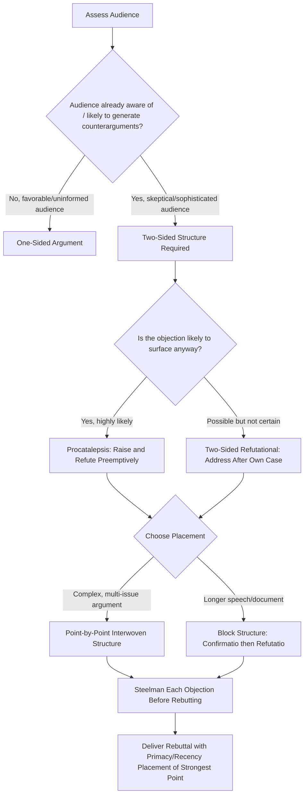

## Structuring Argument and Counterargument

### Definitional Framing

This item addresses the **architectural organization** of persuasive discourse when opposing positions are in play — how an argument is built to withstand, anticipate, or incorporate counterargument, as distinct from the content of any individual claim. This shifts the chapter's focus from *style* (the tropes/schemes of the prior chapter) to *dispositio* — classical rhetoric's term for the arrangement of argumentative material, specifically in the adversarial or dialectical context of debate and objection handling.

The central structural tension this item addresses: **an argument presented in isolation, without engaging opposing views, is generally weaker than one that explicitly anticipates and answers objections** — but the manner, placement, and proportion of that engagement is itself a strategic choice with significant persuasive consequences.

### Classical Foundations

Classical rhetorical arrangement (*dispositio*) in forensic and deliberative oratory typically divided a speech into a canonical sequence, most fully articulated by Cicero and later Quintilian:

1. **Exordium** — introduction, securing audience attention and goodwill
2. **Narratio** — statement of facts/background
3. **Partitio** (or *divisio*) — outline of the points to be argued
4. **Confirmatio** — positive proof of one's own case
5. **Refutatio** — refutation of the opposing case
6. **Peroratio** — conclusion, summary, and emotional appeal

The **refutatio** stage is the classical ancestor of modern counterargument-handling, and its *placement* was itself a debated strategic question in antiquity: Quintilian noted that refutation could occur either after the speaker's own proof (confirmatio-then-refutatio, allowing the speaker's case to be established first) or interwoven throughout, addressing objections as they became relevant to each point — a structural choice modern argumentation theory still treats as consequential.

Aristotle's *Rhetoric* also addressed the *enthymeme* (the rhetorical syllogism, an argument built on probable premises rather than strict logical certainty) as the core structural unit of persuasive argument, and treated anticipation of counterargument (*prolepsis* / *procatalepsis* — raising and answering an objection before the opponent raises it) as a sophisticated technique for pre-empting refutation.

### Structural Taxonomy of Argument-Counterargument Architectures

| Structure | Description | Typical Use Case |
| --- | --- | --- |
| One-sided argument (ex parte) | Presents only supporting reasons, omits opposing views entirely | Low-sophistication audiences already favorable to the position; brief persuasive contexts |
| Two-sided refutational | Presents own case, then explicitly raises and rebuts the strongest opposing arguments | Sophisticated or skeptical audiences; high-stakes persuasion; contexts with known counterarguments circulating |
| Two-sided non-refutational | Acknowledges opposing view exists but does not rebut it, leaving it unresolved | Balanced/informational contexts, or when direct refutation would seem defensive |
| Procatalepsis (anticipatory refutation) | Raises the objection oneself before the opponent does, then answers it within one's own argument | Preempting a known, likely objection to remove its rhetorical force |
| Point-by-point (interwoven) rebuttal | Alternates between one's own claims and objections/counters at each individual point | Complex, multi-issue debates; technical or policy argumentation |
| Block structure (confirmatio-then-refutatio) | All positive argument presented first as a block, then all refutation presented as a second block | Longer speeches/documents; allows the affirmative case to be fully established before conceding any ground to objections |
| Steelmanning | Presenting the opposing argument in its strongest, most charitable form before refuting it | High-credibility contexts where audience sophistication would penalize a weak/strawman rebuttal |
| Strawmanning (fallacious, to avoid) | Presenting a weakened or distorted version of the opposing argument for easier refutation | Not a legitimate structural choice — a fallacy risk to be avoided, covered under objection-handling ethics |

### Persuasive Mechanics: Why Structure Matters Independent of Content

**Inoculation theory.** A substantial body of persuasion research (originating with McGuire's inoculation theory, 1961, and subsequently applied extensively in political and health communication) demonstrates that pre-exposing an audience to a weakened form of a counterargument, along with its refutation, builds resistance to that counterargument when the audience later encounters it in full force — analogous to a medical inoculation. This provides a strong theoretical basis for the persuasive value of proactive refutation (procatalepsis) over purely one-sided argument.

**Audience sophistication effects.** Classic persuasion research (Hovland, Lumsdale & Sheffield's WWII-era studies, subsequently refined) found that two-sided arguments are generally more persuasive than one-sided arguments **for audiences that are already aware of counterarguments or are more educated/skeptical**, while one-sided arguments can be equally or more effective for audiences unlikely to encounter or generate counterarguments themselves. This makes audience analysis a prerequisite structural decision, not an afterthought.

**[Inference]** The general direction of these classic findings (two-sided > one-sided for sophisticated/opposed audiences) is well-established in persuasion research, but exact effect sizes vary considerably by topic, source credibility, and delivery context, and should not be treated as a fixed formula guaranteeing a specific persuasive outcome in any given executive scenario.

**Credibility transfer via fair engagement.** Explicitly and accurately representing an opposing view (steelmanning) before rebutting it signals intellectual honesty and confidence, enhancing the speaker's ethos — audiences tend to trust a speaker who appears unafraid of the strongest version of the opposing case more than one who avoids or distorts it.

**Primacy/recency effects on structural placement.** Classical and modern rhetoric both recognize that information placed at the beginning (primacy) or end (recency) of an argument sequence tends to be more memorable and impactful than information placed in the middle — a consideration directly relevant to whether refutation should precede or follow one's own confirmatio, and whether a rebuttal's strongest point should open or close that section.

### Function in Executive and Organizational Communication

**1. Board and investor presentations.** Executives presenting a strategic recommendation to a sophisticated, skeptical board are well-served by two-sided refutational structure — explicitly naming the strongest objections (cost, risk, timing) and addressing them directly, since board members are likely to have already considered or will raise these objections regardless.

**2. Internal change management.** When announcing organizational change likely to generate employee resistance, procatalepsis (anticipatory refutation: "You may be wondering whether this means layoffs — it doesn't, and here's why") can defuse anxiety-driven objections before they crystallize into active resistance or rumor.

**3. Competitive and sales positioning.** Steelmanning a competitor's genuine strength before articulating a differentiated advantage is often more persuasive to sophisticated buyers than ignoring or dismissing the competitor, since sophisticated buyers will independently generate the comparison regardless.

**4. Crisis and reputational communication.** Structuring a crisis response to proactively address the most damaging anticipated question or criticism (rather than waiting for media/stakeholders to raise it) is a direct executive application of procatalepsis, often reducing the perception of evasiveness.

**5. Negotiation framing.** In negotiation contexts, presenting the counterparty's likely position accurately before presenting one's own counter-proposal can build the credibility needed for the counter-proposal to be taken seriously, rather than dismissed as uninformed.

### Worked Example (Structural Comparison)

> **One-sided (weaker for sophisticated audience)**: "We should invest in the new platform because it will reduce costs by 20% and improve delivery speed."
>
> **Two-sided refutational (procatalepsis)**: "We should invest in the new platform because it will reduce costs by 20% and improve delivery speed. The obvious concern is the six-month migration risk — and that's real, but our phased rollout plan limits exposure to a single, reversible pilot team before any full-scale commitment. Compared to the ongoing cost of our current system, the migration risk is smaller than the risk of doing nothing."
>
> **Function**: the second version names the audience's most likely objection (migration risk) before they raise it, concedes its legitimacy (avoiding strawmanning), and then directly neutralizes it with a specific mitigation (phased rollout) and a comparative reframe (risk of inaction) — producing a structurally more resilient argument than the flat one-sided claim.

### Risks and Failure Modes

- **Strawmanning**: presenting a distorted or weakened version of the opposition to make refutation easier is both an ethical/logical fallacy and a credibility risk — sophisticated audiences who recognize the distortion will discount the entire argument, not just the strawmanned portion.
- **Over-conceding**: excessive acknowledgment of opposing strength without a correspondingly strong rebuttal can leave the audience more persuaded by the objection than the original claim (a risk specific to steelmanning executed without adequate counter-argument).
- **Refutation-heavy imbalance**: devoting disproportionate space to rebutting objections relative to establishing one's own affirmative case can shift the rhetorical center of gravity onto the opposition's terms, implicitly framing the debate on the opponent's chosen ground.
- **Raising objections the audience hadn't considered**: procatalepsis carries the risk of introducing a damaging counterargument to an audience that would not otherwise have generated it themselves — a strategic judgment call requiring accurate assessment of audience's existing knowledge/skepticism.
- **Structural incoherence in point-by-point rebuttal**: interweaving claims and counters at high granularity can fragment the argument's overall throughline if not carefully signposted, leaving the audience uncertain what the speaker's actual net position is.
- **Timing/placement errors**: burying the strongest rebuttal in the middle of a long refutatio section (rather than leveraging primacy/recency) can waste its persuasive impact.

### Relationship to Adjacent Chapter Concepts

- **Refutatio and Objection-Handling Techniques** (subsequent chapter items): this item establishes the architectural framework within which specific refutation techniques (direct rebuttal, concession-and-pivot, reframing) are deployed.
- **Logical Fallacies** (adjacent chapter content): strawmanning is formally classified as an informal fallacy; awareness of this structural item is directly relevant to fallacy avoidance in one's own argumentation.
- **Ethos** (cross-chapter): the credibility effects of steelmanning and honest counterargument engagement connect directly to classical ethos theory established in earlier persuasive-appeals content.
- **Audience Analysis** (foundational, cross-chapter): the one-sided vs. two-sided structural choice is explicitly contingent on audience sophistication and prior exposure to counterarguments, making this item dependent on accurate audience assessment as a prerequisite skill.

### Diagram: Argument-Counterargument Structural Decision Flow

### Chapter Comparison Table

| Dimension | One-Sided Argument | Two-Sided Refutational | Procatalepsis (Anticipatory) |
| --- | --- | --- | --- |
| Best-suited audience | Favorable, low-sophistication, low-exposure to counterarguments | Skeptical, sophisticated, already aware of objections | Audience likely to raise a specific known objection |
| Ethos effect | Neutral (no engagement with opposition) | Enhanced via fair engagement | Strongly enhanced — signals confidence and foresight |
| Key risk | Vulnerable if audience encounters counterargument later (no inoculation) | Over-conceding or imbalance if rebuttal is weak | Introducing an objection the audience hadn't considered |
| Theoretical basis | Simplicity/clarity for low-conflict contexts | Two-sided persuasion research, ethos via fairness | Inoculation theory |
| Typical executive use | Brief internal announcements to aligned teams | Board/investor presentations, competitive positioning | Crisis communication, change management |

### Related Topics

- Refutatio Techniques: Direct Rebuttal, Concession-and-Pivot, and Reframing
- Inoculation Theory and Resistance to Persuasion (McGuire)
- Strawman, Steelman, and the Ethics of Representing Opposing Views
- The Enthymeme and Probable-Premise Argumentation (Aristotle)
- Audience Analysis and Sophistication Assessment as a Prerequisite Skill
- Logical Fallacies in Adversarial Argumentation
- Primacy-Recency Effects in Speech and Document Structuring
- Q&A and Live Objection Handling in Executive Presentations