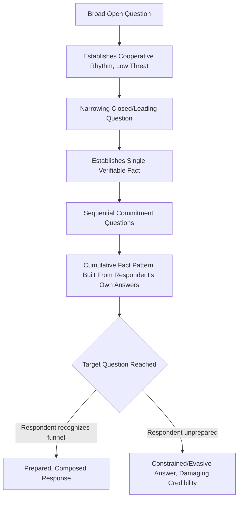

## Cross-Examination and Probing Questions

### Definitional Framing

Cross-examination is a structured, adversarial questioning method aimed at testing, exposing weaknesses in, or extracting concessions from an interlocutor's position — historically rooted in legal procedure but broadly applicable to competitive debate, board interrogation, due-diligence interviews, media interviews, and executive Q&A defense. **Probing questions** are the broader category of interrogative techniques designed to elicit information, test the depth or consistency of a claim, or reveal unstated assumptions, of which cross-examination is the adversarial/legal subtype.

This item shifts the chapter's focus from *structuring one's own argument* (the prior item) to the **interrogative mode** — using questions rather than assertions as the primary rhetorical instrument, either to attack an opposing position (as questioner) or to withstand such questioning (as respondent, covered in the "withstanding" subsection below).

### Classical and Disciplinary Foundations

The classical rhetorical ancestor of cross-examination is **Socratic elenchus** — the dialectical method in Plato's dialogues wherein Socrates uses a sequence of questions to lead an interlocutor into revealing a contradiction within their own stated position, thereby refuting it using the interlocutor's own premises rather than external counter-assertion. This is structurally distinct from adversarial legal cross-examination in *intent* (Socratic method aims at joint discovery of truth, at least nominally, while legal cross-examination aims at impeachment of a witness's credibility or testimony) but shares the core technique: **using sequential, controlled questions rather than direct assertion to expose weakness**.

Legal cross-examination technique was formalized extensively in Anglo-American adversarial trial practice, with foundational modern treatments (e.g., Irving Younger's "Ten Commandments of Cross-Examination," a widely taught mid-20th-century framework in American trial advocacy) establishing principles such as: ask only leading questions, ask one new fact per question, never ask a question to which you do not already know the answer, and do not permit the witness to explain.

Formal and competitive debate traditions (parliamentary debate, policy debate's "cross-examination" period, Lincoln-Douglas debate) independently developed structured cross-examination periods with their own conventions, generally more oriented toward exposing logical inconsistency or unsupported claims than witness credibility per se.

### Structural Taxonomy of Question Types

| Question Type | Function | Example |
| --- | --- | --- |
| Leading question | Suggests its own answer, used to control witness/respondent testimony | "You had access to the budget figures before the meeting, didn't you?" |
| Closed/binary question | Forces a yes/no or narrow-choice answer, limiting evasive elaboration | "Did you approve this expenditure — yes or no?" |
| Open probing question | Invites elaboration, used to explore reasoning or surface unstated assumptions | "Walk me through how you arrived at that projection." |
| Clarifying question | Requests precision on an ambiguous or vague claim | "When you say 'significant risk,' what probability are you estimating?" |
| Hypothetical/scenario question | Tests the robustness or consistency of a position under a constructed scenario | "If costs rose 30% instead of 10%, would your recommendation change?" |
| Commitment question | Locks the respondent into a stated position for later use in argument | "So you agree the current process is the primary bottleneck?" |
| Impeachment question | Confronts the respondent with a prior inconsistent statement or contradicting evidence | "Last quarter you said X — how does that square with what you're telling us now?" |
| Socratic/elenctic question | Sequenced questions building toward exposing an internal contradiction | A series of questions establishing premises the respondent accepts, which jointly contradict their conclusion |
| Funnel sequencing | Broad open questions narrowing progressively to specific, harder-to-evade questions | Starting with "How is the project going?" before narrowing to "Why is it three months behind schedule?" |
| Loaded/complex question (fallacious, to flag) | Embeds an unproven assumption within the question itself | "Why did the team fail to meet the deadline?" (assumes failure without establishing it) |

### Persuasive and Dialectical Mechanics

**Control through question form.** Leading and closed questions structurally limit the respondent's ability to reframe, elaborate, or introduce favorable context — a core technique in adversarial cross-examination where the questioner, not the witness, controls the narrative. This is why formal cross-examination doctrine emphasizes leading questions almost exclusively, reserving open questions for direct examination of a cooperative witness.

**Commitment and consistency pressure.** Once a respondent publicly commits to a premise (via a commitment question), social and cognitive consistency pressures (well-documented in commitment-consistency persuasion research, e.g., Cialdini) make it psychologically costly for them to later contradict that premise — a mechanism cross-examiners exploit by securing small, seemingly innocuous commitments early that jointly constrain the respondent's later answers.

**Funnel technique and cognitive narrowing.** Beginning with broad, low-threat questions before narrowing to specific, harder questions reduces the respondent's opportunity to anticipate and prepare defensive framing for the eventual difficult question, and establishes a cooperative questioning rhythm that makes evasion on the narrow question more conspicuous by contrast.

**The "never ask a question you don't know the answer to" principle.** This foundational cross-examination rule (from trial advocacy doctrine) reflects the asymmetric risk of open-ended interrogative attack: an unexpected or well-reasoned answer can hand the respondent a persuasive opening the questioner did not anticipate, whereas a question with a known, constrained answer set keeps control with the questioner.

**[Inference]** The trial-advocacy "commandments" (Younger's framework and similar) are pedagogically dominant and widely taught, but their universal applicability is debated even within legal practice — some experienced litigators deliberately depart from rigid adherence to these rules situationally; they should be understood as strong defaults rather than inviolable laws.

### Function in Executive and Organizational Communication

**1. Board and investor interrogation (as questioner).** Board members and analysts use structured probing sequences to test management's projections, risk assessments, and consistency across reporting periods — often employing funnel technique (broad strategic questions narrowing to specific line-item scrutiny) and impeachment questions referencing prior guidance.

**2. Due diligence and M&A interviews.** Acquiring-side executives and advisors use cross-examination-style techniques to test target-company management's claims about revenue quality, customer concentration, or operational risk, often via hypothetical/scenario questions designed to reveal unstated fragility in a business model.

**3. Media interview defense (as respondent).** Executives facing adversarial media questioning benefit from recognizing leading and loaded questions in real time and responding to the question's accurate content rather than its embedded framing (a technique often called "bridging" in media training — acknowledging the question, declining the embedded frame, and redirecting to a prepared, accurate point).

**4. Internal accountability reviews.** Structured probing (funnel sequencing, clarifying questions) is used in post-mortems and performance reviews to move past vague self-assessment ("it was a tough quarter") toward specific, falsifiable claims that can be evaluated against evidence.

**5. Negotiation and deal-term interrogation.** Probing questions are used to test the other party's stated constraints (budget ceilings, timelines) for genuine firmness versus negotiating position, often via hypothetical scenarios that would reveal flexibility if it exists.

### Worked Example

> **Ineffective (open, uncontrolled) cross-examination question**: "Can you tell us about the delays on this project?"
>
> **Problem**: invites open elaboration, giving the respondent full control to explain, contextualize, and minimize.
>
> **Effective (leading, controlled) cross-examination sequence**:
>
> Q1: "The original delivery date was March 1st, correct?"
>
> Q2: "As of today, the project has not been delivered?"
>
> Q3: "No client communication about the delay was sent until April, was it?"
>
> **Function**: each question establishes a single, narrow, verifiable fact; the respondent has minimal room to reframe; by the third question, the cumulative effect (missed deadline + delayed communication) has been established through the respondent's own confirmations rather than the questioner's assertion — a structurally stronger position because it cannot be dismissed as the questioner's opinion.

### Withstanding Cross-Examination (Respondent-Side Technique)

- **Recognize question type before answering.** Identify whether a question is genuinely open, subtly leading, or loaded with an unproven assumption before responding — answering a loaded question directly can implicitly concede its embedded premise.
- **Correct false premises explicitly.** If a question assumes something false or unproven ("Why did the team fail...") the respondent should name and correct the assumption before answering ("I'd push back on 'failure' — we hit 90% of targets; here's the context on the remaining 10%").
- **Bridge to substance.** A trained response technique: briefly acknowledge the question, decline any unfair or narrow framing, and pivot to the accurate, prepared point — avoiding both evasion (which reads as guilt) and simply accepting the frame (which cedes control).
- **Resist artificial binary constraints.** When a closed yes/no question genuinely cannot be answered honestly without qualification, a respondent is rhetorically justified in briefly stating why a binary answer would be misleading before providing the qualified answer — though excessive resistance to answering directly risks appearing evasive.
- **Maintain composure under funnel pressure.** Recognizing a funnel sequence in progress (broad questions narrowing toward a target) allows a respondent to prepare for the eventual specific question rather than being caught off guard by the apparent innocuousness of early questions.

### Risks and Failure Modes

- **Loaded/complex questions (as questioner)**: embedding unproven assumptions in a question is a recognized informal fallacy (*plurium interrogationum*, "many questions" fallacy / complex question fallacy) and can damage the questioner's credibility if the assumption is publicly exposed and corrected by the respondent.
- **Over-aggressive tone damaging perceived fairness**: cross-examination technique that appears bullying or unfair to an observing audience (board, jury, public) can generate sympathy for the respondent and damage the questioner's own ethos, particularly in contexts where the audience is evaluating the questioner's character alongside the substantive exchange.
- **Answering a question not asked (respondent)**: attempting to redirect too transparently, without genuinely engaging the actual question, is often perceived by sophisticated audiences as evasive, undermining credibility more than a direct but unfavorable answer would.
- **Conceding via silence or hesitation**: in high-stakes adversarial contexts, visible hesitation before answering a direct factual question can itself be read by audiences as evidence of concealment, independent of the eventual answer's content.
- **Over-reliance on leading questions producing brittle answers**: a respondent who senses excessive leading may become guarded or hostile, reducing the natural, credible quality of subsequent answers even on genuinely neutral questions.
- **Losing sight of overall narrative in granular questioning**: highly granular, fact-by-fact cross-examination sequences risk losing the audience's attention or overall comprehension if not periodically synthesized back into the larger argument they are meant to support.

### Relationship to Adjacent Chapter Concepts

- **Structuring Argument and Counterargument** (prior item): cross-examination is often the live, interactive mechanism through which the two-sided/refutational structures discussed previously are tested in real time by an opposing party.
- **Logical Fallacies**: the loaded/complex question is a specific fallacy category directly relevant to both offensive (avoid committing) and defensive (recognize and correct) cross-examination practice.
- **Media Training and Bridging Technique** (adjacent executive skill): a direct practical application of respondent-side cross-examination defense.
- **Ethos and Perceived Fairness**: audience perception of a questioner's fairness or a respondent's evasiveness both function as ethos inputs, connecting this item to the broader persuasive-appeals framework.

### Diagram: Cross-Examination Question Funnel Structure

### Chapter Comparison Table

| Dimension | Socratic/Elenctic Questioning | Legal-Style Cross-Examination | Open Probing Question |
| --- | --- | --- | --- |
| Primary intent | Joint discovery, expose internal contradiction | Impeach credibility, control narrative | Elicit information, explore reasoning |
| Typical question form | Sequenced, building toward contradiction | Leading, closed, tightly controlled | Open-ended, exploratory |
| Executive use case | Internal strategy debate, mentoring | Board scrutiny, due diligence, hostile media | Post-mortems, coaching, exploratory research |
| Respondent risk | Being led into self-contradiction | Loss of narrative control, forced concessions | Over-disclosure if unprepared |
| Governing skill for defense | Consistency-checking one's own premises in advance | Recognizing leading/loaded framing, bridging | Structuring concise, complete answers |

### Related Topics

- Socratic Elenchus and Dialectical Method in Executive Reasoning
- Media Training: Bridging Technique and Frame Correction
- The Complex/Loaded Question Fallacy and Its Detection
- Commitment and Consistency Principles in Persuasion (Cialdini)
- Due Diligence Interview Design in M&A Contexts
- Board Governance: Structuring Effective Management Interrogation
- Post-Mortem and Accountability Review Question Design
- Composure and Nonverbal Signaling Under Adversarial Questioning