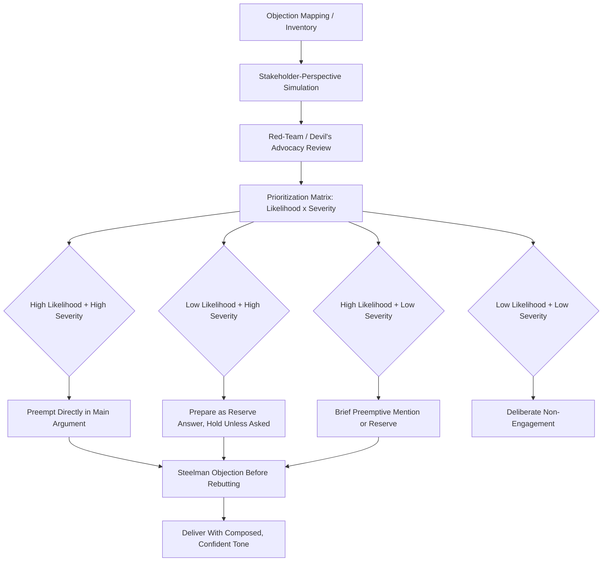

## Anticipating and Preempting Objections

### Definitional Framing

This item addresses the **proactive, preparatory dimension** of objection handling — identifying likely objections before they are raised and deciding whether, how, and where to address them, as opposed to the reactive skills of live rebuttal or cross-examination defense. It formalizes and extends the *procatalepsis* technique introduced in the "Structuring Argument and Counterargument" item into a full preparatory methodology: systematic objection-mapping, prioritization, and integration planning conducted before a speech, presentation, negotiation, or high-stakes communication event.

The distinguishing question this item answers: **given that some objections are foreseeable, what is the systematic process for identifying them in advance, and what governs the decision to preempt, prepare-but-hold, or deliberately not address a given objection?**

### Classical and Disciplinary Foundations

Classical rhetoric's *procatalepsis* (also called *prolepsis* or, in Latin, *praesumptio*/*occupatio*) — raising and answering an anticipated objection within one's own speech before an opponent or audience member raises it — is the direct ancestor of this item's practice. Quintilian discussed this technique as a mark of a well-prepared orator, noting its dual function: it demonstrates the speaker has genuinely considered opposing views (an ethos benefit) and it strips the eventual objection of its rhetorical force by having already answered it on the speaker's own terms rather than the opponent's.

Modern argumentation theory formalizes this under the broader concept of **dialectical obligations** — the idea, prominent in pragma-dialectical argumentation theory (van Eemeren and Grootendorst), that a reasonable arguer is expected to anticipate and be prepared to answer the standard critical questions relevant to their argument scheme, not merely assert a claim and wait to be challenged.

**Inoculation theory** (McGuire, 1961, referenced in the prior item on argument structure) provides the empirical/psychological grounding specific to *preemptive* objection handling: exposing an audience to a weakened counterargument and its refutation in advance measurably increases resistance to that counterargument when later encountered — directly supporting preemption as a persuasion strategy rather than merely a defensive courtesy.

### Structural Taxonomy of Objection-Anticipation Methods

| Method | Description | Typical Application |
| --- | --- | --- |
| Objection mapping/inventory | Systematic brainstorming of all plausible objections from every relevant stakeholder perspective before drafting the argument | Board presentations, major proposals |
| Stakeholder-perspective simulation | Explicitly role-playing the perspective of each anticipated skeptical party (finance, legal, a specific board member, a competitor) to surface objections that would not occur from the presenter's own vantage point | Cross-functional proposals, M&A pitches |
| Red-teaming / devil's advocacy | Assigning a person or subgroup to formally attack the argument before it is finalized, simulating adversarial scrutiny | High-stakes strategic decisions, crisis response planning |
| Objection prioritization matrix | Ranking anticipated objections by likelihood of being raised and severity/damage if unaddressed, to allocate preparation effort | Time-constrained preparation for major presentations |
| Preemption (procatalepsis) | Raising and answering the objection within the main argument itself, before it can be raised by others | Objections nearly certain to arise and seriously damaging if left unaddressed |
| Prepared reserve (hold-and-ready) | Preparing a full answer to an objection but not raising it proactively, deploying only if actually asked | Objections that are possible but not certain, where raising them might introduce a doubt the audience wouldn't otherwise have had |
| Deliberate non-engagement | Consciously deciding not to prepare a defense against a particular objection, judged too unlikely, too damaging to dignify, or strategically better ignored | Objections lacking a strong rebuttal, or where a rebuttal would inadvertently amplify a weak criticism |

### Persuasive and Strategic Mechanics

**The preemption trade-off (raise-and-risk vs. omit-and-hope).** Every anticipated objection presents the same core strategic choice, discussed in the prior item and formalized here: preempting an objection guarantees the speaker controls its framing and can neutralize it in advance (inoculation benefit), but it also guarantees the audience is exposed to the objection — a risk if a meaningful fraction of the audience would not otherwise have generated that objection independently. This trade-off is the central analytical task of this item's methodology.

**Likelihood-severity prioritization.** Not all foreseeable objections merit the same preparatory investment. A systematic approach cross-references (a) the probability an objection will actually surface, given the specific audience's composition and known concerns, against (b) the damage that objection would cause if raised and left unanswered — concentrating preemptive effort on the high-probability, high-severity quadrant, using prepared-reserve treatment for lower-probability but still-severe objections, and largely ignoring low-probability, low-severity objections.

**The "elephant in the room" principle.** When an objection is so obvious or widely known that most of the audience is already aware of it (a competitor's well-known advantage, a company's recent public failure, an evident cost concern), failing to address it proactively is itself read as evasive or as an implicit concession — in these cases, preemption is close to mandatory regardless of the general raise-and-risk calculus, because the "risk" of introducing the objection is moot (the audience already has it).

**Steelmanning as a preparatory discipline.** Effective objection anticipation requires constructing the strongest plausible version of each anticipated objection (not a convenient weak version) during the preparation phase — a discipline that both produces more robust final rebuttals and reduces the risk of being caught unprepared by an objection stronger than the one the speaker had rehearsed against.

**[Inference]** The precise weighting between "likelihood" and "severity" in objection prioritization is a practical heuristic drawn from communication and negotiation training practice rather than a rigorously quantified formula; experienced practitioners apply judgment informed by specific audience knowledge rather than a fixed numerical model.

### Function in Executive and Organizational Communication

**1. Pre-board-meeting objection mapping.** Before a major proposal reaches the board, experienced executives and their teams typically conduct a structured objection-mapping exercise — often literally listing anticipated questions from each board member individually, given known priorities and prior statements — and prepare targeted responses, deciding which to preempt in the main presentation versus hold in reserve for Q&A.

**2. Red-teaming major strategic decisions.** Organizations facing high-stakes decisions (acquisitions, major product launches, crisis responses) frequently formalize devil's-advocacy through a designated "red team" tasked with attacking the proposal as rigorously as a genuine opponent would, surfacing objections the original proposing team's motivated reasoning might have missed.

**3. Crisis communication pre-briefing.** Crisis communication planning explicitly involves anticipating the most damaging questions a journalist, regulator, or public stakeholder is likely to ask, and preparing (though not necessarily volunteering) precise, factual, legally reviewed answers in advance — a direct application of the prepared-reserve method given legal sensitivity around volunteering information not asked for.

**4. Investor and analyst call preparation.** Public company executives preparing for earnings calls typically undergo mock Q&A sessions specifically designed to simulate the most adversarial anticipated analyst questions, allowing composed, non-defensive delivery of prepared answers rather than improvisation under real-time pressure.

**5. Change management and internal communication.** When announcing organizational change, anticipating the specific fears and objections of different employee segments (individual contributors vs. managers, tenured vs. new employees) allows tailored preemptive messaging addressing each group's most probable concern rather than a generic, one-size-fits-all announcement.

### Worked Example

> **Context**: A CFO proposing a significant price increase to the board.
>
> **Objection-mapping output (abbreviated)**: (1) "Will this cause customer churn?" — high likelihood, high severity; (2) "Why not cut costs instead?" — moderate likelihood, high severity; (3) "Did we benchmark against competitors?" — high likelihood, moderate severity; (4) "What about our lowest-margin customer segment specifically?" — low likelihood (only one board member tracks this), high severity if raised.
>
> **Resulting structural decisions**: Objections 1 and 3 are preempted directly in the main presentation (high likelihood justifies proactive framing). Objection 2 is preempted briefly, since cost-cutting is a natural alternative the board would likely consider unprompted. Objection 4 is prepared as a reserve answer (low likelihood doesn't justify raising it to the full board, but the one board member likely to ask it must not catch the CFO unprepared).
>
> **Function**: preparation effort and structural placement are calibrated to the likelihood-severity assessment rather than treating all foreseeable objections identically.

### Risks and Failure Modes

- **Over-preemption diluting the core argument**: addressing too many anticipated objections proactively can shift the presentation's center of gravity toward defense rather than the affirmative case, and introduces objections a less-informed audience segment might not otherwise have generated (see raise-and-risk trade-off above).
- **Under-preparation on high-severity, lower-likelihood objections**: a single sophisticated or motivated questioner (e.g., one particularly critical board member or journalist) can expose an unprepared gap even when the objection was correctly assessed as unlikely for the audience as a whole — the "one determined critic" risk is not fully captured by aggregate likelihood assessment alone.
- **Weak-strawman rehearsal**: preparing only against a convenient, easily-defeated version of an objection rather than its strongest form leaves the speaker vulnerable if the actual objection raised is more sophisticated than the rehearsed version.
- **False confidence from incomplete objection-mapping**: objection-mapping exercises conducted only within a homogeneous team (shared assumptions, motivated reasoning about the proposal's merit) can systematically miss objections that a genuinely external or adversarial perspective (red-teaming) would surface — a structural argument for including dissenting or external voices in the mapping process itself.
- **Legal/disclosure risk in volunteering information**: in regulated contexts (public company disclosures, litigation-adjacent communications), proactively raising and answering certain objections may carry legal implications distinct from the general rhetorical raise-and-risk calculus, requiring legal review before adopting a preemption strategy on sensitive topics.
- **Tone mismatch in preemption**: preempting an objection with a defensive or anxious tone can undermine the very confidence-signaling benefit preemption is meant to provide; the delivery must convey command of the material, not preemptive worry.

### Relationship to Adjacent Chapter Concepts

- **Structuring Argument and Counterargument** (prior item): this item is the preparatory methodology feeding directly into that item's procatalepsis and two-sided refutational structural choices — objection-mapping determines *which* objections populate those structures.
- **Cross-Examination and Probing Questions** (prior item): well-executed objection anticipation directly reduces vulnerability to live cross-examination, since anticipated objections have already been steelmanned and answered in preparation.
- **Ethos and Perceived Command of Material**: the confidence-signaling function of preemption connects directly to ethos-building discussed throughout the persuasive-appeals content of the broader course.
- **Devil's Advocacy and Red-Teaming** (organizational decision-making, cross-disciplinary): this item's methodology overlaps significantly with formal decision-quality and strategic-planning practices outside pure rhetoric.

### Diagram: Objection Anticipation and Prioritization Workflow

### Chapter Comparison Table

| Dimension | Preemption (Procatalepsis) | Prepared Reserve | Deliberate Non-Engagement |
| --- | --- | --- | --- |
| When to use | High likelihood and/or high severity if unaddressed | Possible but uncertain; raising it might introduce unnecessary doubt | Low likelihood and low severity; no strong rebuttal available |
| Ethos effect | Strongly positive — signals foresight and confidence | Neutral until deployed; positive if delivered smoothly when asked | Neutral to risky if audience notices the omission |
| Key risk | Introducing an objection audience wouldn't have raised themselves | Being caught unprepared if the specific questioner does ask | Appearing evasive if audience considers it obvious |
| Preparation effort required | High (must be integrated into main argument structure) | High (full answer needed, just not scheduled for delivery) | Low, but requires deliberate judgment call, not neglect |

### Related Topics

- Procatalepsis and Occupatio in Classical Rhetorical Theory
- Pragma-Dialectical Argumentation and Critical Questions (van Eemeren)
- Inoculation Theory and Resistance to Counter-Persuasion (McGuire)
- Red-Teaming and Devil's Advocacy in Organizational Decision-Making
- Mock Q&A and Earnings Call Preparation Methodology
- Legal Review Constraints on Proactive Disclosure in Crisis Communication
- Stakeholder-Perspective Simulation Techniques in Proposal Development
- Composure and Tone Calibration in Preemptive Objection Delivery