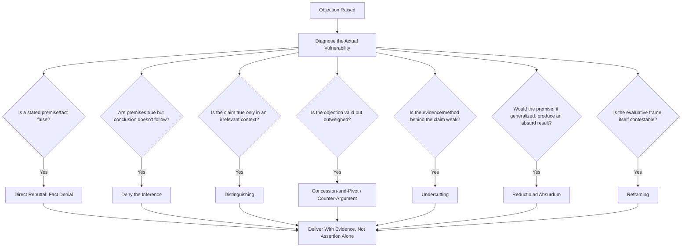

## Refutation Strategies and Techniques

### Definitional Framing

This item catalogs the specific **tactical moves available once an objection has actually been raised** — the execution layer that follows the architectural decisions covered in "Structuring Argument and Counterargument" and the preparatory work covered in "Anticipating and Preempting Objections." Where those items addressed *whether and when* to engage an objection, this item addresses *how* — the concrete verbal and logical maneuvers by which a raised objection is answered, weakened, redirected, or absorbed into the speaker's own case.

Classical rhetoric groups this material under **refutatio** technique proper (as distinct from *dispositio*, arrangement): the specific argumentative moves Cicero and Quintilian catalog for undermining an opponent's proof once it has been stated.

### Classical Foundations

Aristotle's *Rhetoric* (Book II) and the broader classical tradition identify several standard refutative moves, most enduringly systematized by Quintilian in *Institutio Oratoria* Book V: an opposing argument can be refuted by **denying the premise** (showing a stated fact is false), **denying the inference** (accepting the premises but showing the conclusion doesn't follow), **introducing a distinction** (showing the opponent's claim is true in one sense but not the sense relevant to the case), or **countering with a stronger opposing consideration** (conceding a point's validity but showing it is outweighed).

Cicero's *Topica* and *De Inventione* further catalog *loci* (topics/commonplaces) of refutation — recurring argumentative patterns for attacking a claim's consistency, its source's credibility, its factual accuracy, or its relevance — providing a portable toolkit an orator could apply across different subject matters.

Modern informal logic and argumentation theory (particularly Douglas Walton's work on argumentation schemes and critical questions) reformalizes this classical toolkit as a set of standard "critical questions" attached to specific argument types (e.g., arguments from expert opinion, from analogy, from cause) — each argument scheme has a corresponding set of ways it can legitimately be challenged, providing a more granular modern equivalent to the classical *loci*.

### Structural Taxonomy of Refutation Techniques

| Technique | Mechanism | Example |
| --- | --- | --- |
| Direct rebuttal (fact denial) | Presents counter-evidence showing a factual premise is false | "You claim churn increased — the data shows it decreased 3% this quarter." |
| Denying the inference | Accepts the premises but shows the conclusion doesn't logically follow | "Yes, costs rose — but that doesn't mean the project failed; revenue rose faster." |
| Distinguishing | Shows the claim is true in one sense/context but inapplicable in the relevant one | "That's true for enterprise clients, but this proposal only affects SMB accounts." |
| Concession-and-pivot (turning) | Concedes the objection's validity, then reframes why it doesn't defeat the overall case | "You're right that migration carries risk — which is exactly why we're proposing a phased pilot instead of a full cutover." |
| Reductio ad absurdum | Extends the opponent's premise to a logically absurd or clearly unacceptable conclusion | "If we accept that logic, we'd also have to cancel every project with any risk at all." |
| Undercutting (source/method attack) | Challenges the reliability of the evidence or method behind the objection, without directly denying the fact | "That survey had a 2% response rate — it's not representative of our full customer base." |
| Counter-argument (outweighing) | Concedes the objection's truth but introduces a stronger consideration on the other side | "That cost is real, but it's a fraction of what continued downtime is costing us." |
| Reframing | Shifts the criteria or context by which the claim should be judged, changing what counts as a successful rebuttal | "This isn't a cost question — it's a survival question." |
| Ad hominem circumstantial rebuttal (use cautiously; fallacy risk) | Notes a possible bias or interest of the objector, without addressing the substance | Legitimate only when actual bias is directly relevant to assessing the claim's reliability; otherwise a fallacy |
| Tu quoque (rarely legitimate; fallacy risk) | Points out the objector's own inconsistency rather than addressing the claim | "You raised the same risk when you approved the last project." — deflects rather than refutes |

### Persuasive and Logical Mechanics

**Choosing the right refutation type for the objection's actual weak point.** Effective refutation requires first correctly diagnosing *where* an argument is vulnerable — a factually false premise calls for direct rebuttal; a valid premise with an invalid inferential leap calls for denying the inference; a technically true but contextually irrelevant claim calls for distinguishing. Misdiagnosing the vulnerability (e.g., attacking a premise that is actually true, when the real weakness is the inference) produces an ineffective or even self-damaging rebuttal.

**Concession as a credibility-building move.** Concession-and-pivot (also called "turning" the objection) is often more persuasive with sophisticated audiences than flat denial, because openly conceding a valid point signals intellectual honesty (an ethos benefit consistent with the steelmanning principle from prior items) while the pivot demonstrates the concession doesn't actually defeat the broader case — this combines credibility-building with substantive rebuttal in a single move.

**Undercutting vs. rebutting (a key logical distinction).** Argumentation theory distinguishes **rebutting defeaters** (which attack the truth of the conclusion or a premise directly) from **undercutting defeaters** (which attack the *connection* between evidence and conclusion — e.g., challenging a survey's methodology without disputing that the survey produced the numbers it did). Recognizing this distinction allows more precise refutation: sometimes the fastest path to victory is not disputing the opponent's fact but disputing whether that fact actually supports their conclusion.

**Reframing and criteria-shifting.** Reframing is among the most powerful but riskiest refutation techniques because it changes the terms of evaluation itself rather than answering the objection on its own terms — highly effective when the reframe is perceived as legitimate and clarifying, but perceived as evasive "changing the subject" if the audience judges the original criteria were, in fact, the relevant ones.

**The reductio's double-edged nature.** Reductio ad absurdum can be a powerful refutation when the extended consequence is genuinely absurd and the extension is logically valid, but it risks being perceived as a strawman if the extension misrepresents how far the opponent's actual claim would need to be pushed to reach the absurd conclusion.

**[Inference]** Empirical persuasion research on the relative effectiveness of concession-and-pivot versus flat denial across different audience types and stakes levels is less extensively quantified than the classical/logical taxonomy itself; the credibility benefit of conceding valid points is a broadly accepted principle in rhetoric and negotiation practice but should be treated as a well-supported heuristic rather than a precisely measured effect.

### Function in Executive and Organizational Communication

**1. Board and investor objection response.** Concession-and-pivot is the dominant technique in sophisticated investor relations: acknowledging a genuine risk or weak quarter directly, then pivoting to mitigating context or forward plan, is generally more credible than flat denial of a visible problem.

**2. Competitive and sales rebuttal.** Distinguishing and undercutting are frequently used against a competitor's objection or comparison claim — showing a competitor's advantage applies only in a narrow, non-representative use case (distinguishing), or that a comparative claim rests on a flawed benchmark (undercutting).

**3. Crisis communication.** Direct rebuttal (fact denial) is used cautiously and only where the underlying fact is genuinely, verifiably false — misapplied factual denial against a true claim is a severe credibility risk once exposed; concession-and-pivot or reframing are typically safer in crisis contexts where some version of the criticism has merit.

**4. Internal strategic debate.** Denying the inference and reductio ad absurdum are common in internal strategic disagreement, where the goal is often to test the logical robustness of a proposal rather than to win an adversarial contest — a more collaborative deployment of the same underlying techniques.

**5. Negotiation counter-moves.** Undercutting (challenging the basis of a counterpart's claimed constraint, e.g., "that budget ceiling doesn't match the market rate data we have") and counter-argument/outweighing are standard negotiation refutation moves.

### Worked Example (Technique Selection)

> **Objection**: "Our top competitor already has this feature, so we're not actually differentiating by building it."
>
> **Weak refutation (misdiagnosed)**: "No they don't." (Direct rebuttal — risky if factually wrong, and doesn't address the underlying differentiation concern even if narrowly true.)
>
> **Stronger refutation (distinguishing + reframing)**: "They have a version of it, but only for their enterprise tier — for the mid-market segment we're targeting, no one has it yet. And the real differentiation question isn't 'do we have a unique feature,' it's 'do we serve this segment better than anyone else' — which this supports regardless of the enterprise-tier overlap."
>
> **Function**: distinguishing narrows the competitor's claim to a non-overlapping context, and reframing shifts the evaluative criteria from "feature uniqueness" (a losing frame) to "segment fit" (a winning frame) — a combined technique more robust than a single-move rebuttal.

### Risks and Failure Modes

- **Misdiagnosing the vulnerability**: attacking a premise that is actually correct, or denying an inference that is actually valid, produces an ineffective rebuttal that can damage credibility if the error is exposed.
- **Ad hominem and tu quoque overreach**: attacking the objector's motives or consistency instead of the argument's substance is a recognized fallacy; even when factually accurate, it risks appearing as deflection rather than refutation, especially to audiences focused on the substantive question.
- **Reductio misapplied as strawman**: extending an opponent's argument to an absurd conclusion that doesn't actually follow from their real position (rather than a fair logical extension) is a strawman fallacy, not a legitimate reductio, and is a common technical error.
- **Reframing perceived as evasion**: an audience that views the original evaluative frame as legitimate and central may perceive a reframe as changing the subject rather than answering the question, particularly damaging in contexts (media interviews, cross-examination) where evasion reads as guilt.
- **Undercutting without follow-through**: challenging an objection's methodology or source without providing an alternative, more reliable basis for the claim under dispute (or for one's own counter-claim) can leave the underlying question unresolved rather than actually refuted.
- **Over-conceding in concession-and-pivot**: conceding too much ground, or conceding a point central enough to the objection that the subsequent pivot fails to adequately outweigh it, can leave the audience more persuaded by the objection than by the response.

### Relationship to Adjacent Chapter Concepts

- **Structuring Argument and Counterargument / Anticipating and Preempting Objections** (prior items): those items determine which objections are addressed and where; this item provides the specific tactical execution once an objection is being answered, whether preemptively or reactively.
- **Cross-Examination and Probing Questions** (prior item): several refutation techniques (undercutting, distinguishing) are directly deployed as answers within live cross-examination exchanges.
- **Logical Fallacies**: this item's taxonomy directly maps onto legitimate-vs-fallacious refutation moves (ad hominem, tu quoque, strawman-via-misapplied-reductio), making fallacy literacy a direct prerequisite for correct application.
- **Rebutting vs. Undercutting Defeaters** (formal argumentation theory, adjacent): a foundational distinction in modern informal logic directly operationalized in this item's technique catalog.

### Diagram: Refutation Technique Selection by Vulnerability Type

### Chapter Comparison Table

| Dimension | Direct Rebuttal | Concession-and-Pivot | Reframing |
| --- | --- | --- | --- |
| What it targets | Factual accuracy of a premise | Validity of objection, but not its decisiveness | The evaluative criteria itself |
| Ethos effect | Risky if wrong; strong if verifiably correct | Strongly positive — signals honesty | Positive if seen as clarifying, negative if seen as evasive |
| Best-suited context | Objections resting on a verifiably false claim | Objections with genuine partial merit | Objections resting on a narrow or misleading frame |
| Key risk | Backfire if the "false" claim is actually true | Over-conceding the central point | Perceived as changing the subject |
| Relationship to fallacy risk | Low, if evidence is solid | Low | Moderate — can shade into evasion if overused |

### Related Topics

- Rebutting vs. Undercutting Defeaters in Argumentation Theory (Walton, Pollock)
- Aristotelian and Ciceronian *Loci* of Refutation
- Critical Questions and Argumentation Schemes (Douglas Walton)
- Logical Fallacies in Refutation: Ad Hominem, Tu Quoque, Strawman
- Concession-and-Pivot Technique in Investor Relations and Crisis Response
- Reductio ad Absurdum: Valid Extension vs. Strawman Distortion
- Reframing and Criteria-Shifting in Negotiation and Media Response
- Diagnostic Skill: Identifying an Argument's Actual Point of Vulnerability