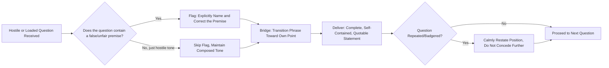

## Reframing Hostile or Loaded Questions

### Definitional Framing

This item narrows from the general refutation taxonomy of the prior item to a specific, high-frequency executive scenario: **live, real-time response to a question that is itself adversarially constructed** — either **hostile** (aggressive in tone or intent, designed to provoke a defensive or damaging reaction) or **loaded/complex** (embedding an unproven or unfavorable assumption within its grammatical structure, such that any direct answer implicitly concedes the assumption). This is the respondent-side counterpart to the questioner-side techniques covered in "Cross-Examination and Probing Questions," and it operationalizes the *reframing* refutation technique from the prior item specifically for the question-response format rather than the assertion-rebuttal format.

The defining challenge: **a loaded question cannot be answered honestly and directly without either accepting a false premise or appearing evasive** — the reframing techniques in this item exist specifically to resolve that bind.

### Classical and Disciplinary Foundations

The **complex question fallacy** (*plurium interrogationum*, "many questions," classically illustrated by "have you stopped beating your wife?") was catalogued in Aristotle's *Sophistical Refutations* as one of the fallacies of language — a question so constructed that any direct answer, yes or no, concedes an unproven premise embedded within it. Classical rhetorical training treated recognizing and correctly refusing to answer within the terms of such a question (rather than being trapped by its binary structure) as an essential defensive skill.

Modern applied fields — most systematically **media training** (a discipline that emerged prominently from mid-to-late 20th century political and corporate communications practice) and crisis communication — formalized specific respondent techniques for hostile/loaded questions under names such as **"bridging"** and **"flagging,"** widely taught in executive media training programs, political communications consulting, and spokesperson preparation. These techniques are the direct practical descendants of the classical complex-question defense, adapted for broadcast interview format, press conferences, and adversarial Q&A.

### Structural Taxonomy of Hostile/Loaded Question Types and Responses

| Question Pattern | Mechanism | Corresponding Response Technique |
| --- | --- | --- |
| Loaded/complex question | Embeds an unproven assumption ("Why did leadership fail to prevent this crisis?") | Flag and correct the premise before answering |
| False dichotomy question | Forces a choice between two options when others exist ("Are you going to lay off workers or go bankrupt?") | Reject the binary explicitly, introduce the omitted option(s) |
| Hostile/aggressive-tone question | Confrontational delivery designed to provoke a defensive or emotional reaction, regardless of content | Maintain composed tone, do not mirror hostility, answer the legitimate substance calmly |
| Hypothetical trap question | Asks the respondent to speculate on a damaging hypothetical ("What if it turns out you knew all along?") | Decline to speculate on the hypothetical, redirect to known facts |
| Compound question | Bundles multiple distinct questions into one, making any single answer seem to address all parts | Separate the components explicitly before answering each |
| "Gotcha" quote-trap question | Constructed to elicit a short, decontextualized soundbite usable against the respondent later | Answer in complete, self-contained statements that resist damaging fragmentary quotation |
| Repetition/badgering question | Same hostile question repeated with rephrasing to pressure a different (often more damaging) answer | Calmly restate the accurate answer without escalating; do not let repetition itself induce concession |

### Core Technique: The Bridging Framework

The most widely taught structural technique for reframing hostile or loaded questions in executive/media contexts follows a three-part sequence:

1. **Acknowledge/flag** — briefly acknowledge the question was asked (and, if loaded, explicitly name the embedded assumption without accepting it: "I want to push back on the premise there—") without appearing to dodge.
2. **Bridge** — a transitional phrase that pivots away from the hostile framing toward the respondent's own accurate, prepared point ("—but what's actually true is...", "—the real issue here is...", "—let me give you the full picture...").
3. **Deliver the message** — state the accurate, prepared substantive point clearly and completely, ideally in a self-contained form that could stand alone if quoted out of context.

This structure directly operationalizes the "reframing" refutation technique from the prior item, specialized for the compressed, real-time constraints of live questioning where there is no opportunity for extended argumentative structure.

### Persuasive and Psychological Mechanics

**Why direct denial of a false premise, not silent evasion, is required.** Simply ignoring a loaded question's embedded assumption and answering only the surface question can be read by sophisticated audiences as tacit acceptance of the premise — the flag/correct step is not optional politeness but a substantive logical necessity, directly paralleling the classical fallacy-defense principle that a complex question must be explicitly split before any part of it can be honestly answered.

**Composure as counter-signal to hostility.** A hostile question is often designed to provoke a visibly defensive, angry, or flustered reaction, which itself becomes persuasively damaging regardless of the answer's content (audiences read emotional dysregulation as guilt or weakness). Maintaining calm, measured delivery under an aggressive question is itself a persuasive act — it signals control and confidence independent of the substantive answer, and denies the questioner the reactive spectacle they may be seeking.

**Self-contained answers and quotability risk.** In media and public contexts, answers are frequently excerpted; a response that depends on the interviewer's question for context (e.g., "No, that's not true") can be quoted in a way that obscures what was denied. Structuring the bridge's final delivery as a complete, standalone statement ("Our safety record has improved every year for the past five years") is more resistant to damaging decontextualization than a purely reactive negation.

**The badgering/repetition trap.** When a hostile question is repeated with slight rephrasing after an adequate answer, the psychological pressure to "give them something new" can induce a respondent to overreach into speculation or concession beyond their prepared, accurate position — recognizing repetition as a deliberate pressure tactic (rather than evidence the first answer was inadequate) is a specific defensive skill.

**[Inference]** The effectiveness of bridging technique in actually shifting audience perception (as opposed to merely protecting the respondent from self-inflicted damage) is more robustly supported as professional consensus within media-training and crisis-communication practice than as a body of tightly controlled experimental research; it should be treated as a well-established practitioner heuristic.

### Function in Executive and Organizational Communication

**1. Media interviews and press conferences.** The paradigm context for bridging technique — executives facing hostile journalist questions during a crisis, controversy, or adversarial coverage cycle rely on flag-bridge-deliver as the default structural response.

**2. Adversarial board or shareholder questioning.** Loaded questions from an activist shareholder or skeptical board member ("Why has leadership allowed this decline to continue?") require the same flag-and-correct step before any substantive answer, to avoid implicitly conceding an unproven or unfair framing of the situation.

**3. Regulatory and legal questioning.** Hostile or loaded questions in regulatory hearings or depositions carry additional legal stakes — flagging a false premise is often not just rhetorically advisable but legally necessary to avoid an answer being later characterized as an admission.

**4. Internal town halls and difficult employee questions.** Executives fielding hostile or loaded employee questions during layoffs, restructurings, or controversies benefit from the same composed flag-bridge-deliver structure, adapted to a less adversarial but still emotionally charged register.

**5. Social media and public statement contexts.** Written public responses to hostile or loaded public criticism (e.g., a company statement responding to a viral complaint) apply the same logical structure — correcting false premises explicitly, then delivering the accurate position — even without the live, spoken-interview format.

### Worked Example

> **Hostile/loaded question**: "Given that your company clearly knew about this defect for months and did nothing, how do you sleep at night?"
>
> **Weak response (accepts the premise implicitly)**: "We take this very seriously and are committed to doing better." (Fails to correct "knew for months and did nothing" — audience may read this as tacit confirmation.)
>
> **Effective response (flag-bridge-deliver)**: "I have to correct something in that question first — we identified this issue six weeks ago, not months, and initiated a recall within 72 hours of confirming it. [flag/correct] What matters now is what we're doing for affected customers: [bridge] full replacement, extended warranty coverage, and a direct hotline our team is staffing 24/7 starting today. [deliver]"
>
> **Function**: the response explicitly names and corrects the false timeline embedded in the question (flag), pivots without dwelling defensively on the correction (bridge), and closes with a complete, quotable, forward-looking statement of action (deliver) — resistant to being excerpted as an admission.

### Risks and Failure Modes

- **Over-bridging / non-responsiveness**: excessive or transparent pivoting away from a legitimate question, without genuinely engaging its accurate substance, is read by sophisticated audiences as evasion — the technique fails when the "bridge" becomes a full subject change rather than a reframing that still substantively addresses the real issue.
- **Failing to flag, answering the loaded frame directly**: the most common execution failure — providing a direct yes/no or substantive answer without first correcting a false or unfair premise, resulting in implicit concession of that premise.
- **Escalating tone in response to hostility**: matching an interviewer's or questioner's aggressive tone, even if the underlying answer is factually strong, produces a persuasively damaging appearance of defensiveness or anger.
- **Speculating under hypothetical-trap pressure**: engaging with a damaging hypothetical ("what if it turns out...") rather than declining to speculate can generate a quotable, damaging statement about a scenario that hasn't occurred.
- **Concession creep under repetition/badgering**: incrementally offering more ground with each repeated hostile question, rather than calmly restating the accurate position, especially under sustained pressure in extended live formats.
- **Legal exposure from flagging technique misapplied**: in regulated or litigation-adjacent contexts, correcting a premise inaccurately or inconsistently with prior statements can itself create legal exposure — flagging must be factually precise and consistent with the organization's documented position, requiring legal coordination in high-stakes contexts.

### Relationship to Adjacent Chapter Concepts

- **Refutation Strategies and Techniques** (prior item): this item is a specialized, compressed application of "reframing" and "denying the premise" refutation techniques, adapted for the live question-response format.
- **Cross-Examination and Probing Questions** (prior item): this item is the direct respondent-side counterpart to that item's questioner-side techniques — recognizing a leading, loaded, or closed question in the moment is the shared skill underlying both offensive and defensive application.
- **Complex Question Fallacy** (classical logic, cross-referenced): the loaded-question pattern addressed throughout this item is formally the same fallacy category introduced in the cross-examination item's risk section.
- **Media Training as an Applied Executive Discipline** (professional practice, cross-disciplinary): this item's bridging framework is the core content of most formal executive media-training curricula.

### Diagram: Flag-Bridge-Deliver Response Structure

### Chapter Comparison Table

| Dimension | Hostile-Tone Question | Loaded/Complex Question | Hypothetical Trap Question |
| --- | --- | --- | --- |
| Core problem | Provokes emotional/defensive reaction | Embeds unproven premise in structure | Invites speculation on damaging scenario |
| Required first move | Maintain composure, do not mirror tone | Flag and correct the premise | Decline to speculate |
| Key risk if mishandled | Appears defensive/guilty regardless of content | Implicitly concedes false premise | Generates quotable speculative admission |
| Governing technique | Composed delivery + substantive answer | Flag-Bridge-Deliver | Redirect to known facts, refuse hypothetical |

### Related Topics

- The Complex Question Fallacy (*Plurium Interrogationum*) in Classical Logic
- Media Training Curriculum: Bridging and Flagging Techniques
- Composure and Nonverbal Signaling Under Adversarial Questioning
- Quotability and Soundbite Risk in Public Statements
- Legal Coordination in High-Stakes Regulatory and Deposition Questioning
- False Dichotomy Recognition and Correction in Live Response
- Crisis Communication: Structuring Statements Resistant to Decontextualization
- Repetition and Badgering Tactics in Adversarial Interviews