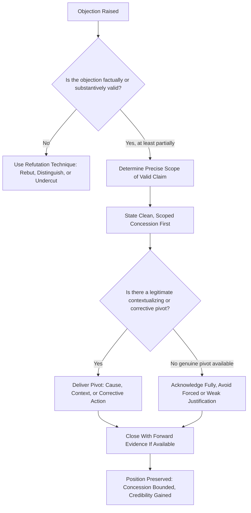

## Conceding Gracefully Without Losing Ground

### Definitional Framing

This item isolates and deepens a single technique first introduced in the prior two items — concession-and-pivot — into its own full treatment, because graceful concession is less a single tactical move than a **distinct rhetorical competency** with its own failure modes, calibration challenges, and psychological mechanics. The defining problem this item addresses: **not every objection can or should be denied, distinguished, or undercut — some are simply correct, in whole or in part — and the rhetorical task becomes conceding truthfully without that concession being read as, or actually constituting, a defeat of the speaker's overall position.**

This distinguishes concession from surrender: **surrender abandons the position; graceful concession narrows, contextualizes, or subordinates the conceded point while preserving the larger argument's integrity.**

### Classical and Disciplinary Foundations

Classical rhetoric recognized concession as a legitimate and even strategically valuable move under the figure **concessio** (or *paromologia* in Greek terminology) — deliberately granting a point, often one the opponent would raise anyway, in order to strengthen the credibility of one's overall position and set up a stronger subsequent argument. Quintilian discussed concession as a sign of a confident, non-defensive orator, distinguishing genuine strategic concession from a rhetorically weak, uncontrolled admission that damages the entire case.

The classical *confessio et deprecatio* — a defendant's admission of a fact combined with a plea in mitigation or justification — represents an ancient legal-rhetorical ancestor of modern concession-and-pivot: acknowledging that something occurred while reframing the surrounding context, intent, or consequence to preserve the overall defense.

Modern negotiation theory (notably principled negotiation frameworks such as Fisher and Ury's *Getting to Yes*) treats acknowledgment of the other party's valid points as a credibility-building and trust-establishing move essential to productive negotiation, distinct from substantive concession on terms — a parallel distinction (acknowledging a point vs. conceding a position) directly relevant to this item's core competency.

### Structural Taxonomy of Concession Techniques

| Technique | Mechanism | Example |
| --- | --- | --- |
| Full concession-and-pivot | Concede the point entirely, then show why it doesn't defeat the larger case | "You're right, the launch was delayed. That's exactly why we rebuilt the QA process before this one." |
| Partial/scoped concession | Concede only part of the claim, explicitly bounding what is and isn't conceded | "The cost estimate was off for the hardware line — the software estimate held." |
| Contextualizing concession | Concede the fact but reframe the surrounding circumstances that affect its significance | "Yes, we missed the target — during a quarter when three key markets were in regulatory shutdown." |
| Temporal concession | Concede a past state while emphasizing a since-corrected present state | "That was true as of last year's process; it no longer is." |
| Conditional concession | Concede the point only under a stated condition, implicitly contesting the condition's applicability | "If the assumption were X, you'd be right — but the assumption is actually Y." |
| Preemptive self-concession | Volunteer a weakness before it is raised by an opponent, controlling its framing entirely | "Before you ask — yes, we underestimated the timeline. Here's what we changed." |
| Strategic minor concession | Concede a genuinely minor point specifically to build credibility/goodwill for holding firm on a major point | Conceding a small budget line to strengthen credibility while holding firm on the central proposal |

### Persuasive and Psychological Mechanics

**Ethos accrual through honest acknowledgment.** Audiences generally extend greater trust to a speaker who visibly concedes valid points than to one who resists every objection reflexively — the willingness to concede signals that the speaker's overall position is not merely defended out of ego or self-interest, making their non-conceded claims more credible by association (a halo-like credibility transfer effect widely recognized in persuasion and negotiation practice).

**The scoping discipline as the core skill.** The central technical skill in graceful concession is precise **scoping** — conceding exactly what is true and no more, explicitly bounding the concession's extent, so that the audience cannot generalize the admitted weakness beyond its actual scope. An unscoped concession ("you're right, we messed this up") invites the audience to apply the admission far more broadly than warranted; a scoped concession ("the Q2 estimate was wrong; Q3 and Q4 were accurate") contains the damage precisely.

**Sequencing: concede before pivot, not the reverse.** Rhetorically, stating the pivot/justification before the concession itself ("we had good reasons, but yes, we missed the target") tends to read as defensive rationalization-first, whereas leading with the clean concession before the pivot ("yes, we missed the target — here's why that doesn't change our recommendation") tends to read as more forthright, because the audience isn't kept waiting through a justification for an admission not yet made.

**Preemptive self-concession and control of framing.** Volunteering a known weakness before an opponent raises it (an application of the procatalepsis principle from earlier items, specifically applied to one's own genuine weaknesses rather than to counterarguments in general) allows the speaker to frame the weakness in their own terms, with their own context and mitigation, rather than having it framed adversarially by someone else first — a significant strategic advantage when a weakness is nearly certain to surface regardless.

**Strategic minor concessions as credibility currency.** In extended negotiations or multi-point debates, deliberately conceding smaller, less consequential points can function as a credibility investment that makes firmness on major points more persuasive — audiences and counterparts read total inflexibility across every point as evidence of rigid self-interest rather than genuine conviction on the points that matter most.

**[Inference]** The relative persuasive weight of concession-based credibility-building versus its risk of appearing to weaken one's position is highly dependent on audience type, cultural context, and adversarial intensity; some competitive or highly adversarial contexts (e.g., certain negotiation cultures, hostile litigation) may penalize any concession regardless of scoping quality, making audience-specific judgment essential rather than a universal rule favoring concession.

### Function in Executive and Organizational Communication

**1. Post-mortems and accountability communication.** Leaders addressing a genuine organizational failure (missed targets, a product issue, a strategic misjudgment) benefit substantially from scoped, forthright concession rather than defensive minimization — audiences (employees, boards, media) consistently read over-defensive non-admission of visible failures as a larger credibility problem than the original failure itself.

**2. Investor relations during underperformance.** Earnings calls addressing a missed quarter are a paradigm case for concession-and-pivot: acknowledging the miss directly and specifically, then pivoting to concrete corrective action or contextualizing factors, is standard and expected practice; conspicuous evasion of a visible miss is read far more negatively by sophisticated analyst audiences than the miss itself.

**3. Negotiation and deal-making.** Strategic minor concessions are a standard negotiation tactic for building the reciprocity and trust needed to secure favorable terms on higher-priority points, operationalizing the credibility-currency mechanic described above.

**4. Crisis communication.** Preemptive self-concession — volunteering a known organizational failing before media or regulators frame it first — is a core crisis-communication strategy specifically because it controls the initial framing of an otherwise inevitable disclosure.

**5. Internal leadership credibility.** Leaders who model scoped, non-defensive concession of their own or their team's errors in internal settings (rather than reflexive justification) are widely regarded in leadership and organizational-behavior practice as building greater team trust and psychological safety than leaders who never visibly concede error — though this connects to broader leadership literature beyond pure rhetorical technique.

### Worked Example

> **Objection**: "Your team promised this feature would ship in Q1. It's now Q3. Why should we trust the next deadline?"
>
> **Ungraceful/defensive response (avoid)**: "There were a lot of unforeseen technical challenges and the scope actually changed significantly, so it's not really fair to say we missed the original deadline." (Unscoped rationalization, reads as excuse-making, doesn't actually concede anything clearly.)
>
> **Graceful concession**: "You're right — we missed that deadline by two quarters, and that's on us. [clean, scoped concession] What changed since then is that we've moved to two-week sprint reviews with customer-facing checkpoints, specifically because the Q1 miss came from not surfacing scope changes early enough. [pivot: contextualized cause + corrective action] The next deadline has already survived two of those checkpoints without slipping. [forward evidence]"
>
> **Function**: the concession is stated cleanly and first, without hedging language that dilutes its honesty; the pivot identifies the *specific* root cause (not vague "challenges") and ties it to a concrete process change; the closing statement offers verifiable forward evidence rather than a bare promise — collectively converting an admission of past failure into a credibility-building moment for the current claim.

### Risks and Failure Modes

- **Unscoped over-concession**: conceding in vague, sweeping terms ("we really failed here") when the actual issue was narrow allows the audience to generalize the failure far beyond its true extent, damaging credibility on unrelated points.
- **Defensive hedging that dilutes the concession**: qualifying language ("well, technically," "to be fair," excessive context before the actual admission) can make a concession read as reluctant or insincere, undermining the ethos benefit the concession is meant to provide.
- **Concession without pivot (true surrender)**: stopping after the admission without a subsequent contextualizing or corrective pivot leaves the objection fully standing, effectively conceding not just the point but the broader argument it was raised to challenge.
- **Pivot arriving too fast or overshadowing the concession**: moving to justification too quickly, or with disproportionate length/energy relative to the concession itself, can read as minimizing the admission rather than honestly building from it.
- **Conceding a point that is not, in fact, true**: under social or adversarial pressure, conceding a claim that is actually false (rather than holding firm with appropriate rebuttal) sacrifices accuracy for the appearance of agreeableness — a distinct error from graceful concession of a genuinely valid point.
- **Cultural/contextual misjudgment**: in some adversarial contexts (hostile litigation, certain competitive negotiation cultures, or hard-line political environments), any concession — however well-scoped — may be exploited by an opposing party as unqualified admission, making audience- and context-specific judgment essential before applying this technique.

### Relationship to Adjacent Chapter Concepts

- **Refutation Strategies and Techniques** (prior item): concession-and-pivot was introduced there as one refutation technique among several; this item provides its full independent treatment given its distinct psychological and scoping demands.
- **Reframing Hostile or Loaded Questions** (prior item): graceful concession is frequently the correct response when a hostile or loaded question's embedded premise is, in fact, true (as opposed to false, which calls for the flag-and-correct technique from that item) — recognizing which situation applies is a critical diagnostic skill spanning both items.
- **Anticipating and Preempting Objections** (earlier item): preemptive self-concession is a direct specialized application of procatalepsis specifically to one's own known weaknesses rather than to general counterarguments.
- **Ethos** (cross-chapter foundational concept): this item's central mechanic — credibility accrual through honest, scoped admission — is a direct application of classical ethos theory to the specific tactical moment of concession.

### Diagram: Concession Decision and Scoping Process

### Chapter Comparison Table

| Dimension | Full Surrender (avoid) | Graceful Scoped Concession | Defensive Non-Concession (avoid) |
| --- | --- | --- | --- |
| Accuracy | May be accurate but abandons the broader position unnecessarily | Accurate and precisely bounded | Often inaccurate or evasive when the objection has real merit |
| Ethos effect | Neutral to negative — signals lack of a defensible position | Strongly positive — signals honesty and command of detail | Negative if audience perceives the objection as valid |
| Effect on broader argument | Broader case collapses along with the conceded point | Broader case preserved, often strengthened | Broader case appears defensively fragile |
| Best-suited situation | Rarely appropriate as a deliberate strategy | Objection is genuinely valid, in whole or part | Never appropriate when the objection is actually correct |

### Related Topics

- Concessio and Paromologia in Classical Rhetorical Theory
- Confessio et Deprecatio: Admission Combined with Mitigation in Legal Rhetoric
- Principled Negotiation and Acknowledgment vs. Concession (Fisher and Ury)
- Scoping Discipline: Precisely Bounding an Admission's Extent
- Preemptive Self-Concession as Applied Procatalepsis
- Psychological Safety and Leadership Modeling of Error Acknowledgment
- Reciprocity and Strategic Minor Concessions in Negotiation Practice
- Distinguishing Valid Objections (Concede) from False Premises (Reframe/Flag)