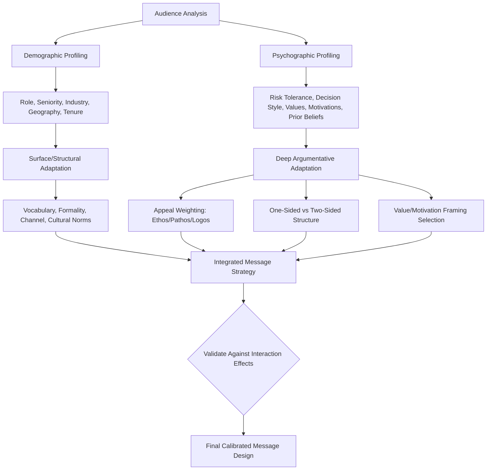

## Demographic and Psychographic Audience Profiling

### Definitional Framing

This item opens a new chapter, shifting from the adversarial mechanics of debate and objection handling to the **foundational analytical work that precedes any message design**: systematically characterizing an audience before crafting a persuasive communication. **Demographic profiling** categorizes an audience by objective, observable population characteristics (age, role, industry, seniority, geography, organizational tenure). **Psychographic profiling** categorizes an audience by internal, dispositional characteristics — values, attitudes, motivations, risk tolerance, decision-making style, and prior beliefs relevant to the message topic.

The distinction matters because the two profiling modes answer different strategic questions: demographics answer **"who is in the room"** (informing vocabulary, examples, formality, channel), while psychographics answer **"what will move this specific audience"** (informing which appeals, framings, and evidence types will actually land). Effective audience analysis requires both, since two demographically identical audiences can require entirely different persuasive strategies if their psychographic profiles diverge (e.g., two boards of similar composition but differing risk tolerance).

### Classical and Disciplinary Foundations

Aristotle's *Rhetoric* (Book II) is the direct classical ancestor of psychographic profiling avant la lettre — his extended discussion of the emotions (*pathe*) and the character types of different age groups (youth, prime of life, old age) constitutes a systematic effort to catalog how audience disposition should shape argumentative strategy, explicitly linking rhetorical effectiveness to accurate audience characterization rather than treating persuasion as audience-independent.

Cicero's concept of *decorum* (introduced in the earlier chapter on overuse/artificiality) already implied audience analysis as a prerequisite — style must fit not only occasion but audience — but classical rhetoric lacked the systematic, quantifiable audience-segmentation apparatus that emerged from 20th-century marketing and social-science research.

Modern demographic and psychographic profiling as formal methodology derives substantially from **marketing science**: demographic segmentation has roots in early-to-mid 20th century market research, while **psychographics** as a named, systematized discipline was significantly developed and popularized starting in the 1960s-70s (notably associated with researchers like Emanuel Demby, credited with coining the term "psychographics," and later operationalized through instruments such as the VALS — Values, Attitudes, and Lifestyles — framework developed by SRI International). Executive and organizational communication has substantially borrowed this marketing-derived apparatus and adapted it for internal, board, investor, and stakeholder audiences.

### Structural Taxonomy

**Demographic profiling dimensions:**

| Dimension | Relevance to Message Adaptation |
| --- | --- |
| Role/function (finance, engineering, sales, legal) | Determines relevant vocabulary, priority concerns, and evidence types considered credible |
| Seniority/organizational level | Determines appropriate level of detail, framing (strategic vs. tactical), and formality |
| Industry/sector | Determines shared reference points, regulatory context, and competitive framing |
| Tenure/organizational history | Determines what institutional context can be assumed vs. must be explained |
| Geography/cultural context | Determines idiom, humor, directness norms, and hierarchy expectations |
| Age/generational cohort | Determines communication channel preferences and some shared cultural reference points (used cautiously — see risks) |

**Psychographic profiling dimensions:**

| Dimension | Relevance to Message Adaptation |
| --- | --- |
| Risk tolerance | Determines whether framing should emphasize opportunity/upside or safety/downside mitigation |
| Decision-making style (analytical vs. intuitive) | Determines reliance on data/detail versus narrative/vision in argument construction |
| Prior beliefs/existing position on the topic | Determines whether one-sided or two-sided argument structure is appropriate (see prior chapter) |
| Core values (efficiency, innovation, tradition, fairness) | Determines which value-based appeals will resonate versus fall flat |
| Motivational drivers (achievement, security, affiliation, status) | Determines which benefits to foreground in a proposal or pitch |
| Skepticism/trust level toward the speaker or organization | Determines how much ethos-building work is needed before substantive argument will be received |
| Cognitive/informational needs (detail-oriented vs. big-picture) | Determines document/speech structure and level of granularity |

### Methods for Constructing an Audience Profile

| Method | Description | Best Suited For |
| --- | --- | --- |
| Direct research/records review | Reviewing known biographical, organizational, or historical data about specific named audience members | Board members, specific investors, known individual stakeholders |
| Stakeholder interviews | Direct conversation with representatives of the target audience or those who know them well, prior to message design | High-stakes presentations to unfamiliar audiences |
| Prior statement/position analysis | Reviewing an audience's previously stated positions, public comments, or voting/decision history on related topics | Board members, analysts, public officials |
| Segmentation modeling | Grouping a large or heterogeneous audience into a smaller number of representative psychographic/demographic segments | Large internal audiences (all-employee communications), broad customer bases |

- **Persona construction** — Synthesizing profiling data into a small number of representative "personas" embodying key demographic and psychographic clusters, used as a design reference throughout message development | Marketing communication, large-audience organizational messaging

| Empathy mapping | Structured exercise mapping what the audience thinks, feels, sees, and hears in their current context, to surface unstated concerns | Change management, internal communication design |

### Application to Persuasive Strategy Selection

**Demographic-driven adaptation** primarily affects **surface-level and structural choices**: vocabulary and jargon calibration (a technical audience tolerates and may expect domain terminology; a mixed or executive audience typically requires plain-language translation), formality level, channel selection (a younger, distributed workforce may respond better to video or chat-based communication than a formal memo), and cultural adaptation (directness norms, hierarchy signaling, and humor conventions vary substantially across national and organizational cultures).

**Psychographic-driven adaptation** primarily affects **deep argumentative strategy**: whether to lead with data or narrative (analytical vs. intuitive decision-makers), whether to use one-sided or two-sided argument structure (audiences already skeptical or aware of counterarguments require two-sided treatment per the prior chapter's findings), which of the classical appeals (ethos, pathos, logos) to weight most heavily, and which specific values or motivational drivers to foreground as the primary benefit frame.

**Interaction effects.** Demographic and psychographic profiles frequently interact in ways that plain demographic-only analysis would miss: two departments (demographically distinct — engineering vs. sales) may share a psychographic trait (both highly risk-averse after a recent failure) that should override department-specific default assumptions, meaning psychographic assessment must be conducted directly rather than merely inferred from demographic category.

**[Inference]** The relative predictive power of psychographic versus demographic variables for message effectiveness is well-established as a general marketing and communication-science principle (psychographics often outperform demographics alone in predicting response to specific messages), but this is a directional tendency rather than a fixed ratio, and the optimal weighting varies by context and topic.

### Function in Executive and Organizational Communication

**1. Board presentation calibration.** Effective board communication typically requires individual-level profiling (not just aggregate board demographics) — knowing that one board member is risk-averse and detail-oriented while another is vision-focused and impatient with granular data allows a presenter to structure the narrative arc and anticipate which sections will draw the most scrutiny from which individuals.

**2. Investor and analyst segmentation.** Public company investor relations distinguishes between psychographically distinct investor segments (long-term value investors vs. short-term momentum traders vs. activist investors), each requiring different emphasis (fundamentals and stability vs. growth narrative vs. governance and capital allocation critique) despite potentially overlapping demographic profiles.

**3. Internal change communication.** Large-scale organizational change communication benefits substantially from segmenting the employee audience beyond simple demographic categories (department, tenure) into psychographic clusters (change-resistant vs. change-eager, security-motivated vs. growth-motivated), enabling differentiated messaging tracks for different employee segments rather than a single generic announcement.

**4. Cross-cultural executive communication.** Multinational organizations must layer demographic (national/cultural) profiling with psychographic assessment, since assuming a uniform psychographic profile based solely on national demographic category risks significant stereotyping error (see risks below) even as some genuine cultural-communication-norm differences are real and relevant.

**5. Sales and negotiation preparation.** Preparing for a high-stakes sales pitch or negotiation benefits from both profiling modes — demographic research on the counterpart organization's industry and structure, combined with psychographic assessment of the specific decision-maker's risk tolerance and decision style, gathered through prior interactions, public statements, or intermediary intelligence.

### Worked Example

> **Scenario**: Presenting a proposal to invest in a new, unproven technology platform to two different audiences.
>
> **Audience A profile**: Demographic — senior finance and legal leadership, long organizational tenure. Psychographic — high risk aversion (organization experienced a costly failed technology investment three years prior), analytical decision style, high skepticism toward vendor claims.
>
> **Adapted strategy**: Two-sided refutational structure (per the debate chapter) explicitly acknowledging risk and the prior failure; heavy reliance on data, pilot-program structuring, and downside-mitigation framing (per the "irony/hyperbole" chapter's caution against hyperbole with skeptical, high-stakes audiences).
>
> **Audience B profile**: Demographic — product and engineering leadership, shorter average tenure, direct reports drawn from a fast-growing division. Psychographic — high risk tolerance, growth/achievement-motivated, intuitive/narrative-responsive decision style, low organizational skepticism (haven't experienced a major related failure).
>
> **Adapted strategy**: Vision-forward framing, greater tolerance for ambitious/hyperbolic language, competitive positioning emphasis (what competitors are already doing), less emphasis on granular downside mitigation.
>
> **Function**: identical underlying proposal, substantially different rhetorical strategy derived directly from divergent psychographic profiles despite both being internal executive audiences of comparable seniority.

### Risks and Failure Modes

- **Demographic stereotyping/essentialism**: inferring psychographic traits directly and uncritically from demographic category (assuming all members of an age cohort, nationality, or department share identical values or risk tolerance) produces inaccurate profiles and risks both message failure and reputational harm (perceived stereotyping).
- **Over-segmentation and message fragmentation**: excessive psychographic segmentation of a large audience into many narrow personas can produce an unmanageable number of message variants, diluting resources and consistency without proportional persuasive benefit.
- **Stale or unverified profiling data**: relying on outdated prior-statement analysis or assumed psychographic traits without verification (a board member's risk tolerance may have shifted after a recent event) can lead to miscalibrated strategy.
- **Confusing aggregate and individual-level data**: applying an audience-wide psychographic average to guide a message intended for an individual high-stakes decision-maker (e.g., a single swing board vote) ignores meaningful individual variance that aggregate profiling obscures.
- **Privacy and ethical boundaries in profiling**: particularly in employee and customer-facing contexts, psychographic profiling methods (data collection, inference from behavior) carry privacy and ethical considerations distinct from the rhetorical question of how to use accurate profiles once obtained — profiling methodology itself is subject to organizational and legal constraints beyond rhetorical strategy.
- **Manipulation concerns**: highly precise psychographic targeting, especially when used to exploit specific psychological vulnerabilities rather than to genuinely adapt communication clarity and relevance, raises the same rhetorical-ethics concerns (manipulation vs. legitimate adaptation) flagged in earlier chapter items regarding framing and metaphor.

### Relationship to Adjacent Chapter Concepts

- **Structuring Argument and Counterargument** (prior chapter): the one-sided vs. two-sided structural decision was explicitly identified there as audience-sophistication-dependent — this item provides the systematic methodology for making that audience assessment.
- **Anticipating and Preempting Objections** (prior chapter): stakeholder-perspective simulation and objection-mapping depend directly on accurate psychographic profiling of specific anticipated objectors.
- **Avoiding Overuse and Artificiality** (earlier chapter): genre/audience-appropriate figurative density calibration is itself a demographic/psychographic adaptation decision, retroactively connecting this foundational item to the stylistic material covered earlier.
- **Message Adaptation Techniques** (subsequent chapter items, forthcoming): this item's profiling output is the direct input to subsequent chapter content on tailoring message content, channel, and delivery to specific audience types.

### Diagram: Demographic vs. Psychographic Profiling Applied to Message Strategy

### Chapter Comparison Table

| Dimension | Demographic Profiling | Psychographic Profiling |
| --- | --- | --- |
| What it measures | Observable, objective population characteristics | Internal dispositions: values, motivations, decision style |
| Primary strategic use | Vocabulary, formality, channel, cultural adaptation | Appeal selection, argument structure, framing choice |
| Data sources | Records, org charts, public biographical data | Interviews, prior statements, behavioral observation, segmentation models |
| Key risk | Treated as a proxy for psychographics (stereotyping) | Reliance on stale, unverified, or aggregate-level assumptions |
| Relative predictive strength for message response | Moderate — informs relevance and access | Generally higher — more directly predicts persuasive response |

### Related Topics

- Aristotelian Audience Analysis: Age, Character, and Emotion in Rhetoric II
- VALS Framework and Psychographic Segmentation Methodology (SRI International)
- Persona Construction and Empathy Mapping in Communication Design
- Stakeholder-Perspective Simulation for Objection Anticipation
- Cross-Cultural Communication Norms and the Risk of Demographic Essentialism
- Privacy and Ethics in Audience Data Collection and Profiling
- Investor Segmentation: Value, Growth, and Activist Investor Communication Strategy
- Change Management Communication: Segmenting Resistant vs. Receptive Employee Cohorts