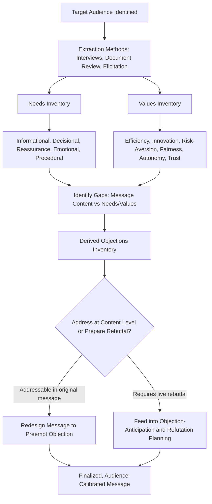

## Identifying Audience Needs, Values, and Objections

### Definitional Framing

Where the prior item established *how to categorize an audience* (demographic and psychographic profiling as a classificatory apparatus), this item addresses the **substantive extraction task**: converting a general audience profile into a specific, actionable inventory of what a particular audience actually needs from the communication, what they value and will use to judge it, and what objections they are likely to raise. This is the diagnostic bridge between audience analysis and message construction — profiling identifies the audience's *type*; this item identifies the audience's *content-specific requirements* for the message at hand.

The three categories are analytically distinct: **needs** are the practical, functional requirements a message must satisfy for the audience to act on it (information, reassurance, decision-ready detail); **values** are the normative criteria an audience uses to judge whether a proposal or claim is acceptable (efficiency, fairness, innovation, risk-aversion, loyalty); **objections** are the specific points of resistance an audience is likely to raise given their needs and values, directly feeding the objection-anticipation methodology from the prior chapter.

### Classical and Disciplinary Foundations

Aristotle's treatment of the *topoi* (topics/commonplaces) in the *Rhetoric* provided a systematic method for generating relevant arguments and anticipated audience responses for any given subject and audience — the *topoi* functioned partly as a heuristic for discovering what considerations (needs, values, likely objections) an audience would bring to bear on a given question, making this item's task a direct descendant of classical invention (*inventio*) theory rather than a purely modern innovation.

Maslow's hierarchy of needs (1943), though originating in psychology rather than rhetoric, has been broadly and durably adopted in communication, marketing, and organizational behavior practice as a heuristic for categorizing audience needs by underlying motivational level (physiological/security needs through esteem and self-actualization needs) — frequently applied loosely in executive communication training to distinguish surface-stated needs from deeper underlying motivations.

Modern needs-assessment and stakeholder-analysis methodologies, prominent in organizational change management, project management (e.g., stakeholder analysis frameworks used in PMI/PRINCE2-adjacent practice), and user-centered design (needs-finding, "jobs to be done" framework), have substantially formalized systematic needs/values/objection identification as a discrete pre-communication research discipline, which executive communication practice has absorbed as standard preparatory methodology.

### Structural Taxonomy

**Categories of audience needs:**

| Need Type | Description | Example |
| --- | --- | --- |
| Informational need | What the audience must know to understand or evaluate the message | Specific figures, technical explanation, comparative benchmarks |
| Decisional need | What the audience needs in order to actually act (approve, adopt, change behavior) | Clear recommendation, defined next steps, decision criteria |
| Reassurance need | What the audience needs to feel secure proceeding, independent of factual content | Risk mitigation evidence, precedent, expert validation |
| Emotional/relational need | What the audience needs to feel respected, heard, or included in the process | Acknowledgment of prior contribution, participatory framing |
| Procedural need | What the audience needs to know about process, timeline, or their own role | Clarity on what happens next and when |

**Categories of audience values (illustrative, non-exhaustive):**

| Value | Manifestation in Judgment Criteria |
| --- | --- |
| Efficiency/cost-consciousness | Judges proposals primarily on resource use and ROI |
| Innovation/growth orientation | Judges proposals on novelty, competitive advantage, upside potential |
| Risk-aversion/stability | Judges proposals on downside protection, precedent, reversibility |
| Fairness/equity | Judges proposals on distributional impact across stakeholders |
| Loyalty/tradition | Judges proposals on consistency with established practice and relationships |
| Autonomy/control | Judges proposals on degree of retained control or independence |
| Transparency/trust | Judges proposals on completeness and honesty of disclosure |

**Objection derivation logic:** an audience's likely objections can be systematically derived as the **gap between the message's content and the audience's needs/values inventory** — an objection typically arises where (a) a stated need is unmet, (b) a proposal conflicts with a held value, or (c) the audience holds relevant prior knowledge or experience not accounted for in the message. This directly operationalizes the objection-mapping methodology from the "Anticipating and Preempting Objections" chapter item, providing its systematic input rather than relying on unstructured brainstorming alone.

### Methods for Extraction

| Method | Description | Best Suited For |
| --- | --- | --- |
| Direct stakeholder consultation | Interviews or conversations with representative audience members prior to message design | High-stakes, accessible audiences (board members, key clients) |
| Document/history review | Reviewing prior meeting minutes, feedback, complaints, or public statements for stated needs/values | Recurring audiences (regular board, established client relationship) |
| Needs-values-objections (NVO) mapping matrix | Structured worksheet cross-referencing anticipated audience segments against needs, values, and derived objections | Complex, multi-stakeholder communications |
| "Jobs to be done" framing | Identifying the functional, emotional, and social "job" the audience is trying to accomplish that the message/proposal should serve | Product, sales, and internal-service communication |
| Values-elicitation questioning | Direct or indirect questions designed to surface an audience's decision criteria before message design ("What would make this a clear yes for you?") | Negotiation preparation, sales, internal proposal development |
| Historical objection pattern analysis | Reviewing what objections similar audiences have raised to similar proposals in the past | Recurring proposal types (budget requests, policy changes) |

### Persuasive Mechanics

**Needs-satisfaction as a precondition for persuasion, not a persuasive technique itself.** A message that is stylistically excellent (well-structured, appropriately figurative, well-refuted) but fails to satisfy a genuine audience need (e.g., omitting the specific financial detail a finance-oriented board member requires to approve) will generally fail regardless of rhetorical quality — needs-identification functions as a threshold requirement rather than an optional enhancement.

**Values as the criteria audiences use to resolve ambiguity.** When a message's implications are not fully determined by its explicit content (e.g., a proposal with genuine uncertainty about outcomes), audiences resolve that ambiguity using their own values — a risk-averse audience will interpret ambiguous language pessimistically, while a growth-oriented audience will interpret the same ambiguous language optimistically. Accurate values-identification therefore predicts not just objection content but how neutral or ambiguous statements will be received.

**Objections as diagnostic signals, not obstacles.** Reframing objections as evidence of unmet needs or unaddressed values (rather than simply resistance to overcome) shifts the strategic posture from defensive rebuttal toward proactive message redesign — an objection anticipated through NVO mapping can often be resolved by revising the proposal's content itself (addressing the underlying need) rather than merely preparing a rebuttal to the symptom.

**Distinguishing stated needs from underlying needs.** A frequently cited principle in needs-assessment practice (paralleling the "jobs to be done" framework and loosely drawing on Maslow-style needs layering) holds that audiences often state a surface need ("we need lower costs") that reflects a deeper underlying need or value (security, risk-aversion, or resource-control) — accurate identification of the underlying need can reveal that a proposal satisfying the stated need in an unexpected way (e.g., cost predictability rather than absolute reduction) may be equally or more persuasive.

**[Inference]** The "jobs to be done" and Maslow-derived needs-layering frameworks are widely used practitioner heuristics with substantial adoption in product, marketing, and communication practice, but they are frameworks for organizing qualitative judgment rather than rigorously validated predictive models — their value lies in structuring the analyst's inquiry rather than guaranteeing accurate prediction of any specific audience's underlying motivation.

### Function in Executive and Organizational Communication

**1. Proposal and business-case development.** Before drafting a business case, systematically mapping the decision-making audience's informational needs (what data will they require), decisional needs (what specifically are they being asked to approve), and values (efficiency vs. growth vs. risk-aversion) allows the case to be structured around what will actually move the specific audience rather than a generic template.

**2. Change management communication design.** Employee audiences facing organizational change have well-documented common need categories (job security reassurance, procedural clarity, respect/inclusion in the process) that, when systematically addressed, substantially reduce the volume and intensity of resistance-driven objections compared to communications that address only the informational dimension of the change.

**3. Negotiation preparation.** Direct or indirect values-elicitation with a negotiating counterpart ("what matters most to you in this deal") often surfaces underlying interests distinct from stated positions — a foundational principle in interest-based negotiation theory directly overlapping with this item's needs/values distinction.

**4. Investor and board communication.** Differentiating board members' or investor segments' values (risk-aversion vs. growth-orientation, control vs. efficiency) allows anticipatory framing of the same underlying proposal to emphasize the specific value dimension most likely to resonate with each distinct audience member or segment.

**5. Customer and market communication.** "Jobs to be done" analysis of customer audiences — identifying the functional, emotional, and social job a product or service is meant to accomplish — directly informs which needs and values should be foregrounded in marketing and sales communication.

### Worked Example

> **Scenario**: Proposing a mandatory return-to-office policy to an employee audience.
>
> **NVO mapping (abbreviated)**:
>
> - **Needs**: informational (why now, what changed), procedural (timeline, exceptions process), emotional (acknowledgment that remote work has been valued and effective for many).
> - **Values**: autonomy/control (many employees value schedule flexibility), fairness (concern about inconsistent enforcement across teams), trust (skepticism toward stated rationale if not transparently explained).
> - **Derived objections**: "Why now, if performance hasn't suffered?" (value: fairness/evidence-based rationale); "Will this apply equally to leadership?" (value: fairness); "What about caregivers or long commuters?" (need: procedural exceptions).
>
> **Resulting message design implication**: rather than announcing the policy and separately preparing rebuttals to anticipated resistance, the NVO mapping suggests the announcement itself should proactively include performance data (addressing the evidence-based-rationale objection at the need level), an explicit statement on leadership's own compliance (addressing the fairness value directly), and a defined exceptions process (addressing the procedural need) — converting several likely objections into content built into the original message rather than reactive rebuttal.

### Risks and Failure Modes

- **Projecting the analyst's own needs/values onto the audience.** A common failure mode: constructing the NVO map based on what the message-designer assumes matters, rather than what has been verified through actual research or consultation with the target audience — producing an inaccurate map that misdirects message design.
- **Treating a heterogeneous audience as monolithic.** Applying a single needs/values/objections profile to an audience that actually contains meaningfully distinct psychographic segments (per the prior item) can produce a message that satisfies no segment well, rather than a segmented approach addressing each distinct profile.
- **Surface-need fixation.** Addressing only the explicitly stated need (e.g., "we need more budget detail") without probing the underlying value or concern it reflects (e.g., a deeper trust or control concern) can produce a technically responsive but persuasively ineffective message.
- **Static profiling in dynamic situations.** Needs, values, and likely objections can shift meaningfully in response to external events (a recent related failure, a market shift, new information) — relying on outdated NVO analysis without verification near the time of message delivery risks misalignment.
- **Objection-avoidance bias in mapping.** Analysts may unconsciously under-identify objections that are genuinely difficult to answer, producing an incomplete map that leaves the message vulnerable to exactly the objections most damaging to address — a specific risk this item shares with the red-teaming caution from the "Anticipating and Preempting Objections" item.
- **Ethical boundary on values-based targeting.** As with psychographic profiling generally, using values-identification to exploit a vulnerability (e.g., exploiting insecurity-driven values to pressure a decision against the audience's own genuine interest) rather than to genuinely serve a legitimate need crosses from audience adaptation into manipulation — a recurring ethical boundary flagged throughout this course's treatment of audience-targeted rhetoric.

### Relationship to Adjacent Chapter Concepts

- **Demographic and Psychographic Audience Profiling** (prior item): this item's needs/values/objections inventory is the content-specific output that profiling's categorical framework is designed to support — profiling identifies audience type, this item identifies what that type specifically requires for the message at hand.
- **Anticipating and Preempting Objections** (earlier chapter): the objection-derivation logic in this item (gap between message and needs/values) provides the systematic input for that item's objection-mapping and prioritization methodology, rather than relying on unstructured brainstorming.
- **Structuring Argument and Counterargument** (earlier chapter): values-identification directly informs which appeals (ethos/pathos/logos) and which structural choice (one-sided/two-sided) will resonate with a specific audience's judgment criteria.
- **Interest-Based Negotiation Theory** (adjacent discipline, cross-referenced): the needs/positions distinction in this item directly parallels the interests/positions distinction foundational to principled negotiation frameworks.

### Diagram: Needs-Values-Objections Mapping Workflow

### Chapter Comparison Table

| Dimension | Needs | Values | Objections |
| --- | --- | --- | --- |
| Definition | Functional requirements for understanding/acting | Normative criteria for judging acceptability | Specific points of anticipated resistance |
| Primary extraction method | Interviews, document review, procedural mapping | Values-elicitation, historical pattern analysis | Derived from needs/values gaps, historical objection review |
| Message design implication | Determines required content and detail level | Determines framing and which appeals resonate | Determines what to preempt vs. hold in reserve |
| Failure mode if ignored | Message is unusable or incomplete for decision-making | Message is technically correct but fails to persuade | Audience raises unaddressed resistance, damaging credibility |

### Related Topics

- Aristotelian *Topoi* and the Classical Theory of Invention (*Inventio*)
- Maslow's Hierarchy and Needs-Layering Heuristics in Communication Practice
- "Jobs to Be Done" Framework in Product and Message Design
- Interest-Based Negotiation: Interests vs. Positions (Fisher and Ury)
- Stakeholder Analysis Methodology in Change Management and Project Practice
- Values-Elicitation Questioning Techniques for Negotiation and Sales
- Ethical Boundaries in Values-Based Audience Targeting
- Segmented Messaging Design for Heterogeneous Audiences