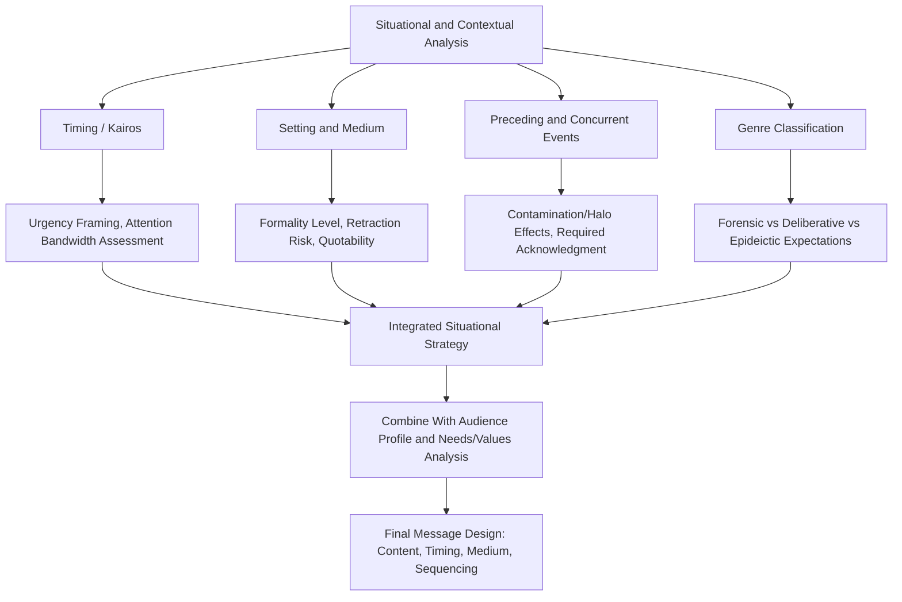

## Situational and Contextual Analysis

### Definitional Framing

Where the two prior items addressed **who the audience is** (demographic/psychographic profiling) and **what that audience specifically needs and values** (NVO mapping), this item addresses a third, independent variable in message adaptation: **the situation and context surrounding the communication event itself** — factors external to the audience's identity that nonetheless materially shape how any message, regardless of audience type, will be received. The same audience, profiled identically, may require substantially different message treatment depending on timing, setting, medium, preceding events, and competing conditions.

This item formalizes what classical rhetoric called **kairos** — the opportune or fitting moment for a given speech act — into a systematic analytical category, distinguishing it from *ethos* (speaker credibility), *audience* (the subject of the prior two items), and pure *content* (the argument's substance). Situational analysis asks: **given this specific moment, setting, and set of surrounding circumstances, what does effective communication require, independent of who exactly is receiving it?**

### Classical and Disciplinary Foundations

**Kairos** — often translated as "the opportune moment" or "the right time" — was treated by the Sophists (particularly Gorgias) and subsequently by Aristotle and later rhetoricians as a distinct and essential rhetorical consideration alongside *logos*, *ethos*, and *pathos*: the same argument, delivered with equal skill, could succeed or fail entirely based on whether it was offered at the fitting moment. Aristotle's division of rhetoric into three genres — **forensic** (judicial, concerned with past events), **deliberative** (political, concerned with future action), and **epideictic** (ceremonial, concerned with present praise/blame) — is itself a foundational situational-context taxonomy, since each genre carries distinct expectations, timeframes, and audience postures that shape appropriate rhetorical strategy independent of the specific audience's identity.

Cicero's and Quintilian's discussions of *decorum* (the fitting match of style to occasion, introduced in earlier chapter items) explicitly incorporated situational factors — the setting (forum, senate, funeral), the surrounding events, and the broader political climate — as co-determinants of appropriate rhetorical choice alongside audience characteristics.

Modern communication and crisis-management theory has substantially extended situational analysis through frameworks such as **Situational Crisis Communication Theory** (Coombs), which explicitly models how the type and attribution of a crisis situation (victim, accidental, or preventable) should determine response strategy independent of the specific audience's demographic or psychographic profile — a direct modern descendant of the classical kairos concept applied specifically to crisis contexts.

### Structural Taxonomy of Situational/Contextual Factors

| Factor Category | Specific Elements | Message Adaptation Implication |
| --- | --- | --- |
| Timing | Proximity to related events, news cycles, fiscal periods, competing announcements | Determines urgency framing, risk of being overshadowed or misread against concurrent events |
| Setting/venue | Formal vs. informal, public vs. private, in-person vs. remote, ceremonial vs. working session | Determines formality level, appropriate figurative density (per earlier chapter), degree of improvisation possible |
| Medium/channel | Live speech, written memo, video, social media, press release | Determines message length, correction/retraction difficulty, permanence, and quotability risk |
| Preceding events | Recent related successes, failures, controversies, or unresolved tensions | Determines what can be assumed as shared context vs. what must be explicitly addressed or acknowledged |
| Concurrent conditions | Simultaneous crises, competing organizational priorities, external market/political conditions | Determines whether the message risks appearing tone-deaf or poorly prioritized |
| Power/authority dynamics | Speaker's formal authority relative to audience, presence of higher-authority observers | Determines appropriate directness, hedging, and framing of requests vs. directives |
| Legal/regulatory environment | Applicable disclosure rules, litigation exposure, regulatory scrutiny | Determines what can be said, how precisely, and what must be reviewed before delivery |
| Cultural/organizational climate | Current morale, trust levels, recent leadership changes, cultural moment | Determines tone calibration and risk of message being read through an unintended lens |

### Situational Genre Classification (Adapted from Aristotelian Genres)

| Genre | Temporal Orientation | Core Question | Modern Executive Analogue |
| --- | --- | --- | --- |
| Forensic (judicial) | Past | Did X happen, and who is responsible? | Post-mortems, incident reviews, accountability communications |
| Deliberative (political) | Future | What should we do? | Strategic proposals, budget requests, policy announcements |
| Epideictic (ceremonial) | Present | What do we value, celebrate, or condemn? | Culture-setting speeches, awards, anniversaries, eulogistic/tribute communication |

Recognizing which genre a given communication situation belongs to — even when not explicitly labeled as such — clarifies default audience expectations: a forensic-genre situation (e.g., addressing a recent failure) carries an implicit expectation of accountability and fact-finding rather than aspirational vision language, while a deliberative-genre situation (a forward strategy pitch) carries the opposite expectation, and applying the wrong genre's conventions (e.g., celebratory epideictic tone during a forensic-genre accountability moment) is a common and damaging situational misjudgment.

### Persuasive Mechanics

**Kairos as a multiplier, not merely a modifier, of message effectiveness.** Classical rhetorical theory treats timing not as one adaptation factor among many equally weighted considerations but as potentially decisive — an excellent argument delivered at the wrong moment (too early, before an audience is ready to engage; too late, after a decision has effectively been made; amid a competing crisis that consumes all available attention) can fail entirely regardless of content quality, audience-fit, or delivery skill.

**Setting as an implicit frame.** The physical or virtual setting of a communication carries its own implicit rhetorical signal independent of content — a message delivered in a formal boardroom setting versus an informal hallway conversation, or via a scheduled all-hands versus a leaked internal memo, is read by the audience partly through the lens of the setting's own conventions and implications (formality, deliberateness, spontaneity, containment).

**Medium-specific constraints and risks.** Different communication media carry structurally different risk profiles independent of message content: live spoken communication allows real-time adjustment but cannot be retracted or edited once delivered; written communication allows careful drafting and review but can be widely circulated, quoted out of context, or preserved indefinitely as a document of record; social/digital media carries the highest risk of decontextualized excerption and the least control over onward framing.

**Preceding-event contamination and halo effects.** An audience's reception of a new message is substantially shaped by their most recent related experience with the speaker or organization — a proposal following a recent success benefits from a positive halo effect (increased trust, benefit of the doubt), while an identical proposal following a recent failure or controversy faces elevated skepticism and scrutiny regardless of its own independent merits, requiring explicit situational accounting (often via the concession or preemption techniques from the prior chapter) rather than treating the new message as if delivered in a vacuum.

**Concurrent-priority competition and message drowning.** A message competing for attention against simultaneous organizational crises, major news events, or other significant concurrent announcements risks being under-attended-to regardless of intrinsic quality — situational analysis includes assessing whether the current moment offers sufficient audience attention bandwidth for the message to land as intended, or whether timing should be adjusted.

**[Inference]** While the qualitative importance of timing/kairos is a near-universal principle across rhetorical traditions and crisis-communication practice, precisely quantifying "the right moment" for any specific communication is inherently a matter of practitioner judgment informed by situational particulars rather than a formula — the taxonomy above provides an analytical checklist, not an algorithm guaranteeing correct timing.

### Function in Executive and Organizational Communication

**1. Crisis timing and sequencing.** Situational Crisis Communication Theory-informed practice explicitly calibrates response strategy (accommodative vs. defensive, apologetic vs. explanatory) to the specific crisis type and attribution of responsibility, recognizing that the same underlying facts call for different framing depending on situational classification (victim crisis vs. preventable crisis).

**2. Announcement sequencing and internal-before-external discipline.** A well-established executive communication norm — announcing significant organizational changes internally before external disclosure — reflects situational analysis of setting and audience-order effects: employees learning of major changes via external media before internal communication constitutes a significant situational failure independent of the announcement's content quality.

**3. Avoiding concurrent-crisis message drowning.** Experienced executive communicators actively monitor the external and internal environment for competing major events before scheduling significant announcements, recognizing that even well-crafted messages can fail to register adequately if delivered amid unrelated but attention-consuming concurrent developments.

**4. Genre-matching in post-incident communication.** Effective post-incident (forensic-genre) communication explicitly avoids premature deliberative or epideictic framing (moving too quickly to "lessons learned" and future vision before adequately addressing the forensic accountability expectations of the immediate audience), a common situational misjudgment in crisis response.

**5. Medium selection for sensitive content.** Executive communication practice generally favors live, synchronous, or at minimum non-permanent-record media (in-person or live video) for highly sensitive announcements (layoffs, major restructuring) over written or asynchronous media, reflecting situational risk analysis of medium-specific constraints (empathy conveyance, real-time question handling, reduced risk of cold, decontextualized written record).

### Worked Example

> **Scenario**: A company must announce a significant cost-cutting initiative.
>
> **Situational analysis factors**: Timing — the announcement would fall one week after a public competitor's layoff announcement (preceding-event contamination risk: employees may fear a similar scale, requiring explicit scope clarification). Setting — options include a formal all-hands meeting versus a written memo. Medium — a written-only announcement risks appearing cold and generates an uncontrolled, quotable permanent record; a live all-hands allows real-time question handling but carries higher improvisation risk. Genre — this is fundamentally a deliberative-genre communication (future action: what we are doing and why) but occurs in a climate primed for forensic-genre expectations (accountability for what led to this) given the concurrent industry news.
>
> **Resulting situational adaptation**: Schedule a live all-hands (medium choice favoring empathy and real-time clarification) that opens with brief acknowledgment of the industry context and explicit scope clarification (addressing the preceding-event contamination risk directly) before pivoting to the deliberative content (the actual plan), rather than treating the announcement as if no relevant external event had just occurred.

### Risks and Failure Modes

- **Ignoring kairos in favor of content-only optimization.** Investing exclusively in message content and audience-fit while neglecting timing, setting, and medium can produce a well-crafted message that nonetheless fails due to poor situational placement — a common blind spot when message design focuses narrowly on the two prior items' concerns.
- **Genre mismatch.** Applying celebratory or aspirational (epideictic/deliberative) framing to a situation the audience perceives as forensic (requiring accountability) — or conversely, over-focusing on forensic detail in a moment calling for forward-looking deliberative vision — produces a persistent sense that the communication is tone-deaf to the actual moment.
- **Underestimating preceding-event contamination.** Treating a new message as if delivered in a neutral situational vacuum, without accounting for a recent related failure, success, or controversy that will inevitably color the audience's reception, produces messages that read as oblivious to context the audience cannot ignore.
- **Medium-risk misjudgment.** Selecting a permanent, easily-decontextualized medium (written memo, recorded broadcast) for highly sensitive or nuanced content that would be better served by a real-time, adjustable medium, or vice versa, exposes the message to risks specific to the chosen channel.
- **Sequencing failures.** Allowing external stakeholders, media, or lower-priority audiences to receive a significant message before the audiences with the greatest stake or expectation of primacy (e.g., employees before press, key clients before general market) creates a distinct situational failure independent of message content, often generating its own secondary controversy about process.
- **Concurrent-priority blindness.** Scheduling a significant announcement without awareness of competing internal or external events that will consume audience attention, resulting in a message that fails to register as intended regardless of quality.

### Relationship to Adjacent Chapter Concepts

- **Demographic and Psychographic Audience Profiling / Identifying Audience Needs, Values, and Objections** (prior items): situational analysis is explicitly the third, audience-independent variable completing the message-adaptation triad — the same profiled audience with the same identified needs/values may require different treatment depending on situational classification.
- **Anticipating and Preempting Objections** (earlier chapter): preceding-event contamination frequently generates specific, predictable objections ("is this like what happened at [competitor]?") that should be incorporated directly into that item's objection-mapping process when situational analysis identifies a relevant contaminating prior event.
- **Conceding Gracefully Without Losing Ground** (earlier chapter): situational acknowledgment of a contaminating preceding event (a recent related failure) often takes the specific rhetorical form of scoped concession before pivoting to the current message's substance.
- **Crisis Communication practice** (cross-referenced throughout the course): Situational Crisis Communication Theory represents a fully developed modern application of this item's kairos-based analytical framework to a specific high-stakes communication domain.

### Diagram: Situational Analysis Factors and Message Design Implications

### Chapter Comparison Table

| Dimension | Audience Profiling (Prior Items) | Situational/Contextual Analysis (This Item) |
| --- | --- | --- |
| Core question | Who is receiving the message, and what do they need/value? | When, where, and under what surrounding conditions is the message delivered? |
| Independent of specific audience? | No — audience-specific by definition | Yes — situational factors can override or modify audience-specific strategy regardless of who is present |
| Classical foundation | Aristotelian audience/character analysis, *topoi* | Kairos, rhetorical genre theory, *decorum*'s occasion component |
| Key risk if neglected | Message mismatched to audience needs/values | Well-matched message fails due to poor timing, setting, or sequencing |
| Modern applied framework | Psychographic segmentation, needs-values-objections mapping | Situational Crisis Communication Theory, genre classification |

### Related Topics

- Kairos in Classical and Sophistic Rhetorical Theory (Gorgias)
- Aristotelian Rhetorical Genres: Forensic, Deliberative, Epideictic
- Situational Crisis Communication Theory (Coombs)
- Medium Theory and Channel-Specific Communication Risk
- Announcement Sequencing Norms in Organizational Communication
- Preceding-Event Contamination and Halo Effects in Message Reception
- Attention Economy and Concurrent-Priority Competition in Executive Messaging
- Decorum's Occasion Component vs. Audience Component in Classical Style Theory