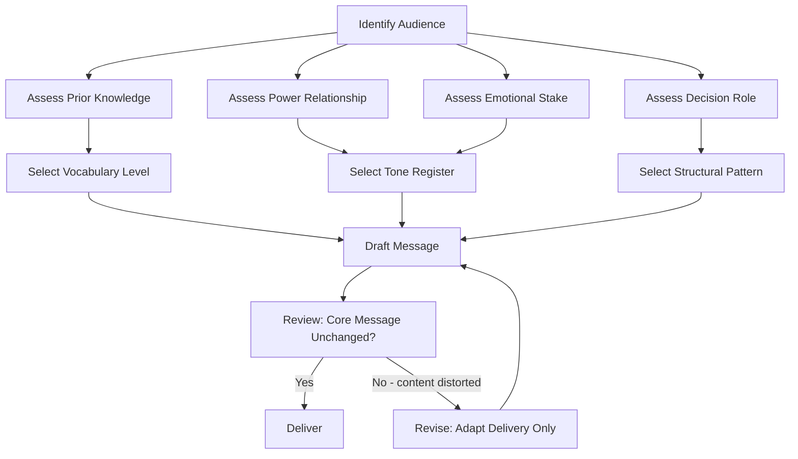

## Adapting Tone, Vocabulary, and Structure by Audience

### Definition and Scope

Adapting tone, vocabulary, and structure by audience is the rhetorical practice of deliberately modifying **how** a message is delivered (tone), **what** terms are used to express it (vocabulary), and **how information is sequenced and organized** (structure), while preserving the core message content and intent. This is distinct from changing the substance of the message — the underlying facts, recommendations, or conclusions should remain constant across audiences unless the communicator is deliberately misrepresenting information, which is an ethical violation of audience adaptation, not a legitimate application of it.

This practice sits at the intersection of classical rhetoric (particularly Aristotle's concept of *ethos*, *pathos*, and *logos* calibrated to the listener) and modern executive communication theory, where the same quarterly result might be communicated differently to a board, a frontline team, and a regulator — not because the truth changes, but because each audience's prior knowledge, stakes, and decision-making role differ.

### Why Adaptation Matters in Executive Communication

**Key Points**

- Executives typically communicate the same core message (a decision, a result, a risk) to multiple stakeholder groups within a short time window (board, employees, press, regulators)
- Failure to adapt causes three common failure modes: (1) information overload for lay audiences, (2) perceived condescension for expert audiences, (3) loss of credibility when structure doesn't match audience expectations for how information should be sequenced
- Adaptation is a credibility mechanism: audiences judge competence partly by whether a speaker demonstrates understanding of their specific context and constraints
- Poor adaptation is a leading cause of executive communication failure even when the underlying strategy or decision is sound [Inference — this is a widely cited claim in executive communication training literature but is not derived from a single controlled study cited here]

### The Three Adaptation Levers

#### 1. Tone

Tone is the emotional register and interpersonal stance conveyed by word choice, sentence rhythm, and framing. It answers the implicit audience question: *"How should I feel about what I'm hearing, and how does the speaker feel about me?"*

**Dimensions of tone to calibrate:**

- **Formality** (casual ↔ formal): governed by power distance, occasion, and organizational culture
- **Directness** (indirect/diplomatic ↔ direct/blunt): governed by audience seniority, cultural context, and severity of the message
- **Warmth** (detached/clinical ↔ warm/personal): governed by relationship history and emotional stakes of the content
- **Confidence** (tentative/hedged ↔ assertive/certain): governed by audience's need for reassurance versus audience's sophistication in evaluating uncertainty

**Example**

| Audience | Message: "We missed Q3 revenue targets by 8%" |
| --- | --- |
| Board of directors | "Q3 revenue came in at 8% below target, driven primarily by delayed enterprise contract signings. We've identified the root cause and adjusted the Q4 pipeline forecast accordingly." |
| Frontline sales team | "We didn't hit the number this quarter — I know that's frustrating given how hard everyone worked. Here's what we learned and what we're changing for Q4." |
| Press / public statement | "Third-quarter results reflected timing shifts in several large contracts, which we expect to resolve in the fourth quarter." |

The facts (8% miss, enterprise contract delays) are constant. The emotional register shifts from clinical-analytical (board), to empathetic-motivational (team), to measured-neutral (press).

#### 2. Vocabulary

Vocabulary adaptation involves substituting technical jargon, acronyms, and domain-specific terminology based on the audience's prior knowledge, without altering the underlying claim.

**Key Points**

- **Jargon density** should be inversely proportional to audience diversity: a homogeneous expert audience tolerates high jargon density; a mixed or lay audience requires translation
- **Acronym expansion**: first use should always be spelled out unless the audience's shared vocabulary is confirmed in advance
- **Precision vs. accessibility tradeoff**: simplifying vocabulary for a lay audience necessarily sacrifices some technical precision; the adapter's skill lies in choosing simplifications that don't introduce factual distortion
- **Register matching**: legal, financial, and technical audiences often expect specific standardized terminology (e.g., "material weakness" in an audit context) where substituting a synonym can create ambiguity or even legal risk

**Example**

| Audience | Technical concept: API rate limiting |
| --- | --- |
| Engineering team | "We're capping requests at 100/min per token to prevent downstream service degradation under load." |
| Executive leadership | "We've put a safeguard in place so a single customer's traffic spike can't slow the system down for everyone else." |
| Customer-facing support docs | "To keep the service fast and reliable for all users, each account can make up to 100 requests per minute." |

#### 3. Structure

Structure is the sequencing and organizational architecture of the message — what comes first, how much detail is front-loaded, and what organizational pattern (deductive vs. inductive, chronological vs. priority-ordered) is used.

**Key structural patterns and their ideal audiences:**

- **Direct/deductive (conclusion-first, "BLUF" — Bottom Line Up Front)**: Best for senior executives, boards, and time-constrained decision-makers who want the answer before the reasoning. Common in executive memos and board summaries.
- **Indirect/inductive (context-first, conclusion-last)**: Best for audiences who may resist the conclusion, need to be walked through evidence to build buy-in, or come from cultures/professions where this build-up is the norm (e.g., some legal or academic audiences, or when delivering bad news to preserve goodwill before the ask).
- **Problem-Solution-Benefit**: Effective for pitching change initiatives to skeptical or resource-constrained audiences.
- **Chronological/narrative**: Effective for post-mortems, case studies, or audiences unfamiliar with the situation who need the sequence of events to understand causality.
- **Q&A / FAQ structure**: Effective for anticipatory audiences (press, regulators) where objections or questions are predictable and addressing them preemptively builds trust.

**Example: Same content, restructured**

*Deductive (for the CEO):*

> "Recommendation: We should delay the product launch by six weeks. Reason: QA identified a critical security vulnerability. Impact: Delaying costs an estimated $200K in lost early-adopter revenue but avoids a potential post-launch breach costing an estimated $2M+ in remediation and reputational damage."

*Inductive (for a nervous product team that fought for the original date):*

> "Over the past week, QA ran an expanded penetration test ahead of launch. They found a vulnerability in the authentication flow that could allow unauthorized account access. We modeled the cost of fixing it before versus after launch — before costs us six weeks and roughly $200K in delayed revenue; after could cost over $2M if exploited. Given that gap, we're recommending a six-week delay."

### A Framework for Audience Analysis Prior to Adaptation

Before adapting tone, vocabulary, or structure, the communicator should assess the audience along several axes. This is often formalized as an **audience analysis matrix**:

1. **Prior knowledge**: novice, informed, expert
2. **Power/authority relationship**: superior, peer, subordinate, external/regulatory
3. **Emotional stake**: low (informational), medium (affected but not personally threatened), high (personally or financially threatened)
4. **Decision role**: decision-maker, influencer, implementer, bystander/informed party
5. **Cultural and organizational norms**: high-context vs. low-context communication preference, direct vs. indirect cultural tendencies [Inference — cultural communication style is a well-documented area in intercultural communication research, but any individual audience member may not conform to broad cultural generalizations, so this axis should be treated as a starting hypothesis, not a fixed rule]

#### Diagram: Audience Analysis to Adaptation Pipeline

### Visual: The Three Levers Radiating from a Fixed Core Message

<svg xmlns="http://www.w3.org/2000/svg" viewBox="0 0 600 420">
<text x="300" y="30" text-anchor="middle" font-size="18" font-weight="bold" fill="#1a1a1a">Tone, Vocabulary, Structure Adaptation (svg_diagram)</text>
<circle cx="300" cy="210" r="70" fill="#2c5f8a" opacity="0.9" />
<text x="300" y="205" text-anchor="middle" font-size="14" fill="#ffffff" font-weight="bold">Core</text>
<text x="300" y="222" text-anchor="middle" font-size="14" fill="#ffffff" font-weight="bold">Message</text>
<line x1="300" y1="140" x2="300" y2="70" stroke="#555555" stroke-width="2" />
<circle cx="300" cy="60" r="45" fill="#3d8a5f" />
<text x="300" y="56" text-anchor="middle" font-size="13" fill="#ffffff" font-weight="bold">Tone</text>
<text x="300" y="70" text-anchor="middle" font-size="10" fill="#ffffff">Emotional register</text>
<line x1="240" y1="245" x2="110" y2="330" stroke="#555555" stroke-width="2" />
<circle cx="100" cy="345" r="45" fill="#a3572c" />
<text x="100" y="340" text-anchor="middle" font-size="13" fill="#ffffff" font-weight="bold">Vocabulary</text>
<text x="100" y="356" text-anchor="middle" font-size="10" fill="#ffffff">Term selection</text>
<line x1="360" y1="245" x2="490" y2="330" stroke="#555555" stroke-width="2" />
<circle cx="500" cy="345" r="45" fill="#8a3d6e" />
<text x="500" y="340" text-anchor="middle" font-size="13" fill="#ffffff" font-weight="bold">Structure</text>
<text x="500" y="356" text-anchor="middle" font-size="10" fill="#ffffff">Sequencing</text>

<text x="300" y="400" text-anchor="middle" font-size="12" fill="`#444444`" font-style="italic">Facts and intent remain fixed; delivery mechanics vary by audience</text>

</svg>

### Common Pitfalls

- **Over-simplification that distorts meaning**: removing so much technical nuance that the lay-audience version becomes factually misleading (e.g., saying "the system is completely secure" instead of "the system meets current industry security standards")
- **Tone mismatch through channel neglect**: using written-memo tone in a live Q&A, or vice versa, where audience expectations differ by medium as well as by group
- **Code-switching failure under pressure**: reverting to habitual jargon or tone when stressed (e.g., in a crisis press conference), undermining otherwise well-planned adaptation
- **Condescension**: over-simplifying for an audience that is more sophisticated than assumed, which damages credibility as much as under-simplifying for a novice audience
- **Structural mismatch with cultural expectations**: using a direct, deductive style with audiences/cultures that expect relationship-building context before the main point, which can read as abrupt or disrespectful [Inference — the direction and magnitude of this effect varies by specific cultural and organizational context and should not be treated as a universal rule]

### Practical Adaptation Checklist

1. Identify all distinct audience segments who will receive or overhear this message
2. For each segment, assess prior knowledge, power relationship, emotional stake, and decision role
3. Draft the core message once, stripped of tone/vocabulary/structure choices (the "facts and ask")
4. For each audience, select tone (formality, directness, warmth, confidence), vocabulary (jargon density, term substitution), and structure (deductive/inductive, pattern) independently
5. Cross-check each adapted version against the original core message to confirm no factual drift occurred
6. Where the same message will be delivered to multiple audiences in close succession (e.g., internal memo before external press release), sequence releases to avoid contradictory framing being discovered by cross-audience visibility

**Related Topics**

- Audience Segmentation Techniques in Executive Communication
- The BLUF (Bottom Line Up Front) Method for Executive Memos
- Crisis Communication and Tone Calibration Under Pressure
- Cross-Cultural Communication Styles (High-Context vs. Low-Context)
- Ethical Boundaries in Message Adaptation vs. Message Distortion
- Register and Diction in Technical Writing for Mixed Audiences
- Framing Theory and Its Application to Stakeholder Messaging
- Reading the Room: Real-Time Audience Feedback and Mid-Speech Adaptation