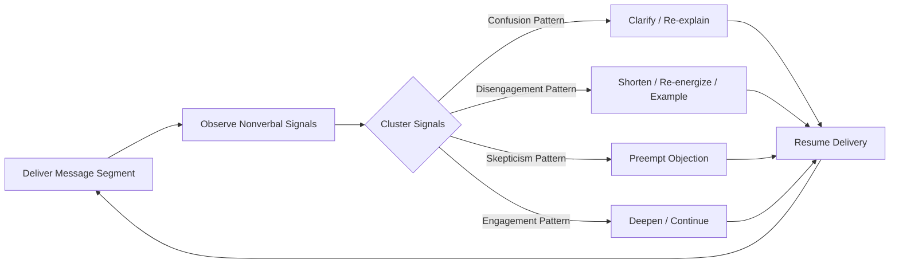

## Reading Nonverbal Audience Feedback in Real Time

### Definition and Scope

Reading nonverbal audience feedback in real time is the practice of observing, interpreting, and responding to an audience's unspoken signals — body language, facial expression, posture, movement, vocal backchannel cues, and collective group dynamics — while a communication is actively in progress, in order to adapt delivery on the fly. This is a live, dynamic subset of audience analysis distinct from pre-speech audience research: it happens during the speech act itself and requires simultaneous observation, interpretation, and adaptive response.

This skill draws on kinesics (the study of body movement as communication, a term coined by anthropologist Ray Birdwhistell), proxemics (spatial behavior), and paralinguistics (vocal cues excluding words themselves), applied specifically to the executive communication context of presentations, meetings, negotiations, and public speaking.

### Why Real-Time Nonverbal Reading Matters

**Key Points**

- Audiences rarely interrupt a speaker verbally to say "I'm confused" or "I disagree" — nonverbal signals are often the only feedback channel available during a live presentation
- Executives who fail to notice disengagement, confusion, or resistance in real time lose the opportunity to course-correct before the message fails entirely
- The ability to read a room and adjust is frequently cited as a distinguishing trait between merely competent and highly effective public speakers and negotiators [Inference — this is a widely held view in communication coaching and leadership literature, not a single empirically settled metric]
- Real-time adaptation based on nonverbal feedback closes the loop between one-way transmission (speaking) and genuine two-way communication, even when the audience never speaks

### Categories of Nonverbal Feedback Signals

#### 1. Facial Expressions

- **Engagement indicators**: raised eyebrows (interest/surprise), sustained eye contact, slight forward head tilt
- **Confusion indicators**: furrowed brow, squinting, asymmetric expressions, rapid glances at neighbors
- **Disagreement/skepticism indicators**: pursed lips, one-sided mouth raise, narrowed eyes, slow head shake
- **Disengagement indicators**: flat affect, eyes glazing or unfocused, minimal facial movement over extended periods

#### 2. Posture and Body Orientation

- **Open posture** (uncrossed arms/legs, torso facing speaker, leaning slightly forward): typically signals receptivity and engagement
- **Closed posture** (crossed arms, turned-away torso, leaning back): may signal defensiveness, skepticism, or discomfort — though this can also simply indicate physical comfort preferences, so it should be weighted alongside other cues, not read in isolation [Inference — the "crossed arms equals defensiveness" heuristic is a popular but contested claim in body language literature; treat single-cue interpretations cautiously]
- **Mirroring**: audience members subconsciously mimicking the speaker's posture or gestures, often associated with rapport and alignment
- **Restlessness**: shifting in seats, foot-tapping, checking devices, adjusting posture frequently — often signals boredom, discomfort, or urgency to leave

#### 3. Collective/Group-Level Signals

- **Synchrony**: when multiple audience members display the same reaction simultaneously (collective forward lean, collective note-taking), this is a stronger signal than any individual cue
- **Micro-clusters of side conversation**: whispered exchanges between neighbors often indicate either confusion (clarifying with a peer) or strong reaction (positive or negative) worth addressing
- **Silence quality**: there is a distinguishable difference between "engaged silence" (stillness, eye contact, note-taking) and "checked-out silence" (fidgeting, downward gaze, phone use) — the same absence of sound carries different meaning based on accompanying cues
- **Energy contagion**: audience energy in group settings tends to be socially contagious — one or two visibly disengaged individuals can influence perception among neighbors if not addressed [Inference — based on social contagion theory in group psychology; magnitude varies by group size, culture, and setting]

#### 4. Paralinguistic and Vocal Backchannel Cues (in Q&A or Discussion Settings)

- **Backchannel signals**: "mm-hmm," "right," soft laughter — these indicate active listening and processing
- **Tone shifts in questions**: a sharp or clipped tone in a follow-up question often signals frustration or skepticism, independent of the question's literal wording
- **Pause length before response**: unusually long pauses before an audience member responds may indicate they are formulating a diplomatic version of disagreement

### A Framework for Real-Time Reading and Response

**Practical Adaptation Checklist**

1. **Establish a baseline early**: in the first 1–2 minutes, observe the audience's resting nonverbal state (a naturally reserved audience should not be misread as hostile)
2. **Scan systematically, not randomly**: rotate attention across sections of the room/call rather than fixating on a single reactive individual (the "front row halo/anti-halo effect" — one very engaged or very disengaged person in the front row can disproportionately skew a speaker's perception of the whole room)
3. **Cluster signals before reacting**: a single crossed-arm audience member is low-signal; three audience members simultaneously checking phones during the same slide is high-signal
4. **Match response to signal type**:
   - Confusion cluster detected → pause, offer a clarifying example, or explicitly ask "does this framing make sense so far?"
   - Disengagement cluster detected → shorten the current section, insert a concrete example or question, or change vocal pacing/volume to re-capture attention
   - Skepticism/disagreement cluster detected → proactively address the likely objection ("I know some of you may be thinking...") rather than waiting for it to surface later, more adversarially
   - High engagement detected → this is often a signal to extend or deepen the current point rather than rushing past it
5. **Confirm interpretation when stakes are high**: for consequential meetings (board presentations, high-stakes negotiations), a direct verbal check ("I want to pause and check — is this landing the way I intend?") converts an inferred nonverbal signal into confirmed verbal information

#### Diagram: Real-Time Feedback Loop

### Visual: Signal Strength by Cue Type

<svg xmlns="http://www.w3.org/2000/svg" viewBox="0 0 620 380">
<text x="310" y="28" text-anchor="middle" font-size="17" font-weight="bold" fill="#1a1a1a">Nonverbal Signal Reliability (svg_diagram)</text>
<line x1="80" y1="330" x2="580" y2="330" stroke="#333333" stroke-width="2" />
<line x1="80" y1="330" x2="80" y2="60" stroke="#333333" stroke-width="2" />
<text x="30" y="200" text-anchor="middle" font-size="12" fill="#333333" transform="rotate(-90 30 200)">Signal Strength</text>
<text x="330" y="365" text-anchor="middle" font-size="12" fill="#333333">Cue Type</text>
<rect x="110" y="290" width="60" height="40" fill="#b0b0b0" />
<text x="140" y="345" text-anchor="middle" font-size="10" fill="#333333">Single</text>
<text x="140" y="357" text-anchor="middle" font-size="10" fill="#333333">crossed arms</text>
<rect x="210" y="250" width="60" height="80" fill="#8fae7a" />
<text x="240" y="345" text-anchor="middle" font-size="10" fill="#333333">Facial</text>
<text x="240" y="357" text-anchor="middle" font-size="10" fill="#333333">expression</text>
<rect x="310" y="190" width="60" height="140" fill="#5f8fae" />
<text x="340" y="345" text-anchor="middle" font-size="10" fill="#333333">Synchronized</text>
<text x="340" y="357" text-anchor="middle" font-size="10" fill="#333333">group reaction</text>
<rect x="410" y="150" width="60" height="180" fill="#3d6e8a" />
<text x="440" y="345" text-anchor="middle" font-size="10" fill="#333333">Verbal +</text>
<text x="440" y="357" text-anchor="middle" font-size="10" fill="#333333">nonverbal combo</text>
<rect x="510" y="90" width="60" height="240" fill="#2c4e6e" />
<text x="540" y="345" text-anchor="middle" font-size="10" fill="#333333">Direct verbal</text>
<text x="540" y="357" text-anchor="middle" font-size="10" fill="#333333">confirmation</text>
</svg>

### Modality-Specific Considerations

**In-person settings**: full-body cues are visible (posture, spatial distancing, collective movement); easiest modality for reading group-level synchrony.

**Video conferencing**: nonverbal bandwidth is significantly reduced — only faces (and sometimes only partial faces) are visible in gallery view, backchannel audio cues are often muted, and "checked-out silence" is harder to distinguish from "engaged silence" since audio and camera framing limit visibility of hands, posture, or side conversations. Behavioral proxies specific to video settings include: camera-off rates increasing mid-meeting, chat activity patterns, and reaction-emoji usage where platforms support it. [Inference — the specific behavioral proxies that substitute for lost nonverbal bandwidth in video settings are an active area of applied communication practice rather than a single settled body of research]

**Audio-only settings (phone calls, podcasts, radio)**: nonverbal reading is limited entirely to paralinguistic cues (tone, pace, pauses, breathing); speakers must rely more heavily on direct verbal check-ins since visual cues are entirely absent.

### Common Pitfalls

- **Over-indexing on a single individual**: reading the whole room's temperature from one visibly reactive audience member (positively or negatively) distorts overall calibration
- **Cultural misreading**: eye contact norms, expressiveness, and acceptable audience behavior vary significantly across cultures; a "disengaged" reading in one cultural context may simply reflect a culturally normal listening posture in another [Inference — cross-cultural nonverbal norms are well documented in intercultural communication research as varying significantly, but any given individual's behavior should not be assumed to strictly follow group-level cultural norms]
- **Confirmation bias**: speakers who are nervous about a particular section may selectively notice negative cues that confirm their anxiety while missing neutral or positive signals
- **Overreacting to normal baseline behavior**: adjusting delivery based on a cue that was simply that individual's resting expression or habitual posture, not a reaction to the content
- **Neglecting self-monitoring**: focusing entirely outward on audience cues while failing to notice one's own nonverbal signals (which the audience is simultaneously reading), creating a mismatched feedback loop

**Related Topics**

- Kinesics and Proxemics in Executive Presence
- Vocal Delivery: Pace, Pitch, and Pause as Persuasive Tools
- Q&A Management and Handling Hostile Questions
- Adapting Tone, Vocabulary, and Structure by Audience
- Cross-Cultural Nonverbal Communication Norms
- Building Rapport Through Mirroring and Synchrony
- Video Conferencing Presence and Reduced-Bandwidth Communication
- Managing Speaker Anxiety and Its Effect on Self-Perception of Audience Feedback