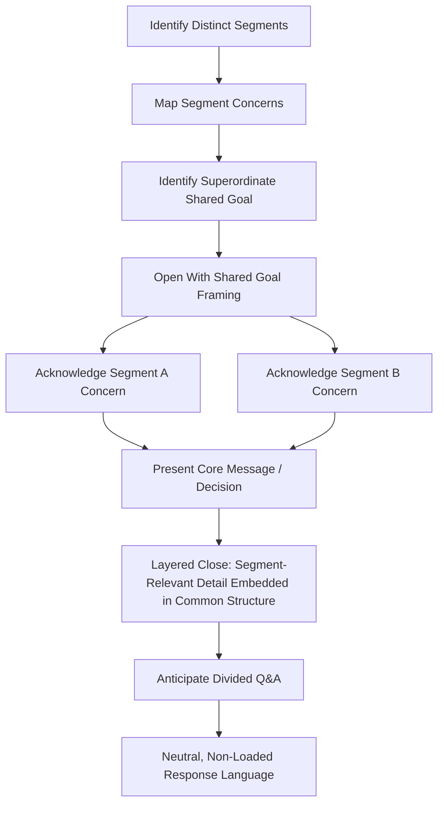

## Adjusting Message for Mixed or Divided Audiences

### Definition and Scope

Adjusting message for mixed or divided audiences is the rhetorical practice of constructing a single communication event that must reach multiple audience segments simultaneously — segments that differ in prior knowledge, values, interests, or even overt opposition to one another or to the speaker's position — without fracturing the message's coherence or sacrificing credibility with any one segment. This differs from sequential audience adaptation (delivering different tailored versions to different audiences at different times, as in prior topics) because here **all segments receive the message at the same time, often in the same room**, and any accommodation visible to one segment is also visible to the others.

This is a common condition in executive communication: an all-hands meeting where some employees support a reorganization and others oppose it; a board presentation where some directors favor an acquisition and others are skeptical; a press conference where friendly and adversarial journalists are present simultaneously; a public hearing with polarized stakeholder groups.

### Why Mixed Audiences Require Distinct Technique

**Key Points**

- Unlike sequential adaptation, the speaker cannot use audience-specific vocabulary or framing without all other segments also hearing it — this constrains the available adaptation levers
- Any message perceived as favoring one segment risks alienating others who are simultaneously present, which can damage credibility broadly rather than with just one group
- Divided audiences often contain latent conflict that the speaker did not create but must navigate; poor handling can appear to take sides even when neutrality was intended
- The goal shifts from "optimize for this specific audience" (single-audience adaptation) to "find common ground and shared values that hold across all segments while still addressing each segment's core concern" [Inference — this framing reflects standard practice in conflict-sensitive and multi-stakeholder communication, not a single canonical source]

### Core Strategies for Mixed/Divided Audiences

#### 1. Superordinate Framing (Shared Identity or Goal)

Identify and lead with a goal, value, or identity that all segments share, even when they disagree on the means to achieve it. This is grounded in social psychology's concept of superordinate goals (from Sherif's Robbers Cave studies) — shared goals that require cooperation across otherwise divided groups reduce intergroup tension.

**Example**: In an all-hands meeting about a divisive reorganization, rather than opening with the restructuring details (which will immediately trigger opposition from affected groups), open with: "Every team in this room cares about our ability to serve customers reliably during this growth phase — that's the shared problem we're solving for today." This reframes the subsequent disagreement as being about *means* to a shared end, not a zero-sum conflict.

#### 2. Sequential Acknowledgment (Steelmanning Each Position)

Explicitly and accurately articulate each major position or concern present in the room before advancing the speaker's own message. This signals to each segment that their perspective has been heard and understood, which increases receptivity to what follows — even among those who disagree with the ultimate conclusion.

**Example structure**:

> "I know some of you are concerned this change will slow down decision-making [Segment A's concern, stated accurately]. I also know others are concerned that without this change, we won't scale to support the new product lines [Segment B's concern, stated accurately]. Both concerns are valid, and here's how we're addressing both..."

#### 3. Layered Messaging (Simultaneous Multi-Level Communication)

Structure the message so that different segments can extract the specific reassurance or information most relevant to them without the speaker needing to name segments explicitly. This often involves:

- Leading with the universally relevant information (facts, timeline, shared impact)
- Embedding segment-specific detail within a common structure (e.g., an FAQ-style close where each anticipated question maps to a specific segment's concern)
- Avoiding language that implicitly signals "this part is for you" to one group in a way that excludes or alienates others

#### 4. Strategic Ambiguity (Used Carefully and Ethically)

In some cases, especially early in a contentious process, deliberately using language broad enough to be interpreted compatibly by multiple segments can preserve unity while details are still being finalized. This technique carries real ethical risk: **strategic ambiguity crosses into deception when it is used to imply mutually exclusive commitments to different segments** (e.g., implying to one group that a decision favors them while implying to another that it favors them, when only one can be true). Ethical strategic ambiguity preserves flexibility on genuinely undecided matters; unethical strategic ambiguity manufactures false reassurance on matters that are already decided. [Inference — the ethical boundary described here reflects standard treatment in organizational communication ethics literature, though the precise line can be contested in specific cases]

#### 5. Neutral Facilitation Language

When a speaker must remain (or appear) neutral among divided factions — e.g., a moderator, a newly appointed executive inheriting a divided team, or a mediator — vocabulary should avoid loaded terms associated with either side's framing. This often means substituting neutral descriptive terms for the labels each faction uses for itself or the other (e.g., using "the proposed restructuring" rather than either side's preferred framing of "the necessary modernization" or "the layoffs").

### A Framework for Preparing to Address a Mixed Audience

**Practical Adaptation Checklist**

1. **Map the segments**: identify the distinct groups present, their core concerns, their relationship to the speaker's message (supportive, neutral, opposed), and their relationship to each other (allied, indifferent, adversarial)
2. **Identify the superordinate goal**: find the value or objective that legitimately holds across all segments — this cannot be manufactured; it must be genuine or the audience will detect the artifice
3. **Draft segment-specific concern statements**: write out, in each segment's own likely terms, what their core objection or question would be — this is the steelmanning step
4. **Sequence for de-escalation**: generally, address the most emotionally charged or highest-stakes concern early enough to prevent it from dominating audience attention throughout the rest of the message, but not so early that it overshadows the shared framing
5. **Pressure-test vocabulary for loaded terms**: review the draft for words that implicitly favor one segment's framing over another's
6. **Plan for the Q&A/reaction phase separately from the prepared remarks**: mixed audiences often reveal their true divisions in questions or follow-up, not in the initial speech — a plan for handling adversarial or pointed questions from a subset of the audience should exist in advance (see also: real-time nonverbal feedback reading)

#### Diagram: Mixed-Audience Message Architecture

### Visual: Convergence Model for Divided Audiences

<svg xmlns="http://www.w3.org/2000/svg" viewBox="0 0 620 360">
<text x="310" y="28" text-anchor="middle" font-size="17" font-weight="bold" fill="#1a1a1a">Divided Audience Convergence (svg_diagram)</text>
<circle cx="150" cy="150" r="55" fill="#a3572c" opacity="0.85" />
<text x="150" y="145" text-anchor="middle" font-size="12" fill="#ffffff" font-weight="bold">Segment A</text>
<text x="150" y="162" text-anchor="middle" font-size="10" fill="#ffffff">Supportive</text>
<circle cx="470" cy="150" r="55" fill="#2c5f8a" opacity="0.85" />
<text x="470" y="145" text-anchor="middle" font-size="12" fill="#ffffff" font-weight="bold">Segment B</text>
<text x="470" y="162" text-anchor="middle" font-size="10" fill="#ffffff">Opposed</text>
<circle cx="310" cy="260" r="65" fill="#3d8a5f" />
<text x="310" y="253" text-anchor="middle" font-size="13" fill="#ffffff" font-weight="bold">Superordinate</text>
<text x="310" y="270" text-anchor="middle" font-size="13" fill="#ffffff" font-weight="bold">Shared Goal</text>
<line x1="180" y1="195" x2="280" y2="235" stroke="#555555" stroke-width="2" stroke-dasharray="4,3" />
<line x1="440" y1="195" x2="340" y2="235" stroke="#555555" stroke-width="2" stroke-dasharray="4,3" />

<text x="310" y="340" text-anchor="middle" font-size="11" fill="`#444444`" font-style="italic">Both segments are drawn toward genuine common ground, not toward each other's position</text>

</svg>

### Common Pitfalls

- **False balance**: treating all positions as equally valid when they are not (e.g., factual claims versus opinions), which can undermine credibility with the segment holding the factually stronger position
- **Visible favoritism**: unconsciously spending more time, warmer tone, or more detailed acknowledgment on one segment's concerns, which the other segment(s) will notice even if unintentional
- **Manufactured superordinate goals**: invoking a "shared value" that is not genuinely shared or is transparently pretextual, which audiences — especially skeptical or adversarial segments — tend to detect and reject
- **Avoiding the core disagreement entirely**: over-relying on superordinate framing to the point of never actually addressing the substantive disagreement, which reads as evasive to more engaged or informed segments
- **Assuming segments are internally homogeneous**: treating "supporters" or "opponents" as monolithic blocks when in practice most divided audiences contain a spectrum of positions and a persuadable middle group [Inference — audience segmentation models generally support the existence of a persuadable middle in most divided groups, though the exact proportion varies significantly by context and cannot be assumed universally]

**Related Topics**

- Adapting Tone, Vocabulary, and Structure by Audience
- Reading Nonverbal Audience Feedback in Real Time
- Conflict-Sensitive Communication and Mediation Language
- Crisis Communication to Polarized Stakeholder Groups
- Steelmanning as a Persuasive and Ethical Rhetorical Technique
- Strategic Ambiguity: Ethical Boundaries and Applications
- Managing Hostile or Adversarial Q&A in Public Forums
- Superordinate Goals and Intergroup Conflict Reduction (Social Psychology)