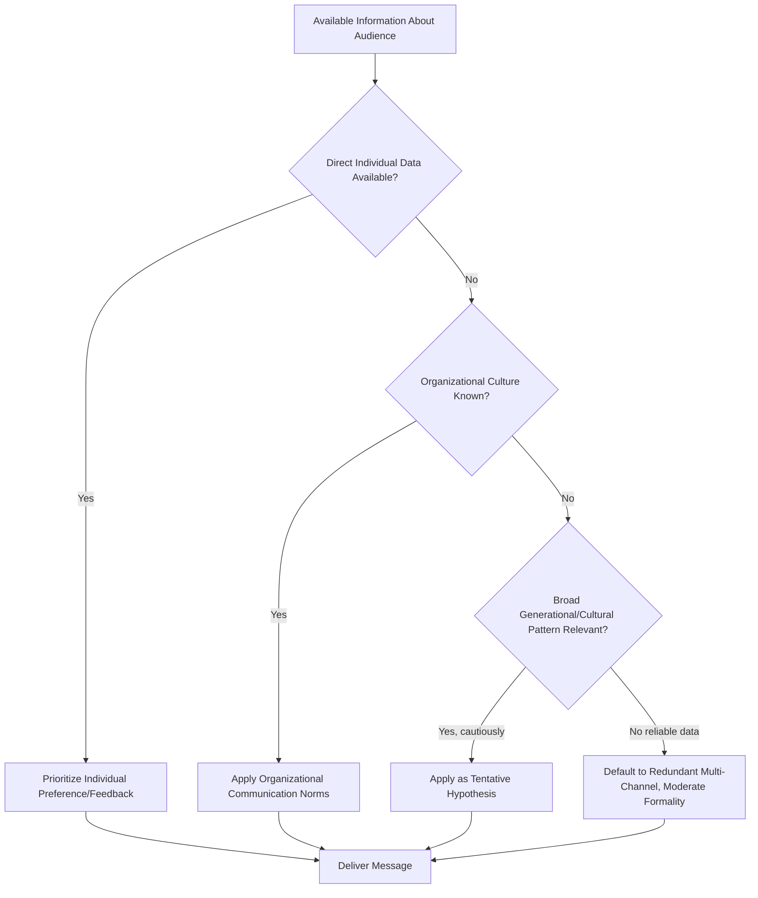

## Generational and Cultural Considerations in Adaptation

### Definition and Scope

Generational and cultural considerations in adaptation refers to the practice of adjusting communication style, structure, channel, and content based on two distinct but often interacting demographic dimensions: **generational cohort** (age-based groupings shaped by shared historical and technological formative experiences) and **cultural background** (national, regional, ethnic, or organizational culture shaping communication norms, values, and expectations). Both dimensions influence how messages are received, interpreted, and judged for credibility, independent of the message's content.

This topic sits within the broader audience analysis framework but requires distinct treatment because generational and cultural factors are frequently **assumed** by communicators based on visible or inferred group membership, which introduces a heightened risk of stereotyping if applied uncritically. Effective adaptation in this domain requires balancing genuine, evidence-informed pattern awareness against the ethical and practical need to treat individuals as individuals.

### Generational Considerations

#### Overview of Commonly Referenced Cohorts

Generational labels are commonly used in workplace communication training, though their boundaries and even their validity as predictive categories are actively debated among sociologists and psychologists. The commonly cited cohorts (with approximate birth year ranges) are:

- **Baby Boomers**: c. 1946–1964
- **Generation X**: c. 1965–1980
- **Millennials (Generation Y)**: c. 1981–1996
- **Generation Z**: c. 1997–2012

[Unverified] — Exact boundary years vary meaningfully between sources (Pew Research, U.S. Census Bureau, and various consulting firms each use slightly different cutoffs), and there is no single authoritative definition.

**Key Points**

- Generational categories are **population-level tendencies observed in some survey and workplace research, not individual predictors** — an individual's communication preferences are shaped by far more than birth year, including profession, personality, regional culture, and individual experience
- The academic validity of "generations" as a rigorous psychological construct is contested; critics argue that generational differences attributed to age cohort may actually reflect life-stage effects (how people of any generation behave at a similar career stage) rather than true cohort effects [Inference — this is a recognized critique in generational research literature, not a settled resolution]
- Despite these limitations, generational framing remains widely used in corporate communication and training contexts, so executive communicators should be aware of the framing even while applying it cautiously

#### Commonly Cited (and Contested) Generational Communication Tendencies

| Cohort | Commonly cited channel preference | Commonly cited tone preference | Caveat |
| --- | --- | --- | --- |
| Baby Boomers | Phone calls, in-person, formal email | More formal, respect-for-hierarchy oriented | Highly variable by industry and individual tech adoption |
| Generation X | Email, direct communication | Pragmatic, low-ceremony, efficiency-valuing | Often characterized as valuing autonomy in communication style |
| Millennials | Instant messaging, collaborative platforms | Values transparency, feedback-seeking, purpose-driven framing | Broad generalization; workplace tenure and role affect this more than age alone [Inference] |
| Generation Z | Visual/short-form, chat-first, video | Direct, values authenticity over polish | Least workplace-tenure data available given recent entry to workforce; claims here are more speculative [Speculation] |

These patterns should be treated as **hypotheses to test against the specific individual or group**, not defaults to apply uniformly. Executive communicators frequently address multi-generational audiences (a single all-hands meeting may span four generational cohorts), which makes channel and format redundancy (e.g., following a live meeting with a written recap) a more reliable adaptation strategy than trying to average across generational preference.

### Cultural Considerations

#### Foundational Frameworks

**High-Context vs. Low-Context Communication** (Edward T. Hall)

- **High-context cultures** (commonly associated in the literature with many East Asian, Middle Eastern, and Latin American cultural contexts): meaning is heavily embedded in shared context, relationship history, and nonverbal cues; direct statements of disagreement or refusal are often avoided in favor of indirect signaling
- **Low-context cultures** (commonly associated with the U.S., Germany, and Scandinavian countries in the literature): meaning is expected to be made explicit in the words themselves; directness is often valued and indirectness may be read as evasiveness

**Hofstede's Cultural Dimensions Theory** (widely used, though also academically contested) identifies dimensions relevant to communication adaptation, including:

- **Power distance**: the degree to which hierarchy and unequal power distribution are accepted as normal — affects how directly subordinates are expected/permitted to question or challenge executives
- **Individualism vs. collectivism**: affects whether messages framed around individual achievement or group/team outcomes land more effectively
- **Uncertainty avoidance**: affects audience comfort with ambiguity, hedged language, and open-ended plans versus a preference for detailed, definitive structure

[Unverified] — Hofstede's framework, while highly influential and widely taught, has been critiqued by researchers for methodological limitations (originally derived from a single company's employee surveys) and for risk of oversimplifying national cultures as monolithic; it should be treated as a heuristic starting point, not a precise measurement tool.

#### Practical Cultural Adaptation Areas

- **Directness calibration**: in high power-distance or high-context settings, direct criticism of a plan (especially from a subordinate to a superior, or in front of others) may need to be delivered more indirectly or privately to be received as intended rather than as disrespectful
- **Silence interpretation**: silence following a question or proposal carries different meaning across cultures — in some contexts it signals respectful consideration; in others it may signal disagreement or discomfort; assuming a universal interpretation risks misreading the room (see also: real-time nonverbal feedback reading)
- **Formality and honorifics**: appropriate use of titles, last names versus first names, and formal register varies significantly and can affect perceived respect or credibility
- **Decision-making pace expectations**: some cultural and organizational norms expect rapid, individual decision-making; others expect extended consensus-building before a decision is considered final — mismatched expectations here can be misread as either indecisiveness or recklessness depending on which side is doing the judging

### A Framework for Applying Generational and Cultural Awareness Without Stereotyping

**Practical Adaptation Checklist**

1. **Use group-level patterns as hypotheses, not conclusions**: enter any interaction open to disconfirming evidence about a specific individual or group, rather than assuming the pattern holds
2. **Prioritize direct information over inferred category membership**: if an individual's actual stated preferences, feedback, or prior behavior are available, they should override any generational or cultural assumption
3. **Default to redundant, multi-modal delivery for mixed audiences**: rather than trying to select the "correct" single style for a mixed generational or cultural room, deliver key messages through multiple channels/formats (live plus written, visual plus verbal)
4. **Distinguish organizational culture from national/ethnic culture**: in executive settings, the specific organization's established communication norms often matter as much as or more than broader generational or national-cultural tendencies
5. **Avoid essentializing language**: internal or external communication planning should avoid absolute statements like "Gen Z wants X" or "that culture always does Y" in favor of probabilistic, hedged framing that leaves room for individual variation
6. **Seek local expertise when stakes are high**: for high-stakes cross-cultural communication (e.g., international negotiations, market-entry announcements), consulting someone with direct lived or professional expertise in that specific cultural context is more reliable than applying a general framework alone

#### Diagram: Layered Adaptation Priority

### Visual: Confidence Gradient of Adaptation Signals

<svg xmlns="http://www.w3.org/2000/svg" viewBox="0 0 620 300">
<text x="310" y="28" text-anchor="middle" font-size="17" font-weight="bold" fill="#1a1a1a">Reliability of Audience Signals (svg_diagram)</text>
<line x1="60" y1="240" x2="580" y2="240" stroke="#333333" stroke-width="2" />
<text x="320" y="270" text-anchor="middle" font-size="12" fill="#333333">Increasing Reliability →</text>
<circle cx="120" cy="200" r="8" fill="#b0392c" />
<text x="120" y="185" text-anchor="middle" font-size="10" fill="#333333">Broad</text>
<text x="120" y="225" text-anchor="middle" font-size="10" fill="#333333">stereotype</text>
<circle cx="260" cy="160" r="8" fill="#c47a2c" />
<text x="260" y="145" text-anchor="middle" font-size="10" fill="#333333">Generational/</text>
<text x="260" y="225" text-anchor="middle" font-size="10" fill="#333333">cultural pattern</text>
<circle cx="400" cy="120" r="8" fill="#8a8a2c" />
<text x="400" y="105" text-anchor="middle" font-size="10" fill="#333333">Organizational</text>
<text x="400" y="225" text-anchor="middle" font-size="10" fill="#333333">culture norm</text>
<circle cx="530" cy="80" r="8" fill="#2c7a4e" />
<text x="530" y="65" text-anchor="middle" font-size="10" fill="#333333">Individual's</text>
<text x="530" y="225" text-anchor="middle" font-size="10" fill="#333333">direct feedback</text>
<line x1="120" y1="200" x2="260" y2="160" stroke="#999999" stroke-width="1.5" stroke-dasharray="3,2" />
<line x1="260" y1="160" x2="400" y2="120" stroke="#999999" stroke-width="1.5" stroke-dasharray="3,2" />
<line x1="400" y1="120" x2="530" y2="80" stroke="#999999" stroke-width="1.5" stroke-dasharray="3,2" />
</svg>

### Common Pitfalls

- **Essentialism**: assuming every member of a generation or culture behaves identically, ignoring within-group variation that is typically larger than between-group variation on many communication dimensions [Inference — this pattern of greater within-group than between-group variance is commonly observed in social science research on group differences generally, though the specific magnitude for any given communication trait is not established here]
- **Outdated or overly broad frameworks applied uncritically**: treating Hofstede's dimensions or generational labels as precise, fixed measurements rather than dated, contested heuristics
- **Confusing correlation with individual causation**: knowing someone's generation or cultural background provides, at best, a weak prior — it should never override direct evidence about that specific person's communication preferences
- **Tokenizing or over-indexing in the opposite direction**: overcorrecting for cultural sensitivity to the point of avoiding direct, honest communication out of excessive caution, which can itself be patronizing
- **Ignoring intersectionality**: treating generational and cultural factors as independent when they often interact with each other and with other factors (role, seniority, individual personality) in ways that simple frameworks do not capture

**Related Topics**

- Adapting Tone, Vocabulary, and Structure by Audience
- Reading Nonverbal Audience Feedback in Real Time
- Adjusting Message for Mixed or Divided Audiences
- High-Context vs. Low-Context Communication Frameworks
- Cross-Cultural Negotiation Strategies for Executives
- Multi-Channel Redundancy in Organizational Communication
- Ethical Boundaries of Demographic Generalization in Messaging
- Organizational Culture vs. National Culture in Global Enterprises