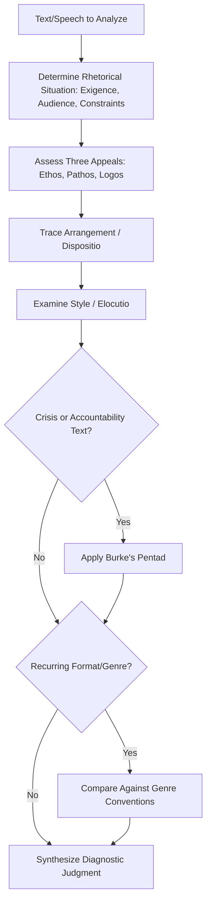

## Frameworks for Analyzing Speeches and Texts

### Definition and Scope

Frameworks for analyzing speeches and texts are structured methodologies used in rhetorical criticism to systematically evaluate how a piece of communication achieves (or fails to achieve) its persuasive, informative, or expressive purpose. Rhetorical criticism is the scholarly and practical discipline of examining texts — speeches, written documents, advertisements, visual media — to understand the choices made by the communicator and the effects those choices produce on an audience. In an executive communication context, these frameworks serve a dual purpose: analyzing others' speeches (competitors, leaders, historical figures) for lessons, and self-auditing one's own drafts before delivery.

### Why Analytical Frameworks Matter in Executive Communication

**Key Points**

- Frameworks convert intuitive reactions ("that speech felt weak") into diagnosable, actionable components (weak *ethos* establishment, disorganized *dispositio*, overreliance on *logos* without *pathos*)
- Different frameworks illuminate different aspects of a text — no single framework is comprehensive, so skilled analysis often applies multiple frameworks in combination
- Executive communicators use these frameworks both retrospectively (post-mortems on how a major announcement landed) and prospectively (drafting and revision checklists before a high-stakes speech)
- Familiarity with classical frameworks also improves the ability to recognize and counter manipulative rhetoric used by others

### Classical Framework: The Five Canons of Rhetoric

Originating in Roman rhetorical education (particularly Cicero and Quintilian), the five canons describe the stages of composing and delivering persuasive speech, and remain a foundational structure for analysis.

1. **Inventio (Invention)**: the discovery of arguments, evidence, and appeals available for the topic and audience. Analysis question: *What arguments did the speaker choose to include, and what did they choose to omit?*
2. **Dispositio (Arrangement)**: the organization and sequencing of the material. Analysis question: *Does the structure build effectively toward the speaker's goal (e.g., problem-solution, chronological, climactic ordering)?*
3. **Elocutio (Style)**: word choice, sentence construction, figures of speech, and tone. Analysis question: *Is the language appropriately calibrated to the audience and occasion (see also: adapting tone and vocabulary by audience)?*
4. **Memoria (Memory)**: historically, the memorization of the speech; in modern analysis, this extends to how well the speaker appears to command the material without over-reliance on notes or slides. Analysis question: *Does the delivery suggest genuine mastery of the content?*
5. **Pronuntiatio (Delivery)**: vocal modulation, gesture, and physical presence. Analysis question: *Do vocal and physical delivery reinforce or undercut the verbal content?*

### Classical Framework: The Three Rhetorical Appeals (Aristotle)

Aristotle's *Rhetoric* identifies three modes of persuasion, and analyzing their balance and execution remains one of the most widely used frameworks in both classical and executive rhetorical criticism.

- **Ethos** (credibility/character appeal): Does the speaker establish trustworthiness, expertise, and goodwill? Analysis looks at credentials invoked, tone of humility versus arrogance, acknowledgment of counterarguments (which paradoxically strengthens ethos by demonstrating fairness).
- **Pathos** (emotional appeal): Does the speaker connect with the audience's values, fears, hopes, or identity? Analysis looks at use of narrative, vivid imagery, and emotionally resonant framing — and whether the emotional appeal is proportionate to the message or manipulative/excessive.
- **Logos** (logical appeal): Does the speaker provide sound reasoning, evidence, and structure? Analysis looks at the quality of evidence, the validity of inferential steps, and whether logical fallacies are present.

**Example — Applying the Three Appeals to a Sample Excerpt**

Consider a hypothetical executive line: *"I've spent eighteen years in this industry, and I've never seen a shift this fast. Our people built this company through hard times before, and the data tells us this transition, done right, adds a billion dollars in value over five years."*

- **Ethos**: "eighteen years in this industry" — establishes experiential credibility
- **Pathos**: "our people built this company through hard times before" — invokes shared identity, resilience, and emotional continuity
- **Logos**: "the data tells us... adds a billion dollars in value" — appeals to quantifiable, evidence-based reasoning

A rhetorical critique would assess whether these three appeals are balanced, whether the ethos claim is substantiated elsewhere in the speech, and whether the logos claim's evidentiary basis is actually presented or merely asserted.

### Modern/Applied Framework: Neo-Aristotelian Criticism

An extension of classical rhetoric formalized in 20th-century rhetorical scholarship (notably associated with Herbert Wichelns and later Lester Thonssen), neo-Aristotelian criticism systematically applies the five canons and three appeals to a specific historical speech within its full context: the speaker's biography and credibility, the immediate occasion, the audience's disposition, and the speech's actual historical effect. This framework is particularly useful for case-study analysis (e.g., analyzing a CEO's crisis-response speech against its actual market/stakeholder outcome).

### Modern/Applied Framework: The Rhetorical Situation (Bitzer)

Lloyd Bitzer's concept of the **rhetorical situation** analyzes a text by examining three components that call the discourse into being:

1. **Exigence**: the urgent problem or need that the communication is a response to
2. **Audience**: those capable of being influenced by the discourse and of acting to resolve the exigence
3. **Constraints**: the people, events, objects, and relationships that limit what the speaker can persuasively say (including the speaker's own credibility, prior statements, and available time/resources)

Analysis question: *Does the speech appropriately match the actual exigence, correctly identify the audience capable of acting, and account realistically for its constraints?* A common executive communication failure is misjudging the exigence (e.g., treating an internal morale problem as a strategy problem) or misjudging the audience (speaking to the wrong decision-makers).

### Modern/Applied Framework: Burke's Pentad (Dramatism)

Kenneth Burke's dramatistic pentad analyzes a text as if it were a drama, examining five elements to understand the speaker's underlying motive:

1. **Act**: what was done
2. **Scene**: the context/setting in which it was done
3. **Agent**: who did it
4. **Agency**: the means/instruments used
5. **Purpose**: why it was done

Burke's method emphasizes examining the **ratios** between these elements (e.g., a "scene-act ratio" analysis of whether the speaker frames the situation as forcing the action, which shifts perceived responsibility). This is particularly useful for analyzing apologies, crisis statements, and accountability-related executive communication, where framing of agency and purpose significantly affects audience judgment of responsibility.

### Modern/Applied Framework: Fantasy-Theme / Narrative Criticism

Drawing on Ernest Bormann's Symbolic Convergence Theory and broader narrative criticism traditions, this framework analyzes how speakers use recurring stories, characters, and "fantasy themes" (shared narratives that a group comes to believe collectively) to build group identity and cohesion. Analysis questions include: *What recurring narrative or metaphor does the speaker rely on? Does this narrative align with or contradict the audience's existing self-understanding?* This is useful for analyzing organizational culture-building speeches (e.g., founder narratives, mission-driven messaging).

### Modern/Applied Framework: Genre Criticism

Genre criticism analyzes a text by comparing it against the established conventions of its rhetorical genre (e.g., the eulogy, the apologia/crisis apology, the inaugural address, the shareholder letter). Analysis questions: *Does the text fulfill the audience's genre-based expectations? Where does it deviate, and is the deviation effective or jarring?* This framework is especially useful in executive communication because many recurring formats (earnings calls, resignation announcements, product-recall statements) function as genres with well-established audience expectations.

### Comparative Framework Table

| Framework | Primary Focus | Best Applied To |
| --- | --- | --- |
| Five Canons | Composition process (invention through delivery) | Full speech drafting and revision |
| Three Appeals (Aristotle) | Persuasive balance (credibility/emotion/logic) | Any persuasive text; quick diagnostic |
| Neo-Aristotelian | Historical/contextual full analysis | Case studies of specific notable speeches |
| Rhetorical Situation (Bitzer) | Fit between message, urgency, audience, constraints | Assessing whether a message matches its actual context |
| Burke's Pentad | Underlying motive and responsibility framing | Crisis communication, apologies, accountability statements |
| Fantasy-Theme/Narrative | Shared story and group identity building | Culture-building, vision, and mission communication |
| Genre Criticism | Conformity to/deviation from format conventions | Recurring standardized communication formats |

### A Practical Analysis Workflow

**Practical Adaptation Checklist**

1. Identify the rhetorical situation: what exigence prompted this text, who is the true audience, what constraints applied
2. Assess the three appeals: is there a deliberate and appropriate balance of ethos, pathos, and logos for this audience and purpose
3. Trace the arrangement (dispositio): outline the actual structure used and evaluate whether it serves the persuasive goal
4. Examine style (elocutio): identify notable rhetorical devices (repetition, antithesis, metaphor) and assess whether they match audience and occasion
5. If relevant, apply Burke's Pentad to uncover implicit framing of responsibility or motive
6. If relevant, compare against genre conventions to assess whether the text meets, exceeds, or violates audience expectations for its format
7. Synthesize findings into a diagnostic judgment: identify the one or two elements most responsible for the text's success or failure, rather than listing every observation with equal weight

#### Diagram: Layered Analysis Workflow

### Visual: Framework Selection by Analytical Goal

<svg xmlns="http://www.w3.org/2000/svg" viewBox="0 0 640 380">
<text x="320" y="28" text-anchor="middle" font-size="17" font-weight="bold" fill="#1a1a1a">Choosing a Rhetorical Framework (svg_diagram)</text>
<rect x="40" y="70" width="150" height="80" rx="8" fill="#2c5f8a" />
<text x="115" y="100" text-anchor="middle" font-size="12" fill="#ffffff" font-weight="bold">Persuasive</text>
<text x="115" y="116" text-anchor="middle" font-size="12" fill="#ffffff" font-weight="bold">Balance</text>
<text x="115" y="136" text-anchor="middle" font-size="10" fill="#dceaf5">Three Appeals</text>
<rect x="245" y="70" width="150" height="80" rx="8" fill="#3d8a5f" />
<text x="320" y="100" text-anchor="middle" font-size="12" fill="#ffffff" font-weight="bold">Context</text>
<text x="320" y="116" text-anchor="middle" font-size="12" fill="#ffffff" font-weight="bold">Fit</text>
<text x="320" y="136" text-anchor="middle" font-size="10" fill="#dcf5e5">Rhetorical Situation</text>
<rect x="450" y="70" width="150" height="80" rx="8" fill="#a3572c" />
<text x="525" y="100" text-anchor="middle" font-size="12" fill="#ffffff" font-weight="bold">Motive &amp;</text>
<text x="525" y="116" text-anchor="middle" font-size="12" fill="#ffffff" font-weight="bold">Responsibility</text>
<text x="525" y="136" text-anchor="middle" font-size="10" fill="#f5e5dc">Burke's Pentad</text>
<rect x="40" y="200" width="150" height="80" rx="8" fill="#8a3d6e" />
<text x="115" y="230" text-anchor="middle" font-size="12" fill="#ffffff" font-weight="bold">Group Identity</text>
<text x="115" y="246" text-anchor="middle" font-size="12" fill="#ffffff" font-weight="bold">&amp; Culture</text>
<text x="115" y="266" text-anchor="middle" font-size="10" fill="#f0dcea">Fantasy-Theme</text>
<rect x="245" y="200" width="150" height="80" rx="8" fill="#6e6e2c" />
<text x="320" y="230" text-anchor="middle" font-size="12" fill="#ffffff" font-weight="bold">Format</text>
<text x="320" y="246" text-anchor="middle" font-size="12" fill="#ffffff" font-weight="bold">Conformity</text>
<text x="320" y="266" text-anchor="middle" font-size="10" fill="#ecece0">Genre Criticism</text>
<rect x="450" y="200" width="150" height="80" rx="8" fill="#555555" />
<text x="525" y="230" text-anchor="middle" font-size="12" fill="#ffffff" font-weight="bold">Full Historical</text>
<text x="525" y="246" text-anchor="middle" font-size="12" fill="#ffffff" font-weight="bold">Case Study</text>
<text x="525" y="266" text-anchor="middle" font-size="10" fill="#e0e0e0">Neo-Aristotelian</text>

<text x="320" y="340" text-anchor="middle" font-size="11" fill="`#444444`" font-style="italic">Frameworks are complementary; complex texts benefit from multiple simultaneous applications</text>

</svg>

### Common Pitfalls in Applying Analytical Frameworks

- **Framework overreach**: forcing a text into a framework that doesn't fit well (e.g., applying Burke's Pentad to a routine product announcement with no accountability dimension) rather than selecting the framework matched to the analytical question
- **Descriptive-only analysis**: cataloging rhetorical devices present without connecting them to an evaluative judgment about effectiveness — identifying that a speech "uses repetition" is not analysis until it is connected to what effect that repetition produces for the audience
- **Ignoring actual audience effect**: an analysis that only examines the text's internal construction without considering how it was actually received (where evidence exists) risks purely theoretical conclusions disconnected from real persuasive outcomes
- **Presentism**: judging historical speeches by contemporary standards of style or values without accounting for the original rhetorical situation and audience norms
- **Conflating ethical evaluation with rhetorical-effectiveness evaluation**: a speech can be rhetorically skillful (effective at persuading its audience) while being ethically problematic (e.g., relying on manipulation or misinformation) — rigorous criticism distinguishes these two axes rather than treating "effective" as synonymous with "good"

**Related Topics**

- The Five Canons of Rhetoric in Speech Drafting
- Ethos, Pathos, and Logos in Executive Persuasion
- Burke's Pentad and Crisis Communication Framing
- Genre Conventions in Recurring Corporate Communication Formats
- Logical Fallacies and Their Detection in Public Discourse
- Case Study Method in Rhetorical Criticism
- The Rhetorical Situation and Message-Context Fit
- Ethical Evaluation vs. Effectiveness Evaluation in Rhetoric