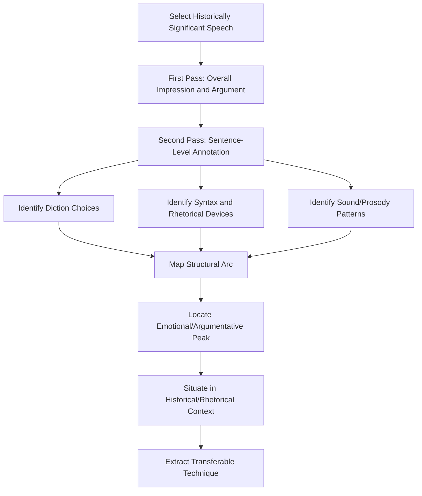

## Close Reading of Historically Significant Speeches

### Definition and Scope

Close reading of historically significant speeches is the practice of conducting a detailed, line-by-line or passage-by-passage examination of a specific historical speech's language, structure, and rhetorical choices, situated within its full historical and situational context. Unlike framework-driven rhetorical criticism (which applies a general analytical lens across texts), close reading emphasizes granular attention to the specific text itself — word choice, syntax, sound patterns, and micro-level structural decisions — before generalizing to broader interpretive claims.

This practice originated in literary criticism (particularly the New Critical tradition) and was adapted into rhetorical studies as a method for understanding not just *what* a speech argued but *how* its specific linguistic construction produced persuasive or memorable effect. In executive communication education, close reading of canonical historical speeches serves as a model-study method: examining exemplary (and sometimes flawed) speeches to extract transferable technique.

### Why Close Reading of Historical Speeches Matters for Executive Communication

**Key Points**

- Historical speeches that remain studied decades or centuries later typically demonstrate durable, transferable rhetorical techniques rather than merely topical relevance to their moment
- Close reading reveals *craft* decisions (specific word choices, sentence rhythms, structural pivots) that are otherwise invisible in summary-level analysis or framework application alone
- Studying historical speeches provides a shared reference vocabulary for executive communication training (e.g., referring to a "Gettysburg-style" compression of a large idea into a short, dense passage)
- Close reading builds the analytical muscle needed for self-editing: an executive who has practiced identifying why a phrase works in a historical speech is better equipped to evaluate and revise their own draft language

### Core Techniques of Close Reading

#### 1. Diction Analysis (Word-Level Choice)

Examining individual word choices for connotation, register, and precision. Close readers ask: *why this word and not a readily available synonym?*

**Example**: In Winston Churchill's 1940 "We Shall Fight on the Beaches" speech, the repeated verb structure "we shall fight" — rather than a synonym like "we will resist" or "we will continue" — was chosen for its rhythmic repetition and its slightly archaic, elevated register, which lends gravity appropriate to the occasion. [Inference — the specific compositional intent behind Churchill's word choice is not directly documented in his own notes available here; this is a widely accepted interpretive reading in rhetorical scholarship on the speech, not a confirmed authorial statement]

#### 2. Syntax and Sentence Rhythm Analysis

Examining sentence length, structure, and rhythm, including rhetorical devices built on sentence-level patterning:

- **Anaphora**: repetition of a word or phrase at the beginning of successive clauses (e.g., Martin Luther King Jr.'s repeated "I have a dream that...")
- **Antithesis**: juxtaposition of contrasting ideas in parallel structure (e.g., John F. Kennedy's "ask not what your country can do for you—ask what you can do for your country")
- **Tricolon**: a series of three parallel words, phrases, or clauses, often used because three-part structures are perceived as complete and rhythmically satisfying (e.g., Abraham Lincoln's "government of the people, by the people, for the people")
- **Periodic sentence structure**: withholding the main clause until the end of a long sentence, building tension and emphasis before resolution

#### 3. Structural/Compositional Analysis

Examining how the speech is organized at the paragraph and section level: where the speech pivots from one movement to the next, how the opening establishes ethos and exigence, how the conclusion returns to or transforms the opening's themes (a structural device sometimes called "ring composition").

#### 4. Sound and Prosody Analysis

Examining the auditory qualities of the language when spoken aloud: alliteration, assonance, consonance, and rhythm (cadence). This dimension is often underweighted in purely textual analysis but is central to a speech's effect, since speeches are composed for the ear, not primarily the eye.

#### 5. Contextual Situating

Close reading is not purely textual — it requires grounding the text in its **rhetorical situation** (see: Bitzer's framework in the prior topic): the specific historical moment, the immediate audience present, the broader audience reached via media, and the constraints the speaker operated under (time limits, political risk, competing factions).

### Worked Example: Close Reading Passage Structure

Consider a structural close reading of the opening of Lincoln's Gettysburg Address (1863) — analyzed at the level of technique, not full reproduction of the text (the speech is in the public domain and widely available, but this analysis focuses on describing, not quoting extensively):

- The address opens with a temporal frame ("Four score and seven years ago") that immediately signals historical weight through elevated, almost biblical phrasing rather than a plain numerical statement, establishing gravitas appropriate to the occasion (a wartime cemetery dedication)
- The opening sentence's subject — the founding fathers' creation of a nation "conceived in Liberty" — establishes a value-based ethos appeal before any argument is made, aligning the speech's purpose with foundational national identity
- The speech's brevity itself (roughly two minutes in delivery) is a structural choice that stands in deliberate contrast to the much longer oration that preceded it that day (Edward Everett's two-hour speech), and this contrast is part of why the brevity was rhetorically notable and memorable [Inference — the deliberate contrast with Everett's speech length is a widely noted point in historical accounts of the occasion, though Lincoln's specific compositional intent regarding this contrast is not something that can be confirmed as his conscious motive]

This kind of analysis models the technique: identify a specific textual or structural choice, articulate the likely rhetorical effect, and situate it within the occasion's constraints — without reproducing extended verbatim text, since the instructive value lies in the analytical method, not the reproduction of the speech itself.

### A Framework for Conducting a Close Reading

**Practical Adaptation Checklist**

1. **Read/listen to the full speech at least twice** — once for overall impression and argument, once specifically hunting for craft-level choices
2. **Annotate at the sentence level**: mark notable word choices, repeated structures, shifts in sentence length, and any rhetorical devices (anaphora, antithesis, tricolon, etc.)
3. **Map the structural arc**: identify the speech's major movements/sections and how the speaker transitions between them
4. **Identify the emotional and argumentative peak(s)**: most effective speeches have one or more clearly identifiable high points where diction, rhythm, and content converge most intensely
5. **Situate in context**: research the immediate occasion, audience composition, and historical constraints under which the speech was delivered
6. **Extract transferable technique**: articulate what specific, nameable technique (not just "it was powerful") could be studied and adapted for a different context — this is the step that converts historical analysis into applicable executive communication skill

#### Diagram: Close Reading Process Flow

### Visual: Layers of Close Reading Analysis

<svg xmlns="http://www.w3.org/2000/svg" viewBox="0 0 600 340">
<text x="300" y="28" text-anchor="middle" font-size="17" font-weight="bold" fill="#1a1a1a">Layers of Close Reading (svg_diagram)</text>
<rect x="150" y="60" width="300" height="50" fill="#2c5f8a" />
<text x="300" y="90" text-anchor="middle" font-size="13" fill="#ffffff" font-weight="bold">Contextual Situating (Rhetorical Situation)</text>
<rect x="150" y="120" width="300" height="50" fill="#3d7a8a" />
<text x="300" y="150" text-anchor="middle" font-size="13" fill="#ffffff" font-weight="bold">Structural / Compositional Arc</text>
<rect x="150" y="180" width="300" height="50" fill="#4e8a5f" />
<text x="300" y="210" text-anchor="middle" font-size="13" fill="#ffffff" font-weight="bold">Syntax and Sentence Rhythm</text>
<rect x="150" y="240" width="300" height="50" fill="#8a7a2c" />
<text x="300" y="270" text-anchor="middle" font-size="13" fill="#ffffff" font-weight="bold">Diction (Word-Level Choice)</text>
<rect x="150" y="300" width="300" height="30" fill="#a3572c" />
<text x="300" y="320" text-anchor="middle" font-size="12" fill="#ffffff" font-weight="bold">Sound and Prosody (Underlies All Layers)</text>
</svg>

### Selecting Speeches for Close Reading Study

Effective close-reading practice benefits from studying a range of speech types and eras rather than a narrow canon, including:

- **Crisis and wartime oratory** (e.g., Churchill's wartime speeches) for studying urgency, resolve, and morale-building technique
- **Civil rights and social movement oratory** (e.g., King's "I Have a Dream") for studying anaphora, moral appeal, and vision-casting
- **Inaugural and ceremonial addresses** for studying genre conventions and occasion-appropriate tone
- **Contemporary executive and business speeches** (product launches, crisis apologies, resignation announcements) for studying how classical technique translates into modern corporate register
- **Speeches now viewed as ethically or historically problematic** — close reading is a technique for understanding *how* persuasion functions, and studying manipulative or propagandistic rhetoric (with appropriate critical framing) builds the same recognition skill needed to detect manipulation in other contexts [Inference — this is a standard justification in rhetorical education for studying ethically fraught historical texts, though it is not a universally uncontested pedagogical position]

### Common Pitfalls

- **Summary masquerading as close reading**: restating the speech's general argument or historical importance without engaging the specific textual mechanics that produced its effect
- **Overreliance on reproduction**: extensive quotation of the original text is not itself analysis; close reading should describe and analyze technique rather than substitute quoted passages for original insight (and extended verbatim reproduction of copyrighted or extensively quoted material should generally be avoided in favor of paraphrase and targeted, minimal quotation)
- **Anachronistic judgment**: evaluating a historical speech's diction or approach by contemporary stylistic standards without accounting for the norms of its era
- **Ignoring delivery and context in favor of text-only analysis**: a speech's transcript is not identical to its delivered effect; vocal delivery, audience presence, and media context significantly shape a speech's actual historical impact and should be accounted for where evidence exists
- **Treating historical rhetorical success as moral endorsement**: as with framework-based criticism, a speech's rhetorical effectiveness and its ethical standing are separate axes of evaluation

**Related Topics**

- Frameworks for Analyzing Speeches and Texts
- Anaphora, Antithesis, and Tricolon as Rhetorical Devices
- The Rhetorical Situation and Historical Context in Criticism
- Vocal Delivery and Prosody in Persuasive Speech
- Case Studies in Crisis and Wartime Oratory
- Studying Propagandistic Rhetoric for Critical Recognition Skills
- Genre Conventions in Ceremonial and Inaugural Addresses
- From Historical Technique to Modern Executive Speechwriting