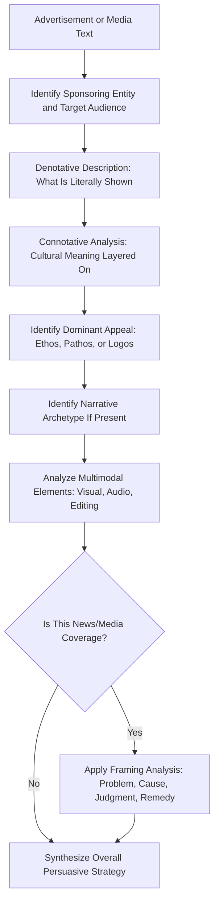

## Identifying Rhetorical Strategy in Advertising and Media

### Definition and Scope

Identifying rhetorical strategy in advertising and media is the application of rhetorical criticism frameworks to commercial and mass-media texts — advertisements, marketing campaigns, news framing, and branded content — in order to reveal the persuasive techniques operating beneath surface-level messaging. Unlike political oratory or ceremonial speech, advertising and media rhetoric typically operates through condensed, repeated, and often visual or multimodal forms, which requires adapting classical rhetorical analysis to account for image, sound, editing, and commercial context alongside language.

This topic extends the frameworks covered previously (the three appeals, rhetorical situation, genre criticism) into a domain where the "speaker" is often a brand or institution rather than an individual, the "audience" is frequently segmented and data-targeted, and the underlying purpose is typically transactional (driving purchase, attention, or belief) rather than purely persuasive-argumentative.

### Why This Analysis Matters for Executive Communication

**Key Points**

- Executives are simultaneously producers of advertising/media rhetoric (through marketing, brand messaging, and press positioning) and targets of it (as consumers and as audiences for competitor and media messaging)
- Recognizing rhetorical strategy in media builds critical media literacy, which protects against being persuaded by manipulative technique and improves the ability to detect when one's own messaging may cross ethical lines
- Advertising rhetoric often demonstrates highly refined, testable persuasive technique (due to extensive A/B testing and market research) that offers transferable lessons for other high-stakes persuasive communication, even outside commercial contexts
- Media framing analysis is directly relevant to executive communication because how a company's actions are covered by media is itself a rhetorical event that executives must anticipate and respond to

### Core Analytical Concepts for Advertising Rhetoric

#### 1. The Three Appeals in Commercial Context

- **Ethos in advertising**: often established through brand heritage claims, celebrity or expert endorsement, testimonials, certifications, and visual cues of quality or authenticity (e.g., "trusted since 1952," professional-looking cinematography, or endorsement by a recognized expert)
- **Pathos in advertising**: frequently the dominant appeal in brand advertising (as opposed to direct-response advertising), operating through narrative, music, humor, nostalgia, aspiration, or fear appeals (e.g., insurance and security-product advertising often relies on fear/safety appeals)
- **Logos in advertising**: comparative claims, statistics, demonstrations, and specification-based arguments — more common in direct-response, B2B, and technical product advertising than in brand-building campaigns

#### 2. Semiotic Analysis (Sign and Symbol Systems)

Drawing on the work of Roland Barthes (notably *Mythologies*), semiotic analysis examines advertising as a system of signs operating on two levels:

- **Denotation**: the literal, surface content of an image or text (a photograph of a car)
- **Connotation**: the cultural meaning layered onto that literal content (the car associated with freedom, status, or family safety through visual styling, setting, and juxtaposition)

Barthes's concept of **myth** in this context refers to how advertising naturalizes cultural or ideological associations, making a constructed connotation (e.g., "diamonds signify eternal love") appear as though it were simply natural or self-evident truth rather than a historically constructed commercial narrative. [Unverified — the specific claim that diamond-eternal love association was substantially shaped by 20th-century advertising campaigns is a commonly cited example in media studies literature, though the full historical account involves multiple contributing factors beyond advertising alone]

#### 3. Narrative and Character Archetype Analysis

Many advertisements use compressed narrative structures (often 15–60 seconds) that rely on immediately recognizable character archetypes (the busy parent, the underdog, the expert, the skeptic-turned-believer) to achieve emotional resonance without lengthy exposition. Analysis examines which archetype is invoked, how quickly the audience is expected to recognize it, and what values the archetype implicitly endorses.

#### 4. Repetition and Slogan Analysis

Advertising relies heavily on repetition (within a single ad and across a campaign's flight) to build recall, distinct from the single-occasion persuasion model of a speech. Slogan analysis examines brevity, rhythm (often using classical devices like alliteration or parallelism at a compressed scale), and memorability mechanisms.

#### 5. Framing Analysis (Media and News Rhetoric)

Framing theory (associated with Erving Goffman and later media scholars such as Robert Entman) examines how media coverage selects and emphasizes certain aspects of a reality while omitting others, shaping audience interpretation. Entman's widely cited formulation identifies framing as functioning across four dimensions: defining the problem, diagnosing causes, making moral judgments, and suggesting remedies. Analysis questions include: *What frame is a news outlet applying to a company's action (e.g., "cost-cutting" versus "layoffs," "innovation" versus "disruption")? What is included versus omitted, and whose perspective is centered?*

**Example — Framing Contrast**

The same corporate action — reducing headcount by 10% — can be framed multiple ways in media coverage:

- "Company streamlines operations to focus on core growth areas" (efficiency/strategy frame)
- "Company lays off hundreds amid cost pressures" (hardship/human-impact frame)
- "Company follows industry trend toward AI-driven automation" (technological-inevitability frame)

Each frame is factually compatible with the same underlying event but directs audience judgment toward different causes, moral evaluations, and expected responses.

#### 6. Multimodal Rhetoric (Visual and Audio Rhetoric)

Because advertising and broadcast media combine language with image, music, pacing, and editing, analysis must account for how these channels interact:

- **Visual composition**: framing, color palette, lighting, and camera movement carry connotative meaning independent of spoken/written text
- **Music and sound design**: tempo, key, and instrumentation shape emotional register, often operating below conscious audience awareness
- **Editing rhythm**: pacing (rapid cuts versus long takes) shapes perceived energy, urgency, or contemplativeness

### A Framework for Analyzing an Advertisement or Media Text

**Practical Adaptation Checklist**

1. **Identify the commercial/institutional rhetorical situation**: who is the sponsoring entity, what is the target audience segment, what action or belief is the desired outcome
2. **Determine denotative content**: describe literally what is shown/said, separate from interpretation
3. **Analyze connotative/symbolic layers**: identify the cultural associations being invoked and whether they are being naturalized as "obvious" rather than presented as constructed claims
4. **Assess the dominant appeal**: determine whether ethos, pathos, or logos dominates, and evaluate whether the appeal is proportionate or manipulative given the claims being made
5. **Identify archetype and narrative structure** (if present): name the character type and story arc being compressed into the format
6. **Examine multimodal elements**: assess how visual, audio, and editing choices reinforce or complicate the verbal/textual message
7. **For news/media coverage specifically, conduct framing analysis**: identify the problem definition, causal attribution, moral evaluation, and implied remedy embedded in the coverage, and compare against alternative available framings of the same underlying facts

#### Diagram: Advertising Rhetoric Analysis Layers

### Visual: Denotation vs. Connotation Model

<svg xmlns="http://www.w3.org/2000/svg" viewBox="0 0 600 320">
<text x="300" y="28" text-anchor="middle" font-size="17" font-weight="bold" fill="#1a1a1a">Barthes: Denotation and Connotation (svg_diagram)</text>
<rect x="150" y="70" width="300" height="70" fill="#2c5f8a" />
<text x="300" y="100" text-anchor="middle" font-size="13" fill="#ffffff" font-weight="bold">Denotation</text>
<text x="300" y="120" text-anchor="middle" font-size="11" fill="#dceaf5">Literal image/text content</text>
<line x1="300" y1="140" x2="300" y2="170" stroke="#333333" stroke-width="2" />
<polygon points="292,165 308,165 300,180" fill="#333333" />
<rect x="150" y="185" width="300" height="70" fill="#a3572c" />
<text x="300" y="215" text-anchor="middle" font-size="13" fill="#ffffff" font-weight="bold">Connotation</text>
<text x="300" y="235" text-anchor="middle" font-size="11" fill="#f5e5dc">Cultural/symbolic meaning attached</text>

<text x="300" y="290" text-anchor="middle" font-size="11" fill="`#444444`" font-style="italic">Repeated pairing naturalizes connotation as apparent "common sense" (myth)</text>

</svg>

### Applying This to Executive Self-Analysis

Executives producing marketing, brand, or media-facing content benefit from applying this same analytical lens to their own materials before release:

- **Ethos audit**: does the claimed credibility (expertise, heritage, endorsement) hold up to scrutiny, or does it risk being perceived as manufactured if investigated
- **Pathos proportionality check**: is the emotional appeal calibrated to the actual stakes of the product/message, or does it risk appearing manipulative or tone-deaf if the emotional intensity outpaces the substance
- **Framing anticipation**: before a public announcement, model how adversarial or neutral media might frame the same facts, and prepare messaging that proactively addresses the most likely unfavorable frame rather than only the most favorable one

### Common Pitfalls

- **Treating advertising rhetoric as purely manipulative by default**: not all persuasive technique in advertising is deceptive; ethical advertising rhetoric can accurately represent genuine value while still using skilled emotional and narrative technique — the analysis should distinguish technique from deception, not conflate them
- **Ignoring the commercial/institutional rhetorical situation**: analyzing an advertisement's language in isolation without accounting for its sponsor's interest, regulatory context (e.g., advertising standards requirements), and target segment produces incomplete analysis
- **Over-reading intent into automated or algorithmically optimized content**: much contemporary digital advertising is iteratively optimized through testing rather than singularly authored with fully deliberate rhetorical intent behind every element, which changes how "intentionality" should be interpreted in the analysis [Inference — this reflects known industry practice around A/B testing and programmatic optimization in digital advertising, though the degree of deliberate authorial intent varies significantly by campaign and medium]
- **Neglecting multimodal elements**: focusing analysis solely on spoken or written language while ignoring music, visual composition, and editing, which often carry the dominant persuasive weight in broadcast and video media
- **False equivalence in framing analysis**: presenting all possible frames of a story as equally accurate or neutral when the underlying facts may more strongly support one framing over another — framing analysis should identify bias and omission, not imply that no frame can be more accurate than others

**Related Topics**

- Frameworks for Analyzing Speeches and Texts
- Close Reading of Historically Significant Speeches
- Framing Theory in Crisis and Reputation Management
- Semiotics and Brand Identity Construction
- Ethical Boundaries in Persuasive Marketing Communication
- Anticipating Adversarial Media Framing Before Public Announcements
- Multimodal Rhetoric: Visual and Audio Persuasion Techniques
- Fear Appeals and Emotional Proportionality in Advertising