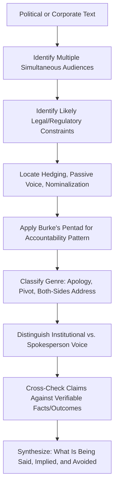

## Analyzing Political and Corporate Messaging

### Definition and Scope

Analyzing political and corporate messaging is the application of rhetorical criticism to institutional communication produced by governments, political actors, and corporations — statements, policy announcements, press releases, earnings calls, and public affairs campaigns. This domain shares tools with the previous topics (the three appeals, framing analysis, genre criticism) but is distinguished by the institutional nature of the speaker: the "voice" is typically an organization or role rather than an individual, messaging is usually produced through extensive collaborative drafting and legal/compliance review, and the stakes often involve regulatory, legal, financial, or electoral consequences that shape what can be said and how.

This topic treats political and corporate messaging together because they share a structural feature: both are produced by institutions managing multiple, often competing audiences (voters/shareholders, media, regulators, employees/constituents) under significant reputational and legal constraint, and both have developed recognizable genre conventions in response to those pressures.

### Why This Analysis Matters for Executive Communication

**Key Points**

- Executives regularly produce and are the subject of both corporate messaging (their own organization's communications) and are affected by political messaging (regulation, public policy debates affecting their industry)
- Institutional messaging analysis reveals patterns — hedging language, passive voice for responsibility diffusion, strategic vagueness — that are useful both to recognize in others' communication and to consciously choose (or avoid) in one's own
- Corporate and political messaging both operate under unusually high legal and reputational constraint compared to other rhetorical genres, which produces distinctive linguistic patterns worth understanding as a genre in itself
- Because both domains are heavily scrutinized by media, competitors, and critics, they offer rich material for framing analysis and accountability-language analysis (see Burke's Pentad, covered previously)

### Distinctive Features of Institutional Messaging

#### 1. Collective/Diffuse Authorship

Unlike a single speechwriter-and-speaker relationship, political and corporate messaging is typically drafted through committee processes involving communications staff, legal review, subject-matter experts, and executive sign-off. This produces recognizable stylistic effects: risk-averse hedging, removal of distinctive individual voice, and heavy reliance on pre-cleared boilerplate language for recurring topics.

#### 2. Legal and Regulatory Constraint on Language

Both domains operate under specific legal frameworks that directly shape vocabulary choices:

- **Corporate**: securities law disclosure requirements (e.g., forward-looking statement disclaimers, careful avoidance of language that could constitute a guarantee or material misstatement), employment law considerations in messaging about personnel actions
- **Political**: campaign finance and election law constraints, official capacity versus personal/campaign capacity distinctions, classification and diplomatic constraints on government statements

Analysis of institutional messaging should account for these constraints as part of the rhetorical situation — apparent evasiveness or hedging may reflect genuine legal necessity rather than purely rhetorical evasion, though the two are not always distinguishable from the outside. [Inference — distinguishing legally-necessitated caution from strategically convenient vagueness is often genuinely difficult for outside analysts without access to internal legal counsel guidance, and should be flagged as an interpretive limitation rather than resolved with false confidence]

#### 3. Strategic Vagueness and Hedging Language

A recurring feature of institutional messaging is deliberately imprecise language that preserves flexibility or avoids commitment:

- **Modal hedging**: "may," "could," "is expected to" rather than definitive claims
- **Passive voice for responsibility diffusion**: "mistakes were made" rather than "we made mistakes" — a widely cited example of agency-obscuring construction in political apology rhetoric
- **Nominalization**: converting actions into abstract nouns that obscure the actor (e.g., "the decision was made" rather than naming who decided)
- **Weasel words and unattributed claims**: "experts say," "many believe," "it is widely understood" without specific attribution

#### 4. Genre Conventions Specific to Institutional Messaging

- **The non-apology apology**: a recognizable genre pattern in both political and corporate crisis communication that uses apology-adjacent language ("we regret that some customers were affected") without a direct admission of fault or first-person responsibility
- **The forward-looking pivot**: acknowledging a problem briefly before rapidly shifting focus to future corrective action, a structural pattern that can be genuine accountability or can function to minimize dwelling on the problem itself depending on execution and proportion
- **The both-sides/all-stakeholders address**: political and corporate statements addressing internally divided audiences often use the mixed-audience techniques covered previously (superordinate framing, sequential acknowledgment) at an institutional scale

#### 5. The Spokesperson/Institutional Voice Distinction

Political and corporate messaging often distinguishes between an institution's collective voice (official statements, press releases) and a designated spokesperson's individual voice, which carries different levels of formal commitment and accountability. Analysis should track which register is being used and what that choice implies about the level of institutional commitment behind the statement.

### Comparative Analysis: Political vs. Corporate Messaging

| Dimension | Political Messaging | Corporate Messaging |
| --- | --- | --- |
| Primary audience | Voters/constituents, media, opposing party | Shareholders, customers, employees, regulators |
| Key legal constraint | Election law, official/campaign capacity distinctions | Securities disclosure law, employment law |
| Common genre | Policy announcement, campaign speech, official statement | Earnings call, press release, crisis statement |
| Accountability pattern | Often diffused across party/administration | Often diffused across "the company" as collective entity |
| Time horizon emphasis | Often oriented to electoral cycles | Often oriented to fiscal quarters/reporting periods |
| Typical framing tension | Ideological/values framing vs. factual claims | Growth/opportunity framing vs. risk/liability framing |

### A Framework for Analyzing Institutional Messaging

**Practical Adaptation Checklist**

1. **Identify the institutional rhetorical situation**: what audiences (plural) is this message simultaneously addressing, and what legal/regulatory constraints likely shaped its drafting
2. **Locate hedging and vagueness**: identify modal hedges, passive constructions, and nominalizations, and assess whether each is plausibly legally necessary or primarily strategically convenient
3. **Identify the accountability pattern**: apply Burke's Pentad (agent, act, agency, scene, purpose) to determine who is positioned as responsible, and whether responsibility is clearly assigned or diffused
4. **Classify the genre**: determine whether the text follows a recognizable institutional genre pattern (non-apology apology, forward-looking pivot, both-sides address) and assess whether the genre convention is used effectively or has become a hollow, detectable formula
5. **Distinguish institutional voice from individual spokesperson voice**: note which register is used and what level of commitment that choice signals
6. **Compare stated position against verifiable action or outcome where possible**: institutional messaging analysis is strengthened by checking rhetorical claims against subsequent or contemporaneous verifiable facts, where available

#### Diagram: Institutional Messaging Analysis Flow

### Visual: Responsibility-Framing Spectrum

<svg xmlns="http://www.w3.org/2000/svg" viewBox="0 0 620 300">
<text x="310" y="28" text-anchor="middle" font-size="17" font-weight="bold" fill="#1a1a1a">Accountability Language Spectrum (svg_diagram)</text>
<line x1="60" y1="180" x2="560" y2="180" stroke="#333333" stroke-width="2" />
<circle cx="100" cy="180" r="10" fill="#a3392c" />
<text x="100" y="150" text-anchor="middle" font-size="11" fill="#333333">"Mistakes</text>
<text x="100" y="165" text-anchor="middle" font-size="11" fill="#333333">were made"</text>
<text x="100" y="210" text-anchor="middle" font-size="10" fill="#666666">Fully diffused</text>
<circle cx="250" cy="180" r="10" fill="#c47a2c" />
<text x="250" y="150" text-anchor="middle" font-size="11" fill="#333333">"The company</text>
<text x="250" y="165" text-anchor="middle" font-size="11" fill="#333333">regrets..."</text>
<text x="250" y="210" text-anchor="middle" font-size="10" fill="#666666">Institutional, indirect</text>
<circle cx="400" cy="180" r="10" fill="#8a8a2c" />
<text x="400" y="150" text-anchor="middle" font-size="11" fill="#333333">"We fell</text>
<text x="400" y="165" text-anchor="middle" font-size="11" fill="#333333">short here"</text>
<text x="400" y="210" text-anchor="middle" font-size="10" fill="#666666">Institutional, direct</text>
<circle cx="530" cy="180" r="10" fill="#2c7a4e" />
<text x="530" y="150" text-anchor="middle" font-size="11" fill="#333333">"I made</text>
<text x="530" y="165" text-anchor="middle" font-size="11" fill="#333333">the wrong call"</text>
<text x="530" y="210" text-anchor="middle" font-size="10" fill="#666666">Individual, direct</text>

<text x="310" y="260" text-anchor="middle" font-size="11" fill="`#444444`" font-style="italic">Movement rightward increases perceived accountability and personal/reputational risk</text>

</svg>

### Applying This Analysis to Executive Self-Review

Executives drafting their own institutional messaging benefit from applying this same critical lens before release:

- **Hedging audit**: for each modal hedge or passive construction, ask whether it reflects a genuine legal/factual uncertainty or is being used to avoid an uncomfortable but knowable commitment — the former is appropriate, the latter risks being perceived as evasive if detected
- **Accountability calibration**: when responsibility genuinely lies with a decision the executive or organization made, diffusing that responsibility through passive or collective language, once identified by media or stakeholders, typically produces greater reputational damage than direct acknowledgment would have [Inference — this reflects a commonly cited principle in crisis communication practice regarding the reputational cost of perceived evasiveness, though outcomes vary by situation, audience, and how the evasion is detected and covered]
- **Genre-fatigue awareness**: audiences and media have become increasingly adept at recognizing formulaic genre patterns (the non-apology apology in particular is now widely recognized and often explicitly called out by media and social commentary), which reduces the effectiveness of relying on the pattern without genuine substance behind it

### Common Pitfalls

- **Conflating all hedging with evasion**: some hedged language reflects genuine, legally required uncertainty (e.g., forward-looking statement disclaimers required by securities regulation) rather than strategic evasiveness — accurate analysis distinguishes these rather than assuming bad faith by default
- **Ignoring the collaborative drafting process**: attributing a single, unified rhetorical intent to a text that was likely shaped by multiple stakeholders (legal, communications, executive) with competing priorities can produce an overly simplistic reading of authorial motive
- **Presentism about genre recognition**: assuming an audience will not notice a formulaic pattern (e.g., the non-apology apology) when media literacy around these patterns has increased significantly, making previously effective genre conventions increasingly likely to be called out rather than accepted at face value
- **Selective outrage in comparative analysis**: applying stricter rhetorical scrutiny to one political or corporate actor than to a comparable actor making structurally similar rhetorical moves, which undermines the credibility and neutrality of the analysis itself
- **Treating institutional caution as inherently deceptive**: not all institutional carefulness reflects concealment; some reflects genuine complexity, legitimate legal constraint, or appropriate epistemic humility about incomplete information at the time of the statement

**Related Topics**

- Frameworks for Analyzing Speeches and Texts
- Identifying Rhetorical Strategy in Advertising and Media
- Burke's Pentad and Accountability Framing
- Crisis Communication and the Non-Apology Apology Genre
- Securities Disclosure Language and Forward-Looking Statements
- Passive Voice and Responsibility Diffusion in Institutional Language
- Framing Theory Applied to Corporate Reputation Management
- Media Literacy and Recognizing Formulaic Institutional Rhetoric