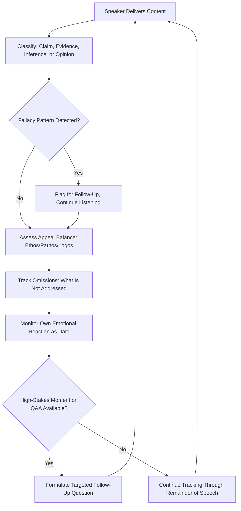

## Developing Critical Listening Habits

### Definition and Scope

Developing critical listening habits refers to the deliberate cultivation of analytical listening skills that allow a listener to evaluate the content, structure, credibility, and persuasive intent of spoken communication in real time, rather than passively absorbing or reflexively reacting to it. Critical listening is distinct from — though it builds on — general active listening (which focuses on accurate comprehension and empathetic engagement); critical listening adds an evaluative layer, assessing the quality of arguments, detecting rhetorical technique, and identifying gaps, biases, or manipulation as the message unfolds.

In the context of rhetorical criticism, critical listening is the real-time, oral counterpart to close reading of texts: it applies the same analytical instincts (identifying appeals, structure, framing, and technique) but under the added constraint of processing speech as it is delivered, without the ability to pause, reread, or annotate at length.

### Why Critical Listening Matters for Executive Communication

**Key Points**

- Executives spend a substantial portion of their professional time listening — to pitches, briefings, negotiations, board discussions, and competitor or market messaging — making listening skill as consequential as speaking skill to overall communication effectiveness [Inference — while it is well established that executives spend significant time in listening-heavy activities, precise proportions vary by role and are not derived from a single cited study here]
- Uncritical listening leaves decision-makers vulnerable to persuasive techniques (emotional manipulation, logical fallacies, selective framing) that a critical listener would catch and discount appropriately
- Critical listening enables better real-time response: identifying a weak argument or unsupported claim during a live discussion allows for immediate, well-targeted follow-up questions rather than only recognizing the flaw after the fact
- Modeling critical listening (asking clarifying, well-reasoned questions) also signals rigor and credibility to the room, reinforcing an executive's own ethos

### Core Components of Critical Listening

#### 1. Distinguishing Claims from Evidence from Inference

A foundational critical listening skill is tracking, in real time, which statements are:

- **Factual claims**: assertions presented as verifiable fact
- **Evidence**: data, examples, or testimony offered in support of a claim
- **Inference/interpretation**: the speaker's reasoning connecting evidence to a conclusion
- **Opinion/value judgment**: statements of preference or values that are not fact-checkable in the same way

Confusing these categories — treating a confidently stated inference as though it were an established fact — is one of the most common listening failures, and critical listening trains the ear to catch phrasing that blurs this distinction (e.g., "clearly," "obviously," "everyone knows" often precede claims that deserve more scrutiny, not less).

#### 2. Real-Time Fallacy Detection

Critical listeners maintain a working awareness of common logical fallacies to catch them as they occur in live speech:

- **Ad hominem**: attacking the arguer rather than the argument
- **False dilemma**: presenting only two options when more exist
- **Straw man**: misrepresenting an opposing position to make it easier to refute
- **Appeal to authority (illegitimate)**: citing authority outside the relevant domain of expertise
- **Slippery slope**: asserting that one step will inevitably lead to an extreme outcome without established causal support
- **Correlation/causation conflation**: presenting a correlation as though it were proven causation

Recognizing these in real time (without necessarily interrupting to name them) allows a listener to mentally discount or flag a point for later follow-up rather than being swept along by confident delivery.

#### 3. Appeal Balance Monitoring

Applying the three-appeals framework (ethos, pathos, logos) as a live listening tool: is the speaker relying disproportionately on emotional appeal or credibility-invoking language in a moment where the actual substance (logos) is thin? A critical listener notices when delivery confidence and emotional resonance are being used to compensate for weak underlying argument.

#### 4. Structural and Omission Tracking

Critical listening includes tracking what is **not** being said: which obvious counterarguments are unaddressed, which stakeholders' perspectives are absent from the account, which alternative options were not considered. This requires holding a mental model of the full decision space while listening, so that gaps become noticeable rather than invisible.

#### 5. Emotional Self-Monitoring During Listening

A critical listener also monitors their own emotional reaction as data: noticing when a message is producing a strong emotional pull and treating that as a cue to slow down and evaluate more carefully, rather than as confirmation that the message is correct. Strong emotional resonance is a signal to increase scrutiny, not decrease it, precisely because emotional appeals are often used to bypass critical evaluation.

### A Framework for Practicing Critical Listening

**Practical Adaptation Checklist**

1. **Pre-listening framing**: before a high-stakes meeting or presentation, briefly note what outcome or claim you expect the speaker to argue for — this primes attention toward evaluating whether the argument actually supports that expected conclusion
2. **Track claim types in real time**: mentally (or literally, in notes) tag statements as claim, evidence, inference, or opinion as they are spoken
3. **Note appeal balance**: periodically check whether the speaker is currently relying primarily on credibility, emotion, or logic, and whether that balance seems proportionate to the claim being made
4. **Flag fallacies without necessarily interrupting**: maintain a running mental (or written) list of moments that warrant follow-up questions rather than derailing the speaker's flow immediately
5. **Actively track omissions**: ask internally, "what would I expect to hear if this argument is genuinely strong, and is it present?"
6. **Formulate targeted follow-up questions**: convert critical listening observations into specific, well-posed questions during Q&A rather than vague pushback — a precise question ("what data supports the assumption that this trend continues?") is more useful and more credible than a vague objection ("I'm not sure I buy this")
7. **Debrief after high-stakes listening**: for particularly consequential meetings, a brief post-hoc review of what was claimed versus what was supported strengthens the habit over time

#### Diagram: Real-Time Critical Listening Process

### Visual: Listening Modes Spectrum

<svg xmlns="http://www.w3.org/2000/svg" viewBox="0 0 620 300">
<text x="310" y="28" text-anchor="middle" font-size="17" font-weight="bold" fill="#1a1a1a">Spectrum of Listening Modes (svg_diagram)</text>
<line x1="60" y1="180" x2="560" y2="180" stroke="#333333" stroke-width="2" />
<circle cx="100" cy="180" r="10" fill="#a3392c" />
<text x="100" y="150" text-anchor="middle" font-size="11" fill="#333333">Passive</text>
<text x="100" y="165" text-anchor="middle" font-size="11" fill="#333333">Hearing</text>
<text x="100" y="210" text-anchor="middle" font-size="10" fill="#666666">No evaluation</text>
<circle cx="240" cy="180" r="10" fill="#c47a2c" />
<text x="240" y="150" text-anchor="middle" font-size="11" fill="#333333">Active</text>
<text x="240" y="165" text-anchor="middle" font-size="11" fill="#333333">Listening</text>
<text x="240" y="210" text-anchor="middle" font-size="10" fill="#666666">Accurate comprehension</text>
<circle cx="400" cy="180" r="10" fill="#4e7a2c" />
<text x="400" y="150" text-anchor="middle" font-size="11" fill="#333333">Empathetic</text>
<text x="400" y="165" text-anchor="middle" font-size="11" fill="#333333">Listening</text>
<text x="400" y="210" text-anchor="middle" font-size="10" fill="#666666">Emotional attunement</text>
<circle cx="530" cy="180" r="10" fill="#2c5f8a" />
<text x="530" y="150" text-anchor="middle" font-size="11" fill="#333333">Critical</text>
<text x="530" y="165" text-anchor="middle" font-size="11" fill="#333333">Listening</text>
<text x="530" y="210" text-anchor="middle" font-size="10" fill="#666666">Evaluative + comprehension</text>

<text x="310" y="260" text-anchor="middle" font-size="11" fill="`#444444`" font-style="italic">Critical listening builds on, rather than replaces, active and empathetic listening</text>

</svg>

### Distinguishing Critical Listening from Cynicism

**Key Points**

- Critical listening is an evaluative discipline applied consistently to all speech, including speech one agrees with — it is not selectively skeptical only toward opposing viewpoints
- A common failure mode is applying rigorous critical listening only to disfavored speakers or positions while extending uncritical acceptance to favored ones (a listening-side analog of motivated reasoning) [Inference — this pattern is well documented in psychological research on motivated reasoning generally, applied here specifically to the listening context]
- Genuine critical listening should be equally capable of strengthening confidence in a well-supported argument (by confirming that claims are backed by evidence) as it is of weakening confidence in a poorly supported one — it is a truth-tracking practice, not a default posture of suspicion
- Critical listening does not require public skepticism or confrontation in every instance; much of its value lies in private calibration of how much weight to give a claim, which may or may not be voiced depending on the setting and stakes

### Common Pitfalls

- **Fallacy-spotting as a substitute for engagement**: becoming so focused on labeling technique (naming fallacies, appeals) that genuine engagement with the substance of the argument is lost
- **Selective application (motivated critical listening)**: applying scrutiny asymmetrically based on whether the listener already agrees with the speaker's conclusion, which undermines the practice's core value
- **Interrupting excessively**: converting critical listening into disruptive real-time debate rather than disciplined internal tracking followed by well-timed, targeted questions
- **Overconfidence in fallacy labels**: some reasoning that superficially resembles a named fallacy is contextually valid (e.g., citing a relevant expert is not automatically an illegitimate appeal to authority) — critical listening requires judgment about context, not mechanical pattern-matching
- **Neglecting the emotional self-monitoring component**: focusing entirely on the speaker's technique while failing to notice one's own susceptibility to a well-delivered emotional appeal, which is often the more actionable insight

**Related Topics**

- Frameworks for Analyzing Speeches and Texts
- Analyzing Political and Corporate Messaging
- Logical Fallacies and Their Detection in Public Discourse
- Active Listening vs. Critical Listening in Executive Settings
- Formulating Effective Follow-Up Questions in High-Stakes Meetings
- Motivated Reasoning and Confirmation Bias in Evaluation
- Reading Nonverbal Audience Feedback in Real Time
- Q&A Management and Handling Hostile Questions