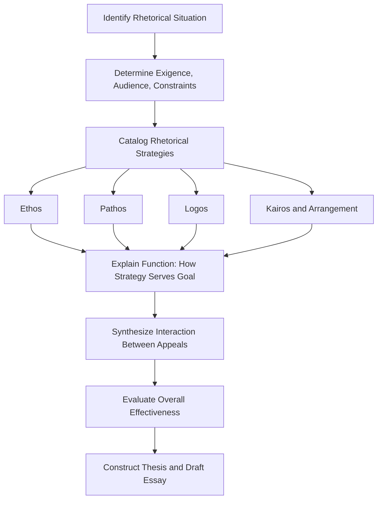

## Writing a Rhetorical Analysis

### Definition and Purpose

A rhetorical analysis is an evaluative essay that examines *how* a speaker, writer, or text attempts to persuade an audience, rather than *what* the text argues on its merits. The analyst's task is to deconstruct the rhetorical choices made by the author — appeals, structure, style, tone, and context — and to explain how those choices function to achieve (or fail to achieve) the author's persuasive goal.

This distinguishes rhetorical analysis sharply from:

- **Summary**: restates content without evaluating technique
- **Argumentative response**: agrees or disagrees with the claims themselves
- **Literary analysis**: focuses on aesthetic or thematic meaning rather than persuasive function

The core analytical question is always: *What is the rhetor trying to accomplish, with whom, and through what means — and how effectively?*

### Foundational Framework: The Rhetorical Situation

Before analyzing technique, the analyst must reconstruct the rhetorical situation, following Lloyd Bitzer's model:

- **Exigence**: The problem, need, or urgency that called the discourse into being
- **Audience**: The specific individuals capable of being influenced and of mediating change
- **Constraints**: Beliefs, values, precedents, institutional rules, or circumstances that limit or shape available rhetorical choices
- **Speaker/Rhetor**: Their identity, credibility, and relationship to the audience
- **Occasion/Context**: The setting, medium, and historical moment of delivery

**Key Points**

- Every rhetorical choice should be traceable back to the situation the rhetor faced
- A common student error is analyzing devices in isolation without linking them to exigence or audience
- Context includes the medium (live speech, op-ed, press release, social media) since medium constrains rhetorical options

### The Three Classical Appeals (Aristotelian Framework)

The dominant analytical lens remains Aristotle's triad, articulated in *Rhetoric*.

#### Ethos (Credibility Appeal)

Ethos concerns how the rhetor establishes trustworthiness, authority, or good character. Analysts look for:

- Explicit credential-building ("As a physician with 20 years of experience...")
- Demonstrated fairness (acknowledging counterarguments)
- Stylistic markers of competence (command of subject-specific vocabulary)
- Moral positioning (aligning with shared values of the audience)

#### Pathos (Emotional Appeal)

Pathos concerns the rhetor's attempt to evoke an emotional state that predisposes the audience toward the desired conclusion. Analysts examine:

- Vivid imagery, anecdotes, and narrative framing
- Word choice with strong connotative charge
- Appeals to fear, hope, pride, anger, or solidarity
- Timing of emotional appeals relative to logical claims (often placed at openings/closings for maximum retention)

#### Logos (Logical Appeal)

Logos concerns the internal reasoning structure: evidence, statistics, syllogisms, causal claims, and enthymemes (truncated syllogisms relying on audience-supplied premises). Analysts assess:

- Type and quality of evidence (statistical, anecdotal, testimonial, analogical)
- Structure of argument (deductive, inductive, causal)
- Presence of logical fallacies, and whether they undermine or merely simplify for audience accessibility

**Example**

Analyzing a corporate CEO's crisis-response memo:

- *Ethos*: CEO opens by citing the company's 30-year safety record
- *Pathos*: Memo includes a personal anecdote about an affected employee's family
- *Logos*: Memo cites third-party audit statistics showing incident rate below industry average

The analyst's job is not simply to identify these appeals but to argue how they interact — e.g., the ethos claim is deployed first specifically to preempt audience skepticism before the logos claim is introduced.

### Secondary Analytical Frameworks

#### Kairos (Timeliness)

The opportune moment — why this message, in this form, at this specific time. A rhetorical analysis of a CEO's apology released within 24 hours of a scandal (vs. 3 weeks later) must account for kairos as a distinct persuasive factor independent of content.

#### Stylistic and Structural Devices (Canons of Rhetoric)

Analysis often incorporates the five classical canons:

1. **Invention** (*inventio*): generation of arguments and appeals
2. **Arrangement** (*dispositio*): organizational structure — exordium, narratio, partitio, confirmatio, refutatio, peroratio
3. **Style** (*elocutio*): diction, tone, figures of speech (anaphora, antithesis, tricolon, chiasmus)
4. **Memory** (*memoria*): historically, unaided delivery; in modern analysis, often reinterpreted as message retention design
5. **Delivery** (*pronuntiatio*): vocal tone, pacing, gesture, visual presentation (highly relevant for speech and video analysis)

#### Audience Analysis Beyond Bitzer

Modern rhetorical analysis often layers in:

- **Primary vs. secondary audiences**: the room being addressed vs. the broader public/media consuming a report of the event
- **Intended vs. actual audience**: divergence here is itself analytically significant (e.g., a message crafted for shareholders that is "overheard" by regulators)

### Structuring the Analytical Essay

A standard rhetorical analysis essay follows this organizational logic:

#### Introduction

- Identify the text, rhetor, and rhetorical situation
- State a clear thesis specifying *which* rhetorical strategies will be examined and toward *what effect*

#### Body Paragraphs

Organized by **one of two conventional structures**:

- **By appeal**: one section each for ethos, pathos, logos
- **By chronological/structural movement**: analyzing the text's own organizational arc, appeal by appeal as they occur

Each body paragraph should follow a claim–evidence–explanation pattern:

1. Claim about a rhetorical strategy
2. Direct textual evidence (paraphrased, never extensively quoted verbatim beyond short illustrative phrases)
3. Explanation of *how* this strategy serves the rhetor's goal given the audience and situation

#### Conclusion

- Synthesizes how the appeals work together (not merely restates them)
- Evaluates overall rhetorical effectiveness relative to the stated exigence and audience
- May address broader implications (genre conventions, precedent-setting, cultural resonance)

### Sample Thesis Construction

A weak thesis merely identifies devices:

> "This speech uses ethos, pathos, and logos to persuade the audience."

A strong thesis specifies mechanism and effect:

> "By foregrounding personal sacrifice before presenting statistical evidence, the speaker leverages pathos to lower audience resistance to an otherwise unpopular logical conclusion, effectively converting emotional goodwill into rational assent."

**Key Points**

- Strong theses name the *interaction* between appeals, not just their presence
- Strong theses specify *effect on a particular audience*, not persuasion in the abstract

### Applying This to Executive Communication Contexts

Rhetorical analysis in executive/organizational settings often examines:

- **Earnings calls**: how logos-heavy financial data is framed with ethos-building narrative ("disciplined execution," "resilient portfolio")
- **Crisis communications**: sequencing of ethos (accountability), pathos (empathy for affected parties), and logos (corrective action data)
- **Internal memos**: how authority (positional ethos) substitutes for extensive argumentation, since audience compliance is partly structurally compelled
- **Town halls / Q&A**: delivery-canon analysis becomes critical — tone, pacing, and handling of hostile questions constitute rhetorical performance distinct from prepared text

[Inference] In practice, executive communication analysis frequently weights ethos and kairos more heavily than academic rhetorical analysis of literary or political texts, because organizational audiences (employees, investors, regulators) are more responsive to credibility and timing signals than to elaborate logical argumentation.

### Common Analytical Pitfalls

- **Device-spotting without function**: naming a metaphor without explaining what persuasive work it performs
- **Summary drift**: gradually shifting from analysis of technique to simple restatement of content
- **Evaluative bias substituting for analysis**: critiquing whether the audience *should* be persuaded rather than explaining how the rhetor *attempts* persuasion
- **Ignoring counter-rhetoric**: failing to note when a text preemptively addresses opposing views (a sophisticated ethos/logos hybrid move)
- **Overreliance on the appeals triad**: neglecting arrangement, style, and delivery, which are often where the most granular analytical insight lies

### Diagram: Rhetorical Analysis Workflow

### Sample Analytical Checklist

| Element | Analytical Question |
| --- | --- |
| Exigence | What problem/need prompted this discourse? |
| Audience | Who is the primary audience; who is secondary? |
| Ethos | How is credibility established or repaired? |
| Pathos | What emotions are targeted, and via what devices? |
| Logos | What evidence and reasoning structures are used? |
| Kairos | Why does timing matter to this message's reception? |
| Arrangement | How does structure sequence the appeals? |
| Style | What diction/figures of speech reinforce the appeals? |
| Delivery | (If applicable) How do vocal/visual elements affect reception? |
| Effectiveness | Did the rhetorical strategy plausibly achieve its aim for this audience? |

**Next Steps**

- Ethos, Pathos, and Logos as Analytical Categories (deep dive)
- The Rhetorical Situation and Bitzer's Model
- Kairos and Timing in Crisis Communication
- Classical Canons of Rhetoric: Arrangement and Style
- Analyzing Delivery in Video and Live Speech
- Rhetorical Analysis of Earnings Calls and Investor Communication
- Identifying and Evaluating Logical Fallacies in Executive Messaging
- Comparative Rhetorical Analysis (analyzing two competing texts on the same exigence)