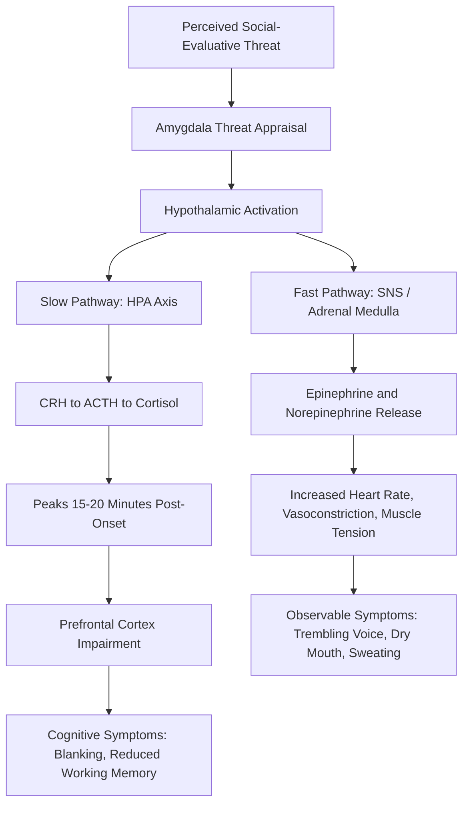

## Understanding the Causes and Physiology of Speech Anxiety

### Definition and Scope

Speech anxiety (also termed glossophobia, public speaking anxiety, or communication apprehension in its trait form) is the physiological and psychological arousal response triggered by the anticipation or performance of oral communication before an audience. It is distinguished in the communication literature from general social anxiety, though the two overlap substantially, because speech anxiety is specifically tied to the performative, evaluative, and one-directional nature of public address.

James McCroskey's construct of **Communication Apprehension (CA)** provides the foundational taxonomy, distinguishing:

- **Trait CA**: a stable personality-level predisposition to experience anxiety across most communication contexts
- **Context-based CA**: anxiety specific to a communication type (e.g., public speaking but not dyadic conversation)
- **Audience-based CA**: anxiety specific to a particular audience (e.g., speaking to superiors)
- **Situational CA**: anxiety tied to a specific, non-recurring event

**Key Points**

- Speech anxiety is not a unitary disorder but a situational activation of a broader anxiety response system
- Most speakers experience some measurable physiological arousal; clinical impairment is a matter of degree and functional interference, not presence/absence of symptoms

### Physiological Mechanism: The Threat-Response Cascade

Speech anxiety is fundamentally an activation of the **sympathetic nervous system (SNS)** via the **hypothalamic-pituitary-adrenal (HPA) axis**, triggered by the amygdala's appraisal of public speaking as a social-evaluative threat.

#### Sequence of Physiological Activation

1. **Amygdala threat appraisal**: The amygdala detects cues consistent with social threat (audience gaze, evaluative context, unfamiliarity) and signals the hypothalamus
2. **Hypothalamic activation**: Triggers two parallel pathways:
   - **Fast pathway (SNS/adrenal medulla)**: Releases epinephrine (adrenaline) and norepinephrine within seconds
   - **Slow pathway (HPA axis)**: Releases corticotropin-releasing hormone (CRH) → adrenocorticotropic hormone (ACTH) → cortisol, peaking 15–20 minutes after onset
3. **Downstream physiological effects**:
   - Increased heart rate and cardiac output
   - Peripheral vasoconstriction (redirecting blood to large muscle groups) — producing the common symptom of cold hands
   - Bronchodilation and increased respiration rate
   - Increased blood glucose (via glycogenolysis) for immediate energy availability
   - Suppressed digestive activity (the "butterflies" sensation results from reduced gastric motility combined with SNS-mediated visceral sensitivity)
   - Increased perspiration (eccrine gland activation)
   - Muscle tension, particularly in the jaw, throat, and diaphragm — directly interfering with vocal production

**Key Points**

- The physiological response is evolutionarily identical to the fight-or-flight response triggered by physical danger; the body does not physiologically distinguish "predator" from "critical audience"
- Vocal symptoms (voice trembling, pitch elevation, dry mouth) result directly from SNS effects on laryngeal muscle tension and reduced salivation — this is why anxiety is often most audible before it is consciously "felt"

### Cortisol and the Extended Stress Response

Unlike the acute adrenaline spike, cortisol produces a longer arousal tail:

- Cortisol elevation typically **precedes** a known stressor (anticipatory cortisol response), meaning physiological anxiety often begins hours before the speech itself
- Cortisol impairs prefrontal cortex function, particularly working memory and cognitive flexibility — this is the physiological basis for "blanking out" or losing one's place
- Chronic elevated cortisol (in speakers with recurring high-frequency public speaking demands) is associated with impaired declarative memory consolidation, which can paradoxically worsen preparation-recall under pressure over time

[Inference] The commonly reported experience of rehearsed material "disappearing" mid-speech is best explained by cortisol-mediated prefrontal impairment interacting with retrieval cues that were encoded in a low-arousal rehearsal state but must be retrieved in a high-arousal performance state — a state-dependent memory mismatch.

### Cognitive-Behavioral Causal Models

Beyond raw physiology, several psychological frameworks explain *why* the threat appraisal occurs:

#### Evaluation Apprehension Theory

Speech anxiety stems from the perceived risk of negative social evaluation. The audience is appraised not as neutral observers but as active judges whose evaluation carries reputational, social, or professional consequence.

#### Cognitive Behavioral Model (Ellis / Beck-derived)

Anxiety arises from **irrational or catastrophizing cognitions** about the speaking event:

- Overestimation of the probability of failure
- Overestimation of the cost of failure (catastrophizing)
- Underestimation of one's own coping resources
- All-or-nothing performance standards ("Any mistake ruins the whole speech")

#### Self-Presentation Theory (Leary)

Anxiety results from the motivational conflict between wanting to make a desired impression and doubting one's ability to do so. The larger this gap, the greater the anxiety.

#### Skills Deficit Model

For a subset of speakers, anxiety is a rational response to a genuine deficit in speaking competence (rather than distorted cognition about adequate skills) — this distinction matters clinically, since a skills-deficit speaker requires training, whereas a distorted-cognition speaker requires cognitive restructuring.

**Example**

Two speakers report identical heart rate elevation before a presentation. Speaker A has strong content mastery but catastrophizes minor stumbles ("If I pause, they'll think I'm incompetent") — a cognitive-model case suited to reframing techniques. Speaker B has never structured a presentation before and has legitimate uncertainty about pacing and organization — a skills-deficit case suited to structural training rather than anxiety-reduction techniques alone.

### Etiological and Predisposing Factors

- **Genetic/temperamental**: Behavioral inhibition traits detectable in early childhood correlate with adult communication apprehension
- **Learning history**: Negative past speaking experiences (public embarrassment, harsh criticism) create conditioned threat associations via classical conditioning
- **Skill acquisition deficits**: Insufficient early exposure to structured speaking opportunities
- **Reinforcement history**: Avoidance of speaking situations is negatively reinforcing (anxiety reduction upon avoidance), which paradoxically maintains and strengthens the avoidance pattern over time — the core mechanism sustaining chronic speech anxiety
- **Trait neuroticism**: Higher trait neuroticism correlates with elevated baseline CA scores across populations studied

### The Inverted-U Model: Arousal and Performance (Yerkes-Dodson)

Physiological arousal is not uniformly detrimental to performance. The Yerkes-Dodson Law posits a curvilinear relationship:

$$P = f(A)$$

where performance $P$ increases with arousal $A$ up to an optimal point, beyond which further arousal degrades performance. This is the physiological basis for reframing techniques that recast arousal symptoms as "excitement" rather than "fear" — the objective is not elimination of arousal but management of arousal within the productive range of the curve.

**Key Points**

- Complete absence of arousal is associated with underprepared, low-energy performance — some anxiety is functionally adaptive
- The optimal arousal point shifts based on task complexity: simple, well-rehearsed tasks tolerate higher arousal before degrading; complex, improvisational tasks degrade at lower arousal thresholds

### Diagram: Physiological Cascade of Speech Anxiety

### Symptom Categories Summary Table

| Category | Physiological Basis | Common Manifestation |
| --- | --- | --- |
| Cardiovascular | Epinephrine-driven increased cardiac output | Racing heart, chest tightness |
| Vascular | Peripheral vasoconstriction | Cold or clammy hands |
| Respiratory | Bronchodilation, increased respiration | Shortness of breath, rapid breathing |
| Gastrointestinal | Reduced gastric motility, visceral sensitivity | "Butterflies," nausea |
| Muscular | Sustained SNS-driven tension | Shaking hands, jaw/throat tightness, trembling voice |
| Cognitive | Cortisol-mediated prefrontal impairment | Blanking, word-finding difficulty, racing thoughts |
| Exocrine | Eccrine gland activation, reduced salivation | Sweating, dry mouth |

### Distinguishing Normal Anxiety from Clinical-Level Impairment

Not all speech anxiety warrants clinical framing. Differentiating factors include:

- **Degree of functional impairment**: whether anxiety prevents required speaking tasks (career, academic) rather than merely causing discomfort
- **Duration and pervasiveness**: transient situational anxiety vs. pervasive trait-level CA affecting most communication contexts
- **Physical symptom severity**: panic-attack-level symptoms (derealization, chest pain mimicking cardiac events) suggest overlap with clinical anxiety disorders and may warrant referral beyond communication-skills coaching

[Unverified] Prevalence estimates for severe, clinically significant public speaking anxiety vary considerably across studies (commonly cited figures range from roughly 15% to over 75% of the general population reporting some degree of speech-related nervousness), largely due to inconsistent operational definitions and self-report measurement instruments across the research base.

**Next Steps**

- Cognitive Restructuring Techniques for Speech Anxiety
- Physiological Self-Regulation: Breathing and Somatic Techniques
- Systematic Desensitization and Exposure-Based Approaches
- The Yerkes-Dodson Law and Optimal Arousal Management
- Communication Apprehension Measurement (PRCA-24 and Related Instruments)
- Cognitive Behavioral Therapy Applications in Speech Coaching
- Reframing Arousal: From Fear Appraisal to Challenge Appraisal
- Speech Anxiety in Executive and High-Stakes Presentation Contexts