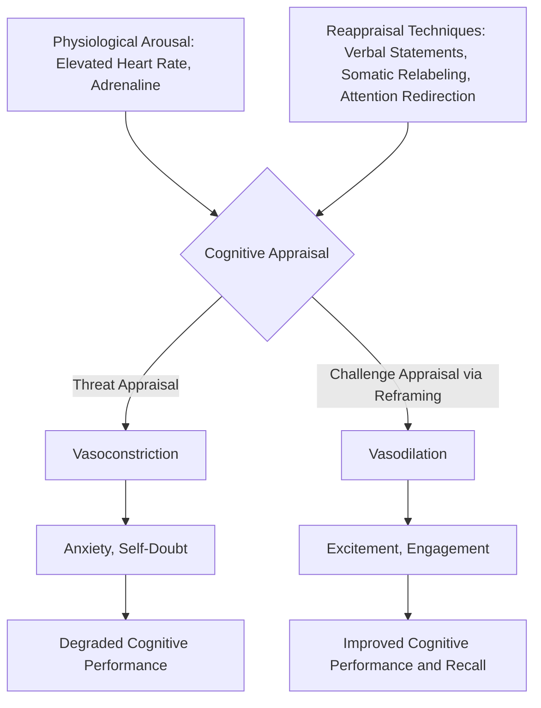

## Reframing Nervous Energy as Performance Readiness

### Definition and Conceptual Basis

Reframing nervous energy as performance readiness is a cognitive-behavioral technique in which the physiological arousal symptoms of speech anxiety (elevated heart rate, adrenaline, heightened alertness) are consciously reinterpreted as evidence of the body preparing for optimal performance rather than as evidence of impending failure or danger. This technique does not attempt to eliminate arousal — a physiologically unrealistic goal — but instead alters the **cognitive appraisal** of that arousal, which changes its subjective and functional effect on performance.

This approach is grounded in **appraisal theory of emotion**, which holds that emotional experience is not determined solely by physiological state but by the cognitive interpretation assigned to that state. Identical physiological signatures (racing heart, sweating palms, adrenaline surge) underlie both anxiety and excitement; the subjective label applied to the arousal — not the arousal itself — determines whether it is experienced as threat or as readiness.

**Key Points**

- Arousal and valence are separable: arousal level (how activated the body is) is distinct from valence (whether that activation is interpreted as positive or negative)
- Reframing works with the body's natural stress response rather than attempting to suppress it, which is generally more sustainable than suppression-based approaches

### The "Excited" vs. "Calm" Research Basis

The most cited empirical foundation for this technique is Alison Wood Brooks' research (Harvard Business School, 2014) on **"anxiety reappraisal,"** which found that instructing participants to say "I am excited" prior to a stressful performance task produced better performance outcomes than instructing them to say "I am calm."

The mechanistic explanation:

- Anxiety and excitement are both **high-arousal** states, differing primarily in valence (negative vs. positive)
- Shifting from "anxious" to "excited" requires only a valence change — a relatively small cognitive shift
- Shifting from "anxious" (high arousal) to "calm" (low arousal) requires an arousal-level change, which is physiologically harder to achieve on demand and often produces an "I'm trying to calm down and it's not working" spiral that increases distress
- Because "excited" retains the arousal, it is a more attainable reframe than "calm," which asks the body to do something it is not currently prepared to do

[Inference] This asymmetry likely explains why calming-focused interventions (e.g., "just relax," "take a deep breath and calm down") frequently fail under high-stakes conditions — they demand a state change that fights the ongoing sympathetic activation, whereas excitement-reframing works with the existing activation and only redirects its interpretation.

### Mechanism: How Reappraisal Alters Physiological and Cognitive Outcomes

#### Cognitive Level

- Appraising arousal as "readiness" activates an **approach-motivation** orientation (moving toward the challenge) rather than an **avoidance-motivation** orientation (moving away from threat)
- Approach-oriented appraisal is associated with a **challenge response** rather than a **threat response** in the cardiovascular stress literature (Blascovich & Tomaka's biopsychosocial model)

#### Physiological Level: Challenge vs. Threat Response

This is a critical distinction with measurable cardiovascular signatures:

| Response Type | Cardiac Output | Vascular Resistance | Subjective Correlate |
| --- | --- | --- | --- |
| Threat response | Increased | Increased (vasoconstriction) | Anxiety, dread, self-doubt |
| Challenge response | Increased | Decreased (vasodilation) | Excitement, engagement, confidence |

Both responses involve elevated arousal and adrenaline; the differentiator is whether peripheral vasculature constricts (threat, limiting blood flow efficiency) or dilates (challenge, supporting more efficient blood flow to muscles and brain). Reappraisal techniques aim to shift the same underlying SNS activation from a threat-response vascular pattern to a challenge-response pattern.

**Key Points**

- The challenge response is associated with better cognitive performance, clearer speech production, and improved memory recall under pressure compared to the threat response, despite comparable arousal levels
- This reframes the goal of anxiety management: not "reduce arousal" but "convert threat-pattern arousal into challenge-pattern arousal"

### Practical Application Techniques

#### Verbal Reappraisal Statements

Simple, repeatable self-statements performed immediately before speaking:

- "I am excited" (direct valence substitution for "I am nervous")
- "My body is preparing me to perform" (readiness framing)
- "This feeling means I care about doing well" (motivational reframing)

#### Somatic Relabeling

Explicitly renaming physical sensations without attempting to suppress them:

- Racing heart → "My heart rate is up because I have extra oxygen and energy available"
- Sweating palms → "My body is cooling itself for sustained effort"
- Adrenaline surge → "This is fuel for an alert, sharp performance"

#### Attention Redirection

Shifting cognitive focus from internal symptom-monitoring (which amplifies threat appraisal through hypervigilance) to external task-focus (which supports challenge appraisal):

- Focus on audience needs and message delivery rather than internal bodily sensations
- Rehearse opening lines as an anchor to redirect attention outward at the moment of highest arousal (typically the first 30–60 seconds of a speech)

#### Physical Priming (Power Posing and Related Techniques)

[Speculation] Some practitioners incorporate expansive body posture prior to speaking, on the theory that posture influences self-perceived confidence and readiness state. The empirical replication of hormonal effects (e.g., testosterone/cortisol shifts) originally associated with this technique has been substantially disputed in subsequent replication attempts, so this should be treated as a low-confidence adjunct technique rather than a validated physiological intervention — though the psychological/attentional benefit of a pre-performance ritual may still hold independent value.

**Example**

A speaker feels their heart pounding backstage before a keynote. Rather than thinking "I need to calm down before I go out there" (arousal-reduction framing, which is difficult to achieve in the remaining two minutes and often backfires by drawing attention to the failure to calm down), the speaker instead says internally: "My heart is pounding because my body is ready to bring energy to this room" (valence-reframe, readiness framing) and redirects attention to the audience's needs rather than internal symptoms.

### Boundary Conditions and Limitations

Reframing is not universally sufficient as a standalone intervention:

- **Skills deficits are not resolved by reframing**: a speaker who lacks structural command of their material will not be helped by reappraisal alone — reframing addresses the interpretation of arousal, not underlying competence gaps (see skills-deficit distinction in speech anxiety etiology)
- **Severe/clinical-level anxiety**: for panic-level physiological responses (derealization, chest pain, inability to speak), reframing alone is typically insufficient and may need to be paired with broader exposure-based or clinical intervention
- **Overuse risk**: forcing an "excited" reframe when the underlying appraisal genuinely reflects unaddressed risk (e.g., insufficient preparation) can produce false confidence rather than genuine readiness — reframing works best when paired with adequate preparation, not as a substitute for it

**Key Points**

- Reframing is most effective as one component within a broader readiness system (preparation + rehearsal + physiological regulation + cognitive reappraisal), not as an isolated fix
- The technique presumes a baseline of competence; it optimizes the *expression* of existing skill under arousal, not the skill itself

### Diagram: Threat vs. Challenge Reappraisal Pathway

### Comparison: Suppression vs. Reappraisal Strategies

| Strategy | Mechanism | Typical Outcome |
| --- | --- | --- |
| Suppression ("don't think about it") | Attempts to inhibit arousal expression | Often increases physiological arousal (rebound effect); depletes cognitive resources |
| Calming ("relax," slow breathing only) | Attempts arousal-level reduction | Difficult under acute high-stakes onset; can create secondary frustration if unsuccessful |
| Reappraisal ("I am excited," readiness framing) | Retains arousal, shifts valence/interpretation | Generally more attainable; associated with challenge-response physiology and improved performance |

**Next Steps**

- The Challenge vs. Threat Response Model (Blascovich and Tomaka)
- Appraisal Theory of Emotion in Performance Contexts
- Breathing and Somatic Regulation Techniques for Speech Delivery
- Pre-Performance Routines and Ritual in High-Stakes Communication
- Cognitive Restructuring Techniques for Speech Anxiety
- Approach vs. Avoidance Motivation in Public Speaking
- Attention Control Theory and Task-Focused vs. Symptom-Focused Attention