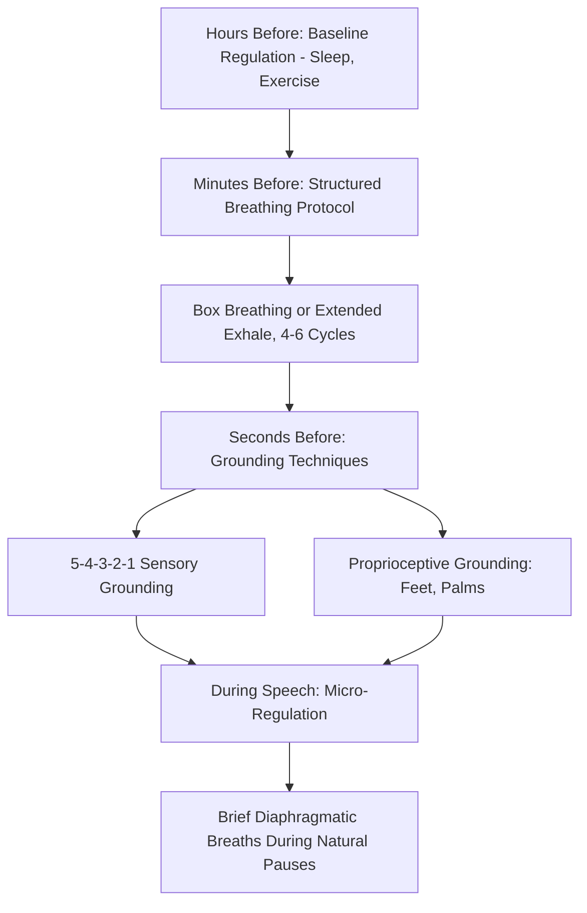

## Breathing and Grounding Techniques Before Speaking

### Definition and Physiological Rationale

Breathing and grounding techniques are somatic self-regulation strategies applied immediately before or during public speaking to modulate autonomic nervous system arousal. Unlike cognitive reappraisal (which changes the *interpretation* of arousal), these techniques act directly on the physiological substrate of anxiety by engaging the **parasympathetic nervous system (PNS)** — specifically the vagus nerve — to counterbalance sympathetic activation.

The physiological target is the **autonomic balance point** between sympathetic (arousal-producing) and parasympathetic (arousal-dampening) activity. Controlled breathing is one of the few autonomic functions under direct voluntary control, making it a uniquely accessible lever for real-time nervous system regulation.

**Key Points**

- Breathing techniques do not eliminate arousal; they shift the sympathetic/parasympathetic balance toward a more regulated state
- Grounding techniques work primarily through attentional mechanisms (redirecting focus to present-sensory input) rather than direct autonomic modulation, though the two effects often overlap

### Physiological Mechanism: Diaphragmatic Breathing and Vagal Tone

#### The Vagus Nerve and Heart Rate Variability

The vagus nerve is the primary parasympathetic pathway connecting the brainstem to the heart, lungs, and digestive organs. Slow, deep diaphragmatic breathing stimulates vagal afferents, which:

- Increases **heart rate variability (HRV)**, a marker associated with better autonomic regulation and stress resilience
- Activates the **baroreceptor reflex**, in which lung stretch receptors during deep inhalation and exhalation modulate heart rate via the vagus nerve
- Produces **respiratory sinus arrhythmia**: heart rate naturally decelerates during exhalation, which is why extended exhalation (relative to inhalation) is emphasized in most calming breath protocols

#### Diaphragmatic vs. Thoracic Breathing

Anxiety-driven breathing is typically **thoracic (chest) breathing**: shallow, rapid, using accessory chest muscles, which perpetuates sympathetic activation and reduces oxygen exchange efficiency. **Diaphragmatic (belly) breathing** engages the diaphragm fully, produces deeper and slower respiration, and directly counters the SNS-driven breathing pattern.

**Key Points**

- The physiological anxiety response includes bronchodilation and increased respiration rate; diaphragmatic breathing works against this pattern rather than being a passive coincidence
- Speakers under sympathetic activation often unconsciously shift to thoracic breathing, which further tightens the throat and diaphragm — directly degrading vocal quality, independent of any subjective anxiety experience

### Specific Breathing Protocols

#### Box Breathing (Tactical Breathing)

A structured four-phase protocol used widely in high-stakes performance contexts (including military and emergency-response training):

1. Inhale for a count of 4
2. Hold for a count of 4
3. Exhale for a count of 4
4. Hold (empty) for a count of 4

Repeated for 4–6 cycles. The equal-phase structure gives the mind a concrete counting task, which also serves an attentional/grounding function alongside the autonomic effect.

#### Extended Exhale Breathing (4-7-8 or Similar)

1. Inhale through the nose for a count of 4
2. Hold for a count of 7
3. Exhale slowly through the mouth for a count of 8

The extended exhale relative to inhale is the operative mechanism — longer exhalation maximizes vagal stimulation via the respiratory sinus arrhythmia effect described above.

#### Diaphragmatic Breathing (Foundational Technique)

1. One hand on chest, one on abdomen (for training/awareness; not needed once habituated)
2. Inhale through the nose, allowing the abdomen (not the chest) to expand
3. Exhale slowly through pursed lips or the mouth, allowing the abdomen to fall
4. Maintain a slow, even rate (roughly 6 breaths per minute is commonly cited as an optimal range for maximizing HRV in the performance-psychology literature)

**Example**

A speaker with 90 seconds before walking on stage uses 4 cycles of box breathing (4-4-4-4), taking approximately 64 seconds, timed to conclude just before the introduction ends — providing both physiological down-regulation and a fixed attentional task that displaces anticipatory catastrophizing thoughts.

### Grounding Techniques

Grounding techniques redirect attention from internal anxious cognition (rumination, catastrophizing, anticipatory threat scanning) to concrete present-moment sensory input. They are drawn substantially from clinical anxiety-management practice and adapted for pre-performance use.

#### 5-4-3-2-1 Sensory Grounding

Sequential identification of:

- 5 things visible in the immediate environment
- 4 things audible
- 3 things physically felt (e.g., feet on floor, fabric texture)
- 2 things smelled
- 1 thing tasted

This technique's mechanism is primarily **attentional displacement**: anxious cognition is future-oriented (anticipated failure) or self-monitoring (internal symptom focus), while sensory grounding is necessarily present-tense and externally focused, which is cognitively incompatible with sustained catastrophizing.

#### Physical/Proprioceptive Grounding

- Feeling feet firmly planted on the floor, weight evenly distributed
- Pressing palms together or gently gripping an object (a lectern edge, notecards) to provide proprioceptive feedback
- Gentle isometric tension-release (briefly tensing shoulders or hands, then releasing) — leverages the tension-release cycle to reduce sustained muscular guarding

#### Cognitive Anchoring

- A single rehearsed phrase or physical cue (touching a specific object, a fixed opening line) used consistently across speaking occasions to build a conditioned association between the cue and a regulated state — functioning similarly to a pre-performance ritual in sports psychology

**Key Points**

- Grounding techniques are particularly useful in the final seconds before speaking, when longer breathing protocols may not be feasible
- Grounding and breathing techniques are complementary, not competing: grounding addresses attentional/cognitive threat-scanning, while breathing addresses autonomic arousal directly

### Timing and Sequencing Considerations

- **Hours before**: general regulation practices (exercise, adequate sleep) affect baseline cortisol and HPA-axis reactivity but are not "technique" in the immediate sense
- **Minutes before**: structured breathing protocols (box breathing, extended exhale) are most effective here, as they require an uninterrupted window
- **Seconds before (walking to the podium)**: grounding techniques and brief diaphragmatic breaths are more practical than multi-cycle protocols requiring sustained counting
- **During the speech**: micro-regulation via brief pauses that double as rhetorical devices (a pause for emphasis also permits a single diaphragmatic breath) — this is a practical integration point where physiological regulation and delivery technique overlap

[Inference] Because visible or audible breathing techniques (long audible exhales, closed-eye grounding) can appear unusual or distracting if performed in front of an audience, most practitioners recommend confining formal protocol-based breathing to backstage or pre-entry windows, reserving only brief, inconspicuous diaphragmatic breaths for use during the speech itself.

### Common Errors in Application

- **Over-breathing/hyperventilation risk**: taking rapid, deep breaths (rather than slow, controlled ones) can paradoxically increase arousal by altering blood CO2 levels (hypocapnia), producing lightheadedness that mimics anxiety symptoms
- **Treating breathing as a complete solution**: breathing techniques regulate arousal but do not address skills deficits, content mastery, or cognitive catastrophizing — most effective as one component in a multi-technique readiness system
- **Insufficient practice before high-stakes use**: techniques rehearsed for the first time under real performance pressure are less reliable than those practiced repeatedly in low-stakes conditions, since the goal is to build a conditioned, automatic response

### Diagram: Breathing and Grounding Timing Sequence

### Comparison of Techniques by Context

| Technique | Time Required | Best Context | Primary Mechanism |
| --- | --- | --- | --- |
| Box breathing | 60-90 seconds | Backstage, private space | Vagal/autonomic regulation |
| Extended exhale (4-7-8) | 60-90 seconds | Backstage, private space | Vagal/autonomic regulation |
| Diaphragmatic breathing | Ongoing/habitual | Any time, including during delivery | Autonomic regulation, vocal quality |
| 5-4-3-2-1 grounding | 30-60 seconds | Immediately before walking on | Attentional displacement |
| Proprioceptive grounding | Seconds | During transition to podium, during delivery | Attentional displacement, minimal disruption |

**Next Steps**

- Heart Rate Variability and Autonomic Regulation in Performance Contexts
- The Physiology of Speech Anxiety (foundational mechanisms)
- Pre-Performance Rituals and Cognitive Anchoring
- Vocal Production Under Physiological Stress
- Integrating Physiological Regulation with Content Rehearsal
- Mindfulness-Based Approaches to Performance Anxiety