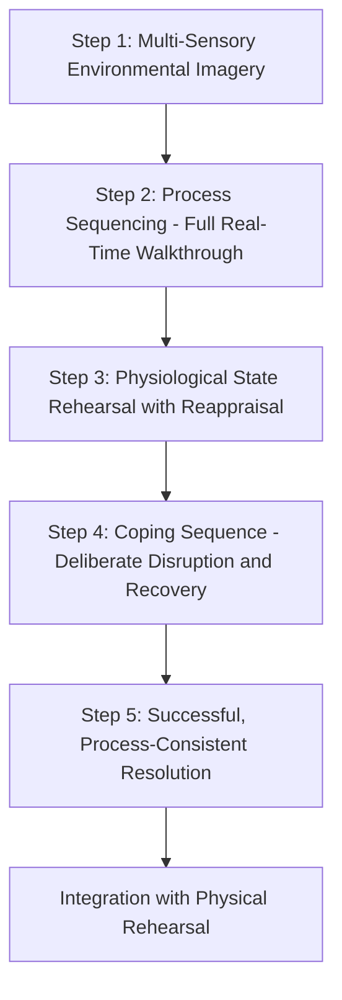

## Visualization and Mental Rehearsal

### Definition and Theoretical Basis

Visualization and mental rehearsal is a cognitive-behavioral preparation technique in which a speaker systematically imagines the full experience of delivering a speech — including environment, physical sensations, audience response, and successful execution — prior to actual performance. The technique is grounded in **motor imagery theory** and **psychoneuromuscular theory**, both extensively studied in sport psychology and subsequently adapted to public speaking and executive communication training.

The core theoretical claim is that vivid, structured mental imagery activates overlapping neural substrates with actual physical performance, producing measurable preparatory effects even in the absence of physical rehearsal.

**Key Points**

- Visualization is not equivalent to "positive thinking" or vague optimism; effective protocols are structured, multi-sensory, and process-focused rather than purely outcome-focused
- Visualization supplements physical rehearsal (rehearsing the actual content aloud) rather than replacing it — the two serve different functions

### Neurological Basis: Functional Equivalence

#### Motor Imagery and Neural Overlap

Neuroimaging research (fMRI studies) demonstrates that imagining a motor action activates many of the same brain regions engaged during actual execution of that action, including:

- **Premotor cortex**: involved in movement planning
- **Supplementary motor area (SMA)**: involved in sequencing and initiating movement
- **Cerebellum**: involved in motor coordination and timing
- **Basal ganglia**: involved in movement selection and habitual sequencing

This overlap is termed **functional equivalence** — the premise that imagined and executed actions share underlying neural machinery, though imagined actions do not produce the actual muscular output (a distinction sometimes described via efference copy and corollary discharge mechanisms that suppress motor execution during imagery while retaining the planning-stage activation).

[Inference] Because public speaking involves not just motor sequencing (gesture, movement, vocal production) but also complex cognitive-verbal sequencing (word retrieval, argument structure, audience-adaptive language), the neural overlap for speech-specific visualization likely extends beyond pure motor imagery regions into language-production areas (e.g., Broca's area) and executive-function regions, though this extension is less directly established in the sport-psychology literature from which the core technique derives.

#### Psychoneuromuscular Theory

An older but historically foundational explanation holds that mental imagery produces low-level, subthreshold neuromuscular activation in the muscles that would be used during actual performance — essentially a faint "rehearsal" innervation pattern. This theory has weaker empirical support relative to the neural-overlap/functional-equivalence framework but remains referenced in applied training contexts.

### Types of Imagery Relevant to Speech Preparation

#### Outcome Imagery

Imagining the successful end-state (positive audience reaction, successful Q&A, applause). Useful for motivation and confidence but insufficient alone, since it does not rehearse the process needed to reach that outcome.

#### Process Imagery

Imagining the specific sequence of actions required for successful delivery: walking to the podium, opening lines, transitions, handling a difficult question, managing a stumble and recovering. Process imagery is generally considered more performance-relevant than outcome imagery alone, because it rehearses the actual behavioral and cognitive sequence rather than only the desired result.

#### Coping Imagery (Rehearsing Setbacks)

Deliberately visualizing minor failures or disruptions (a lost train of thought, a technical glitch, a hostile question) and mentally rehearsing a calm, effective response. This distinguishes mastery imagery (everything goes perfectly) from **coping imagery** (something goes wrong, and I handle it well) — the latter is associated with greater resilience and reduced anxiety when actual disruptions occur, since the speaker has a rehearsed response schema rather than encountering the disruption as a novel threat.

**Key Points**

- Coping imagery is often more valuable than pure mastery imagery for anxiety reduction, because it directly addresses the catastrophizing cognitions (see speech anxiety causal models) that assume any deviation from perfection is unrecoverable
- A well-rounded visualization protocol includes both mastery and coping scenarios

### Structured Visualization Protocol

#### Step 1: Multi-Sensory Environmental Imagery

Construct the performance environment in as much sensory detail as possible:

- Visual: the room layout, lighting, audience size and seating
- Auditory: ambient sound, the sound of one's own voice through the room's acoustics
- Kinesthetic: the feeling of standing at the podium or on stage, posture, weight distribution

#### Step 2: Process Sequencing

Mentally walk through the speech in real time (not compressed or skipped), including:

- The walk to the podium
- The opening moments (often the highest-arousal point)
- Key transitions and structural signposts
- Planned pauses, emphasis points, and gestures
- The conclusion and any Q&A

#### Step 3: Physiological State Rehearsal

Incorporate the anticipated arousal sensations (elevated heart rate, adrenaline) into the visualization itself, paired with a rehearsed reappraisal response (see reframing nervous energy as performance readiness) — this integrates the cognitive and physiological components rather than visualizing a physiologically unrealistic "calm" state that will not match actual arousal levels.

#### Step 4: Coping Sequence Insertion

Deliberately insert at least one minor disruption into the visualization and rehearse the recovery: pausing, breathing, and continuing — building a rehearsed response pattern for the disruptions that most speeches actually contain in some form.

#### Step 5: Successful Resolution

Conclude the visualization with a successful, process-consistent ending (not an unrealistically perfect one) — the audience is engaged, the speaker recovers well from any friction points, and the interaction closes as intended.

**Example**

An executive preparing for a high-stakes board presentation runs a 10-minute visualization the night before: she imagines walking into the boardroom, feeling the weight of her notes in hand, hearing the hum of the projector, delivering her opening line, and then — deliberately — imagines a board member interrupting with a skeptical question earlier than planned. She rehearses pausing, breathing once, acknowledging the question directly, and pivoting back to her structure, before continuing to a successful close.

### Distinguishing Visualization from Passive Daydreaming

Effective visualization protocols share features that distinguish them from unfocused worry or vague positive fantasizing:

| Feature | Effective Visualization | Ineffective Variant |
| --- | --- | --- |
| Sensory detail | High (multi-sensory, specific) | Low (vague, abstract) |
| Pacing | Real-time, full sequence | Compressed or outcome-only |
| Content | Process + coping + outcome | Outcome only, or worry-based catastrophizing |
| Perspective | First-person (internal, as if performing) | Third-person (watching self, generally less effective for motor/process rehearsal) |
| Emotional tone | Includes realistic arousal, paired with regulation | Either falsely calm or anxiety-amplifying |

[Inference] First-person (internal) imagery perspective is generally considered more effective for process and motor rehearsal than third-person (external, "watching yourself on video") perspective, based on the sport-psychology imagery literature, though some practitioners use third-person imagery specifically for self-evaluation purposes distinct from rehearsal purposes.

### Integration with Physical Rehearsal

Visualization is most effective as a complement to, not a substitute for, physical rehearsal:

- **Physical rehearsal** (rehearsing aloud, standing, with actual gestures) builds procedural memory, vocal calibration, and timing accuracy that pure mental imagery cannot fully replicate
- **Visualization** is most valuable for reinforcing already-rehearsed material, managing pre-performance anxiety, and rehearsing scenarios (audience reactions, disruptions) that are impractical to physically simulate repeatedly
- A common applied sequence: physical rehearsal to build competence → visualization closer to the event to reinforce readiness and manage anxiety, since visualization requires less time and physical setup than full physical run-throughs

### Diagram: Visualization Protocol Sequence

### Common Errors in Application

- **Outcome-only visualization**: imagining only success without rehearsing the process, which provides motivational benefit but limited procedural preparation
- **Avoiding disruption imagery**: exclusively rehearsing a "perfect" run-through, leaving no rehearsed response for the deviations that occur in most real deliveries
- **Insufficient sensory detail**: brief, vague imagery produces weaker neural engagement than vivid, multi-sensory imagery
- **Treating visualization as a substitute for content mastery**: visualization reinforces and calibrates existing preparation; it does not generate content competence on its own

**Next Steps**

- Reframing Nervous Energy as Performance Readiness
- Coping Imagery and Resilience in High-Stakes Performance
- Physical Rehearsal Techniques and Vocal Calibration
- Motor Imagery Theory in Sport and Performance Psychology
- Structuring a Pre-Performance Preparation Routine
- Managing Q&A and Unplanned Disruptions in Executive Presentations