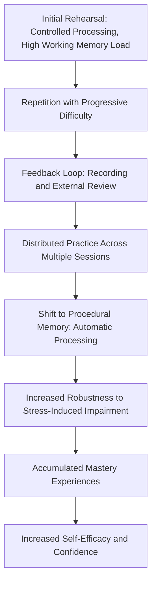

## Building Confidence Through Preparation and Repetition

### Definition and Conceptual Basis

Building confidence through preparation and repetition is the foundational, competence-based approach to reducing speech anxiety and improving delivery quality: rather than managing arousal through cognitive or somatic techniques alone, this approach addresses the underlying skill and familiarity deficits that generate legitimate uncertainty in the first place. The theoretical anchor is Albert Bandura's construct of **self-efficacy** — the belief in one's capacity to execute the specific behaviors required to produce a desired outcome — which is empirically the strongest predictor of performance confidence across the psychological literature, generally outperforming generic self-esteem or trait confidence measures.

**Key Points**

- Confidence, in this framework, is not a fixed trait but a state built through accumulated, verifiable evidence of competence
- This approach directly targets the **skills-deficit** pathway to speech anxiety (see causal models of speech anxiety), distinguishing it from purely cognitive-reappraisal or somatic-regulation techniques, which primarily address the **distorted-cognition** pathway

### Bandura's Sources of Self-Efficacy Applied to Speaking

Bandura identified four primary sources of self-efficacy, each directly applicable to speech preparation:

#### 1. Mastery Experience (Strongest Source)

Direct, successful past performance is the most powerful source of self-efficacy. Each successful speaking experience — even a small one — provides concrete evidence that counters anticipatory catastrophizing.

- Repetition builds a cumulative record of mastery experiences
- Deliberately structuring practice as a series of small successes (rather than one large, high-stakes attempt) accelerates self-efficacy development

#### 2. Vicarious Experience (Modeling)

Observing others — particularly perceived peers — succeed at a similar task increases self-efficacy, especially when the model is seen as comparable in skill level.

- Watching recordings of effective speakers, especially those in similar roles or contexts, provides a modeling benefit
- This is a weaker source than direct mastery experience but valuable when direct repetition opportunities are limited

#### 3. Verbal/Social Persuasion

Credible, specific encouragement from others (coaches, peers, mentors) can incrementally raise self-efficacy, though this effect is generally short-lived unless reinforced by actual mastery experience.

- Effective persuasion is specific ("Your transition in the third section was clear and well-paced") rather than generic ("You'll do great")
- Persuasion works best as reinforcement of genuine improvement, not as a substitute for it

#### 4. Physiological and Affective States

How one interprets one's own physiological arousal state feeds back into self-efficacy judgments (directly connecting to the reappraisal mechanisms discussed under reframing nervous energy). A speaker who has learned, through repetition, that their pre-speech arousal reliably resolves into competent delivery develops a conditioned association between arousal and eventual success.

**Key Points**

- Of the four sources, mastery experience through repeated practice has the largest and most durable effect on self-efficacy in the applied psychology literature
- This is the empirical basis for prioritizing structured repetition over purely motivational or reassurance-based confidence-building approaches

### The Mechanism of Repetition: From Effortful to Automatic Processing

Repetition builds confidence through a well-established cognitive mechanism: the shift from **controlled processing** (effortful, working-memory-intensive, consciously monitored) to **automatic processing** (fast, low-effort, minimally dependent on working memory).

- Early rehearsals of a speech require heavy working-memory engagement: recalling content, monitoring structure, managing delivery mechanics simultaneously
- Working memory capacity is finite and is further degraded under anxiety-driven cortisol elevation (see physiology of speech anxiety) — meaning novice, under-rehearsed material is especially vulnerable to anxiety-induced disruption
- Repeated rehearsal shifts content delivery toward **procedural memory** (skill-based, less dependent on conscious retrieval), which is comparatively more robust to the cognitive impairment produced by acute stress
- This explains the frequently observed pattern in which well-rehearsed speakers can "run on autopilot" through content even while experiencing significant physiological arousal, whereas under-rehearsed speakers are more vulnerable to blanking under identical arousal levels

[Inference] This procedural-memory robustness is likely why deliberate over-rehearsal (practicing well beyond the point of first successful recall) is commonly recommended for high-stakes presentations specifically — the goal is to push content into a processing mode less vulnerable to stress-induced working-memory impairment, rather than simply achieving initial competence.

### Structuring Effective Repetition (Deliberate Practice Principles)

Not all repetition produces equal confidence gains. Effective repetition follows principles derived from **deliberate practice** research (Ericsson et al.):

#### Progressive Difficulty

Structuring rehearsal from lower-stakes to higher-stakes conditions:

1. Silent read-through (content familiarity)
2. Solo read-aloud (vocal and pacing familiarity)
3. Full run-through with notes, alone
4. Full run-through without notes, alone
5. Run-through in front of a small, low-stakes audience (colleague, friend)
6. Run-through in a simulated high-fidelity condition (actual room, actual equipment, timed)

#### Specific, Actionable Feedback Loops

Repetition without feedback produces habituation to errors, not correction of them. Effective practice incorporates:

- Recording (audio/video) for objective self-review, since subjective impressions of one's own delivery are frequently inaccurate (speakers commonly overestimate perceived nervousness visible to others — a well-documented gap between self-perceived and audience-perceived anxiety)
- External feedback from a trusted observer, focused on specific, correctable elements rather than global evaluation

#### Distributed Practice Over Massed Practice

Consistent with broader learning-and-memory research, rehearsal distributed across multiple sessions over days produces more durable retention and skill consolidation than an equivalent amount of practice compressed into a single session immediately before the event (a direct application of the spacing effect from memory research).

**Example**

An executive preparing for a quarterly earnings call rehearses key talking points daily for a week rather than attempting a single intensive rehearsal the night before. By day 4, she notices she no longer needs to consciously recall the sequence of financial figures — they surface automatically, freeing cognitive resources to focus on tone, pacing, and anticipated analyst questions.

### The Self-Perception Gap: Why Speakers Underestimate Their Own Competence

A well-documented phenomenon in the public speaking literature is the mismatch between a speaker's subjective anxiety experience and the audience's perception of that speaker's composure — audiences generally rate visible nervousness lower than speakers self-report experiencing it. This gap has direct implications for confidence-building:

- Speakers often assume internal arousal is fully visible externally, which can itself become an additional anxiety-generating cognition (a form of the spotlight effect from social psychology)
- Reviewing objective recordings of one's own rehearsal — rather than relying on internal subjective impression — often provides corrective, confidence-building evidence that performance is more composed than internally perceived
- This makes recorded self-review not just a feedback tool for content/delivery correction, but also a distinct confidence-calibration tool

**Key Points**

- Recorded practice serves dual functions: skill correction and perceptual recalibration
- This gap-correction effect is often most pronounced in early-career speakers who have limited prior objective feedback to calibrate against

### Boundary Conditions and Limitations

- **Diminishing returns and over-rehearsal rigidity**: excessive repetition of identical phrasing without variation can produce a rigid, over-scripted delivery that reduces perceived authenticity and spontaneity — practitioners generally recommend rehearsing key structure and transitions to automaticity while allowing some phrasing variation to remain natural
- **Repetition does not address distorted cognition alone**: a speaker with well-rehearsed material who still catastrophizes about audience judgment will benefit from combining repetition-based preparation with cognitive reframing techniques
- **Practice conditions must approximate performance conditions**: rehearsal in dissimilar conditions (e.g., seated, without audience, in silence) transfers less effectively than rehearsal approximating the actual performance context (standing, aloud, ideally with some form of audience or audience-simulation) — a principle related to **transfer-appropriate processing** in cognitive psychology

### Diagram: Confidence-Building Pathway Through Repetition

### Summary Table: Sources of Self-Efficacy and Application

| Source | Relative Strength | Speech Preparation Application |
| --- | --- | --- |
| Mastery experience | Strongest | Structured, progressive repetition; recorded rehearsal |
| Vicarious experience | Moderate | Watching skilled models in comparable roles/contexts |
| Verbal persuasion | Weaker, short-lived alone | Specific, targeted feedback from trusted observers |
| Physiological/affective state | Variable, interacts with reappraisal | Conditioning arousal-to-success association through repetition |

**Next Steps**

- Self-Efficacy Theory and Bandura's Sources Model
- Deliberate Practice Principles Applied to Public Speaking
- The Spacing Effect and Distributed Practice in Skill Retention
- Recorded Self-Review and Perceptual Calibration Techniques
- Reframing Nervous Energy as Performance Readiness
- Visualization and Mental Rehearsal
- Transfer-Appropriate Processing in Rehearsal Design