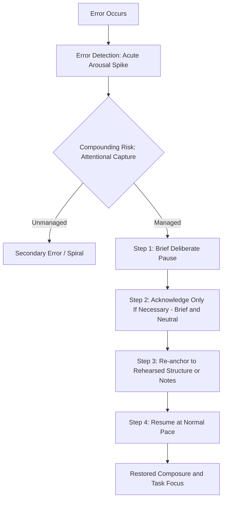

## Recovering Composure After a Mistake

### Definition and Scope

Recovering composure after a mistake refers to the set of cognitive, physiological, and behavioral strategies a speaker employs to regain functional performance state immediately following an error during live delivery — a lost word, a factual slip, a technical failure, a stumble, or a visibly poor response to a question. This is distinct from pre-performance anxiety management (see breathing/grounding and visualization techniques) in that it addresses **in-the-moment disruption recovery** rather than anticipatory preparation, though the two draw on overlapping physiological and cognitive mechanisms.

The central analytical premise is that the mistake itself is rarely what damages a speaker's credibility or composure — the **recovery response** to the mistake is the primary determinant of audience perception and continued performance quality.

**Key Points**

- Audiences typically do not perceive or recall minor errors with the same salience the speaker experiences internally (related to the self-perception gap discussed in confidence-building literature)
- A composed recovery frequently registers as more credible to an audience than flawless, uninterrupted delivery, since it demonstrates authentic competence under pressure rather than rehearsed perfection

### The Physiological Cascade Triggered by an Error

An in-speech mistake typically triggers an acute secondary spike in sympathetic activation, layered on top of whatever baseline arousal was already present:

1. **Error detection**: The anterior cingulate cortex (ACC), associated with conflict/error monitoring, registers the discrepancy between intended and actual output
2. **Acute arousal spike**: A secondary surge of adrenaline is released, often more abrupt than the initial pre-speech arousal, producing a brief but intense spike in heart rate and muscular tension
3. **Attentional capture**: Attention shifts sharply inward toward the error and its perceived consequences (self-monitoring), displacing outward, task-focused attention
4. **Risk of cascade**: If unmanaged, this attentional shift can produce a secondary error (losing the next point while still processing the first), creating a compounding cycle sometimes informally termed a "spiral"

[Inference] The compounding-error cascade is best explained by the interaction between acute stress-induced narrowing of attentional bandwidth and the self-monitoring shift described above — once attention is captured by the error itself, there is reduced cognitive capacity available for the ongoing task of content retrieval and delivery, increasing the probability of a subsequent, unrelated error.

### The Core Recovery Sequence

#### Step 1: Pause (Do Not Rush to Cover)

The instinctive response to a mistake is often to speed up, talk over the error, or immediately over-explain — all of which extend the disruption and signal heightened distress to the audience. A brief, deliberate pause:

- Interrupts the arousal-cascade pathway before it compounds
- Allows a single regulating breath (diaphragmatic, not audible or exaggerated)
- Is almost always perceived by the audience as far shorter than it feels to the speaker internally

#### Step 2: Brief, Neutral Acknowledgment (When Necessary)

Not all errors require acknowledgment — many minor stumbles are best left unaddressed, since drawing attention to a small error the audience may not have registered often does more reputational damage than the error itself. When acknowledgment is warranted (a substantive factual correction, a visible technical failure):

- Keep it brief and neutral in tone ("Let me restate that clearly" or "Let me correct that figure")
- Avoid self-deprecating over-apology, which reinforces the error's salience and can undermine ethos (see rhetorical analysis of credibility appeals)
- Avoid elaborate justification, which extends the disruption and shifts focus further from content to process

#### Step 3: Re-anchor to Structure

Returning to a known structural landmark (a rehearsed transition phrase, a signposted section header, notes) provides a concrete retrieval cue that counters the working-memory disruption caused by the arousal spike (see the physiology of speech anxiety regarding cortisol's effect on prefrontal/working-memory function).

- Rehearsed transition phrases function as pre-built recovery anchors — speakers who explicitly rehearse a small set of flexible transition phrases have a ready-made re-entry point after any disruption
- Referring briefly to notes is generally perceived as competent preparation, not weakness, when done smoothly and without extended searching

#### Step 4: Resume at Normal Pace

Resuming at the speech's established pace (rather than rushing to "make up time" or over-correcting into excessive slowness) signals restored composure more effectively than any verbal reassurance could.

**Example**

An executive presenting quarterly results misstates a figure. Rather than stopping to apologize extensively, she pauses briefly, says "Let me correct that — the figure is 12%, not 15%," and continues directly into her next point at the same pace as before. The correction is registered by the audience as a minor, competently handled clarification rather than a significant failure.

### Distinguishing Error Types and Calibrating Response

| Error Type | Audience Salience | Recommended Response |
| --- | --- | --- |
| Minor verbal stumble (word fumble, brief pause) | Very low — rarely consciously registered | No acknowledgment; continue |
| Lost train of thought (brief) | Low to moderate | Brief pause, re-anchor via notes/structure, continue |
| Factual/data error | Moderate to high (if consequential) | Brief neutral correction, then continue |
| Technical failure (slides, audio) | High but externally attributed | Brief acknowledgment, pivot to available resources, maintain narrative control |
| Hostile or difficult question mishandled | High, and internally attributed to the speaker | Brief pause, clarifying restatement, direct and composed response; avoid defensive over-explanation |

**Key Points**

- Calibrating the response to actual (not perceived) audience salience prevents over-correction, which often draws more attention to an error than the error itself warranted
- Errors with external attribution (technical failures) generally require less ethos-repair than errors with internal attribution (the speaker's own factual or judgment error), since audiences differentiate between speaker-caused and circumstance-caused disruptions

### Cognitive Reframing of the Mistake Itself

Beyond the behavioral recovery sequence, the speaker's **cognitive interpretation** of the mistake significantly affects recovery speed, drawing directly on the cognitive-behavioral models discussed in the causal analysis of speech anxiety:

- **Catastrophizing interpretation** ("This has ruined the entire presentation") extends the arousal cascade and delays recovery
- **Proportional interpretation** ("This is one moment in a longer presentation and will likely not be remembered as the presentation's defining feature") supports faster attentional return to task-focus
- This reframing is most effective when rehearsed in advance (see coping imagery under visualization and mental rehearsal) rather than attempted for the first time during the actual disruption

[Inference] Because cognitive reappraisal under acute stress is more difficult to execute than when rehearsed in a calmer state (a general finding in stress-and-cognition research), the practical value of pre-rehearsing a proportional, non-catastrophizing self-statement for use after an error is likely higher than attempting to construct such a reframe spontaneously in the moment.

### Preemptive Preparation for Recovery

Because in-the-moment cognitive resources are constrained under stress, the most reliable recovery techniques are those **pre-built during preparation** rather than improvised during the disruption itself:

- **Rehearsed transition/bridge phrases**: A small set of flexible phrases ("Let me come back to that point," "To put that more precisely...") rehearsed in advance and usable across multiple disruption types
- **Coping imagery rehearsal**: Explicitly visualizing a disruption and a composed recovery during preparation (see visualization and mental rehearsal)
- **Structural redundancy**: Building a speech structure with clear, memorable signposts (numbered points, clear section headers) that provide easy re-entry points if attention is momentarily lost
- **Physical anchor**: A rehearsed brief physical action (setting down a pen, glancing at notes) that provides a natural, unremarkable pause point during which the diaphragmatic breath and cognitive reset can occur without appearing as a distinct "recovery" moment to the audience

### Diagram: Mistake Recovery Sequence

### Common Errors in Recovery Attempts

- **Over-apologizing**: extended, repeated apology draws disproportionate attention to a minor error and can damage ethos more than the original mistake
- **Rushing**: attempting to "make up time" by speeding up increases cognitive load and raises the probability of compounding errors
- **Ignoring necessary corrections**: failing to correct a substantive factual error (as opposed to a minor stumble) can create larger credibility problems than a brief, composed correction would have
- **Visible self-criticism**: verbal or nonverbal self-deprecation ("I'm so sorry, I always mess this part up") undermines credibility disproportionately relative to the original error's actual audience salience

**Next Steps**

- The Physiology of Speech Anxiety and Acute Stress Responses
- Reframing Nervous Energy as Performance Readiness
- Visualization and Mental Rehearsal: Coping Imagery
- Handling Hostile Questions in Executive Q&A
- Ethos Repair and Credibility Management in Live Communication
- Structural Signposting for Resilient Speech Design