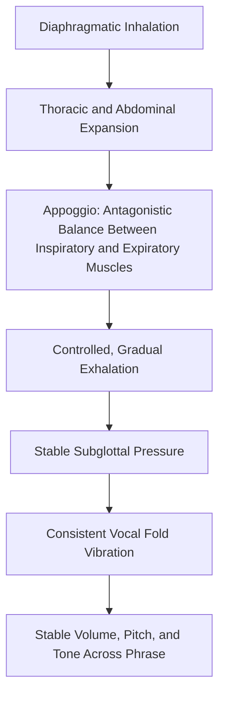

## Breath Control and Vocal Support

### Definition and Anatomical Basis

Breath control and vocal support refer to the deliberate management of respiratory mechanics to provide a stable, sufficient, and efficiently regulated airflow for voice production. In vocal pedagogy, "support" (sometimes called *appoggio* in classical vocal training terminology) describes the coordinated muscular engagement — primarily involving the diaphragm, intercostal muscles, and abdominal musculature — that regulates subglottal air pressure feeding the vocal folds, rather than "breath" in the colloquial sense of simple inhalation and exhalation.

This is a distinct technical domain from the breathing techniques used for anxiety regulation (see breathing and grounding techniques), though the two rely on overlapping respiratory musculature and are frequently trained together in applied speech coaching.

**Key Points**

- Vocal support is fundamentally about *controlled, regulated exhalation*, not deep inhalation alone — a common misconception is that "breath support" means taking bigger breaths, when the more critical skill is managing the release of that breath
- Poor vocal support is a primary cause of vocal fatigue, inconsistent volume, unstable pitch, and reduced vocal endurance across long speaking engagements

### Respiratory Anatomy for Voice Production

#### The Diaphragm

A dome-shaped muscle separating the thoracic and abdominal cavities. During inhalation, the diaphragm contracts and flattens, expanding thoracic volume and drawing air into the lungs. During phonation, the diaphragm's controlled, gradual relaxation (rather than sudden release) is central to sustained, supported airflow.

#### Intercostal Muscles

- **External intercostals**: assist inhalation by elevating the rib cage
- **Internal intercostals**: assist controlled exhalation by depressing the rib cage, particularly important for sustaining longer phrases

#### Abdominal Musculature

The abdominal wall (rectus abdominis, obliques, transversus abdominis) provides counter-pressure against the diaphragm during exhalation, allowing fine control over subglottal pressure rather than an uncontrolled collapse of the thoracic cavity. This muscular counter-tension is the physiological basis of what vocal pedagogy terms "support."

#### The Glottis and Subglottal Pressure

Vocal fold vibration requires a threshold level of **subglottal pressure** (air pressure below the vocal folds) to initiate and sustain phonation. Vocal support's functional purpose is maintaining *consistent, appropriately calibrated* subglottal pressure throughout an utterance — insufficient pressure produces weak, breathy tone; excessive or unregulated pressure produces strained, pressed phonation and increased vocal fold trauma risk over time.

**Key Points**

- The relationship between breath and voice is not simply "more air = louder/better voice" — it is a pressure-regulation system requiring muscular coordination, not raw airflow volume
- Vocal fold vibration is self-oscillating once phonation threshold pressure is reached (per the myoelastic-aerodynamic theory of phonation); the speaker's job is maintaining stable pressure, not manually controlling each vibratory cycle

### Diaphragmatic vs. Clavicular Breathing for Speech

#### Diaphragmatic (Abdominal) Breathing

The recommended pattern for sustained speech: inhalation expands the lower rib cage and abdomen, engaging the diaphragm fully. This provides:

- Greater air volume per breath
- Better muscular leverage for controlled exhalation
- Reduced strain on accessory neck and shoulder muscles

#### Clavicular (Shoulder) Breathing

A shallow breathing pattern that elevates the shoulders and upper chest, common under stress or with untrained speakers. This pattern:

- Provides limited air volume relative to effort expended
- Engages accessory muscles (scalenes, sternocleidomastoid) that are not designed for sustained respiratory effort, contributing to neck and shoulder tension during extended speaking
- Produces less controllable subglottal pressure regulation, contributing to inconsistent vocal quality

[Inference] Because clavicular breathing is also the pattern associated with sympathetic nervous system activation (see the physiology of speech anxiety), speakers under acute anxiety are physiologically predisposed toward the breathing pattern least suited to vocal support — meaning breath-support training and anxiety-regulation training address a shared underlying mechanical vulnerability, even though they target it for different primary purposes.

### The Appoggio Concept: Balanced Breath Management

Classical vocal pedagogy's *appoggio* (Italian: "to lean on/support") describes a specific technical goal: maintaining the inhalation-expanded posture of the ribcage and upper abdomen for as long as possible during exhalation, rather than allowing immediate collapse. This creates a dynamic balance between:

- **Inspiratory muscles** (which resist collapse, maintaining expanded chest/abdominal posture)
- **Expiratory muscles** (which drive the controlled release of air needed for phonation)

This antagonistic muscular balance — rather than either pure inhalation effort or pure exhalation effort — is what produces the sensation of "support" that trained speakers and singers describe, and is the mechanism by which subglottal pressure remains stable across a sustained phrase rather than declining sharply as lung volume decreases.

**Key Points**

- The sensation of support is often described by trained speakers as a feeling of "openness" or sustained expansion in the lower ribs/abdomen, rather than active pushing or forcing
- This is a trainable motor skill requiring conscious practice before becoming automatic (procedural), consistent with general motor learning principles

### Common Dysfunctional Patterns and Their Effects

| Pattern | Mechanism | Vocal Consequence |
| --- | --- | --- |
| Shallow/clavicular breathing | Insufficient air volume, poor pressure control | Weak volume, frequent audible breath intake, vocal fatigue |
| Breath-holding/rigid support | Excessive abdominal/laryngeal tension | Strained, pressed tone; reduced pitch flexibility |
| Uncontrolled exhalation ("breath dumping") | Rapid, unregulated air release at speech onset | Inconsistent volume across a phrase; running out of air mid-sentence |
| Laryngeal compensation | Vocal folds compensate for inadequate breath support by over-adducting | Vocal strain, hoarseness, increased long-term vocal fatigue risk |

**Example**

A speaker who has not developed diaphragmatic support often finds their volume and vocal energy declining noticeably toward the end of long sentences, requiring frequent, audible breaths mid-phrase. A speaker with developed breath support can sustain consistent volume and tone across a full sentence or rhetorical unit before needing to replenish breath, supporting smoother phrasing and more effective use of pauses for emphasis rather than for physiological necessity.

### Practical Exercises for Developing Breath Support

#### Sustained Hiss/Sibilant Exercise

Inhale diaphragmatically, then exhale on a sustained "sss" or "sh" sound, aiming for maximal, evenly controlled duration (not maximal loudness). This isolates controlled exhalation from voicing, allowing the speaker to feel and monitor exhalation pacing independent of vocal fold engagement.

#### Sustained Vowel Exercise

Similar to the hiss exercise but using a sustained vowel ("ah," "oo"), monitoring for consistent pitch and volume across the full duration of the breath, without a decline in the final seconds — this decline is a common marker of inadequate support.

#### Counting on a Single Breath

Counting aloud (1, 2, 3...) on a single supported breath, tracking progressive improvement in the number reached with stable volume and clarity, without straining or gasping at the end.

#### Phrase-Length Calibration

Reading rehearsed material while consciously planning breath points at natural syntactic boundaries (clause and sentence breaks) rather than allowing breath to run out mid-phrase — this connects breath management directly to rhetorical phrasing and pause placement.

**Key Points**

- These exercises are most effective when practiced regularly (procedural motor learning, consistent with the repetition mechanisms discussed under confidence-building) rather than attempted for the first time immediately before a high-stakes speaking event
- Breath point planning should align with meaning units (phrases, clauses) rather than arbitrary points, since breathing mid-phrase disrupts both vocal support and the audience's parsing of sentence structure

### Integration with Rhetorical Delivery

Breath control has direct rhetorical implications beyond pure vocal mechanics:

- **Pause placement**: A well-supported breath taken at a natural syntactic or rhetorical boundary can double as an emphatic pause (see delivery canon, *pronuntiatio*, in rhetorical analysis), rather than an unplanned physiological necessity
- **Sustained emphasis**: Adequate support allows a speaker to sustain volume and pitch through the end of an important clause rather than trailing off — a common delivery weakness that undermines the perceived confidence of a claim
- **Pacing control**: Breath management directly constrains speaking pace; inadequate support often produces rushed delivery as a speaker unconsciously compresses phrasing to avoid running out of air

### Diagram: Breath Support Mechanism

### Relationship to Vocal Health

Inadequate breath support is a recognized contributing factor to vocal strain and, with sustained frequency (e.g., professionals with heavy speaking loads), to vocal fold pathology risk. [Unverified] The specific degree of causal contribution of poor breath support relative to other factors (vocal misuse patterns, hydration, environmental factors, underlying vocal fold pathology) varies across the clinical voice literature and is generally assessed on an individualized basis by speech-language pathologists or laryngologists rather than through generic causal estimates. Speakers with persistent hoarseness, vocal fatigue, or pain should be directed toward clinical voice evaluation rather than technique adjustment alone.

**Next Steps**

- Vocal Resonance and Projection
- Pitch, Pace, and Vocal Variety in Delivery
- Articulation and Diction Precision
- Pause Placement and Rhetorical Timing
- Vocal Health and Fatigue Management for Frequent Speakers
- Integrating Breath Support with Live Q&A Delivery