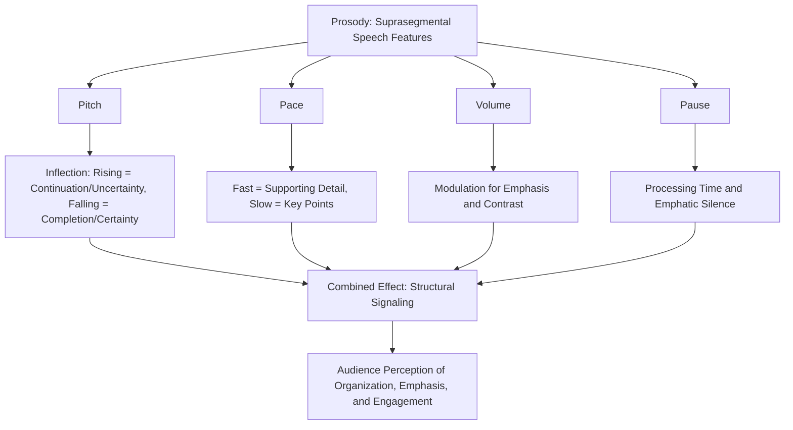

## Pitch, Pace, and Vocal Variety

### Definition and Scope

Pitch, pace, and vocal variety collectively constitute **prosody** — the suprasegmental features of speech that convey meaning, emotion, and emphasis beyond the literal semantic content of words. In executive and rhetorical communication, prosodic control functions as a distinct persuasive and comprehension-shaping tool, operating in parallel with content and argument structure rather than merely decorating it.

**Key Points**

- Prosody is processed by listeners largely automatically and often subconsciously, meaning poor prosodic control can undermine an otherwise strong argument without the audience being able to articulate exactly why
- The three elements (pitch, pace, variety) are interdependent — monotony in one dimension is rarely isolated and typically reflects a broader lack of vocal dynamism

### Pitch: Definition and Functional Role

**Pitch** refers to the perceived frequency of vocal fold vibration, physically measured in Hertz (Hz), though speakers control it through laryngeal muscle tension (primarily the cricothyroid muscle) rather than direct frequency awareness.

#### Pitch Range and Habitual Pitch

- **Habitual pitch**: the pitch level at which a speaker most frequently speaks in relaxed conversation
- **Optimal pitch**: generally considered slightly below habitual pitch in many voice-training frameworks, associated with better resonance and reduced strain, though this varies by individual vocal anatomy
- **Pitch range**: the full span between a speaker's lowest and highest usable pitch; a wider *utilized* range (not necessarily physiological maximum) is associated with perceived vocal dynamism and engagement

#### Pitch Variation (Inflection) and Meaning

Pitch movement across an utterance — inflection — carries substantial semantic and pragmatic function in English and most languages:

- **Rising inflection**: commonly associated with questions, uncertainty, or (in the case of "uptalk"/high rising terminal) can unintentionally signal tentativeness even in declarative statements
- **Falling inflection**: commonly associated with certainty, finality, and declarative authority
- **Pitch emphasis (stress)**: raising pitch on a specific word or syllable draws listener attention and signals semantic importance — this is a primary mechanism of spoken emphasis, distinct from volume-based emphasis

[Inference] In executive contexts specifically, unintentional rising inflection on declarative statements (sometimes informally termed "uptalk") is frequently perceived as undermining authority or certainty, even when the speaker's underlying confidence in the content is high — this is a documented pattern in professional communication coaching literature, though systematic experimental evidence isolating this effect from other confounding prosodic and contextual factors is less extensive than the practitioner literature suggests.

### Pace: Definition and Functional Role

**Pace** (speech rate) refers to the speed of delivery, typically measured in words per minute (WPM). Conversational English speech averages roughly 120–150 WPM, though effective public speaking pace varies considerably by context, content complexity, and audience.

#### Functional Effects of Pace

- **Too fast**: reduces audience processing time, particularly for complex or unfamiliar content; often correlates with (and can itself signal) speaker anxiety
- **Too slow**: risks audience disengagement, can read as unprepared or overly cautious, and in some contexts is perceived as condescending
- **Variable pace as a rhetorical tool**: deliberate pace shifts function as a structural and emphatic signal — slowing down for a key point, or accelerating through supporting/transitional material, guides audience attention toward what the speaker considers most important

#### Pace and Cognitive Load

Pace interacts directly with audience cognitive processing capacity:

- Complex, information-dense content generally requires slower pace to allow adequate processing time
- Familiar or emotionally resonant content can tolerate faster pace without comprehension loss, since it draws on existing schema rather than requiring effortful novel encoding
- Strategic pauses (not merely slow pace, but complete stops) provide processing time and emphasis simultaneously — functionally distinct from simply speaking more slowly throughout

**Key Points**

- Pace should vary purposefully across a speech rather than remaining uniformly fast or slow; a single fixed pace, even a "good" one, reads as monotonous over an extended duration
- Anxiety-driven pace acceleration (see the physiology of speech anxiety) is a common unconscious pattern that speakers should specifically monitor for, since sympathetic activation predisposes toward faster, shallower speech

### Vocal Variety: The Integration of Prosodic Elements

**Vocal variety** refers to the overall dynamism across pitch, pace, volume, and tone throughout a speech — the absence of monotony. It is best understood as the combined, purposeful modulation of all prosodic dimensions rather than a separate, fourth element.

#### Components Contributing to Vocal Variety

- **Pitch variation**: avoiding a flat, unvarying pitch contour
- **Pace variation**: strategic acceleration and deceleration
- **Volume variation**: modulating loudness for emphasis, contrast, and engagement (distinct from simply "being loud enough")
- **Pause variation**: strategic silence of varying length for emphasis, transition, and audience processing time
- **Vocal quality/timbre shifts**: subtle changes in resonance or vocal texture that can signal shifts in tone (e.g., a warmer, softer quality for empathetic content vs. a crisper, more clipped quality for decisive statements)

#### The Monotony Problem

Monotony — insufficient variation across these dimensions — is one of the most commonly cited delivery weaknesses in speech evaluation. Its primary negative effects:

- Reduced audience attention and retention over time (habituation to unchanging auditory stimuli)
- Difficulty distinguishing emphasized content from supporting content, since all information receives equivalent prosodic weight
- Perceived disengagement or lack of genuine investment in the content, even when the speaker's actual investment is high

**Example**

Two executives deliver identical content about a strategic pivot. The first maintains uniform pitch, pace, and volume throughout — the audience struggles to identify which points matter most, and engagement declines steadily. The second slows and lowers pitch slightly on the central strategic rationale, uses a brief pause before stating the key decision, and returns to a brisker pace for supporting operational detail — the same content is processed as more structured, confident, and memorable, without any change to the underlying argument.

### Prosody as a Structural Signaling System

A key technical function of pitch, pace, and variety is **structural signaling** — using vocal delivery to communicate the architecture of an argument independent of explicit verbal signposting ("first," "in conclusion," etc.):

- A falling pitch contour combined with a brief pause typically signals completion of a unit of thought
- Sustained or rising pitch, combined with faster pace, signals continuation or a building sequence (e.g., listing items)
- A marked pitch drop and pace deceleration on a specific phrase signals its designation as the key takeaway, functioning similarly to bold text or italics in written communication

**Key Points**

- This prosodic signaling operates largely below conscious audience awareness but measurably affects perceived clarity and organization
- Mismatched prosody — e.g., using a rising, list-continuation pattern on what is verbally framed as a conclusion — can create subtle audience confusion even when the words themselves are unambiguous

### Practical Calibration Techniques

#### Marking a Script or Notes for Prosody

Experienced speakers often annotate rehearsal scripts with explicit prosodic markers:

- Underlining words for pitch/volume emphasis
- Slash marks (/) indicating pause points
- Arrows or brackets indicating pace shifts (accelerate through supporting detail, decelerate for key points)

#### Recorded Self-Review

Because prosodic patterns (particularly habitual monotony or unconscious uptalk) are often outside a speaker's own real-time awareness, recorded playback review is one of the most effective diagnostic tools — directly paralleling its use in confidence-building and mistake-recovery contexts.

#### Contrastive Practice

Deliberately over-exaggerating pitch, pace, and volume variation in early rehearsal (beyond what will be used in actual delivery) trains the underlying vocal flexibility; the exaggerated range is then calibrated back down to a natural but still dynamic level for actual performance — a common voice-training progression from gross motor exaggeration to refined control.

### Diagram: Prosodic Elements and Their Structural Function

### Summary Table: Prosodic Element Functions

| Element | Low Variation Effect | High/Purposeful Variation Effect |
| --- | --- | --- |
| Pitch | Monotone, reduced perceived authority on key points | Clear emphasis signaling, dynamic engagement |
| Pace | Audience disengagement or processing overload | Structural signaling (supporting vs. key content) |
| Volume | Flat perceived energy, unclear emphasis | Contrast-based emphasis, sustained engagement |
| Pause | Rushed, unprocessed delivery | Emphasis, processing time, rhetorical timing |

### Common Errors

- **Uptalk on declaratives**: unintentional rising inflection undermining perceived certainty in authoritative statements
- **Anxiety-driven pace acceleration**: unconsciously speeding up under arousal, reducing audience comprehension of complex content
- **Uniform emphasis**: failing to vary pitch/volume for key points, leaving audiences unable to distinguish critical from supporting information
- **Pause avoidance**: filling all silence with speech (including filler words) rather than using strategic pause, often driven by discomfort with silence rather than a substantive delivery choice

**Next Steps**

- Breath Control and Vocal Support
- Pause Placement and Rhetorical Timing
- Articulation and Diction Precision
- Vocal Resonance and Projection
- Nonverbal Delivery: Gesture and Posture Alignment with Vocal Delivery
- Recorded Self-Review Techniques for Delivery Calibration