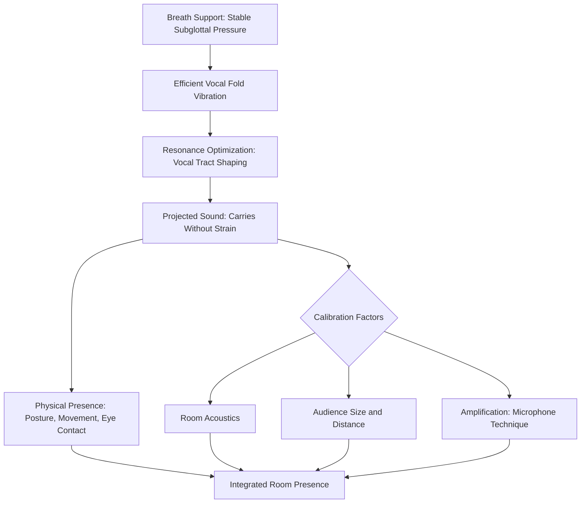

## Volume, Projection, and Room Presence

### Definition and Scope

Volume, projection, and room presence describe the speaker's capacity to produce vocal output that reaches, fills, and commands attention within a given physical or virtual space, at an intensity appropriately calibrated to that space's acoustic properties and audience size. These are related but technically distinct concepts: **volume** is perceived loudness, **projection** is the technique of producing sufficient vocal energy to carry across distance without vocal strain, and **room presence** is the broader perceptual quality of a speaker's vocal and physical energy filling and commanding a space, which depends on projection but also incorporates posture, resonance, and perceived confidence.

**Key Points**

- Projection is frequently confused with simple loudness; effective projection is a technique of efficient sound production and resonance, not merely increased vocal effort
- Room presence is a composite perceptual quality — vocal technique is necessary but not sufficient on its own, since posture, gesture, and eye contact also contribute significantly

### Acoustic and Physiological Basis of Projection

#### Sound Intensity and Distance

Sound intensity naturally diminishes with distance from the source (following an inverse-square relationship for intensity in an idealized free field, though real rooms involve reflection, absorption, and reverberation that complicate this simple model). Effective projection compensates for this attenuation not primarily through increased vocal effort but through:

- **Efficient breath support** (see breath control and vocal support): adequate, well-regulated subglottal pressure is the foundational requirement for projected sound
- **Resonance optimization**: shaping the vocal tract (pharynx, oral cavity, nasal cavity) to amplify and enrich the fundamental frequency and harmonics produced at the vocal folds, rather than relying on raw glottal effort
- **Articulatory precision**: crisp consonant articulation improves intelligibility at distance even when raw volume is held constant, since consonants carry much of the information content that becomes harder to resolve as signal degrades with distance and room noise

#### The Distinction Between Projection and Straining

A common technical error is attempting to increase perceived volume purely through increased laryngeal effort (pushing harder at the vocal fold level) rather than through improved breath support and resonance. This produces:

- Increased risk of vocal strain and fatigue
- A harsh, pressed vocal quality that is often less pleasant and, counterintuitively, sometimes less intelligible at distance than a well-resonated, properly supported voice at moderate effort
- Reduced vocal endurance across a long speaking engagement

[Inference] Because effective projection relies substantially on resonance and breath support rather than glottal effort, a speaker with strong technical breath support (see breath control and vocal support) is likely to achieve better projection with comparatively less subjective effort and lower long-term vocal strain risk than a speaker relying primarily on increased vocal fold tension to increase volume — this follows directly from the shared underlying mechanics of the two skill areas.

### Resonance and Vocal Tract Shaping

Resonance refers to the amplification and modification of the fundamental frequency produced by vocal fold vibration as it passes through the vocal tract's resonating cavities:

- **Pharyngeal resonance**: space in the throat above the larynx
- **Oral resonance**: space in the mouth, shaped by tongue and jaw position
- **Nasal resonance**: contributes to certain speech sounds and can affect perceived vocal quality when engaged excessively (producing a nasal quality) or appropriately (producing fullness in certain phonemes)

A vocal tract shaped for optimal resonance (relaxed jaw, appropriately open pharyngeal space, forward oral placement) produces a fuller, more efficiently carrying sound than a constricted vocal tract (tense jaw, retracted tongue root, closed mouth posture), independent of the raw energy invested at the glottal source.

**Key Points**

- Tension in the jaw, tongue, and neck — often elevated under the muscular tension associated with speech anxiety (see the physiology of speech anxiety) — directly interferes with resonance optimization, meaning anxiety management and vocal projection technique are mechanically linked
- Speakers are often unaware of habitual tension patterns that constrain resonance; targeted relaxation exercises (jaw release, gentle neck stretches) are frequently incorporated into vocal warm-up routines for this reason

### Calibrating Volume to Room and Audience

Effective volume calibration requires assessment of several situational factors:

#### Room Acoustic Properties

- **Reverberant spaces** (large halls, spaces with hard surfaces): require slower pace and more deliberate articulation to avoid words blurring together as reflected sound overlaps with direct sound
- **Acoustically dampened spaces** (carpeted rooms, spaces with soft furnishings, small conference rooms): absorb sound more readily, generally requiring less raw volume but potentially more deliberate projection to avoid a "flat" or absorbed vocal quality
- **Amplified settings** (microphone use): require recalibrated volume expectations, since the speaker's natural volume compensation instincts (developed for unamplified speech) can produce distorted or overly loud amplified sound

#### Audience Size and Distance

- Larger audiences and greater speaker-to-back-row distance require more projection, whether through natural vocal technique or amplification
- Virtual/video conferencing contexts (a highly relevant setting in executive communication) require a distinct recalibration: microphone proximity often means that natural projection techniques, if applied unchanged, can produce audio distortion or perceived aggressiveness — see additional discussion below

#### Microphone Technique

When amplification is available, technique differs substantially from unamplified projection:

- Consistent mouth-to-microphone distance prevents fluctuating volume levels
- Reduced reliance on raw projection, since the microphone handles distance compensation — attempting full unamplified-style projection into a sensitive microphone can produce distortion or an overly aggressive perceived tone
- Awareness of plosive sounds (p, b, t) which can produce audible popping on certain microphone types, generally mitigated through slight off-axis positioning or pop filters

**Example**

An executive accustomed to projecting across a large all-hands meeting room delivers a videoconference presentation using the same vocal energy and volume calibrated for the larger room. The lavalier or laptop microphone, positioned close to the speaker, picks up this level as excessively loud and potentially distorted, while also reading as unusually intense or aggressive to remote viewers accustomed to more moderate conversational volume in video calls — illustrating that room presence must be recalibrated per medium, not simply maximized universally.

### Room Presence: Integration Beyond Pure Vocal Technique

Room presence extends beyond vocal projection to encompass the full perceptual package of a speaker's commanding quality in a space:

#### Physical Contributors

- **Posture and stance**: an open, grounded stance (see physical/proprioceptive grounding techniques) contributes to perceived presence independent of vocal quality
- **Spatial use**: deliberate, purposeful movement (as opposed to nervous pacing or static rigidity) can extend a speaker's perceived presence across a physical space
- **Eye contact and gaze management**: sweeping engagement across an audience (rather than fixed on notes or a single point) reinforces the perception that the speaker's attention and presence extend across the full room

#### Vocal-Physical Integration

Room presence is strongest when vocal projection and physical presence are congruent — a speaker with strong vocal projection but closed, static posture, or conversely strong physical presence with weak, underprojected vocal delivery, produces an incongruent overall impression that undermines the perceived command of the space.

**Key Points**

- Room presence is not reducible to volume; a quieter, well-resonated, confidently delivered statement can command more attention than a loud but poorly supported or physically incongruent one
- This is particularly relevant in executive contexts where excessive volume can be misread as aggression or lack of composure, whereas well-calibrated presence signals authority without requiring maximal loudness

### Warm-Up and Preparation for Projection

Given the physiological basis of projection in breath support, resonance, and reduced tension, effective preparation typically includes:

- **Physical release**: gentle jaw, neck, and shoulder stretches to reduce tension that constrains resonance
- **Breath support activation**: the sustained hiss/vowel exercises described in breath control training, specifically activating the diaphragmatic-abdominal support system before projecting
- **Resonance warm-ups**: humming exercises or gentle vocal glides (sirens) that engage resonating cavities progressively before full-volume speech
- **Room-specific calibration**: when possible, testing actual vocal projection in the specific room or with the specific microphone setup prior to the actual speaking event, since acoustic properties vary substantially by venue

### Diagram: Projection Mechanism and Room Presence Integration

### Common Errors

- **Straining instead of supporting**: increasing perceived volume through glottal effort rather than breath support and resonance, risking vocal fatigue and strain
- **Uniform volume calibration across mediums**: applying in-person projection habits unchanged to amplified or virtual settings, producing distortion or perceived over-intensity
- **Neglecting physical congruence**: strong vocal projection undermined by closed or static physical posture, producing an incongruent overall presence
- **Skipping warm-up**: attempting maximal projection without preparatory resonance and tension-release work, increasing strain risk particularly in back-to-back or lengthy speaking engagements

**Next Steps**

- Breath Control and Vocal Support
- Pitch, Pace, and Vocal Variety
- Vocal Warm-Up Routines for Speaking Professionals
- Microphone Technique for Virtual and Hybrid Presentations
- Nonverbal Delivery: Posture, Gesture, and Spatial Presence
- Vocal Health and Fatigue Management for Frequent Speakers