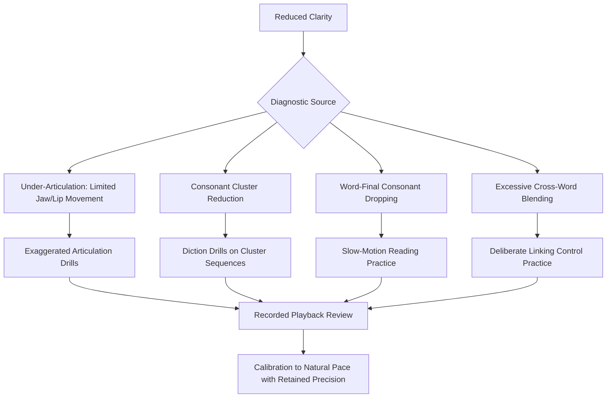

## Articulation, Enunciation, and Clarity

### Definition and Scope

Articulation, enunciation, and clarity concern the precision with which a speaker produces the individual speech sounds (phonemes) and sound sequences of language, determining how accurately and effortlessly an audience can decode spoken content. While often used interchangeably in casual usage, these terms carry distinct technical meanings in speech pedagogy:

- **Articulation**: the physical, mechanical process of shaping speech sounds using the articulators (tongue, lips, teeth, soft palate, jaw)
- **Enunciation**: the clarity and distinctness with which articulated sounds are produced in connected speech, particularly under the pressures of natural speech rate
- **Clarity**: the overall listener-perceived intelligibility outcome, which depends on articulation and enunciation but is also affected by pace, volume, and acoustic environment (see volume, projection, and room presence)

**Key Points**

- Poor articulation is not simply "talking too fast" — it is a distinct mechanical issue involving incomplete or imprecise movement of the articulators, though rushed pace frequently exacerbates it
- Clarity failures disproportionately affect audience comprehension of information-dense or unfamiliar content, since listeners have less redundant contextual information to fall back on when phonetic signal degrades

### The Articulatory System

#### Primary Articulators

- **Tongue**: the most mobile and versatile articulator, responsible for the majority of consonant and vowel distinctions through position (front/back, high/low) and shape
- **Lips**: control labial sounds (p, b, m) and rounding for certain vowels; lip precision is often specifically deficient in speakers with habitually minimal mouth movement
- **Jaw**: provides the vertical space needed for vowel resonance and consonant articulation; insufficient jaw movement ("mumbling") is one of the most common sources of reduced clarity
- **Soft palate (velum)**: controls the nasal/oral resonance distinction, raising to block nasal airflow for non-nasal sounds and lowering for nasal consonants (m, n, ng)
- **Teeth and alveolar ridge**: provide contact points for numerous consonants (t, d, s, z, and others)

#### Places and Manners of Articulation

Consonant sounds are technically classified by:

- **Place of articulation**: where in the vocal tract the primary constriction occurs (bilabial, labiodental, alveolar, velar, glottal, etc.)
- **Manner of articulation**: how airflow is modified (stops/plosives, fricatives, affricates, nasals, liquids, glides)

Precision failures often cluster around specific places or manners — for example, incomplete alveolar contact producing indistinct t/d sounds, or insufficient labiodental constriction producing weak f/v distinctions.

**Key Points**

- Understanding the specific mechanical basis of a clarity issue (rather than a vague sense of "unclear speech") allows targeted corrective practice, since different sound categories require different articulator adjustments
- Most clarity issues in adult speakers are habitual/mechanical (insufficient movement range under normal speech rate) rather than structural/anatomical, and are generally trainable through targeted practice

### Common Sources of Reduced Clarity

#### Under-Articulation ("Mumbling")

Insufficient range of articulator movement, particularly limited jaw drop and lip movement, producing consonants and vowels that blend together without distinct boundaries. Often exacerbated by:

- Habitual minimal-movement speech patterns developed over years of casual conversational speech (where context and shared knowledge compensate for reduced clarity)
- Anxiety-driven muscular tension in the jaw (see the physiology of speech anxiety), which paradoxically restricts articulator range of motion rather than increasing precision

#### Consonant Cluster Reduction

Simplification or dropping of complex consonant sequences (e.g., "asked" reduced toward "ast" or "ax," "facts" reduced toward "fax"), common in rapid casual speech but a significant clarity liability in formal or high-stakes contexts, particularly for less familiar or technical vocabulary.

#### Word-Final Consonant Dropping

Failure to fully articulate word-final consonants, particularly stops (t, d, k, g) and nasals, which can obscure grammatical information (tense markers, plurals) as well as overall word identity.

#### Linking and Blending Across Word Boundaries

Natural connected speech involves systematic sound changes across word boundaries (assimilation, linking) that are a normal feature of fluent speech, but excessive or unclear blending — as opposed to the more deliberate, controlled linking used by trained speakers — can reduce word-boundary clarity for listeners, particularly in unfamiliar or technical phrasing.

**Example**

A speaker delivering a technical briefing habitually drops the final consonant in words like "risk" and "impact," and rapidly blends consonant clusters in phrases like "next quarter's" toward an indistinct string of sound. In casual conversation with familiar colleagues, context compensates and comprehension is unaffected. In a formal briefing to an unfamiliar audience, the same pattern produces genuine comprehension gaps on key technical terms — illustrating that habitual articulation patterns which are functionally adequate in low-stakes, high-context settings often become liabilities in exactly the high-stakes, information-dense settings where precision matters most.

### Articulation Exercises and Training Techniques

#### Diction Drills

Repetition of phonetically challenging sequences (tongue twisters, minimal pairs, consonant cluster sequences) at controlled, then progressively increasing, speed — building the motor precision needed to maintain clarity even as natural speech rate increases. Classic examples (e.g., repeated practice of sequences emphasizing specific consonant clusters) are widely used in actor and broadcaster training specifically because they isolate and exercise particular articulatory movements.

#### Exaggerated Articulation Practice

Deliberately over-articulating (exaggerated jaw drop, lip movement, and consonant precision) during rehearsal, beyond what will be used in actual delivery — a technique paralleling the contrastive practice method used for pitch/pace/volume training (see pitch, pace, and vocal variety). The exaggerated range is calibrated back to a natural but still precise level for performance, following the general motor-learning principle of training beyond the target range before refining down to it.

#### Slow-Motion Reading

Reading rehearsal material at a deliberately slow pace with full, precise articulation of every sound, including word-final consonants and consonant clusters — building the underlying articulatory precision before gradually returning to natural speaking pace, which otherwise tends to reintroduce habitual under-articulation patterns.

#### Recorded Playback Review

As with prosodic and delivery calibration generally (see pitch, pace, and vocal variety; recovering composure after a mistake), recorded self-review is a primary diagnostic tool, since habitual articulation patterns are frequently below a speaker's own conscious awareness — a speaker rarely perceives their own mumbling as such, since they possess full internal knowledge of intended content that a naive listener lacks.

**Key Points**

- Articulation training should progress from slow, exaggerated precision toward natural pace, rather than attempting to correct clarity at full conversational speed from the outset
- Targeted practice on specific problem sound categories (identified through recorded review or external feedback) is more efficient than generic "speak more clearly" practice without diagnostic specificity

### Clarity Under Pace and Cognitive Load

Articulatory precision is not a fixed trait but interacts dynamically with speaking conditions:

- **Increased pace** generally reduces available time for full articulator movement, disproportionately affecting complex consonant clusters and word-final sounds
- **Increased cognitive load** (unfamiliar content, live improvisation, high-stakes pressure) can reduce attentional resources available for monitoring and maintaining articulatory precision, particularly for speakers whose clear articulation is not yet fully automatized (procedural) — directly paralleling the controlled-to-automatic processing shift discussed in confidence-building and repetition
- **Anxiety-driven muscular tension** (see the physiology of speech anxiety) specifically constrains jaw and tongue range of motion, mechanically interfering with articulatory precision independent of any cognitive/attentional effects

[Inference] Because articulatory precision under pressure depends substantially on the degree to which clear articulation has become automatized through repetition, speakers preparing for high-stakes, high-cognitive-load presentations likely benefit from over-practicing clarity specifically on technical or unfamiliar vocabulary segments, where the combination of low automaticity (unfamiliar words) and high cognitive load is most likely to produce clarity breakdown.

### Distinguishing Articulation Issues from Accent and Dialect Variation

A critical distinction in professional and educational contexts: articulation *precision* issues (mechanical imprecision reducing intelligibility) are technically and pedagogically distinct from **accent or dialect variation** (systematic, rule-governed phonological differences associated with regional, national, or linguistic background). Effective clarity coaching targets the former without pathologizing or attempting to eliminate the latter, since accent and dialect variation are linguistically legitimate and are not inherently clarity deficits.

**Key Points**

- Clarity training should focus on precision and intelligibility (fully realized, distinct articulation within a speaker's natural accent/dialect) rather than accent modification or neutralization, which is a separate and more contested undertaking with different professional, ethical, and linguistic considerations
- A speaker with a strong regional or non-native accent can achieve excellent clarity through precise, well-executed articulation within that accent; conversely, a speaker with a "neutral" or prestige-associated accent can still suffer from poor clarity through under-articulation

### Diagram: Sources and Remediation of Clarity Issues

### Summary Table: Articulation Issue Types and Targeted Remediation

| Issue Type | Mechanical Cause | Targeted Exercise |
| --- | --- | --- |
| Mumbling / general under-articulation | Limited jaw and lip movement range | Exaggerated articulation drills |
| Consonant cluster reduction | Simplified complex sound sequences under pace pressure | Diction drills on specific clusters |
| Word-final consonant dropping | Incomplete articulator contact/closure at word end | Slow-motion reading with full final-consonant emphasis |
| Unclear word-boundary blending | Excessive assimilation/linking under natural speech rate | Deliberate, controlled linking practice |

**Next Steps**

- Breath Control and Vocal Support
- Pitch, Pace, and Vocal Variety
- Volume, Projection, and Room Presence
- Vocal Warm-Up Routines for Speaking Professionals
- Clarity in Technical and Data-Heavy Executive Communication
- Recorded Self-Review Techniques for Delivery Calibration