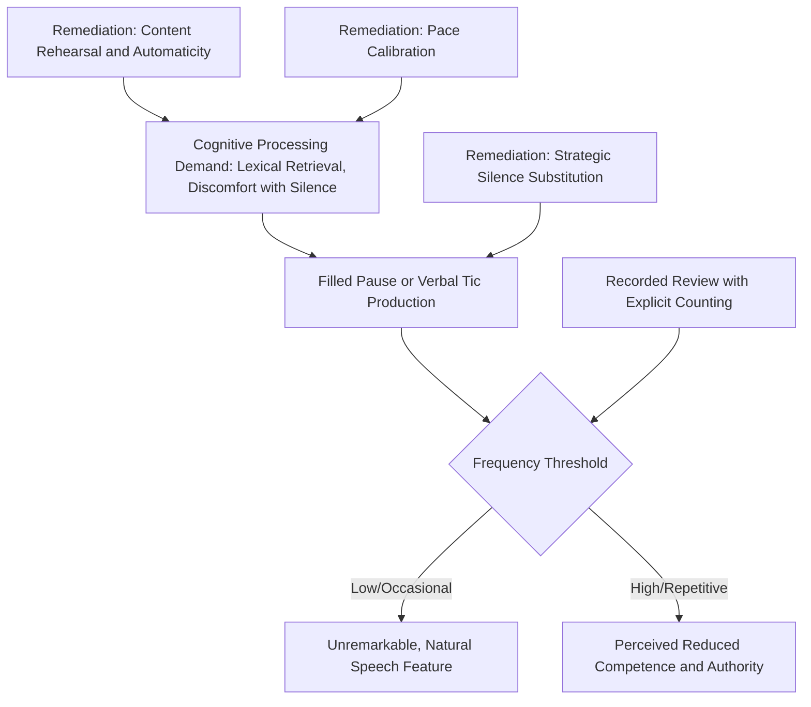

## Eliminating Filler Words and Verbal Tics

### Definition and Scope

Filler words and verbal tics are non-lexical or semantically empty vocalizations and phrases inserted into speech, typically during moments of cognitive processing, hesitation, or discomfort with silence. Linguists classify these primarily as **filled pauses** (non-lexical: "um," "uh," "er") and **discourse markers/verbal tics** (lexical but semantically redundant: "like," "you know," "basically," "so," "right?," "actually"). While filled pauses and verbal tics serve genuine cognitive and social functions in natural speech, their overuse in formal, executive, or persuasive contexts measurably degrades perceived competence, authority, and message clarity.

**Key Points**

- Filler words are not inherently pathological or a sign of poor speaking ability — they serve real cognitive-processing functions in natural speech production
- The concern in executive/rhetorical contexts is one of *frequency and context-appropriateness*, not elimination of an inherently flawed behavior — the goal is contextual calibration, not clinical avoidance

### The Cognitive Function of Filled Pauses

Filled pauses ("um," "uh") are not random noise; psycholinguistic research indicates they serve a genuine function in speech production planning:

- **Lexical retrieval buffering**: filled pauses frequently occur immediately before less predictable, lower-frequency, or more cognitively demanding words, suggesting they mark real-time lexical search and retrieval processes
- **Turn-holding function**: in conversational contexts, filled pauses can signal to listeners that the speaker intends to continue and has not finished their turn, distinct from a silent pause that might invite interruption
- **Processing load indicator**: increased filled-pause frequency correlates with increased cognitive load, unfamiliar content, or reduced automaticity (directly connecting to the controlled-vs-automatic processing distinction discussed in confidence-building through repetition)

[Inference] Because filled pauses appear to correlate with genuine lexical retrieval demand, a reduction in filler frequency achieved through content rehearsal and automaticity (rather than through effortful suppression alone) is likely to be more durable and less effortful to sustain under the additional cognitive load of live, high-stakes delivery than suppression attempted without addressing the underlying retrieval-difficulty cause.

### Why Filler Frequency Matters in Executive and Rhetorical Contexts

Despite their natural cognitive function, excessive filler word usage carries measurable perceptual costs in formal and persuasive communication:

- **Perceived competence and preparation**: high filler frequency is commonly associated by listeners with inadequate preparation or uncertainty about content, regardless of the speaker's actual underlying competence
- **Perceived confidence and authority**: verbal tics in particular (hedging phrases like "I think," "sort of," "kind of," excessive "just") can function as **linguistic hedges** that measurably soften the perceived force of a claim — a documented pattern in the sociolinguistics and gender-and-language literature on hedging and assertiveness in professional speech
- **Message dilution**: filler words and semantically empty discourse markers add processing burden for listeners without contributing information, subtly reducing message density and clarity, particularly in information-dense executive communication where audience attention is a limited resource
- **Credibility erosion under repetition**: a filler word or verbal tic used occasionally is unlikely to be consciously registered by an audience; the same filler used with high frequency becomes increasingly salient and can become a distraction that competes with content for audience attention

**Key Points**

- The perceptual cost of fillers is nonlinear — a single "um" is unremarkable, but a pattern of frequent, repeated use crosses a threshold where the pattern itself, rather than the content, becomes the salient feature of the speaker's delivery
- Hedging verbal tics carry an additional, distinct cost beyond simple disfluency: they can substantively weaken the rhetorical force of a claim (a logos/ethos-relevant concern, see rhetorical analysis of appeals), not merely signal disfluency

### Categorizing Common Filler Types

#### Non-Lexical Filled Pauses

"Um," "uh," "er," "ah" — pure vocalized hesitation with no independent semantic content.

#### Lexical Discourse Markers (Verbal Tics)

- **Hedging tics**: "sort of," "kind of," "I think," "maybe," "just" (used as a minimizer, e.g., "I just wanted to mention...")
- **Redundant connectors**: "so," "and so," "basically," "actually," used habitually at clause boundaries without genuine connective function
- **Solidarity/checking tics**: "you know," "right?," "does that make sense?" used reflexively rather than as genuine audience-checking
- **Intensifiers overused as filler**: "literally," "really," "very" deployed habitually rather than for genuine emphasis

#### Repetitive Phrasal Patterns

Habitual repetition of a specific phrase or sentence-starter across a speech (e.g., beginning multiple consecutive points with "So what I would say is...") — a pattern-level tic distinct from single-word fillers, often less consciously noticed by the speaker but similarly salient to an attentive audience.

**Example**

A speaker reviewing a recorded rehearsal counts eleven instances of "so" used as a sentence-opener across a five-minute segment, most with no logical-connective function (not signaling actual causation or conclusion) but functioning purely as a habitual transition filler. Isolating and quantifying this specific pattern — rather than a vague sense of "I use filler words" — allows targeted correction.

### Remediation Techniques

#### Recorded Self-Review with Explicit Counting

As with other delivery elements (see pitch/pace/variety, articulation), recorded playback is the primary diagnostic tool, since filler usage is frequently below conscious awareness during live delivery. Explicit counting of specific filler types over a rehearsal segment provides concrete, trackable data for improvement, more actionable than a general impression of "I use too many fillers."

#### Strategic Silence Substitution

Replacing the impulse to fill a hesitation gap with vocalized sound by substituting **silence** instead — a brief, deliberate pause is generally perceived by audiences as more composed and confident than a filled pause, directly connecting to the pause-as-rhetorical-tool concept discussed in pitch, pace, and vocal variety.

- This requires building tolerance for silence, since discomfort with silence (rather than genuine processing need) is a significant driver of habitual filler use
- Reframing silence as a rhetorical asset (processing time for the audience, emphasis) rather than a failure to be immediately avoided supports this substitution

#### Addressing the Underlying Retrieval-Difficulty Cause

Since filled pauses correlate with genuine lexical/content retrieval demand, increasing content automaticity through rehearsal and repetition (see building confidence through preparation and repetition) reduces the underlying cognitive trigger for filler production, rather than only suppressing its surface expression.

#### Slowing Overall Pace

Speakers who habitually speak faster than their content-retrieval speed can sustain often produce more fillers as a byproduct of outrunning their own cognitive processing capacity; deliberately reducing pace (see pitch, pace, and vocal variety) can reduce filler frequency as a secondary effect, by better matching speech rate to retrieval speed.

#### Targeted Practice with Immediate Feedback

Live practice sessions (with a coach, peer, or recording device) using an explicit interruption or marking signal each time a target filler occurs, building conscious real-time awareness that gradually shifts toward automatic suppression with sustained practice — consistent with general motor/behavioral learning principles of feedback-driven habit modification.

**Key Points**

- Effective remediation combines surface-level substitution techniques (silence for filler) with root-cause techniques (rehearsal-driven automaticity, pace calibration), since surface suppression alone is often difficult to sustain under the cognitive load of live delivery
- Complete elimination is neither a realistic nor necessary goal; occasional, low-frequency filler use is a normal feature of natural, non-robotic speech — over-correction toward completely filler-free delivery can itself read as unnaturally rehearsed or stilted

### Contextual Calibration: When Some Filler Tolerance Is Appropriate

- **Extemporaneous or Q&A contexts**: genuine real-time processing demand is higher than in fully rehearsed delivery, and audiences generally extend more tolerance for occasional filled pauses in visibly spontaneous speech
- **Highly rehearsed, scripted delivery**: filler tolerance is lower, since audiences implicitly expect greater fluency in prepared remarks, making filler occurrence more salient and potentially more damaging to perceived preparation
- **Cultural and linguistic variation**: filler word norms and their perceptual costs vary across languages and speech communities; [Unverified] the specific perceptual thresholds and hedging-language costs documented in the English-language sociolinguistic literature may not generalize directly to all cross-cultural or multilingual executive communication contexts without further contextual verification

### Diagram: Filler Word Cause and Remediation Pathway

### Summary Table: Filler Types and Targeted Remediation

| Filler Type | Example | Primary Remediation |
| --- | --- | --- |
| Non-lexical filled pause | "um," "uh" | Silence substitution; content automaticity via rehearsal |
| Hedging tic | "sort of," "I think," "just" | Deliberate rephrasing toward direct, assertive phrasing |
| Redundant connector | "so," "basically," "actually" | Conscious monitoring; recorded review with counting |
| Solidarity/checking tic | "you know," "right?" | Targeted practice with feedback signal |
| Repetitive phrasal pattern | Repeated sentence-starter | Script/notes variation review prior to delivery |

**Next Steps**

- Building Confidence Through Preparation and Repetition
- Pitch, Pace, and Vocal Variety: Strategic Pause Use
- Recorded Self-Review Techniques for Delivery Calibration
- Hedging Language and Assertiveness in Executive Communication
- Handling Extemporaneous Speech and Q&A Fluency
- Articulation, Enunciation, and Clarity