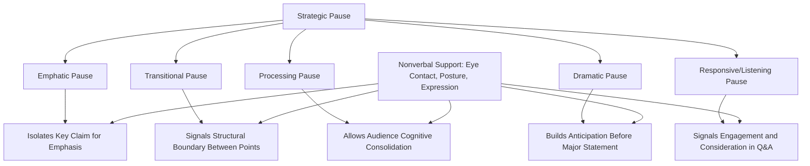

## Strategic Use of Pause and Silence

### Definition and Scope

Strategic use of pause and silence refers to the deliberate insertion of silent intervals within speech delivery to serve rhetorical, cognitive, and physiological functions — as distinct from unplanned silence resulting from hesitation, error, or lost train of thought (see recovering composure after a mistake). While pause has already appeared as a component within several adjacent topics (breath support, prosody, filler-word remediation), this topic treats silence itself as a distinct, positive delivery tool with its own technical taxonomy and application principles, rather than merely the absence of speech.

**Key Points**

- Silence is not a delivery gap to be minimized but an active rhetorical resource with specific functions unavailable to continuous speech
- The perceptual experience of pause length differs substantially between speaker and audience — pauses that feel uncomfortably long to the speaker are frequently perceived by the audience as normal, deliberate, or even too brief, directly paralleling the self-perception gap discussed in confidence-building literature

### Taxonomy of Pause Types

#### The Emphatic Pause

A brief silence placed immediately before or after a key word, phrase, or claim, isolating it from surrounding content and signaling its heightened importance. Functions analogously to bold or italic text in written communication — a purely prosodic emphasis mechanism operating independent of word choice or volume.

#### The Transitional Pause

A pause marking the boundary between structural units of a speech (between main points, between an introduction and body, before a conclusion). Functions as an auditory signpost, allowing the audience to mentally close one unit of content and prepare for the next, without requiring explicit verbal signposting language ("moving on to my next point").

#### The Processing Pause

A pause inserted after presenting complex, information-dense, or unfamiliar content, providing the audience time to cognitively process what has just been said before additional content is introduced. This is distinct from emphasis — its primary function is managing audience cognitive load rather than signaling importance per se, though the two functions often overlap in practice.

#### The Dramatic Pause

An extended pause (longer than typical emphatic or transitional pauses) used to build anticipation before a significant statement, reveal, or conclusion. Requires confident calibration, since an overextended dramatic pause risks reading as a lost train of thought rather than a deliberate rhetorical device — the distinction is carried largely by the speaker's physical composure and eye contact during the pause, which signal control rather than disruption.

#### The Responsive/Listening Pause

A pause taken after a question (particularly in Q&A) or after making a claim that anticipates audience reaction, signaling genuine consideration or space for the moment to register — functioning as a marker of engagement and thoughtfulness rather than of speech production difficulty.

**Key Points**

- Different pause types are distinguished less by objective duration and more by placement, surrounding delivery cues (eye contact, posture, preceding/following content), and audience-perceived intent
- A pause of similar length can function as either emphatic, transitional, or dramatic depending entirely on its structural placement within the surrounding discourse

### Physiological and Cognitive Functions of Pause

Beyond pure rhetorical signaling, strategic pause serves several underlying functions connecting to prior physiological and cognitive topics:

- **Breath replenishment**: a well-placed pause at a natural syntactic boundary allows for a supported diaphragmatic breath (see breath control and vocal support), integrating physiological necessity with rhetorical function rather than treating them as competing demands
- **Cognitive reset for the speaker**: a brief pause provides the speaker a moment to mentally retrieve upcoming content or recover composure after a minor disruption, functioning as the foundational mechanism in mistake recovery (see recovering composure after a mistake)
- **Audience cognitive processing**: as noted in the processing pause category, silence allows working-memory consolidation of just-presented information before additional content competes for the same limited processing resources
- **Filler word displacement**: silence functions as the primary substitute for filled pauses and verbal tics (see eliminating filler words and verbal tics), replacing an audible hesitation marker with a rhetorically purposeful silence

[Inference] Because pause serves overlapping physiological, cognitive, and rhetorical functions simultaneously, well-placed strategic pauses likely provide compounding benefit relative to their apparent simplicity — a single well-timed pause can support breath, aid speaker composure, structure audience comprehension, and provide emphasis concurrently, which may explain why pause is consistently identified across multiple independent areas of delivery training as a high-leverage technique.

### Duration Calibration

Pause duration is context-dependent, and general calibration guidelines (subject to speaker, content, and audience variation) include:

| Pause Type | Approximate Duration | Primary Risk of Miscalibration |
| --- | --- | --- |
| Micro-pause (breath/phrasing) | Under 1 second | Too frequent: choppy, fragmented delivery |
| Emphatic pause | 1-2 seconds | Too brief: emphasis not registered; too long: reads as hesitation |
| Transitional pause | 1-3 seconds | Too brief: structural boundary unclear; too long: loses momentum |
| Dramatic pause | 2-4+ seconds | Miscalibration toward "lost train of thought" without composed body language |

[Unverified] These duration ranges reflect commonly cited applied public-speaking coaching guidance rather than a single, universally validated experimental standard; optimal pause duration likely varies meaningfully by individual speaker delivery style, audience size, content complexity, and cultural/linguistic norms around conversational silence tolerance.

**Key Points**

- Speakers new to strategic pausing consistently underestimate how long they can pause before it registers as uncomfortable to an audience, since subjective time perception under the mild arousal of live speaking tends to dilate relative to actual elapsed time
- Calibration is best developed through recorded rehearsal review (see recorded self-review methodology discussed across delivery topics), timing actual pause durations against subjective experience to correct this perceptual gap

### Nonverbal Support During Pause

A pause's rhetorical effectiveness depends substantially on accompanying nonverbal behavior, since silence alone, without composed physical signaling, risks ambiguity between "deliberate pause" and "disruption":

- **Maintained eye contact**: sustaining audience engagement during silence signals control and intentionality rather than searching or hesitation
- **Stable posture**: avoiding fidgeting, looking down, or shifting weight during a pause, which would signal discomfort rather than command
- **Facial expression congruence**: an expression consistent with the content's tone (thoughtful, serious, anticipatory) reinforces the pause's intended rhetorical function

**Example**

A speaker delivering a key strategic recommendation states the recommendation, then pauses for approximately two seconds while maintaining direct eye contact across the room and a composed, steady posture, before continuing to the supporting rationale. The pause is registered by the audience as deliberate emphasis. If the same speaker instead broke eye contact, glanced at notes, and shifted weight during an identical two-second silence, the same duration would likely be read as uncertainty or a momentary loss of place rather than intentional emphasis — illustrating that pause function is carried jointly by duration and nonverbal congruence, not duration alone.

### Common Errors in Pause Application

- **Insufficient pause after key statements**: rushing immediately from an important claim into supporting content, undermining the emphasis the claim deserves
- **Pause avoidance driven by silence discomfort**: filling all potential pause space with continuous speech or filler words (see eliminating filler words and verbal tics), often rooted in the same discomfort with silence that drives habitual filler use
- **Miscalibrated dramatic pause**: overextending a dramatic pause without corresponding composed body language, causing it to read as disruption rather than deliberate device
- **Uniform pause application**: using pause length and placement identically throughout a speech regardless of structural or emphatic function, reducing pause's differentiating rhetorical value
- **Pause during genuinely uncertain moments without composure signals**: using pause as a cover for genuine loss of content recall without the accompanying nonverbal composure that distinguishes strategic pause from visible struggle

### Diagram: Pause Type Application by Rhetorical Function

### Integration Across Delivery Domains

Strategic pause functions as a connective thread across multiple delivery skill areas already covered:

- Interacts with **breath support** by aligning physiological breath needs with rhetorical structure
- Interacts with **pitch, pace, and vocal variety** as one of the core prosodic elements alongside pitch and pace variation
- Serves as the primary substitute technique in **filler word elimination**
- Provides the foundational recovery mechanism in **mistake recovery** during live delivery
- Functions as a **coping imagery** rehearsal element in **visualization and mental rehearsal**, since rehearsing pause insertion (including recovery pauses) builds automaticity for live use

**Next Steps**

- Eliminating Filler Words and Verbal Tics
- Pitch, Pace, and Vocal Variety
- Breath Control and Vocal Support
- Nonverbal Delivery: Eye Contact and Posture During Speech
- Recovering Composure After a Mistake
- Q&A Delivery and Responsive Pause Technique