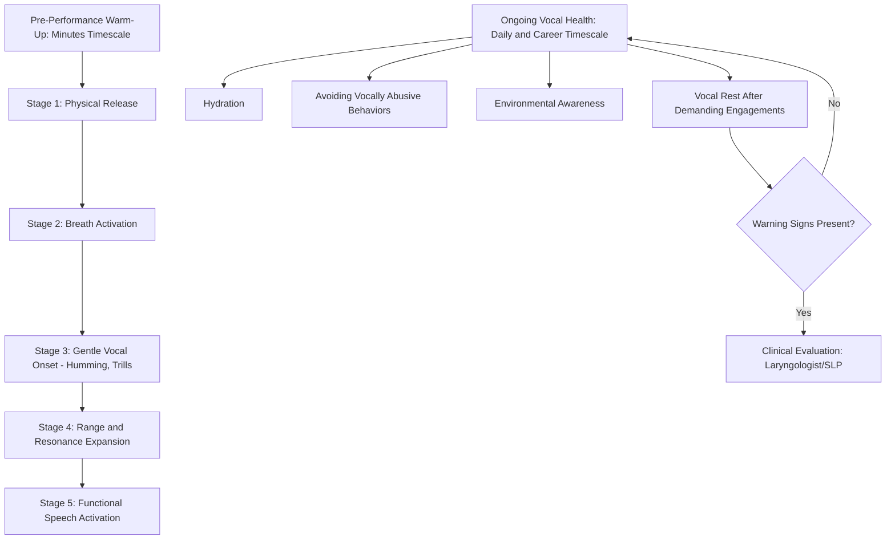

## Vocal Warm-Ups and Vocal Health

### Definition and Scope

Vocal warm-ups and vocal health encompass the preparatory physical routines used to ready the voice for demanding speaking engagements, and the broader set of practices that preserve vocal function and prevent injury across a speaking career. This topic addresses the voice as a physiological instrument subject to fatigue, strain, and potential pathology — a perspective distinct from, but foundational to, the technique-focused topics of breath support, projection, and articulation covered elsewhere in this chapter.

**Key Points**

- The voice is produced by living tissue (vocal folds) capable of both temporary fatigue and, with sustained misuse, lasting pathological change — this distinguishes vocal health from purely technical delivery skills
- Professionals with heavy speaking loads (executives with frequent presentations, frequent public speakers) face elevated cumulative vocal strain risk relative to occasional speakers, warranting more systematic warm-up and maintenance practice

### Physiological Basis: Why Warm-Up Matters

The vocal folds are composed of layered tissue (epithelium, superficial lamina propria, vocal ligament, and muscle) that vibrates hundreds of times per second during phonation. Like other tissues involved in repetitive physical activity, vocal fold tissue benefits from gradual preparation before intensive use:

- **Increased blood flow**: gradual vocal engagement increases blood flow to the laryngeal muscles and surrounding tissue, similar to physical warm-up principles in broader exercise physiology
- **Mucosal lubrication**: warm-up vocalization stimulates mucus production that lubricates the vocal fold surface, reducing friction-based irritation during vibration
- **Progressive range activation**: gradually engaging pitch and volume range before demanding full range immediately reduces the risk of strain associated with sudden, unprepared maximal vocal effort
- **Neuromuscular coordination priming**: warm-up activates the coordinated muscular patterns (breath support, resonance shaping, articulator engagement) that underlie efficient, non-strained vocal production, consistent with general motor-learning principles of progressive activation before peak demand

[Inference] Because vocal fold tissue is living, vascularized tissue subject to the same general principles of gradual load progression that apply to other soft tissue and muscle groups in exercise physiology, skipping warm-up before demanding vocal use likely elevates acute strain risk in a manner broadly analogous to skipping warm-up before intensive physical exercise, though the vocal-fold-specific research base is smaller than the general exercise physiology literature this inference draws upon.

### Structured Vocal Warm-Up Sequence

Effective vocal warm-up typically progresses from low-effort, low-range exercises toward the full range and effort level needed for actual performance:

#### Stage 1: Physical Release

- Gentle neck rolls and shoulder shrugs to release accessory muscle tension that can constrain both breath support and resonance
- Jaw release exercises (gentle jaw drops, massaging the masseter muscles) to reduce jaw tension that restricts articulation and resonance
- Tongue stretches and gentle tongue-tip trills to release tongue-root tension

#### Stage 2: Breath Activation

- Diaphragmatic breathing exercises (see breath control and vocal support) to activate the support system before adding vocal fold engagement
- Sustained hiss or sibilant exercises to establish controlled exhalation pacing

#### Stage 3: Gentle Vocal Onset

- Humming exercises, which engage the vocal folds with minimal effort and strong nasal/facial resonance feedback, providing a low-strain entry point into phonation
- Lip trills or tongue trills combined with pitch glides (sirens), which distribute airflow and reduce the risk of direct vocal fold impact stress while still engaging the full pitch range

#### Stage 4: Range and Resonance Expansion

- Pitch glides across increasing portions of the speaker's range, moving gradually from a comfortable mid-range toward higher and lower extremes
- Sustained vowel exercises at varying pitch levels, monitoring for consistent quality without strain

#### Stage 5: Functional Speech Activation

- Reading aloud at a moderate pace and volume, gradually increasing toward the volume and energy level required for actual performance
- Articulation drills (see articulation, enunciation, and clarity) to engage precise articulator movement before live delivery

**Key Points**

- The overall progression — physical release, breath, gentle phonation, range expansion, functional speech — mirrors general exercise warm-up principles (mobility, activation, progressive loading) applied to the vocal mechanism specifically
- Full warm-up sequences typically require 5-15 minutes depending on the demands of the upcoming speaking engagement and the individual speaker's baseline vocal condition

### Vocal Health Maintenance Practices

Beyond immediate pre-performance warm-up, sustained vocal health depends on broader daily and lifestyle practices:

#### Hydration

Adequate systemic hydration supports vocal fold mucosal lubrication; the vocal folds are avascular at the surface layer and depend substantially on adequate hydration for optimal vibratory function. [Unverified] While hydration is broadly recognized as relevant to vocal health in the voice science and speech-language pathology literature, effect sizes and specific hydration protocols vary across studies, and hydration should be understood as one contributing factor among several rather than a standalone solution to vocal strain concerns.

#### Vocal Rest

Periods of reduced or eliminated vocal use following unusually demanding speaking engagements allow vocal fold tissue recovery time, analogous to rest periods following intensive physical exertion in other muscle groups.

#### Avoiding Vocally Abusive Behaviors

- **Throat clearing**: forceful, repeated throat clearing produces direct vocal fold impact trauma; sipping water or a gentle, controlled cough is generally preferable when clearing sensation is needed
- **Shouting or yelling**: produces vocal fold impact stress substantially exceeding typical speech, particularly damaging when performed without adequate breath support
- **Speaking over ambient noise (Lombard effect)**: unconsciously increasing volume and vocal effort in noisy environments (e.g., speaking over loud background noise on a conference call or in a crowded venue) without corresponding technique adjustment, elevating strain risk during otherwise ordinary speaking situations

#### Environmental and Lifestyle Factors

- **Dry environments**: air travel, air conditioning, and heated indoor air reduce ambient humidity, increasing vocal fold surface dryness, particularly relevant for executives with frequent travel schedules
- **Caffeine and alcohol**: both have mild diuretic and drying effects that can indirectly affect vocal fold hydration status
- **Reflux management**: laryngopharyngeal reflux (extraesophageal reflux affecting the larynx) is a recognized contributor to vocal irritation and hoarseness in some individuals, generally requiring clinical evaluation rather than self-management if suspected
- **Sleep and general health**: general physical fatigue and illness (particularly upper respiratory infection) directly affect vocal fold function and warrant modified vocal demands during recovery

**Key Points**

- Vocal health maintenance operates on a different timescale than warm-up — warm-up prepares for a single engagement, while health maintenance practices protect cumulative vocal function across a speaking career
- Executives and professionals with frequent, sustained speaking demands (a category directly relevant given this material's context) face elevated cumulative strain risk relative to occasional speakers, making systematic maintenance practices proportionally more valuable

### Recognizing Warning Signs Requiring Clinical Evaluation

Certain symptoms indicate a need for professional evaluation (by a laryngologist or speech-language pathologist) rather than continued self-managed technique adjustment:

- Persistent hoarseness lasting more than 2-3 weeks without clear cause (e.g., unrelated to a resolving cold)
- Vocal fatigue that does not resolve with rest
- Pain during speaking or swallowing
- Sudden, unexplained changes in pitch range or vocal quality
- Recurrent loss of voice

[Unverified] The specific threshold durations and symptom combinations warranting clinical referral vary somewhat across professional voice-care guidance, and individuals with persistent or concerning symptoms should consult a qualified medical or speech-language professional directly rather than relying on generic duration thresholds, since underlying causes range from benign, self-resolving strain to conditions (vocal nodules, polyps, or other pathology) requiring targeted clinical intervention.

**Key Points**

- Self-administered warm-up and health practices are preventive and maintenance-oriented; they are not a substitute for clinical evaluation when warning signs are present
- Professional speakers with recurring vocal demands often benefit from establishing a relationship with a voice specialist proactively, rather than only seeking care after a problem has already developed

### Example: Warm-Up Integration into an Executive Speaking Schedule

**Example**

An executive with back-to-back client presentations scheduled across a single day builds a compressed 5-minute warm-up (physical release, breath activation, humming, brief pitch glides) into the transition time before each session, rather than relying on a single warm-up at the start of the day. This addresses the cumulative fatigue risk of sustained same-day vocal demand, since vocal fold fatigue can accumulate across multiple speaking engagements even when each individual session is well within normal single-session vocal capacity.

### Diagram: Vocal Warm-Up Progression and Health Maintenance Timescales

### Summary Table: Warm-Up Stages and Their Physiological Targets

| Stage | Physiological Target | Example Exercise |
| --- | --- | --- |
| Physical release | Accessory muscle tension (neck, jaw, tongue) | Neck rolls, jaw drops, tongue stretches |
| Breath activation | Diaphragmatic support system | Diaphragmatic breathing, sustained hiss |
| Gentle vocal onset | Low-strain vocal fold engagement | Humming, lip/tongue trills |
| Range and resonance expansion | Progressive pitch range activation | Pitch glides, sustained vowels at varying pitch |
| Functional speech activation | Integrated delivery readiness | Reading aloud, articulation drills |

**Next Steps**

- Breath Control and Vocal Support
- Volume, Projection, and Room Presence
- Articulation, Enunciation, and Clarity
- Managing Vocal Demands Across Multi-Engagement Speaking Schedules
- Recognizing and Responding to Vocal Fatigue in High-Frequency Speaking Roles