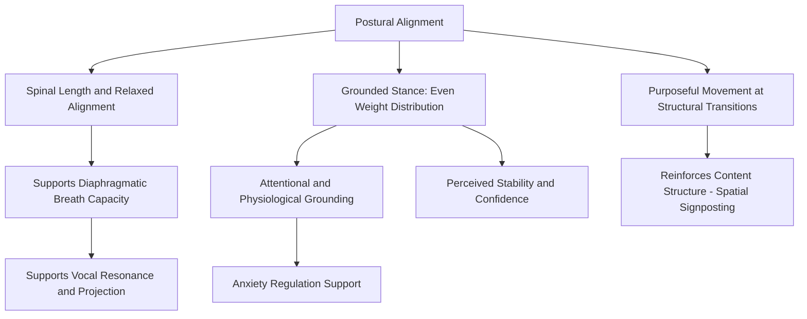

## Posture, Stance, and Physical Grounding

### Definition and Scope

Posture, stance, and physical grounding refer to the speaker's static and dynamic body positioning during delivery — how weight, spinal alignment, and lower-body positioning are managed to project stability, credibility, and command, while also supporting the physiological systems (breath, voice) that depend on structural alignment. This topic addresses the body as the platform from which vocal and gestural communication operates, distinct from but foundational to the topics of gesture (covered separately) and vocal delivery mechanics covered earlier in this material.

**Key Points**

- Posture is not merely aesthetic; structural alignment directly affects breath support and vocal resonance (see breath control and vocal support), making posture a functional prerequisite for effective delivery, not only a perceptual one
- Physical grounding serves a dual function: it shapes audience perception of the speaker's confidence and authority, and it provides genuine physiological stability that supports composure under the arousal conditions discussed in the physiology of speech anxiety

### Postural Alignment and Its Functional Basis

#### Spinal Alignment and Breath Mechanics

Effective vocal production depends on adequate thoracic and abdominal space for diaphragmatic excursion (see breath control and vocal support). Postural deviations directly constrain this:

- **Slouched/collapsed posture**: compresses the thoracic cavity, restricting diaphragmatic movement and reducing available breath capacity — a direct mechanical link between posture and vocal support quality
- **Overly rigid/hyperextended posture**: can paradoxically create tension in the surrounding musculature (lower back, shoulders) that interferes with the relaxed muscular coordination breath support requires
- **Optimal alignment**: generally described in vocal and performance pedagogy as a lengthened but relaxed spine, with the head balanced over the shoulders and the shoulders over the hips, rather than either collapsed or artificially forced into rigidity

#### The Feedback Loop Between Posture and Physiological Arousal

Postural muscle tension is bidirectionally linked with the sympathetic nervous system activation discussed under the physiology of speech anxiety:

- Anxiety-driven muscular tension often manifests first in the shoulders, neck, and upper back, producing a characteristic raised-shoulder, forward-head posture
- [Inference] Because postural tension and autonomic arousal appear to interact bidirectionally in the broader psychophysiology literature (tense posture can both result from and contribute to sustained sympathetic activation), deliberately adopting an open, grounded posture before and during speaking may provide modest downward feedback on subjective arousal, in addition to its independent effects on breath mechanics and audience perception — though this feedback effect is likely smaller and slower-acting than direct autonomic techniques like paced breathing (see breathing and grounding techniques).

**Key Points**

- Posture and breath support are mechanically interdependent, not merely correlated — this is a distinguishing technical point from purely aesthetic treatments of "good posture" advice
- Postural correction should prioritize relaxed alignment over forced rigidity, since excess muscular effort to "stand up straight" can itself introduce the kind of tension that impairs both breath support and natural gesture

### Stance: Base of Support and Weight Distribution

#### The Grounded Stance

A stable speaking stance typically involves:

- Feet positioned approximately shoulder-width apart, providing a stable base of support without appearing rigid or overly wide
- Weight evenly distributed across both feet, avoiding a consistent lean or weight-shift to one side
- Knees "soft" (not locked), which supports circulation and reduces the risk of lightheadedness during extended standing, as well as allowing natural, fluid weight shifts rather than a frozen, immobile stance

#### Weight Distribution and Perceived Confidence

- Even, balanced weight distribution is generally associated with perceived stability and confidence
- Asymmetrical or shifting weight patterns (rocking, shifting from foot to foot) are commonly associated with, and often driven by, underlying nervous energy — a physical manifestation of the same arousal-driven restlessness that can also produce vocal pace acceleration (see pitch, pace, and vocal variety) and other anxiety-linked behavioral patterns
- This connects directly to the physical/proprioceptive grounding techniques discussed as pre-performance anxiety regulation: a consciously grounded stance (feeling weight distributed through the feet) serves simultaneously as an anxiety-management technique and as a perceptually confident physical presentation

**Example**

A speaker who unconsciously rocks side to side while presenting draws audience attention toward the movement itself rather than the content, and the movement pattern often correlates with (and can itself reinforce) elevated internal arousal. Deliberately grounding attention in the sensation of feet planted evenly on the floor — a technique directly drawn from proprioceptive grounding practice — can reduce this pattern while simultaneously projecting greater stability to the audience.

### Purposeful Movement vs. Static Rigidity vs. Nervous Movement

A key technical distinction in stance and spatial use is between three qualitatively different movement patterns:

| Movement Pattern | Characteristics | Audience Perception |
| --- | --- | --- |
| Nervous/unconscious movement | Rocking, pacing without purpose, foot shifting, fidgeting | Distraction, reduced perceived composure |
| Static rigidity | Fixed, unmoving stance held throughout | Perceived stiffness, discomfort, or disengagement |
| Purposeful movement | Deliberate repositioning tied to structural or rhetorical transitions | Reinforces content structure, extends room presence |

Purposeful movement — physically repositioning at a natural transition point (moving to signal a new section, stepping toward the audience to emphasize a key point) — uses spatial positioning as an additional structural signaling tool, functioning similarly to the prosodic structural signaling discussed under pitch, pace, and vocal variety, but through physical rather than vocal means.

**Key Points**

- The goal is neither constant motion nor complete stillness, but movement that is purposeful and tied to content structure, with stillness maintained during focused, content-dense delivery
- Distinguishing purposeful movement from nervous movement is often more apparent to an external observer (via recorded review) than to the speaker in the moment, paralleling the self-perception gaps discussed in confidence-building and delivery calibration generally

### Grounding as an Anxiety-Regulation Technique

Physical grounding — the deliberate attention to physical contact points (feet on floor, weight distribution) — serves a dual function already introduced under pre-performance anxiety management (see breathing and grounding techniques):

- **Attentional redirection**: shifting focus from internal anxious cognition to concrete physical sensation, displacing catastrophizing thought patterns
- **Physiological stabilization**: a consciously grounded, evenly weighted stance may provide modest feedback that supports autonomic regulation, complementing breathing-based techniques
- **Sustained availability during delivery**: unlike breathing protocols that require a dedicated preparation window, postural grounding can be maintained continuously throughout a speech, providing an ongoing stabilizing resource rather than only a pre-performance intervention

### Common Postural Errors and Their Functional Costs

- **Slouched/collapsed posture**: restricts breath capacity, reduces vocal resonance and projection quality, and is commonly perceived as reflecting low energy, disengagement, or lack of confidence
- **Locked knees**: can restrict circulation during extended standing, increasing risk of lightheadedness, and often produces visible upper-body swaying as the body compensates
- **Crossed arms or defensive posture**: commonly perceived as closed, defensive, or disengaged, potentially undermining rapport regardless of the speaker's actual internal state
- **Hands in pockets or fixed at sides throughout**: can restrict natural gesture (addressed in gesture-specific material) and may read as low energy or discomfort
- **Weight consistently shifted to one side or one hip**: often perceived as casual or low-energy in contexts calling for higher perceived authority, though contextually this may be appropriate for more informal or conversational delivery settings

### Contextual Calibration: Stance Across Speaking Formats

Optimal stance and posture calibration varies by format:

- **Formal platform/podium speaking**: generally calls for more structured, grounded stance with limited but purposeful movement
- **Conversational or town-hall formats**: may call for a more relaxed, mobile stance that supports a sense of approachability and dialogue rather than formal address
- **Virtual/video presentation**: posture remains functionally important (breath support, resonance) even though the audience's view is typically limited to upper body — collapsed seated posture still measurably affects vocal quality even when invisible to the camera
- **Standing vs. seated delivery**: seated delivery (common in virtual meetings, panel discussions) requires deliberate postural attention since typical seated posture tends toward the thoracic compression that standing posture more naturally avoids

[Inference] Because seated posture during virtual presentations is less visually monitored by the speaker (no mirror or stage awareness cues) and structurally predisposes toward compression, speakers delivering high-stakes virtual presentations while seated likely benefit from deliberate postural correction (sitting forward on the chair edge, maintaining spinal length) specifically because the format removes some of the natural postural feedback available in standing, in-person delivery.

### Diagram: Postural Function Integration

### Summary Table: Postural Elements and Their Functions

| Element | Functional Basis | Perceptual Effect |
| --- | --- | --- |
| Spinal alignment | Diaphragmatic space, breath capacity | Perceived energy and presence |
| Even weight distribution | Physical stability, reduced nervous movement | Perceived confidence and composure |
| Soft knees | Circulation, natural movement capacity | Reduced risk of visible swaying/lightheadedness |
| Purposeful movement | Structural/spatial signposting | Reinforces content organization |
| Grounded attention (feet, weight) | Attentional and autonomic regulation | Reduced visible nervous movement |

**Next Steps**

- Breath Control and Vocal Support
- Breathing and Grounding Techniques Before Speaking
- Gesture and Hand Movement in Executive Delivery
- Eye Contact and Audience Engagement Techniques
- Nonverbal Delivery in Virtual and Hybrid Presentation Formats
- Recorded Self-Review Techniques for Delivery Calibration