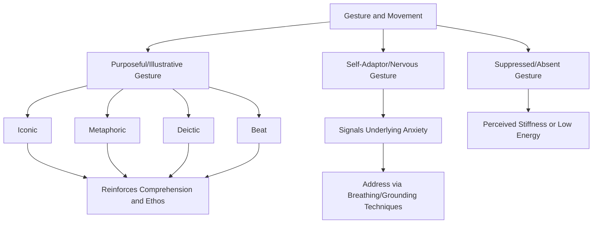

## Purposeful Gesture and Movement

### Definition and Scope

Purposeful gesture and movement refers to the deliberate use of hand, arm, and whole-body motion to reinforce, clarify, or emphasize spoken content, as distinct from unconscious, anxiety-driven, or habitual movement that occurs independent of communicative intent. This topic extends the postural and spatial groundwork established in posture, stance, and physical grounding into the domain of dynamic movement — gesture is the kinetic counterpart to the static stability that grounding provides.

**Key Points**

- Gesture is not merely decorative accompaniment to speech; a substantial body of gesture research demonstrates that hand movement is functionally integrated with speech production and comprehension, not a separate, optional add-on
- The distinction between purposeful and unconscious movement parallels the distinction already drawn for stance (nervous movement vs. purposeful movement vs. static rigidity), extended here specifically to hand and arm gesture

### The Cognitive-Linguistic Basis of Gesture

#### Gesture-Speech Integration

Psycholinguistic research (notably the work of David McNeill and colleagues) demonstrates that gesture and speech emerge from a shared underlying cognitive representation during language production, rather than gesture being a secondary decoration added after verbal content is formulated. This has practical implications:

- Gestures often carry semantic and structural information that complements, rather than merely duplicates, spoken content
- Suppressing natural gesture (e.g., through anxiety-driven physical restriction, or through avoidance strategies like hands clasped or in pockets) can, in some cases, subtly interfere with fluent speech production, since the two systems are cognitively linked rather than independent

#### Functional Categories of Gesture (McNeill's Taxonomy)

- **Iconic gestures**: depict a concrete aspect of the referent being discussed (e.g., hands shaping the size of an object, a hand movement tracing an upward trend)
- **Metaphoric gestures**: represent an abstract concept through spatial or physical metaphor (e.g., a hand gesture indicating "on one hand... on the other hand" for contrasting ideas, or a forward-moving hand indicating progress or advancement)
- **Deictic gestures**: pointing gestures indicating a physical or metaphorical location (pointing to a screen, or gesturing toward "the future" as a spatial direction)
- **Beat gestures**: rhythmic, simple movements (a hand tapping or moving in sync with speech rhythm) that align with prosodic emphasis rather than depicting semantic content directly — functioning similarly to the vocal emphasis techniques discussed under pitch, pace, and vocal variety, but through a physical rather than vocal channel

**Key Points**

- Different gesture types serve different communicative functions; effective gesture use in executive communication typically draws most heavily on metaphoric and beat gestures for abstract business content, and iconic/deictic gestures when referencing concrete data, visuals, or physical spaces
- Understanding gesture taxonomy allows more precise, targeted coaching than a generic instruction to simply "use your hands more"

### Purposeful Gesture vs. Nervous/Habitual Movement

Paralleling the taxonomy established for stance and spatial movement, gesture falls into functionally distinct categories:

| Gesture Pattern | Characteristics | Audience Perception |
| --- | --- | --- |
| Nervous/self-adaptor gestures | Touching face/hair, fidgeting with objects, wringing hands | Distraction, reduced perceived composure, signals discomfort |
| Suppressed/absent gesture | Hands clasped, in pockets, rigidly at sides | Perceived stiffness, discomfort, or lack of energy |
| Purposeful/illustrative gesture | Gestures aligned with and reinforcing verbal content | Reinforces comprehension, projects confidence and engagement |

**Self-adaptor gestures** (a term from nonverbal communication research referring to self-touching or object-manipulation behaviors) are particularly associated with elevated anxiety and discomfort, and tend to increase under the physiological arousal conditions discussed in the physiology of speech anxiety. Common examples include touching the face or hair, adjusting clothing or jewelry repetitively, or clicking a pen.

[Inference] Because self-adaptor gestures appear to increase under stress in the broader nonverbal communication literature, their frequency during a speech may function as a reasonably observable external indicator of a speaker's internal arousal state — making recorded review specifically attentive to self-adaptor frequency a useful diagnostic tool for identifying unaddressed anxiety patterns, complementing the vocal indicators (pace acceleration, pitch changes) discussed elsewhere in this material.

### Principles of Effective Gesture Use

#### Gesture-Speech Synchrony

Effective gestures are temporally aligned with the specific word or phrase they reinforce, typically initiating slightly before or precisely at the relevant verbal content (consistent with the gesture-speech integration research noted above). Misaligned timing — a gesture occurring notably before or after its corresponding verbal content — can create subtle audience confusion or a sense of disconnection between verbal and physical channels.

#### Gesture Space and Scale

- **Gesture space**: the physical zone (generally from roughly waist to shoulder height, and within a moderate width in front of the body) within which most communicative gestures are naturally and effectively executed
- **Scale calibration**: gesture size should generally scale with audience size and room size — gestures effective in an intimate small-group setting may read as insufficient in a large hall, while gestures calibrated for a large stage may appear exaggerated in a small conference room or on video
- **Video-specific calibration**: virtual/video presentation contexts require distinct gesture scale awareness, since typical webcam framing captures a limited zone (roughly chest to head), meaning gestures executed at a scale appropriate for in-person delivery can appear cut off, distracting, or entirely outside the frame

#### Variety and Avoiding Repetitive Gesture

Habitual reliance on a single repeated gesture (a particular hand movement used indiscriminately regardless of content) reduces gesture's differentiating communicative value, paralleling the vocal monotony problem discussed under pitch, pace, and vocal variety — repeated identical gesture, like repeated identical prosody, loses its capacity to signal emphasis or meaning because it no longer contrasts with a baseline.

**Example**

A speaker discussing a strategic pivot uses a deliberate, brief metaphoric gesture — hands moving from a lower to a higher position — precisely timed with the phrase "moving the organization forward," reinforcing the verbal metaphor of progress through spatial-visual congruence. The same speaker, when transitioning to a new discussion point, takes a small purposeful step to the side, functioning as spatial punctuation analogous to a transitional pause in vocal delivery.

### Gesture and Credibility: The Ethos Connection

Gesture use has direct implications for perceived credibility and authority, connecting to the ethos appeal discussed in rhetorical analysis:

- Open, expansive (but controlled) gesture is generally associated with perceived confidence and openness
- Restricted, minimal gesture, or conversely excessive/erratic gesture, can undermine perceived composure and, by extension, credibility
- Congruence between gesture and verbal content (gestures that make sense given what is being said) reinforces perceived authenticity, while incongruent gesture (arbitrary movement unrelated to content) can create subtle audience unease even when not consciously identified as the source of that unease

**Key Points**

- Gesture functions as a nonverbal ethos signal in parallel with vocal and postural cues, meaning gesture coaching is relevant to credibility management, not solely to visual interest or engagement
- Authenticity and congruence matter more than gesture quantity — a smaller number of well-timed, purposeful gestures generally outperforms constant, undifferentiated movement

### Cultural and Individual Variation

[Unverified] Gesture norms — including acceptable frequency, scale, and specific gesture meanings — vary substantially across cultural contexts, and gestures perceived as confident or appropriate in one cultural or organizational setting may be perceived differently in another; the gesture research base drawn on here (predominantly Western, English-language sources) may not generalize directly to all cross-cultural executive communication contexts without additional contextual awareness. Speakers operating across varied cultural or organizational settings should calibrate gesture norms to the specific audience context rather than applying a single universal standard.

### Diagnostic and Training Techniques

#### Recorded Self-Review

As with vocal delivery elements, recorded video review is the primary diagnostic tool for gesture patterns, since speakers are frequently unaware of habitual self-adaptor behaviors or repetitive gesture patterns during live delivery — directly paralleling the self-perception gaps discussed throughout this material's delivery topics.

#### Gesture Planning for Key Moments

For high-stakes presentations, deliberately planning (though not rigidly scripting) gesture at key emphatic or structural moments — similar in approach to marking a script for prosodic emphasis (see pitch, pace, and vocal variety) — can help ensure purposeful gesture occurs at points of highest rhetorical importance, while leaving other portions of delivery to more spontaneous, natural gesture.

#### Addressing Self-Adaptors at the Source

Since self-adaptor gestures correlate with anxiety, addressing underlying arousal through the techniques discussed in breathing and grounding and reframing nervous energy is likely to reduce self-adaptor frequency more durably than attempting to consciously suppress the specific behavior alone, which can introduce a secondary self-monitoring burden during delivery.

### Diagram: Gesture Function and Diagnostic Pathway

### Summary Table: Gesture Types and Executive Communication Application

| Gesture Type | Function | Executive Communication Example |
| --- | --- | --- |
| Iconic | Depicts concrete referent | Indicating size, shape, or physical layout |
| Metaphoric | Represents abstract concept spatially | Contrasting options, indicating growth/decline |
| Deictic | Points to location or reference | Directing attention to a slide or data point |
| Beat | Rhythmic emphasis aligned with prosody | Emphasizing key words in a strategic statement |
| Self-adaptor | Anxiety-driven self-touching/fidgeting | (To be minimized, not leveraged) |

**Next Steps**

- Posture, Stance, and Physical Grounding
- Eye Contact and Audience Engagement Techniques
- Pitch, Pace, and Vocal Variety
- Nonverbal Delivery in Virtual and Hybrid Presentation Formats
- Recorded Self-Review Techniques for Delivery Calibration
- Cross-Cultural Considerations in Nonverbal Executive Communication