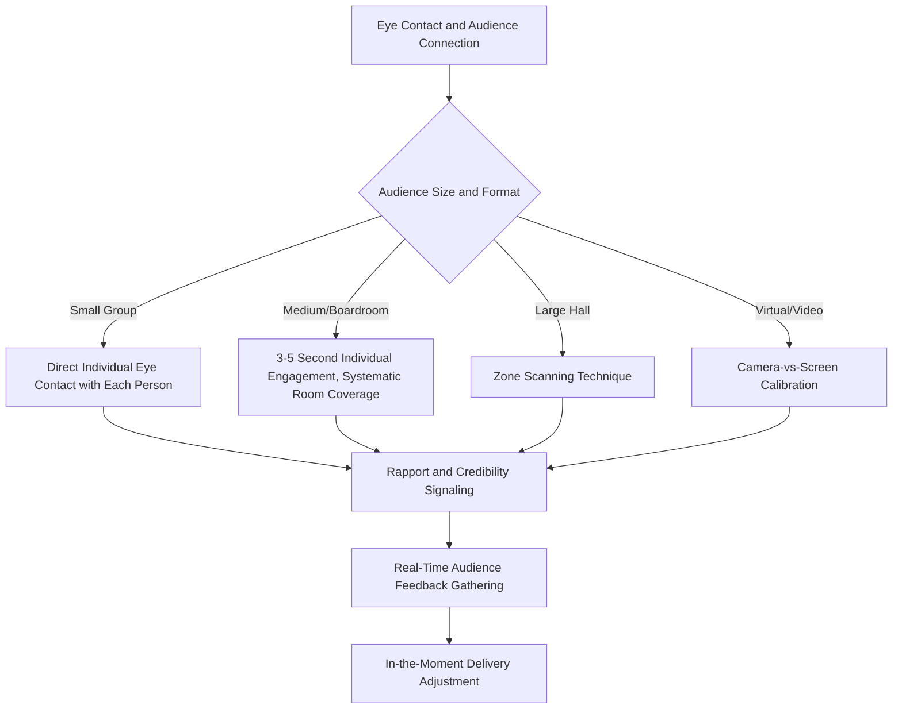

## Eye Contact and Audience Connection

### Definition and Scope

Eye contact and audience connection refers to the deliberate management of gaze direction and duration during public speaking to establish rapport, signal confidence, monitor audience response, and distribute perceived attention across an audience. This topic completes the nonverbal delivery triad alongside posture/stance and gesture, addressing the specific communicative channel of visual engagement between speaker and audience.

**Key Points**

- Eye contact serves multiple simultaneous functions — rapport-building, credibility signaling, and real-time audience feedback gathering — that are worth distinguishing analytically even though they operate together in practice
- Appropriate eye contact norms vary meaningfully by audience size, cultural context, and format (live vs. virtual), making this a domain where calibration matters more than a single universal rule

### Functional Basis: Why Eye Contact Matters

#### Rapport and Perceived Connection

Direct gaze is a well-established signal of engagement and attentiveness in human social interaction generally; in public speaking, sustained (though not fixed or staring) eye contact with audience members creates a subjective sense, for those individuals, of being personally addressed rather than passively spoken at.

#### Credibility and Ethos Signaling

Eye contact functions as a nonverbal ethos cue, parallel to the vocal and postural credibility signals discussed elsewhere in this material:

- Sustained, comfortable eye contact is broadly associated with perceived honesty, confidence, and competence in Western communication norms
- Gaze aversion, particularly frequent or sustained looking away from the audience, can be (rightly or wrongly) associated with perceived nervousness, evasiveness, or lack of preparation, regardless of the speaker's actual internal state or the genuine reason for the gaze shift (e.g., referring to notes)

#### Real-Time Audience Feedback Gathering

Eye contact is not purely transmissive (speaker to audience); it also allows the speaker to gather real-time nonverbal feedback — confusion, engagement, agreement, restlessness — that can inform in-the-moment delivery adjustments (pace, emphasis, whether to elaborate on a point). This bidirectional function is often underappreciated relative to eye contact's more commonly discussed rapport and credibility functions.

**Key Points**

- The feedback-gathering function of eye contact gives it a practical, not just perceptual, value: a speaker actively using eye contact to monitor audience response has genuine information to adjust delivery, beyond simply appearing more engaged
- This connects eye contact to the audience-adaptation principles relevant to rhetorical situation analysis (see writing a rhetorical analysis), since real-time audience reading is a live analog of the audience-awareness rhetorical analysis examines retrospectively in texts

### Eye Contact Techniques for Different Audience Sizes

#### Small Audiences (Individual to Small Group)

Direct, sustained eye contact with each individual is both feasible and expected; failure to make eye contact with any given individual in a small setting can be noticeably perceived as exclusion or discomfort.

#### Medium Audiences (Conference Room, Boardroom)

- **Individual engagement technique**: making brief, genuine eye contact with individual audience members for roughly 3-5 seconds (long enough to register as genuine connection, not so long as to become uncomfortably fixed) before shifting to another individual
- Systematic coverage across the room (not repeatedly returning to the same few individuals, and not neglecting entire sections of the room, such as consistently favoring one side) prevents the audience-perceived experience of being ignored, particularly relevant in boardroom or panel contexts where every attendee may be a stakeholder whose engagement matters

#### Large Audiences (Auditorium, Large Hall)

- Direct individual eye contact becomes impractical at scale and distance; the common technique is **zone scanning** — dividing the room into sections and making eye contact with individuals within each zone in sequence, creating the impression of personal engagement across the broader audience even though only a subset of individuals receive genuine direct gaze
- This technique relies on the fact that audience members near a genuinely gazed-at individual often perceive themselves as included in that eye contact, extending its apparent reach beyond the literal number of individuals directly gazed upon

**Example**

A speaker addressing a 200-person conference hall cannot make genuine individual eye contact with each attendee within a reasonable timeframe. Instead, she mentally divides the room into left, center, and right zones, and across the course of her remarks, deliberately makes brief eye contact with specific individuals in each zone in rotation — audience members throughout the room subjectively experience being "seen," even though the majority did not receive literal direct gaze.

### Eye Contact in Virtual and Hybrid Formats

Virtual presentation formats introduce a specific technical challenge: the mismatch between looking at the audience (viewing their faces on screen) and looking at the camera (which produces the perception of eye contact for the remote viewer).

- **The camera-vs-screen tradeoff**: looking at audience faces displayed on screen (natural instinct, and useful for reading audience reaction) does not register as eye contact to viewers, since the camera is typically positioned above or beside the screen; looking directly at the camera produces the perception of eye contact for viewers but prevents the speaker from simultaneously monitoring audience reaction on screen
- **Practical calibration**: many virtual presentation practitioners recommend primarily addressing the camera during key statements or when speaking for extended periods, while permitting brief glances to the screen for audience monitoring during natural pauses or when actively soliciting feedback/questions
- **Camera positioning**: positioning the camera as close as possible to the screen area where key participant video feeds are displayed can reduce the visual discrepancy between "looking at camera" and "looking at audience," partially mitigating the tradeoff

[Inference] Because the camera-vs-screen tradeoff has no complete technical solution with standard single-camera consumer video setups, executives with frequent high-stakes virtual presentations likely benefit from deliberately practicing camera-directed delivery specifically, since this is a less naturally intuitive skill than in-person eye contact and is unlikely to transfer automatically from strong in-person eye contact habits.

**Key Points**

- Virtual eye contact calibration is a genuinely distinct skill from in-person eye contact, not simply an application of the same skill in a different medium
- The appropriate balance between camera-directed and screen-directed gaze depends on context — a scripted, one-directional presentation segment favors camera focus, while an interactive discussion or Q&A segment favors more screen-directed attention to genuinely read participant reactions

### Common Errors in Eye Contact Application

- **Reading directly from notes/slides without lifting gaze**: produces minimal audience connection and can signal under-preparation even when content mastery is high, since audiences cannot distinguish "reading because thoroughly scripted" from "reading because unprepared" through gaze pattern alone
- **Fixed staring at a single point or individual**: can become uncomfortable for the individual singled out and fails to distribute engagement across the broader audience
- **Rapid, unsettled gaze shifting ("scanning" too quickly)**: fails to register as genuine engagement with any individual, and can itself signal nervousness through its rapid, unsettled quality
- **Consistent favoring of one section of the room**: often unconscious (frequently correlating with a speaker's dominant hand or habitual body orientation), leaving portions of the audience with the subjective experience of being overlooked throughout the presentation
- **Eye contact avoidance during difficult content or hostile questions**: particularly costly in Q&A or crisis-communication contexts, where gaze avoidance during exactly the moments requiring the most credibility signaling can compound rather than mitigate the perceived difficulty of the situation

### Eye Contact and Anxiety: The Bidirectional Relationship

Eye contact and speech anxiety interact bidirectionally, paralleling the posture-arousal relationship discussed under posture, stance, and physical grounding:

- Elevated anxiety commonly produces reduced or avoidant eye contact, as gaze aversion is a broadly documented behavioral correlate of social-evaluative threat response
- Conversely, deliberately maintaining eye contact despite discomfort can function as a form of graduated exposure (a principle drawn from anxiety treatment more broadly), potentially reducing avoidance-driven anxiety maintenance over repeated practice
- This connects directly to the reinforcement dynamics discussed in the causal analysis of speech anxiety: avoidance of eye contact (like avoidance of speaking generally) is negatively reinforcing in the short term (reduced discomfort) but can maintain or worsen anxiety-driven avoidance patterns over time if not addressed

**Key Points**

- Building eye contact tolerance is a trainable skill that benefits from the same progressive, repetition-based approach discussed under building confidence through preparation and repetition — starting with lower-stakes practice audiences before high-stakes application
- Speakers with significant eye contact avoidance driven by acute anxiety (rather than habitual/technique-based avoidance) may benefit from combining eye contact practice with the broader anxiety-regulation techniques discussed earlier in this material

### Diagram: Eye Contact Techniques by Context

### Summary Table: Eye Contact Calibration by Context

| Context | Technique | Primary Risk if Miscalibrated |
| --- | --- | --- |
| Small group | Direct engagement with each individual | Perceived exclusion if someone is skipped |
| Boardroom/medium group | 3-5 second individual engagement, rotated | Favoring certain individuals or room sections |
| Large hall | Zone scanning | Appearing to address no one specifically |
| Virtual/video | Camera-directed for key statements | Appearing to look "away" from viewers if screen-focused |
| Q&A/hostile questions | Sustained, composed direct engagement | Gaze avoidance compounding perceived evasiveness |

**Next Steps**

- Posture, Stance, and Physical Grounding
- Purposeful Gesture and Movement
- Nonverbal Delivery in Virtual and Hybrid Presentation Formats
- Handling Hostile Questions in Executive Q&A
- The Physiology of Speech Anxiety
- Recorded Self-Review Techniques for Delivery Calibration