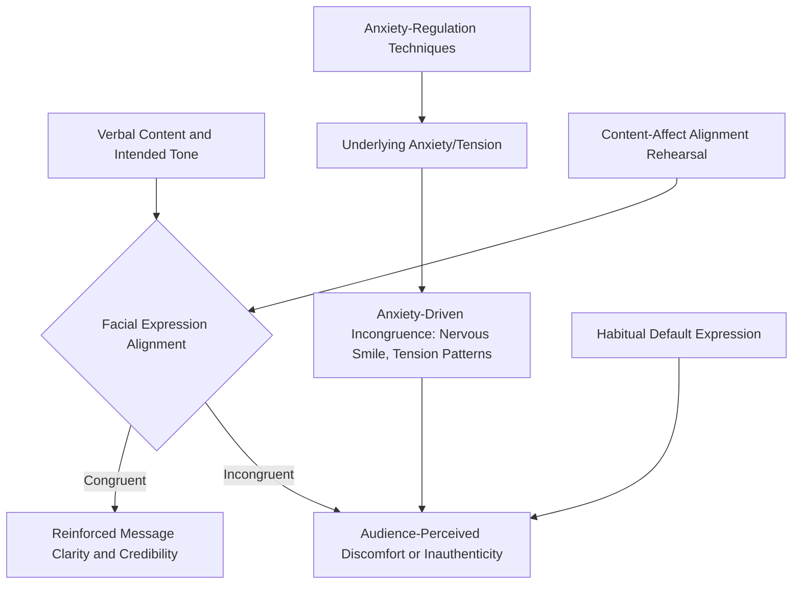

## Facial Expression and Message Congruence

### Definition and Scope

Facial expression and message congruence refers to the alignment between a speaker's facial affect and the semantic, emotional, and rhetorical content of their spoken message, and the perceptual consequences that arise when these channels align or conflict. This topic completes the nonverbal communication set established across posture, gesture, and eye contact, addressing the specific channel of facial affect as both an independent communicative signal and a potential source of interference when misaligned with verbal content.

**Key Points**

- Facial expression operates largely automatically and is often less consciously controlled than gesture or posture, making incongruence more likely to occur unintentionally and, when it does, more likely to be perceived by audiences as revealing genuine internal state rather than a deliberate choice
- Congruence — not simply "positive" or "expressive" facial affect — is the operative principle; an inappropriately positive or neutral expression during serious content is as problematic as a negative expression during positive content

### The Communicative Function of Facial Expression

#### Emotional Signaling and the Basic Emotion Framework

Foundational research in facial expression (notably Paul Ekman's work on universal facial expressions) identifies a set of expressions associated with basic emotional states (happiness, sadness, anger, fear, surprise, disgust) that are recognized with notable cross-cultural consistency, though the broader claim of full universality has faced ongoing scholarly debate and refinement in subsequent research. For public speaking purposes, the practically relevant point is narrower and less contested: facial expression reliably communicates emotional and attitudinal information to audiences, largely automatically and rapidly, often before or alongside conscious processing of verbal content.

#### Facial Expression as a Credibility and Authenticity Signal

Because facial expression is comparatively difficult to fully control relative to more consciously managed channels (word choice, even gesture), audiences often weight facial affect heavily — sometimes described in nonverbal communication research as a primary channel for judging authenticity — when facial expression and verbal content appear to conflict. A verbal message of confidence delivered with a facial expression suggesting doubt or discomfort is generally more likely to be read by the audience as revealing the "true" underlying state than the verbal content is to override the facial signal.

[Inference] Because facial expression appears to be weighted heavily in audience judgments of authenticity relative to more consciously controllable channels, achieving genuine facial-verbal congruence likely depends more on aligning underlying affective/cognitive state with message content (through preparation, cognitive reframing, and comfort with the material) than on consciously performing a "matching" expression independent of genuine internal state — a forced or performed expression that does not correspond to authentic internal affect is itself a form of incongruence, sometimes perceptible to attentive audiences as subtly "off" even when the surface expression appears superficially appropriate.

### Congruence and Incongruence: Functional Analysis

#### Positive Congruence

Facial expression aligning with and reinforcing verbal content — an engaged, warm expression during rapport-building content; a serious, focused expression during weighty or consequential content; genuine enthusiasm during content the speaker is authentically positive about. Congruent facial expression reinforces message clarity and credibility without requiring additional verbal emphasis.

#### Negative Incongruence Patterns

- **Anxiety-driven incongruence**: nervous or tense facial expression (tight jaw, strained smile, wide or darting eyes) appearing during content that calls for confident, composed affect — directly connecting to the physiological tension patterns discussed under the physiology of speech anxiety, since facial musculature is subject to the same sympathetic-driven tension as other muscle groups
- **Habitual mismatch expressions**: some speakers exhibit a habitual "default" expression (a slight frown, a flat affect, an inadvertent smile) that occurs regardless of content, creating persistent incongruence unrelated to any specific moment's content
- **Delayed or absent affect shifts**: failing to shift facial expression when content shifts (e.g., maintaining a light, casual expression when transitioning into serious content, or vice versa), producing a lag between verbal and facial channels that can create subtle audience confusion about the intended tone

**Example**

An executive delivering difficult news (a restructuring announcement) smiles reflexively at the start of the announcement — a common nervous habit rather than a genuine emotional signal — before the content's serious tone registers facially moments later. Audience members may register this brief incongruence as unsettling or as suggesting the speaker does not fully grasp the gravity of the message, even though the smile was an unconscious anxiety response rather than a genuine reflection of the speaker's attitude toward the content.

### The Habitual Smile and Anxiety-Driven Facial Patterns

A specific and common pattern worth distinguishing: the **anxious/nervous smile**, a reflexive facial response to social-evaluative discomfort that is not a genuine expression of positive affect but rather a common human response to social anxiety and uncertainty. This is mechanistically and functionally distinct from a genuine, congruent smile used during appropriately positive content.

- Nervous smiling frequently occurs during content with no genuine positive valence — including serious, negative, or neutral content — creating a persistent incongruence that experienced audiences may register (even if not consciously articulated) as a signal of underlying discomfort
- [Unverified] The specific prevalence and audience-detection accuracy of nervous smiling as an anxiety indicator varies across the nonverbal communication literature, and individual variation in baseline facial expressiveness means this pattern should be treated as one possible indicator among several rather than a definitive diagnostic sign in any specific individual case

**Key Points**

- Distinguishing a genuine congruent smile from a nervous/incongruent smile is not always straightforward even for trained observers, but the underlying distinction (does the expression align with actual content-appropriate affect, or is it a reflexive anxiety response) remains analytically important for coaching purposes
- Addressing nervous smiling (and other anxiety-driven facial patterns) is generally more effectively approached through the underlying anxiety-regulation techniques discussed earlier in this material than through direct suppression of the facial behavior alone, which risks introducing a secondary self-monitoring burden

### Facial Expression Range and Executive Communication Contexts

#### The Restricted-Affect Risk

Some executive communication training traditions historically emphasized controlled, minimal facial affect as a marker of composure and professionalism. Contemporary communication coaching increasingly treats excessive facial restriction as its own liability:

- A persistently flat or restricted facial affect can be perceived as disengagement, lack of investment in the content, or, in some contexts, as evasive or untrustworthy — precisely the opposite of the composure such restriction is often intended to convey
- Appropriate facial expressiveness, calibrated to content and context, generally supports rather than undermines perceived executive credibility, provided it remains congruent with message content and does not veer into excessive or exaggerated affect

#### Context-Specific Calibration

- **Crisis or serious announcements**: calls for restrained but genuinely engaged facial affect — appropriately serious without appearing detached, and without incongruent positive affect (smiling, casual expression)
- **Motivational or celebratory content**: calls for congruent positive affect; a flat or restrained expression during genuinely positive content can undercut the intended motivational impact
- **Q&A and difficult questions**: calls for composed, attentive facial affect that signals genuine consideration of the question rather than defensiveness or dismissiveness, connecting to the eye contact and composure principles discussed in the eye contact and mistake-recovery topics

### Cultural Variation in Facial Expression Norms

[Unverified] While certain basic facial expressions show notable cross-cultural recognition consistency in foundational research, display rules — the culturally variable norms governing when and how intensely particular emotions are appropriately expressed in given social contexts — vary considerably across cultures, and appropriate facial expressiveness calibration for executive communication may differ across cultural and organizational contexts in ways not fully captured by predominantly Western-sourced communication coaching literature. Speakers operating across varied cultural contexts should calibrate facial expressiveness expectations to the specific audience and organizational culture rather than assuming a single universal standard.

### Diagnostic and Development Techniques

#### Recorded Self-Review

As with the other nonverbal delivery channels covered in this chapter, recorded video review is the primary diagnostic tool for identifying habitual facial patterns (nervous smiling, flat default affect, delayed affect shifts) that speakers are frequently unaware of during live delivery.

#### Content-Affect Alignment Rehearsal

During rehearsal, deliberately attending to the intended affective tone of each content segment (serious, enthusiastic, empathetic, matter-of-fact) and monitoring whether facial expression during rehearsal genuinely aligns with that intended tone — connecting to the broader rehearsal and automaticity principles discussed under building confidence through preparation and repetition, since congruent facial expression under pressure is more reliable when practiced in advance than when attempted spontaneously under live arousal conditions.

#### Addressing the Underlying Anxiety Source

Given the strong connection between facial incongruence and underlying anxiety (particularly for nervous smiling and tension patterns), the anxiety-regulation techniques discussed earlier in this material (breathing, grounding, reframing, visualization) are often more effective at producing durable, genuine facial congruence than attempts to consciously manage facial expression as an isolated technical skill.

### Diagram: Facial Congruence and Incongruence Pathway

### Summary Table: Facial Expression Patterns and Audience Effects

| Pattern | Underlying Cause | Audience Perception |
| --- | --- | --- |
| Congruent, context-appropriate expression | Genuine alignment of affect and content | Reinforced credibility and clarity |
| Nervous/anxious smile | Reflexive anxiety response | Perceived discomfort or inauthenticity, especially during serious content |
| Restricted/flat affect | Over-controlled composure, or disengagement | Perceived detachment, lack of investment |
| Delayed affect shift | Lag in facial adjustment to content changes | Momentary confusion about intended tone |
| Habitual default expression | Consistent unconscious facial set | Persistent, content-independent incongruence |

**Next Steps**

- Posture, Stance, and Physical Grounding
- Purposeful Gesture and Movement
- Eye Contact and Audience Connection
- The Physiology of Speech Anxiety
- Recovering Composure After a Mistake
- Cross-Cultural Considerations in Nonverbal Executive Communication