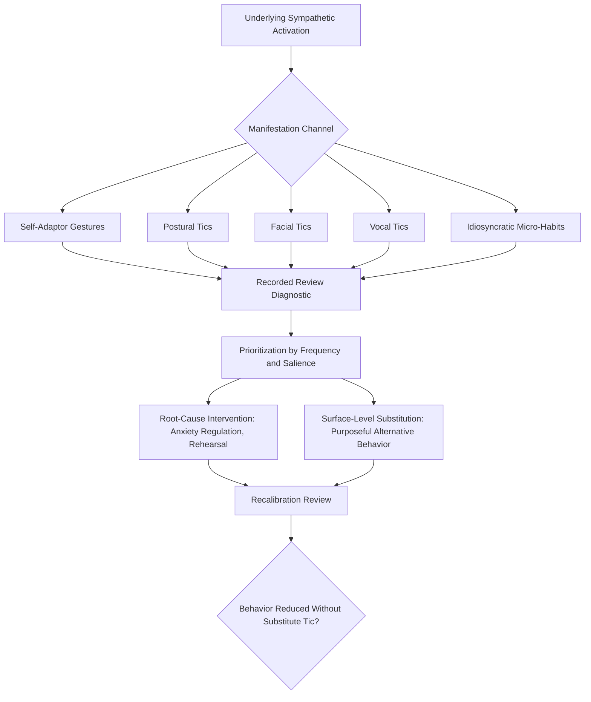

## Managing Involuntary Habits and Nervous Tics

### Definition and Scope

Managing involuntary habits and nervous tics addresses the identification, diagnosis, and remediation of unconscious physical and vocal behaviors that emerge during speech delivery, typically driven by underlying physiological arousal, and that operate outside the speaker's active communicative intent. This topic synthesizes and extends threads introduced across the nonverbal chapter — self-adaptor gestures (see purposeful gesture and movement), nervous postural shifting (see posture, stance, and physical grounding), and anxiety-driven facial patterns (see facial expression and message congruence) — into a unified diagnostic and remediation framework, while also addressing vocal tics not previously covered in depth.

**Key Points**

- The defining feature distinguishing a "tic" or habit from purposeful behavior is the absence of communicative intent — the behavior occurs regardless of, or even in conflict with, the speaker's message, rather than reinforcing it
- Nearly all speakers exhibit some degree of habitual nervous behavior; the concern is one of frequency, salience, and cumulative distraction from content, not the mere presence of any involuntary behavior whatsoever

### Taxonomy of Involuntary Habits and Tics

#### Self-Adaptor Behaviors (Physical)

Touching or manipulating one's own body or nearby objects: touching face or hair, adjusting clothing or jewelry repetitively, clicking a pen, playing with notecards, wringing hands. As discussed under purposeful gesture and movement, these are well-documented in nonverbal communication research as correlating with elevated social-evaluative anxiety.

#### Postural Tics

Repetitive, non-purposeful movement patterns: rocking side to side, weight-shifting, foot tapping, swaying — covered in detail under posture, stance, and physical grounding, and included here for taxonomic completeness within the broader habit-management framework.

#### Facial Tics

Reflexive facial patterns not aligned with content: nervous smiling, eyebrow raising unrelated to emphasis, lip pressing or biting, rapid blinking — covered in detail under facial expression and message congruence.

#### Vocal Tics

Non-lexical or semantically redundant vocalizations and habitual speech patterns: filler words and hedging phrases (covered extensively under eliminating filler words and verbal tics), but also including habitual pitch patterns (persistent uptalk unrelated to actual questions), habitual throat clearing, or a fixed, repeated vocal mannerism (a distinctive laugh, sigh, or verbal habit that recurs regardless of content).

#### Micro-Gestures and Idiosyncratic Habits

Highly individual, often unique-to-the-speaker patterns that do not fit neatly into the above categories: a habitual pause-filling gesture, a specific recurring phrase used as a verbal placeholder, an idiosyncratic head tilt or nod pattern. These are typically identified only through individualized observation (recorded review or external feedback) rather than through general taxonomic categories, since they are by definition specific to the individual speaker's habitual patterns.

**Key Points**

- These categories frequently co-occur and share a common underlying driver (sympathetic nervous system activation under social-evaluative stress), meaning a speaker with elevated anxiety often exhibits patterns across multiple categories simultaneously rather than in a single isolated channel
- Cataloging the specific category (physical, postural, facial, vocal, idiosyncratic) allows more targeted remediation than treating "nervous habits" as an undifferentiated general problem

### The Shared Physiological and Cognitive Basis

Consistent with the analysis presented across the individual nonverbal and vocal topics in this material, involuntary habits and tics share a common underlying mechanism traceable to the physiology of speech anxiety:

- **Sympathetic nervous system activation** produces generalized muscular tension and restlessness that manifests differently across individuals — some channel this into hand movement, others into facial tension, others into postural shifting or vocal patterns
- **Attentional narrowing under stress** reduces the cognitive resources available for monitoring and suppressing habitual behavior, meaning tics often become more pronounced precisely during the moments of highest content difficulty or highest stakes, when self-monitoring capacity is most constrained
- **Negative reinforcement of avoidance-adjacent behaviors**: some tics (fidgeting with an object, touching one's face) may provide minor, immediate anxiety-reducing sensory feedback, creating a reinforcement loop that maintains the behavior over repeated speaking occasions, paralleling the avoidance-reinforcement dynamic discussed in the causal analysis of speech anxiety

[Inference] Because these tics share a common physiological driver across categories, a speaker who successfully reduces overall arousal through the anxiety-regulation techniques discussed earlier in this material (breathing, grounding, reframing, adequate rehearsal) is likely to see improvement across multiple tic categories simultaneously, rather than needing entirely separate interventions for each behavioral channel — this follows from the shared underlying cause even though the surface behaviors appear in distinct physical, vocal, and facial channels.

### The Diagnostic Challenge: Self-Awareness Limitations

A defining and recurring theme across all delivery topics in this material is the **self-perception gap**: speakers are frequently unaware of their own habitual behaviors during live delivery, since conscious attention during speaking is predominantly allocated to content retrieval and delivery management rather than self-monitoring of secondary physical behaviors.

- Involuntary habits are, definitionally, largely outside conscious awareness during their occurrence — a speaker rarely notices their own face-touching or verbal tic in real time, precisely because these behaviors operate below the threshold of active monitoring
- This makes **external diagnostic methods** (recorded review, trusted observer feedback) essential rather than optional for effective identification, since introspective self-report is an unreliable diagnostic method for behaviors that are, by definition, occurring outside conscious self-monitoring

**Key Points**

- Recorded video review remains the single most consistently recommended diagnostic tool across every delivery domain covered in this material (vocal, gestural, postural, facial), precisely because it converts an unobservable-to-the-speaker pattern into an observable, reviewable one
- A single recorded review session is typically insufficient to catalog the full range of an individual's habitual patterns; systematic review across multiple speaking occasions, ideally in varied contexts (high-stakes vs. low-stakes, different content types), provides more complete diagnostic coverage

### Structured Remediation Approach

#### Step 1: Systematic Identification

Review recorded speaking samples (ideally multiple, across varied contexts) with explicit attention to cataloging specific tics by category, rather than a general impression of "seeming nervous." Enlisting a trusted external observer to specifically watch for and note habitual patterns can supplement self-review, since even careful self-review of one's own recording carries some residual self-perception bias.

#### Step 2: Prioritization by Salience and Frequency

Not all identified habits warrant equal remediation priority. Prioritization typically considers:

- **Frequency**: highly frequent tics cross the salience threshold (discussed under filler word remediation) more readily than occasional ones
- **Audience distraction potential**: a tic that draws visual or auditory attention away from content (a repeated verbal phrase, a visible repetitive movement) generally warrants higher priority than a subtler, less noticeable pattern
- **Context-appropriateness**: some patterns matter more in certain contexts (a habitual phrase might be inconsequential in casual internal meetings but more costly in a formal external presentation)

#### Step 3: Root-Cause vs. Surface-Level Intervention

Given the shared anxiety-driven basis of most involuntary habits, effective remediation typically combines two complementary approaches:

- **Root-cause intervention**: addressing underlying arousal through breathing/grounding techniques, adequate content rehearsal (reducing cognitive load and associated tension), and cognitive reframing — likely to reduce tic frequency across multiple categories simultaneously
- **Surface-level substitution**: providing an alternative, less distracting behavior to channel residual physical restlessness (e.g., consciously holding notecards with a stable grip rather than fidgeting with them, or deliberately grounding weight through the feet rather than shifting) — directly paralleling the silence-substitution technique discussed for vocal filler remediation

#### Step 4: Targeted Practice with Feedback

For persistent, high-priority tics, deliberate practice sessions with real-time feedback (a coach or peer signaling each occurrence, or self-monitoring via mirror or recording during low-stakes rehearsal) can build the conscious awareness needed to interrupt an ingrained habitual pattern, consistent with general behavioral-modification and motor-learning principles of feedback-driven habit change.

#### Step 5: Recalibration and Reinforcement

Following initial remediation, periodic re-review (recorded review at intervals) confirms whether the target behavior has genuinely diminished or has been unconsciously replaced by a substitute tic — a documented risk in habit-modification work generally, where suppressing one behavior without addressing its underlying driver can result in the emergence of a new, substitute behavior serving the same underlying function.

**Example**

An executive identifies, through recorded review across three separate presentations, a consistent pattern of clicking a pen during any content involving financial projections specifically — a pattern not present during other content types. Further reflection suggests this segment consistently produces the highest subjective anxiety, since it involves the most scrutiny-prone material. Rather than simply removing the pen (surface-level fix, risking a substitute tic), the executive also specifically over-rehearses the financial projection segment to increase automaticity and reduce the localized cognitive load driving the anxiety in that specific segment.

### Distinguishing Habit Management from Suppression

An important calibration principle: the goal of habit management is **reduction of distracting, non-communicative behavior**, not complete suppression of all physical movement or vocal variation, which would itself produce the static rigidity or vocal monotony problems discussed elsewhere in this material. Effective remediation redirects physical and vocal energy toward purposeful channels (deliberate gesture, strategic pause, congruent facial expression) rather than eliminating expressiveness altogether.

**Key Points**

- Over-suppression of natural movement in an attempt to eliminate all nervous habits can produce a stiffness or restriction that introduces its own distinct perceptual costs
- The target state is not "no movement" or "no vocal variation" but purposeful, content-aligned movement and vocal expression, replacing non-purposeful, anxiety-driven patterns

### Diagram: Involuntary Habit Diagnostic and Remediation Pathway

### Summary Table: Habit Categories and Primary Remediation Approach

| Category | Example | Primary Remediation |
| --- | --- | --- |
| Self-adaptor gestures | Face-touching, pen-clicking, hand-wringing | Grounding techniques; purposeful gesture substitution |
| Postural tics | Rocking, weight-shifting, foot-tapping | Grounded stance practice |
| Facial tics | Nervous smiling, lip-pressing | Anxiety regulation; content-affect alignment rehearsal |
| Vocal tics | Filler words, habitual phrases, uptalk | Content rehearsal; strategic silence substitution |
| Idiosyncratic habits | Individual-specific patterns | Individualized recorded review and targeted practice |

**Next Steps**

- Purposeful Gesture and Movement
- Posture, Stance, and Physical Grounding
- Facial Expression and Message Congruence
- Eliminating Filler Words and Verbal Tics
- The Physiology of Speech Anxiety
- Recorded Self-Review Techniques for Delivery Calibration