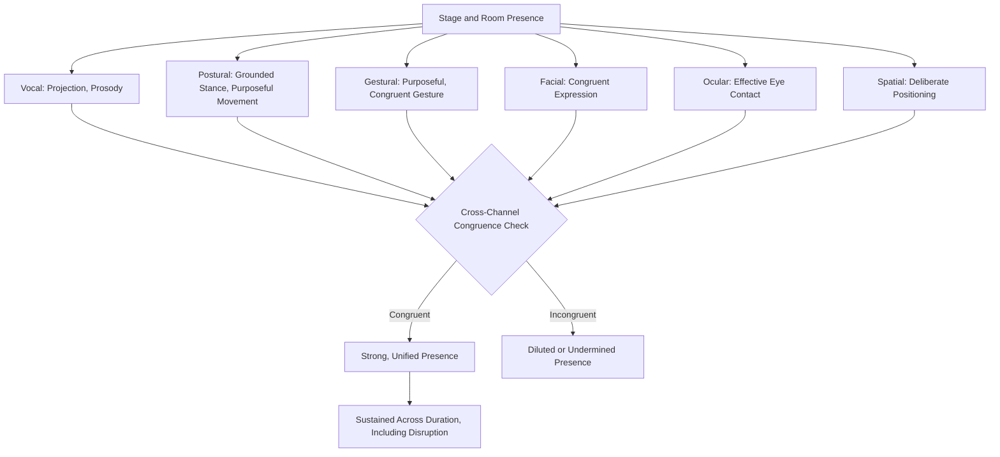

## Stage and Room Presence

### Definition and Scope

Stage and room presence is the integrated, composite perceptual quality that emerges from the coordinated combination of the individual nonverbal and vocal delivery elements addressed throughout this material — posture, gesture, eye contact, facial expression, vocal projection, and spatial use — into a unified impression of command, authority, and engagement within a physical or virtual speaking environment. Unlike the preceding topics, which each isolate a single channel for detailed technical analysis, this topic addresses the emergent, integrative property that arises specifically from the *coordination* of those channels, and cannot be fully explained by any single channel in isolation.

**Key Points**

- Room presence is not an additional discrete skill separate from the individually covered elements; it is the perceptual outcome of those elements functioning congruently together
- A speaker can execute each individual delivery element competently in isolation while still exhibiting weak overall presence if the elements are poorly coordinated or temporally misaligned with one another

### The Concept of Congruence Across Channels

The central technical principle underlying strong stage and room presence is **multichannel congruence**: alignment across vocal, postural, gestural, facial, and spatial signals such that they reinforce a single coherent impression rather than sending conflicting or uncoordinated signals.

- A confident vocal tone paired with closed, defensive posture produces a weaker overall impression than either element would alone, since the incongruence itself becomes a subtle source of audience unease (directly paralleling the facial-verbal incongruence effect discussed under facial expression and message congruence, extended here across all channels)
- Strong gesture use paired with poor eye contact, or vice versa, produces a similarly diluted impression — presence appears to require simultaneous, coordinated engagement across channels rather than excellence in a single channel compensating for weakness in others

[Inference] Because presence appears to depend on cross-channel congruence rather than the sum of independently maximized channels, the most efficient path to strong presence for a given speaker is likely identifying and correcting the *specific channel or channels* where incongruence with an otherwise strong overall delivery is occurring, rather than attempting uniform maximal intensity across every channel — this follows from the premise that a single glaringly incongruent element can undermine an otherwise well-coordinated overall impression more than that element's isolated weakness would suggest.

### Components Contributing to Room Presence

#### Vocal Contribution

Projection, resonance, and prosodic variety (see volume, projection, and room presence; pitch, pace, and vocal variety) provide the auditory foundation of presence — a voice that reaches and holds attention across the physical or virtual space.

#### Physical/Postural Contribution

Grounded stance and purposeful movement (see posture, stance, and physical grounding) provide the visual foundation of stability and command, while purposeful gesture (see purposeful gesture and movement) adds dynamic reinforcement of content.

#### Facial and Ocular Contribution

Congruent facial expression (see facial expression and message congruence) and effective eye contact management (see eye contact and audience connection) provide the interpersonal and emotional-connection dimension of presence, signaling genuine engagement rather than mechanical delivery.

#### Spatial Contribution

Deliberate, purposeful use of available physical space — including calibrated movement at structural transitions and appropriate positioning relative to the audience or camera — extends a speaker's perceived command beyond their immediate physical position, functioning as a structural signaling tool in its own right (paralleling the vocal and gestural structural signaling discussed elsewhere in this material).

**Key Points**

- No single component listed above is sufficient on its own to produce strong presence; the integrative combination, executed with mutual congruence, is what audiences perceive as commanding presence
- This componential breakdown is primarily useful for diagnostic purposes (identifying which specific channel is weakest or most incongruent) rather than suggesting these elements should be developed or evaluated in isolation from one another

### The Temporal Dimension: Presence as Sustained, Not Momentary

A frequently underappreciated aspect of room presence is its temporal consistency requirement — presence must be sustained across the full duration of a speaking engagement, not merely established at the outset and allowed to lapse:

- **Opening presence**: the first moments of a speech (walking to the podium, initial eye contact, opening posture) disproportionately shape initial audience impression, consistent with primacy effects broadly documented in impression-formation research
- **Sustained presence through content-dense segments**: presence often weakens during highly cognitively demanding content segments (dense data, complex technical explanation) as cognitive resources shift toward content management and away from the coordinated delivery elements presence depends on — directly connecting to the controlled-vs-automatic processing distinction discussed under building confidence through preparation and repetition, since well-rehearsed content leaves more cognitive capacity available for maintaining coordinated delivery
- **Presence during disruption**: as discussed under recovering composure after a mistake, presence is often most tested (and most valuable) precisely during moments of disruption, where composed, congruent delivery signals genuine command rather than merely rehearsed performance

**Key Points**

- Presence that is strong only during comfortable, well-rehearsed segments but degrades during difficult or unexpected moments provides a less complete and less durable overall impression than presence sustained consistently across varying content difficulty and disruption
- This makes overall content mastery and rehearsal (freeing cognitive resources for delivery coordination) an indirect but significant contributor to sustained presence, beyond the direct delivery-technique elements

### Presence Across Formats and Contexts

#### In-Person, Formal Platform Speaking

The traditional context for stage presence concepts, involving the fullest range of available channels (full-body posture and gesture, room-scale projection, zone-based eye contact).

#### Boardroom and Small-Group Executive Contexts

Presence in smaller, closer-proximity settings relies less on vocal projection and more heavily on eye contact precision, facial congruence, and controlled, purposeful (rather than large-scale) gesture, since the closer physical proximity makes subtle incongruence more perceptible than it would be at a greater distance.

#### Virtual and Hybrid Presentation Formats

Virtual presence requires a distinct recalibration given the constrained visual and auditory channel (typically limited to upper body, single-camera perspective, and speaker-controlled audio):

- Camera-directed eye contact (see eye contact and audience connection) becomes proportionally more important given the reduced availability of other spatial and postural cues
- Vocal variety and prosody (see pitch, pace, and vocal variety) carry proportionally more of the presence-signaling burden, since large-scale gesture and full-body posture are less visible or entirely absent from frame
- Audio quality and consistent volume calibration (see volume, projection, and room presence) become a more literal, technical determinant of presence, since audio dropouts or inconsistent levels directly and immediately degrade the audience's perceptual experience in a way less analogous to in-person settings

[Unverified] The relative weighting of different presence components (vocal vs. facial vs. gestural) across virtual versus in-person contexts is discussed extensively in applied executive-communication coaching literature, though rigorous comparative experimental research quantifying these relative weightings specifically is more limited than the practitioner consensus might suggest, and individual variation among speakers and audiences likely affects the precise balance in any given case.

**Example**

An executive with strong in-person room presence — commanding posture, purposeful gesture, and effective zone-based eye contact — delivers a similarly prepared presentation over video conference and finds the same content lands with noticeably less impact. Diagnostic review reveals that her gesture, though purposeful, occurs largely outside the camera frame, and her eye contact remains screen-directed (reading audience reaction) rather than camera-directed, producing an accumulated deficit across two of the channels most load-bearing in the virtual format specifically.

### Diagnostic Approach: Assessing Overall Presence

Given presence's integrative nature, diagnostic assessment benefits from a structured, multichannel review rather than isolated technique-by-technique evaluation alone:

1. **Recorded review with full-delivery focus**: reviewing a complete recorded segment for overall impression before conducting channel-specific analysis, capturing the integrated perceptual effect before decomposing it into components
2. **Channel-specific decomposition**: following the initial overall impression, systematically reviewing vocal, postural, gestural, facial, and spatial elements individually (using the diagnostic approaches detailed in each respective topic) to identify specific sources of strength or incongruence
3. **Congruence check across channels**: explicitly comparing channels against one another for alignment (does vocal confidence match postural confidence? does facial affect match verbal content tone?) rather than evaluating each channel purely against an independent standard
4. **Format-specific recalibration**: assessing whether the coordinated delivery pattern developed for one format (in-person) transfers adequately to another (virtual), given the differential channel weighting discussed above

### Diagram: Integrated Room Presence Model

### Summary Table: Presence Components by Format

| Component | In-Person Weight | Virtual Weight |
| --- | --- | --- |
| Vocal projection/prosody | High | Very high (primary channel given visual constraints) |
| Posture and full-body stance | High | Low to moderate (often out of frame) |
| Gesture | Moderate to high | Moderate (must stay within frame) |
| Facial expression | Moderate | High (frequently the most visible channel) |
| Eye contact | High (zone-based) | Very high (camera-directed) |
| Spatial movement | High | Minimal to none |

**Next Steps**

- Posture, Stance, and Physical Grounding
- Purposeful Gesture and Movement
- Eye Contact and Audience Connection
- Facial Expression and Message Congruence
- Volume, Projection, and Room Presence
- Nonverbal Delivery in Virtual and Hybrid Presentation Formats