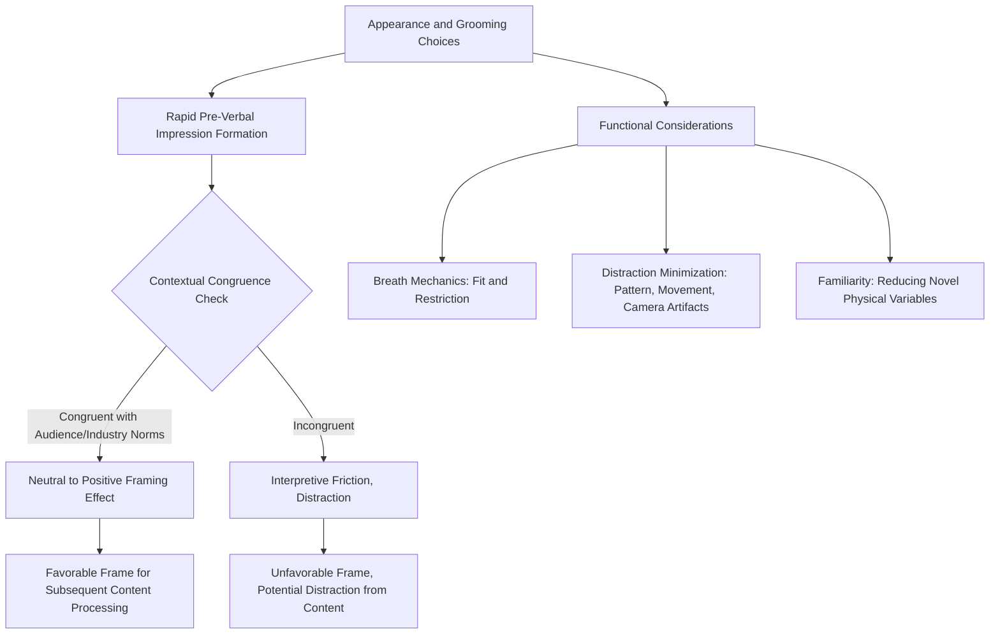

## Dress, Appearance, and Nonverbal Signaling

### Definition and Scope

Dress, appearance, and nonverbal signaling addresses how a speaker's visual self-presentation — clothing, grooming, and overall physical styling — functions as a communicative channel that shapes audience perception prior to, and independent of, spoken content. This topic completes the nonverbal communication chapter by addressing a channel distinct from the dynamic, in-the-moment behaviors (posture, gesture, eye contact, facial expression) covered elsewhere: appearance signals are largely fixed for the duration of an engagement, established before the speaker begins speaking, and interpreted rapidly by audiences, often within seconds of initial visual exposure.

**Key Points**

- Appearance-based judgments occur extremely rapidly and often prior to any verbal content being processed, giving this channel a distinct temporal priority relative to the dynamic delivery elements covered elsewhere in this material
- Unlike posture or gesture, appearance choices are typically made well in advance of the speaking engagement itself, making this a preparation-phase rather than in-the-moment delivery consideration

### The Perceptual Basis: Rapid Impression Formation

Social-psychological research on **thin-slice judgments** demonstrates that observers form assessments of traits such as competence, trustworthiness, and likability from very brief exposure to visual information, often within seconds. While this research base extends across multiple visual cues (including facial structure and expression), clothing and grooming constitute a substantial, controllable component of this rapid-judgment input, since — unlike facial structure — dress and grooming are deliberately chosen and therefore represent an area of genuine communicative agency for the speaker.

- **Halo effects**: positive appearance-based judgments can generalize to unrelated trait inferences (a well-groomed, appropriately dressed speaker may be unconsciously credited with greater competence or credibility on entirely separate dimensions, a documented pattern in impression-formation research generally)
- **Schema activation**: audience members carry implicit expectations regarding appropriate dress for given professional contexts and roles; alignment with or deviation from these expectations can shape the interpretive frame through which subsequent verbal content is processed

[Inference] Because appearance-based impressions form prior to and independent of verbal content, and because subsequent information processing is often influenced by initial framing effects, appearance choices likely exert an anchoring influence on how favorably or critically an audience processes the verbal content that follows — meaning appearance functions as more than a superficial or separate concern from the substantive content of a presentation, even though it carries no semantic content of its own.

### Congruence with Context, Role, and Audience Expectations

The central technical principle governing effective appearance choices, paralleling the congruence principle established throughout this material's nonverbal topics, is **contextual congruence** — alignment between appearance and the expectations of the specific audience, organizational culture, industry norm, and occasion, rather than adherence to any single universal standard of "professional" dress.

#### Organizational and Industry Norms

- Formal financial services, legal, and traditional corporate environments generally maintain more conservative, formal dress expectations
- Technology, creative, and startup environments frequently maintain more casual norms, where excessively formal dress can itself create incongruence (signaling unfamiliarity with organizational culture, or unintentionally suggesting formality/distance inappropriate to the setting)
- Cross-organizational presentations (e.g., a vendor presenting to a client organization with different norms than the presenter's own) require explicit consideration of the audience's norms rather than the presenter's own default organizational context

#### Occasion-Specific Calibration

- Formal external presentations (board meetings, investor calls, public keynotes) generally warrant more formal calibration than internal team meetings or informal working sessions, even within the same overall organization
- Virtual presentation contexts introduce specific considerations: since only upper-body appearance is typically visible, calibration efforts should weight visible elements (upper garments, visible grooming) more heavily, though maintaining full appropriate dress remains relevant for the speaker's own psychological readiness and for handling any camera repositioning or unexpected full-body visibility

**Key Points**

- There is no single universal standard for "appropriate" professional appearance; the operative principle is congruence with the specific audience and context, directly paralleling the audience-and-context-dependent calibration emphasized throughout the rhetorical situation framework (see writing a rhetorical analysis)
- Miscalibration in either direction — underdressed relative to context, or overdressed/overly formal relative to context — can create incongruence that generates a subtle interpretive friction independent of the speaker's actual content or competence

### Distraction Minimization

A distinct functional principle, separate from formality calibration, concerns minimizing visual elements that could distract audience attention from spoken content:

- Busy patterns, notably reflective or noisy jewelry/accessories, or clothing prone to visible movement/rustling (particularly relevant for microphone pickup in amplified or virtual settings) can draw attention away from content
- Fit and comfort considerations affect delivery indirectly: ill-fitting clothing that requires frequent adjustment can introduce self-adaptor-adjacent behaviors (adjusting a tight collar, tugging at sleeves) that function similarly to the nervous habits discussed under managing involuntary habits and nervous tics, even though the underlying driver here (physical discomfort) differs from the anxiety-driven habits discussed in that topic
- Color and contrast considerations for video/broadcast settings: certain patterns (fine stripes, tight repetitive patterns) can produce visual artifacts (moiré effect) on camera, and solid, moderate-contrast clothing generally transmits more reliably across varied camera and display technology than complex patterns

**Example**

An executive selects a patterned shirt for a videoconference board presentation without testing it on camera beforehand; during the actual presentation, the pattern produces a distracting shimmering effect on several participants' screens due to the moiré interaction between the pattern and their respective camera/display combinations — an entirely avoidable distraction unrelated to the presentation's actual content, illustrating the practical value of camera-testing appearance choices in advance for virtual-specific technical considerations.

### Appearance and Composure Under Physiological Stress

Appearance choices interact with the physiological stress responses discussed under the physiology of speech anxiety in practical, functional ways:

- Perspiration-prone clothing choices (certain fabrics, colors that visibly show sweat) can create a secondary source of visible discomfort during an already physiologically demanding situation, potentially compounding rather than merely reflecting underlying anxiety
- Clothing allowing full, unrestricted breath mechanics (avoiding overly tight garments around the chest, abdomen, or neck) supports rather than works against the diaphragmatic breath support discussed under breath control and vocal support — a direct mechanical link between appearance/clothing choice and vocal delivery quality that is often overlooked in appearance-focused coaching
- Familiar, previously worn (and previously comfortable) clothing for high-stakes engagements reduces the introduction of a novel physical variable during an already demanding cognitive and physiological situation — a practical rationale sometimes summarized in applied speaking coaching as "nothing new on presentation day," extending a principle common in other performance domains (e.g., athletic competition) to public speaking preparation

**Key Points**

- Appearance choices are not purely aesthetic; specific choices carry functional consequences for breath mechanics, visible stress signaling, and the introduction of physical discomfort that can compound cognitive load during an already demanding speaking situation
- Testing planned attire in advance (fit, comfort during arm movement/gesture, breathing ease) is a practical extension of the broader rehearsal-under-realistic-conditions principle discussed under building confidence through preparation and repetition

### Grooming and Personal Presentation

Beyond clothing specifically, grooming choices (hair, facial hair, visible personal care) function similarly as rapid, pre-verbal signaling inputs:

- Grooming congruence with organizational and industry norms follows the same contextual-calibration principle discussed for clothing
- Grooming choices that require frequent adjustment or attention during delivery (hair requiring repeated repositioning, for example) can introduce the same distraction-generating self-adaptor risk discussed for ill-fitting clothing

### Boundary Conditions: Avoiding Overemphasis

While appearance functions as a genuine communicative input, its role should be understood within appropriate proportion relative to substantive content and delivery skill:

- Appearance-based impressions, while rapid and influential, are not immutable; substantive, well-delivered content can and frequently does shift initial appearance-based impressions over the course of an extended interaction
- [Unverified] The relative magnitude of appearance's influence on ultimate audience judgment, relative to content quality and delivery skill, varies considerably across specific contexts and audience types in the impression-formation literature, and should not be overweighted relative to the substantive preparation and delivery skill development addressed throughout the rest of this material
- Excessive preoccupation with appearance optimization, at the expense of content preparation and delivery skill development, represents a miscalibration of preparation priorities given the comparatively larger and more durable influence of content mastery and delivery competence on overall communicative effectiveness

### Diagram: Appearance Signaling Pathway

### Summary Table: Appearance Considerations by Context

| Context | Primary Consideration | Practical Guidance |
| --- | --- | --- |
| Formal external presentation | Contextual formality congruence | Calibrate to audience/organizational norm, not presenter's default |
| Virtual/video presentation | Camera-specific visual artifacts | Test patterns/colors on camera in advance; solid, moderate contrast generally reliable |
| High-stakes engagement generally | Familiarity and comfort | Use previously worn, tested attire; avoid novel garments |
| Any speaking context | Distraction minimization | Avoid noisy accessories, ill-fitting garments requiring adjustment |
| Any speaking context | Breath mechanics | Avoid restrictive garments around chest/abdomen/neck |

**Next Steps**

- Stage and Room Presence
- Facial Expression and Message Congruence
- Nonverbal Delivery in Virtual and Hybrid Presentation Formats
- Breath Control and Vocal Support
- Cross-Cultural Considerations in Nonverbal Executive Communication