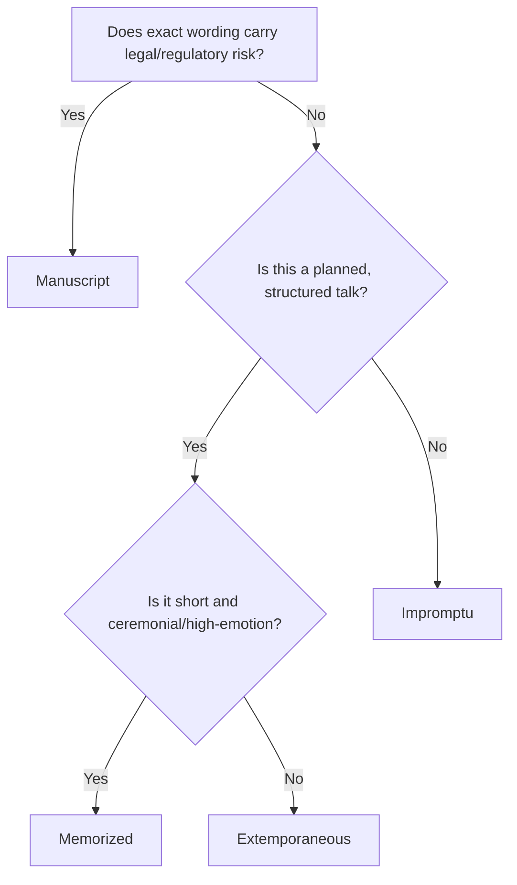

## Impromptu, Extemporaneous, Manuscript, and Memorized Delivery


### Overview

These four terms name the standard taxonomy of speech delivery methods taught in rhetoric and public speaking pedagogy, classified primarily by **degree of advance preparation** and **reliance on a fixed text**. Each method carries distinct tradeoffs across spontaneity, precision, audience connection, and risk of failure. Executive communicators typically move fluidly between extemporaneous and manuscript modes depending on stakes, audience, and legal/PR exposure, while impromptu skill functions as a baseline competency for Q&A and crisis response, and memorized delivery is largely reserved for ceremonial or highly rehearsed contexts (TED-style talks, award speeches, theatrical framing).

---

### Impromptu Delivery

**Definition**

Speaking with little or no advance preparation, typically formulated in the moments immediately before or during delivery.

**Key Characteristics**

- Minimal or no notes
- Structure generated in real time, often using mental templates (e.g., PREP, Rule of Three)
- High authenticity signal — audiences perceive impromptu speech as unfiltered and genuine
- Highest cognitive load; working memory must simultaneously generate content, structure, and delivery

**When It Is Used**

- Q&A sessions following a formal talk
- Media ambush interviews or unplanned press questions
- Toasts, introductions, and being "called on" in meetings
- Crisis moments requiring an immediate public response before a formal statement can be prepared

**Core Technique: PREP Structure**

A widely taught real-time scaffold:

- **P**oint — state the claim first
- **R**eason — justify it
- **E**xample — illustrate with a concrete case
- **P**oint — restate the claim to close the loop

**Example**

> Question: "Should our company adopt a four-day work week?"
>
> Impromptu PREP response: "Yes, I think we should pilot it. [Point] Because the data from comparable firms shows productivity holding steady while retention improves. [Reason] Microsoft Japan's 2019 trial, for instance, reported a substantial productivity increase during its four-day pilot. [Example] So a structured pilot here could give us the retention benefit without the productivity risk. [Point]"

**Strengths**

- Demonstrates command of subject matter under pressure
- Builds perceived trustworthiness (nothing to hide, nothing scripted)
- Essential for handling hostile or unexpected questions

**Weaknesses**

- Highest risk of misstatement, rambling, or legally exposed language
- No opportunity to vet phrasing for sensitive topics (compliance, HR, litigation)
- Executives are often coached to **bridge** into a more prepared talking point rather than remain purely impromptu on high-stakes topics

**Executive Communication Note**

Media training frequently blends impromptu skill with pre-loaded "message discipline" — executives rehearse 3–5 core messages in advance so that impromptu answers can pivot ("bridge") back to safe, pre-approved territory rather than being purely improvised. [Inference] This hybrid approach is widely used in executive media training, though specific technique names vary by coaching firm.

---

### Extemporaneous Delivery

**Definition**

Delivery that is thoroughly prepared and rehearsed in terms of structure and content, but not scripted word-for-word; the speaker uses a keyword outline or brief notes and generates exact phrasing in the moment.

**Key Characteristics**

- Full outline prepared in advance (main points, sub-points, transitions, evidence)
- Wording is fresh each time, even across repeated deliveries of the "same" speech
- Balances spontaneity (natural phrasing, adaptability, eye contact) with reliability (planned structure, vetted content)
- Considered the default recommended mode in most public speaking and rhetoric curricula

**Typical Notes Format**

A keyword/phrase outline, often on index cards or a single sheet — never full sentences:

```plaintext
I. OPEN — hook: customer story (Acme Corp delay)
II. PROBLEM — 3 pain points: cost, latency, support
III. SOLUTION — new platform: architecture diagram, 2 case studies
IV. ASK — pilot program, Q3 timeline
V. CLOSE — callback to Acme story
```

**Strengths**

- Adapts naturally to audience reactions (can expand, compress, or reorder on the fly)
- Sounds conversational and authentic while remaining structurally sound
- Reduces risk of monotone "reading voice" common in manuscript delivery
- Allows genuine eye contact and audience engagement throughout

**Weaknesses**

- Requires more rehearsal than manuscript delivery to internalize structure
- Precise wording is not guaranteed — riskier for legally sensitive or highly quotable statements
- Novice speakers may drift, ramble, or lose their place without a full script to fall back on

**Executive Communication Note**

Extemporaneous delivery is the standard for keynotes, all-hands meetings, board updates, and most investor presentations, because it signals command of the material (unlike manuscript reading) while still permitting rehearsal of key data points and transitions. [Inference] This preference is broadly documented in executive communication and public speaking literature, though exact adoption rates by organization are not independently verifiable.

---

### Manuscript Delivery

**Definition**

Reading a speech from a fully written, word-for-word script.

**Key Characteristics**

- Every word is planned and fixed in advance
- Requires deliberate technique to avoid sounding "read" (vocal variety, planned pauses, practiced eye contact off the page)
- Guarantees precise wording — critical when exact phrasing carries legal, diplomatic, or reputational weight

**When It Is Used**

- Legal or regulatory statements (SEC disclosures, litigation-related remarks)
- Diplomatic and policy statements where a single word choice can be scrutinized internationally
- State of the Union-style addresses and formal government speeches
- Earnings calls' prepared remarks section (before moving to extemporaneous Q&A)
- Crisis communications where legal counsel has reviewed and approved exact language

**Techniques for Naturalness**

- **Chunking**: breaking the script into short phrase groups with marked pauses, rather than reading sentence-by-sentence
- **Teleprompter technique**: maintaining eye contact with the audience/camera rather than visibly scanning a page
- **Vocal marking**: annotating the script with stress, pitch, and pause cues
- **Rehearsal to internalization**: practicing enough that the script feels generated rather than recited

**Example (annotated script excerpt)**

```plaintext
Today, / I want to address / three concerns / raised by our shareholders. // 
[PAUSE] 
First — / the timeline. // 
[SLOW DOWN] We remain fully committed / to the Q4 delivery date. //
```

**Strengths**

- Maximum precision and control over wording
- Essential where legal review of exact language is required
- Eliminates risk of misstatement or forgotten content
- Can be pre-cleared by legal, PR, or communications teams

**Weaknesses**

- High risk of sounding flat, disconnected, or insincere if poorly delivered
- Reduces adaptability to audience reaction
- Perceived by audiences as less authentic than extemporaneous delivery if the "reading" is visible

**Executive Communication Note**

Manuscript delivery is standard for the scripted portion of earnings calls and formal regulatory statements precisely because exact wording has legal consequences (e.g., forward-looking statement disclaimers, materiality language); the same executive typically shifts to extemporaneous delivery once Q&A begins.

---

### Memorized Delivery

**Definition**

A fully written speech that is committed to memory and delivered without notes or a script in view.

**Key Characteristics**

- Combines the precision of manuscript wording with hands-free, notes-free delivery
- Demands significant rehearsal time relative to speech length
- Carries the highest risk of visible failure (forgetting a line, freezing) since there is no fallback text

**When It Is Used**

- Ceremonial speeches: wedding toasts, eulogies, award acceptance speeches
- TED-style talks, where walking a stage without notes is a genre convention
- Oratory competitions and debate (e.g., original oratory events)
- Short, high-emotional-impact segments embedded within a longer extemporaneous talk (a memorized opening or closing line)

**Strengths**

- Enables full physical freedom (stage movement, gesture, sustained eye contact)
- Can achieve very high polish and emotional impact when executed well
- No barrier (notes, podium, script) between speaker and audience

**Weaknesses**

- Memory failure under pressure can be catastrophic and difficult to recover from
- Delivery can sound "recited" rather than spontaneous if not well-rehearsed for natural cadence
- Impractical for long-form content (most business communication exceeds practical memorization limits)
- Inflexible — cannot adapt wording if circumstances change immediately before delivery

**Executive Communication Note**

Full memorization is rare in executive contexts due to length and last-minute revision needs, but a **hybrid technique** is common: memorizing the opening hook and closing line of an otherwise extemporaneous talk, so the highest-impact moments land with maximum polish while the body retains adaptive flexibility. [Inference] This hybrid opening/closing memorization approach is a commonly taught technique in speaker coaching, though its prevalence among executives specifically is not independently quantifiable.

---

### Comparative Summary

| Dimension | Impromptu | Extemporaneous | Manuscript | Memorized |
| --- | --- | --- | --- | --- |
| Prep time | None | Moderate–High | High | Very High |
| Wording fixed? | No | No | Yes | Yes |
| Notes used | None/minimal | Keyword outline | Full script | None |
| Adaptability | Highest | High | Low | Lowest |
| Precision risk | Highest | Moderate | Lowest | Low (if recalled correctly) |
| Perceived authenticity | Highest | High | Lowest (if visibly read) | Variable |
| Failure mode | Rambling, weak structure | Minor disfluency | Sounding "read," flat affect | Forgetting, freezing |
| Typical executive use | Q&A, crisis first response | Keynotes, all-hands, board updates | Legal statements, earnings script | Ceremonial, opening/closing hooks |

---

### Decision Framework (Choosing a Delivery Method)



---

### Practical Guidance for Executive Communicators

- **Default to extemporaneous** for the majority of internal and external presentations — it best balances credibility, adaptability, and preparation efficiency.
- **Reserve manuscript delivery** for moments where legal, compliance, or communications teams require pre-approved exact language.
- **Train impromptu skill deliberately** — most executive communication failures occur in unscripted Q&A or media ambush moments, not in prepared remarks.
- **Use memorization sparingly and strategically** — a memorized opening line and closing line can bookend an otherwise extemporaneous talk for maximum polish without the full risk profile of complete memorization.
- Behavior described here reflects standard rhetoric and communication-coaching practice; actual outcomes depend on speaker skill, audience, rehearsal quality, and organizational context, and may vary.

---

**Related Topics**

- Message discipline and bridging techniques in media training
- Rhetorical canon: *Memoria* and *Actio* (classical foundations of delivery and memorization)
- Teleprompter technique and eye-contact management on camera
- Crisis communication delivery choices (why crisis statements are almost always manuscript)
- Vocal delivery mechanics: pacing, pitch variation, strategic pausing
- Q&A bridging and pivoting techniques for impromptu risk mitigation
- Nonverbal delivery and stage presence across delivery modes