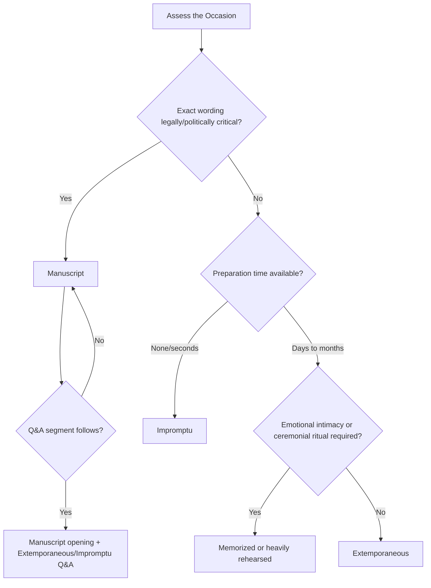

## Choosing the Right Method for the Occasion

### Overview

Selecting a delivery method is a strategic decision, not a default. The four canonical methods—impromptu, extemporaneous, manuscript, and memorized—each optimize for a different combination of variables: preparation time, precision requirements, audience relationship, emotional register, and risk tolerance. Executive and public speakers rarely commit to one method exclusively; they diagnose the occasion and select (or blend) accordingly.

### The Four Delivery Methods: Quick Reference

| Method | Preparation | Precision | Flexibility | Risk Profile |
| --- | --- | --- | --- | --- |
| Impromptu | None/minimal | Low | Highest | High (variance) |
| Extemporaneous | Moderate-high | Moderate-high | High | Low-moderate |
| Manuscript | High | Highest | Lowest | Low (reading risk) |
| Memorized | Highest | High (if executed well) | Low | Moderate-high (blanking risk) |

### Diagnostic Framework: Variables That Drive the Choice

**Key Points**

- **Stakes of exact wording** — legal, regulatory, diplomatic, or crisis communications where a single misstated word carries consequence push toward manuscript.
- **Available preparation time** — a reporter's question in a hallway forces impromptu; a keynote scheduled months out affords extemporaneous or memorized preparation.
- **Audience relationship and expected intimacy** — audiences expect conversational connection in town halls or team meetings, which favors extemporaneous delivery; they expect polish in televised addresses, which favors manuscript.
- **Length and complexity of content** — dense technical or financial content with many precise figures is difficult to sustain from memory or notes alone without manuscript support.
- **Medium and recording context** — anything being recorded for broadcast, transcribed for legal record, or quoted in press tends toward manuscript to control the exact record.
- **Speaker's skill and comfort level** — a highly practiced speaker can extemporize material that a less experienced speaker would need to script.
- **Occasion formality and ritual function** — ceremonial speech (eulogies, toasts, awards) often uses memorized or manuscript delivery because the moment itself demands crafted, unhesitating language.

### Occasion-by-Occasion Guidance

#### Boardroom and Executive Briefings

Extemporaneous delivery is the default. Executives need to project command of material while retaining the ability to pivot when a board member interrupts with a question or challenges a figure. A skeleton outline or key-message card supports this without constraining responsiveness. Manuscript delivery in a boardroom often reads as evasive or over-lawyered unless the content is specifically legal or regulatory disclosure language, in which case precision outweighs the appearance of spontaneity.

#### Press Conferences and Media Statements

A hybrid approach is standard: an opening statement is often manuscript (to control exact quotable language, especially on sensitive topics) followed by a Q&A segment delivered impromptu or extemporaneously. [Inference] The perceived credibility trade-off—manuscript signals control but can appear guarded, while impromptu answers signal authenticity but raise error risk—is why organizations frequently script only the opening and prepare Q&A through anticipated-question drilling rather than full scripting.

#### Crisis Communication

Manuscript delivery, or at minimum a tightly extemporaneous approach anchored to pre-cleared key messages, is preferred. In crisis contexts, legal and reputational exposure from an imprecise word choice generally outweighs the warmth lost by reading from a script. Organizations typically pre-draft holding statements precisely because crises compress the available preparation time to near zero, and manuscript is the only method that guarantees message discipline under that compression.

#### Keynotes and Conference Talks

Extemporaneous is the professional norm, often supported by slides functioning as the outline. Fully memorized delivery is used by highly rehearsed speakers (TED-style talks) to achieve a polished, present-with-audience effect, but carries higher blanking risk without a visible fallback (slides or notes) to recover from.

#### Ceremonial Speech (Toasts, Eulogies, Awards, Tributes)

Memorized or heavily-rehearsed extemporaneous delivery is favored because the audience expects the speaker to be emotionally present and looking at them, not at a page. A eulogy read verbatim from a manuscript can feel emotionally distant precisely when connection matters most. [Inference] Speakers commonly memorize the opening and closing lines while extemporizing the middle from a mental outline, balancing polish at the highest-stakes moments (first and last impressions) against flexibility in the body.

#### Legislative Testimony and Regulatory Hearings

Manuscript delivery for the formal statement (frequently submitted in advance as written testimony) followed by impromptu or extemporaneous responses to questioning. The written record requirement in these settings makes manuscript close to mandatory for the prepared portion.

#### Team Meetings, Town Halls, Internal Updates

Extemporaneous or impromptu, depending on notice given. These settings reward conversational tone and responsiveness; manuscript delivery here often undermines trust by appearing rehearsed or insincere for a low-stakes, high-familiarity audience.

#### Toast/Q&A/Interview Formats

Almost always impromptu or lightly extemporaneous with pre-thought talking points, since the interactive, unscripted format is the genre's defining feature.

### Decision Diagram

### Hybrid and Layered Approaches

**Example**

A CEO delivering quarterly earnings might combine all four methods in a single event:

1. **Manuscript** — for forward-looking statements and regulated financial disclosures (SEC-sensitive language must be exact).
2. **Extemporaneous** — for the narrative discussion of strategy and market conditions, using a slide deck as the outline.
3. **Memorized** — for a brief opening hook or closing call-to-action designed to land with maximum polish.
4. **Impromptu** — for the analyst Q&A that follows.

This layering allows the speaker to allocate risk tolerance deliberately: highest control where consequences are highest (disclosures), highest connection where audience trust is being built (narrative and closing), and highest authenticity where credibility depends on unscripted responsiveness (Q&A).

### Common Misjudgments

- **Over-scripting low-stakes internal talks** — using manuscript for a team update erodes trust and reads as distancing.
- **Under-preparing high-stakes public remarks** — attempting extemporaneous delivery for a legally sensitive statement risks imprecise language that can be quoted out of context or create liability.
- **Memorizing without a fallback** — full memorization without notes or slides as a safety net creates catastrophic failure risk if the speaker blanks under pressure; experienced speakers typically keep a minimal cue outline even when performing from memory.
- **Ignoring medium constraints** — broadcast and recorded settings generally demand tighter control (manuscript or rehearsed extemporaneous) than live-only settings, since recorded misstatements persist and circulate.

### Assessment Checklist for Method Selection

1. Will this be quoted, recorded, or entered into a legal/regulatory record?
2. How much preparation time exists between now and delivery?
3. Does the audience expect and reward spontaneity, or does the occasion's formality demand polish?
4. What is the cost of a wording error versus the cost of appearing rehearsed or distant?
5. Does the speaker have the skill and rehearsal time to execute the higher-risk methods (memorized, full extemporaneous) reliably?
6. Is a hybrid structure appropriate—scripting only the highest-risk segments while leaving lower-risk segments flexible?

**Related Topics**

- Impromptu Speaking Techniques and Structuring on the Fly
- Extemporaneous Delivery: Outlining and Rehearsal Strategies
- Manuscript Speaking: Formatting Scripts for Natural Delivery
- Memorized Delivery and Cognitive Load Management
- Crisis Communication Message Discipline
- Q&A Preparation and Anticipated-Question Drilling
- Teleprompter Technique and Eye-Contact Management
- Matching Register and Formality to Audience Expectations