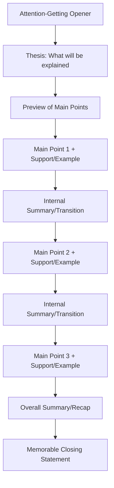

## Informative Speaking Techniques

### Overview

Informative speaking aims to increase audience understanding of a subject without advocating a position or calling for action. Its success is measured by comprehension and retention, not persuasion. This distinguishes it structurally and rhetorically from persuasive or ceremonial speech: the speaker functions as a teacher or explainer, and technique centers on clarity, organization, and cognitive load management rather than emotional appeal or argumentation.

### Core Principles

**Key Points**

- **Audience-centered calibration** — content depth and vocabulary must match the audience's existing knowledge; overestimating prior knowledge causes confusion, underestimating it causes disengagement.
- **Objectivity and neutrality** — informative speech presents facts, processes, or concepts without urging belief or action; crossing into advocacy shifts the genre into persuasive speech.
- **Clarity over comprehensiveness** — selecting the right amount of material for the time available matters more than exhaustive coverage; cognitive load research suggests audiences retain a limited number of new main points per sitting.
- **Concrete before abstract** — grounding abstract concepts in tangible examples, analogies, or demonstrations before generalizing improves retention.
- **Structural signposting** — explicit verbal markers ("first," "next," "in contrast") help audiences track structure without visual aids.

### Types of Informative Speeches

| Type | Focus | Example Topic |
| --- | --- | --- |
| Speech about objects | Physical or conceptual "things" | How a jet engine works |
| Speech about processes | Sequences and procedures | How a bill becomes law |
| Speech about events | Historical or current happenings | The 2008 financial crisis |
| Speech about concepts | Abstract ideas, theories, principles | Behavioral economics |

### Organizational Patterns

The choice of organizational pattern should match the nature of the content:

- **Chronological** — for processes and events, ordered by time sequence (e.g., explaining a project's history or a manufacturing process).
- **Spatial** — for objects or systems with physical or geographic structure (e.g., describing a building's floors or a supply chain's geography).
- **Topical/Categorical** — for concepts with natural sub-divisions (e.g., three types of renewable energy).
- **Causal** — for explaining why something happens or happened, useful for events and some processes.
- **Complexity/Comparative** — building from simple to complex, or comparing a new concept to something the audience already understands.

### Technique: The Explanatory Analogy

Mapping an unfamiliar concept onto a familiar structure reduces cognitive load by letting the audience reuse an existing mental model rather than building one from scratch. Effective analogies preserve the structural relationships that matter for the current explanation while omitting details that would mislead (e.g., "a firewall is like a security guard checking IDs at a door" conveys gatekeeping but omits protocol-level nuance appropriately for an introductory audience).

**Example**

Explaining API rate limiting to a non-technical audience: "Think of it like a coffee shop that only lets a certain number of customers in per hour to avoid overcrowding — some requests wait in line, and if the shop is completely full, new customers are turned away until space opens up." This analogy preserves the essential mechanism (a capped throughput with queuing and rejection behavior) while omitting implementation detail (token buckets, sliding windows) irrelevant to the audience's needs.

### Technique: Definitional Strategies

For technical or unfamiliar terms, four common definitional approaches:

1. **Definition by classification** — placing a term in a known category, then differentiating it ("A stablecoin is a cryptocurrency [category] designed to maintain a fixed value relative to a reference asset [differentiation]").
2. **Definition by function** — describing what something does rather than what it is.
3. **Definition by negation** — clarifying by contrast with what the term is not.
4. **Definition by etymology or example** — using origin or a concrete instance to anchor meaning.

### Technique: Signposting and Internal Summaries

Because informative speech is often linear and content-dense, explicit verbal transitions prevent audience disorientation:

- **Previews** — stating what will be covered before covering it ("There are three phases to this process...").
- **Internal summaries** — briefly recapping a completed section before moving to the next, reinforcing retention at natural break points.
- **Signpost words** — "first/second/third," "on the other hand," "as a result" — make structural relationships audible without slides.

### Technique: Visual and Multimedia Support

**Key Points**

- Visual aids should simplify, not duplicate, spoken content; text-heavy slides compete with the speaker for audience attention (a phenomenon sometimes called the redundancy effect in cognitive load research).
- Diagrams and process visuals are most effective for spatial or sequential content where verbal description alone strains working memory.
- Demonstrations (physically showing a process) are highly effective for procedural informative speech but require rehearsal to avoid technical failure undermining credibility.

#### Visual Aid Selection Matrix (svg_diagram)

<svg xmlns="http://www.w3.org/2000/svg" viewBox="0 0 720 320">
\<style\>
.title { font: bold 15px sans-serif; fill: #1a1a1a; }
.box { fill: #eef3fb; stroke: #4a6fa5; stroke-width: 1.5; }
.label { font: 12px sans-serif; fill: #1a1a1a; }
.sub { font: 10.5px sans-serif; fill: #444; }
\</style\>
<text x="20" y="24" class="title">Visual Aid Selection Matrix (svg_diagram)</text>
<rect x="20" y="50" width="200" height="90" class="box" rx="6" />
<text x="35" y="72" class="label">Process content</text>
<text x="35" y="90" class="sub">→ Flowchart / sequence</text>
<text x="35" y="106" class="sub">diagram</text>
<rect x="260" y="50" width="200" height="90" class="box" rx="6" />
<text x="275" y="72" class="label">Spatial content</text>
<text x="275" y="90" class="sub">→ Map, floor plan,</text>
<text x="275" y="106" class="sub">or labeled diagram</text>
<rect x="500" y="50" width="200" height="90" class="box" rx="6" />
<text x="515" y="72" class="label">Comparative content</text>
<text x="515" y="90" class="sub">→ Table or</text>
<text x="515" y="106" class="sub">side-by-side chart</text>
<rect x="20" y="170" width="200" height="90" class="box" rx="6" />
<text x="35" y="192" class="label">Quantitative content</text>
<text x="35" y="210" class="sub">→ Bar/line graph</text>
<rect x="260" y="170" width="200" height="90" class="box" rx="6" />
<text x="275" y="192" class="label">Physical objects</text>
<text x="275" y="210" class="sub">→ Physical model or</text>
<text x="275" y="226" class="sub">live demonstration</text>
<rect x="500" y="170" width="200" height="90" class="box" rx="6" />
<text x="515" y="192" class="label">Abstract concepts</text>
<text x="515" y="210" class="sub">→ Analogy-based</text>
<text x="515" y="226" class="sub">illustration</text>
</svg>

### Technique: Managing Audience Knowledge Gaps

- **Pre-assessment** — inferring or asking about audience background before or during the speech (e.g., a show of hands) to calibrate depth in real time.
- **Layered explanation** — giving a simple version first, then adding nuance for those who want it ("at a high level, X happens; more precisely, X happens because of Y and Z").
- **Chunking** — breaking dense content into digestible units, generally no more than three to five main points for a single sitting, aligning with working memory constraints. [Inference] Retention outcomes vary by audience and content complexity, so this is a general planning heuristic rather than a fixed rule.

### Technique: Avoiding Persuasive Drift

Because informative and persuasive speech share surface features (both use evidence, structure, and delivery skill), speakers must actively guard against unintentionally advocating a position:

- Present multiple perspectives on contested facts rather than one interpretation as settled.
- Use hedged, attributive language for disputed claims ("researchers have found," "the data suggests") rather than assertive framing.
- Avoid loaded language or emotionally charged framing that implies a value judgment.
- Distinguish established fact from interpretation explicitly when the topic contains both.

### Structural Template

### Common Pitfalls

- **Information overload** — cramming too many facts or points, exceeding audience processing capacity and reducing overall retention.
- **Jargon without translation** — using specialized vocabulary the audience hasn't been given tools to decode.
- **Weak organization** — jumping between points without clear structure, forcing the audience to reconstruct logic themselves.
- **Passive voice overuse** — reduces clarity and energy in explanatory passages ("the process is completed by the system" vs. "the system completes the process").
- **Neglecting the "why should I care" hook** — even purely informative content benefits from establishing relevance to the audience early, without crossing into persuasive appeal.

### Delivery Considerations Specific to Informative Speech

Because informative speech often carries higher information density than persuasive or ceremonial speech, extemporaneous delivery with strong visual support is typically favored over memorized delivery, allowing the speaker to slow down, repeat, or elaborate in response to visible audience confusion — a responsiveness that memorized or manuscript delivery constrains.

**Related Topics**

- Persuasive Speaking Techniques and the Line Between Informing and Persuading
- Designing Effective Slide Decks for Technical Audiences
- Audience Analysis and Knowledge-Level Calibration
- Using Analogy and Metaphor in Technical Communication
- Cognitive Load Theory Applied to Public Speaking
- Structuring Process Explanations and Demonstration Speeches
- Q&A Facilitation for Informative Presentations