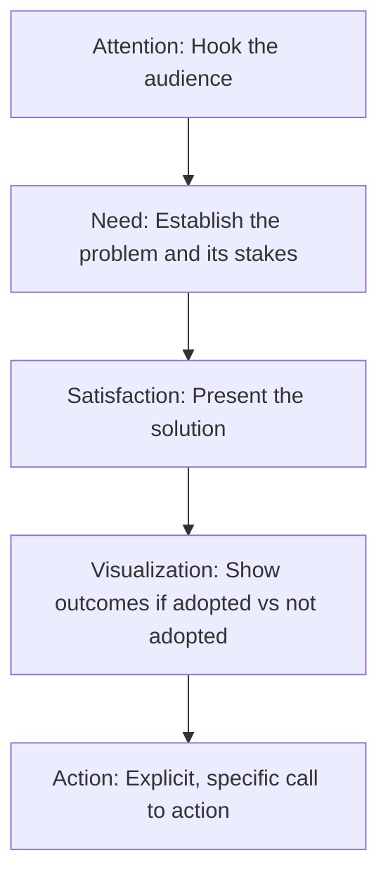

## Persuasive Speaking Techniques

### Overview

Persuasive speaking aims to influence audience beliefs, attitudes, or actions. Unlike informative speech, it explicitly advocates a position and seeks a change in the audience's cognitive or behavioral state. Its techniques draw on classical rhetoric, argumentation theory, and social-psychological research on attitude change, and its success is measured by movement toward the speaker's advocated position, not merely comprehension.

### The Classical Foundation: Ethos, Pathos, Logos

**Key Points**

- **Ethos** — appeals to speaker credibility, competence, and character; established through expertise signals, trustworthiness, goodwill toward the audience, and consistency between the speaker's stated values and prior behavior.
- **Pathos** — appeals to audience emotion; used to make abstract stakes feel immediate and personally relevant, but risks appearing manipulative if unsupported by substance.
- **Logos** — appeals to logic and evidence; structured through claims, data, and reasoning that the audience can evaluate and, ideally, independently verify.
- Effective persuasive speech integrates all three rather than relying on one exclusively; audiences that detect an imbalance (e.g., pure emotional appeal without evidence) often discount the message.

### Toulmin Model of Argument

A structural framework for building defensible persuasive claims:

| Element | Function | Example |
| --- | --- | --- |
| Claim | The position being argued | "The city should invest in bus rapid transit." |
| Grounds | Evidence supporting the claim | "Comparable cities saw 30% ridership increases." |
| Warrant | The logical link between grounds and claim | "Ridership increases indicate reduced congestion." |
| Backing | Support for the warrant itself | "Transit studies across 12 cities confirm this pattern." |
| Qualifier | Limits on the claim's strength | "In most mid-sized urban areas..." |
| Rebuttal | Acknowledged exceptions or counterarguments | "Except where existing infrastructure is inadequate." |

Explicitly constructing grounds, warrant, and rebuttal (rather than claim and grounds alone) makes an argument more resistant to audience counterarguing, since unaddressed objections are the most common source of persuasion failure.

### Organizational Patterns for Persuasive Speech

- **Problem-Solution** — establishing a problem's significance before presenting the advocated solution; effective when the audience doesn't yet perceive the problem as urgent.
- **Comparative Advantage** — assuming audience agreement that a problem exists, and arguing the speaker's solution outperforms alternatives; effective when multiple solutions are already being debated.
- **Monroe's Motivated Sequence** — a five-step sequence (Attention, Need, Satisfaction, Visualization, Action) designed to move an audience from awareness to committed action; widely used in fundraising, advocacy, and sales contexts because it embeds a call to action structurally rather than appending one at the end.
- **Cause-Effect** — establishing a causal chain to justify why a particular intervention is warranted.
- **Refutation** — organizing around anticipated counterarguments, presenting and then dismantling each in turn; effective with a skeptical or hostile audience already aware of opposing views.

### Monroe's Motivated Sequence in Detail

**Example**

A pitch for adopting a new internal tool: Attention ("Our team lost 40 engineering hours last month to manual deployment errors"), Need ("Without automation, this cost scales linearly with team growth"), Satisfaction ("This CI/CD pipeline eliminates the manual step entirely"), Visualization ("Teams that adopted it cut deployment incidents by 70%; without it, we're on track to double incident volume next quarter"), Action ("Approve the two-week pilot starting Monday").

### Techniques for Building Credibility (Ethos)

- **Demonstrated expertise** — citing relevant experience, credentials, or direct familiarity with the subject, stated without excessive self-promotion.
- **Fairness signaling** — acknowledging the strongest counterargument before rebutting it, which paradoxically increases perceived trustworthiness more than ignoring it.
- **Consistency** — aligning the speaker's advocated position with their known prior actions or stated values; perceived hypocrisy is highly damaging to persuasive credibility.
- **Goodwill** — explicitly framing the argument around audience interest rather than purely speaker interest.

### Techniques for Emotional Appeal (Pathos)

**Key Points**

- **Narrative and anecdote** — a single vivid, concrete case often moves audiences more than aggregate statistics alone, a pattern sometimes discussed as the "identifiable victim effect" in psychological literature; combining narrative with statistics leverages both emotional and logical appeal. [Inference] The relative persuasive weighting of narrative versus statistics varies by audience and topic, so this should be treated as a general tendency rather than a fixed ratio.
- **Vivid, concrete language** — sensory and specific language creates stronger mental imagery than abstract description, increasing message memorability.
- **Calibrated intensity** — emotional appeals that exceed what the evidence supports risk backfiring by appearing manipulative; matching emotional intensity to the actual stakes preserves credibility.
- **Fear appeals** — effective only when paired with a clear, feasible action the audience can take to address the threat; fear without an actionable solution tends to produce avoidance or denial rather than persuasion (consistent with the Extended Parallel Process Model in persuasion research).

### Techniques for Logical Appeal (Logos)

- **Statistical evidence** — using relevant, sourced, and appropriately contextualized data; audiences are more persuaded by statistics that are framed relative to a meaningful baseline than raw numbers alone.
- **Expert testimony** — citing recognized authorities, which functions as borrowed ethos supporting the logical structure.
- **Analogical reasoning** — arguing that because two cases are similar in relevant respects, a conclusion true of one likely holds for the other; vulnerable to attack if the disanalogy is significant.
- **Syllogistic and enthymematic reasoning** — structuring arguments as premises leading to a conclusion; effective persuasive speech often leaves the most agreeable premise unstated (enthymeme), inviting the audience to supply it themselves, which increases perceived ownership of the conclusion.

### Addressing Counterarguments: Refutation Technique

A four-step structure for refutation is commonly taught:

1. **State the opposing argument** fairly and without strawmanning.
2. **State your response** clearly.
3. **Support your response** with evidence or reasoning.
4. **Summarize** why your position remains stronger after the exchange.

Explicit refutation is particularly important with audiences that are already aware of counterarguments; omitting acknowledgment of a well-known objection can reduce credibility even if the omission is unintentional.

### Audience Adaptation

| Audience Disposition | Recommended Approach |
| --- | --- |
| Favorable | Reinforce existing belief, focus on call to action and intensity |
| Neutral/Uninformed | Prioritize logos and clear explanation of stakes before advocacy |
| Hostile/Opposed | Lead with common ground, use refutation pattern, moderate claims |
| Apathetic | Lead with pathos and personal relevance before evidence |

### Elaboration Likelihood Model (ELM) Considerations

[Unverified] Persuasion research (notably Petty and Cacioppo's Elaboration Likelihood Model) distinguishes a "central route" (audience carefully evaluates argument quality, favored when motivation and ability to process are high) from a "peripheral route" (audience relies on heuristic cues like speaker credibility or emotional tone, favored when motivation or ability is low). Speakers should assess which route is likely operative for their specific audience and occasion, since strong logical arguments are wasted on a distracted or low-involvement audience, while emotional and credibility cues alone are insufficient for a highly analytical, high-stakes audience.

### Ethical Boundaries in Persuasive Technique

**Key Points**

- Persuasion differs from manipulation in that it respects audience autonomy — it presents genuine reasons the audience can evaluate, rather than exploiting cognitive biases to bypass evaluation.
- Fabricated statistics, misrepresented sources, or false urgency violate both ethical and (in professional/legal contexts) regulatory standards.
- Slippery-slope, strawman, ad hominem, and false-dilemma reasoning are common fallacies that undermine long-term credibility even when they produce short-term persuasive gains.

### Common Pitfalls

- **Overclaiming** — asserting certainty beyond what evidence supports, which invites easy rebuttal and damages credibility once discovered.
- **Ignoring the strongest counterargument** — leaving an obvious objection unaddressed signals either unawareness or evasion.
- **Emotional appeal without substance** — relying solely on pathos invites the audience to dismiss the argument as manipulation once the emotional moment passes.
- **Weak call to action** — a vague or unmemorable action step undermines an otherwise strong persuasive structure, particularly in Monroe's Motivated Sequence, where the Action step is the entire point of the preceding four steps.
- **Audience misjudgment** — using central-route argumentation on a low-involvement audience, or peripheral-route appeals on a highly analytical one, reduces effectiveness regardless of argument quality.

**Related Topics**

- Toulmin Argumentation Model in Depth
- Monroe's Motivated Sequence: Structuring Calls to Action
- Logical Fallacies and Their Rhetorical Detection
- Ethics of Persuasion: Manipulation vs. Legitimate Influence
- Audience Analysis for Persuasive Occasions
- Elaboration Likelihood Model and Dual-Process Persuasion Theory
- Crafting Rebuttals and Refutation Structures