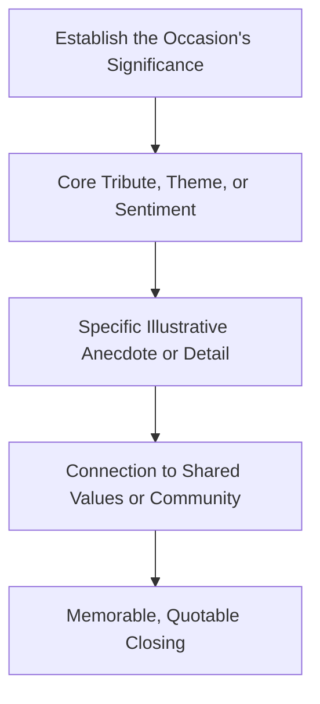

## Special-Occasion and Ceremonial Speaking

### Overview

Ceremonial (epideictic) speaking marks, honors, or interprets a shared occasion rather than informing or persuading toward a specific decision. Rooted in Aristotle's third rhetorical genre alongside deliberative and forensic speech, epideictic rhetoric functions to reinforce shared values, celebrate or memorialize, and strengthen communal or organizational identity. Its rhetorical goal is affirmation and meaning-making in the present moment rather than future action or judgment of past fact.

### Epideictic Rhetoric: The Classical Frame

**Key Points**

- **Aristotle's tripartite division** places epideictic (ceremonial) speech alongside deliberative (policy/future-action) and forensic (judicial/past-fact) rhetoric as one of three fundamental oratorical purposes.
- **Praise and blame** — epideictic speech traditionally centers on praising virtue or, less commonly, condemning vice, using the occasion to reinforce audience values by celebrating what the community esteems.
- **Present-tense orientation** — unlike deliberative speech (future) or forensic speech (past), epideictic speech is oriented to the present, using the shared moment itself as its organizing frame.
- **Communal reinforcement function** — the speech's success is measured by whether it strengthens shared identity and values, not by whether it changes a specific belief or produces a decision.

### Common Ceremonial Speech Types

| Type | Purpose | Typical Length |
| --- | --- | --- |
| Toast | Brief celebratory tribute, often at a social event | 1-3 minutes |
| Eulogy | Honoring and memorializing the deceased | 3-7 minutes |
| Speech of introduction | Establishing credibility and rapport for a following speaker | 1-2 minutes |
| Speech of presentation/award | Honoring an achievement or recipient | 2-5 minutes |
| Speech of acceptance | Responding to receiving an honor or award | 1-3 minutes |
| Commencement/graduation address | Marking transition, offering wisdom to graduates | 8-15 minutes |
| Dedication/commemoration speech | Marking the founding or memory of a place, institution, or event | 5-10 minutes |
| After-dinner/entertaining speech | Light, often humorous remarks at a social or organizational gathering | 5-15 minutes |
| Roast | Affectionate, humorous mock-criticism of an honoree | 3-7 minutes |

### The Eulogy: Structure and Technique

A eulogy balances biographical narrative, emotional acknowledgment, and communal comfort. Common structural elements:

1. **Acknowledgment of loss** — naming the grief directly and validating shared emotion.
2. **Biographical anchor** — selecting a few defining stories or qualities rather than attempting a comprehensive life summary.
3. **Specific, sensory anecdotes** — concrete memories that let the audience recall the person vividly, rather than abstract praise ("she was kind" is less effective than a specific instance of kindness).
4. **Address to the deceased or shared values** — sometimes a direct address, sometimes an articulation of what the person's life exemplified.
5. **Closing that offers continuity** — connecting the person's legacy or values to how the community or family moves forward.

[Inference] Because eulogies are emotionally demanding to deliver, speakers commonly favor memorized or heavily-rehearsed extemporaneous delivery for the opening and closing lines specifically, while allowing the biographical middle section more flexibility, since audience expectation of composure is highest at the beginning and end.

### The Toast: Structure and Technique

Toasts are compressed ceremonial speech and depend heavily on economy of language:

1. **Brief context** — one sentence establishing the speaker's relationship to the honoree or occasion.
2. **Core tribute** — the central sentiment, often built around a single quality, memory, or wish.
3. **Explicit invitation to toast** — a clear closing line cueing the audience to raise glasses ("To [name]...").

**Example**

"I've known Mara since our first year of law school, when she was the only person willing to argue with the professor and win. Mara, your stubbornness has made you a formidable advocate and an even better friend. To Mara — may your arguments always be this good, and your friends always this loyal."

### The Speech of Introduction

Purpose is to build the audience's anticipation and the incoming speaker's credibility, not to deliver the introducing speaker's own content:

- **Brevity discipline** — introductions should be shorter than the audience expects, since the audience came to hear the introduced speaker, not the introducer.
- **Relevant credibility signals** — selecting credentials or achievements specifically relevant to the topic at hand, not an exhaustive biography.
- **Building anticipation** — framing why this speaker, on this topic, at this moment, matters to this audience.
- **Correct name and title delivery** — verifying pronunciation and correct titles in advance; errors here are highly visible and undermine the introduction's purpose.

### Speeches of Presentation and Acceptance

**Presentation speeches** explain why the recipient merits the honor, typically covering the award's significance, the selection criteria, and specific accomplishments that qualify the recipient. **Acceptance speeches** balance gratitude, humility, and acknowledgment of others who contributed to the achievement, while avoiding both false modesty and self-aggrandizement. A common structural risk in acceptance speeches is an unfocused list of thanks that loses audience attention; naming a small number of specific contributions or contributors, rather than an exhaustive list, generally sustains audience engagement better.

### Commencement and Commemorative Addresses

These longer-form ceremonial genres blend epideictic praise with limited deliberative elements (implicit guidance for the future), structured typically around:

1. Marking the significance of the transition or occasion.
2. A central theme or piece of counsel, often illustrated through personal narrative or a shared cultural reference.
3. Connecting the theme to the audience's forthcoming path.
4. A memorable, quotable closing charge.

### Humor in Ceremonial Speech: The After-Dinner Speech and Roast

Humor-centered ceremonial genres require careful calibration:

- **Affectionate rather than cruel framing** — roast humor works because it operates within an implicit understanding of mutual respect; humor perceived as genuinely mean-spirited breaks the ceremonial frame.
- **Self-deprecation as a safety valve** — speakers often include self-directed humor to establish that the room's teasing is mutual and good-natured.
- **Callback structure** — referencing an earlier joke or shared detail later in the speech rewards audience attention and reinforces a sense of shared experience.
- **Reading the room in real time** — because comedic ceremonial speech depends on audience reaction for pacing, extemporaneous or well-rehearsed (not fully manuscript) delivery allows the speaker to adjust timing based on audience response.

### Organizational Pattern for Ceremonial Speech

### Delivery Considerations Specific to Ceremonial Speech

Ceremonial occasions place a premium on the speaker appearing present and emotionally engaged with the audience, since the genre's function is communal connection rather than information transfer. This generally favors memorized delivery of key framing lines (openings, closings, central tribute lines) combined with extemporaneous delivery of the narrative middle, allowing eye contact and emotional presence at the moments the audience is most attentive, while retaining flexibility to adjust pacing based on audience reaction (laughter, emotion, applause).

### Common Pitfalls

- **Excessive length** — ceremonial speech genres are almost universally shorter than the speaker's instinct suggests; audiences rarely criticize brevity in these genres.
- **Generic sentiment** — relying on platitudes ("she touched everyone she met") without specific, concrete illustration reduces perceived sincerity.
- **Inappropriate register** — humor that misjudges the occasion's tone (e.g., excessive levity at a memorial, or excessive solemnity at a light celebratory toast) breaks audience expectation for the genre.
- **Self-focus in acceptance or toast speeches** — centering the speaker's own narrative rather than the honoree or occasion undermines the genre's communal function.
- **Reading visibly from notes during emotionally intimate moments** — perceived as distancing when the genre's expectation is presence and connection.

**Related Topics**

- Delivering Eulogies: Balancing Composure and Emotion
- Writing and Timing Effective Toasts
- Speech of Introduction Best Practices
- Humor Techniques for After-Dinner and Roast Speeches
- Commencement Address Case Studies and Rhetorical Analysis
- Epideictic Rhetoric in Classical and Contemporary Theory
- Managing Emotional Delivery Under Audience Observation