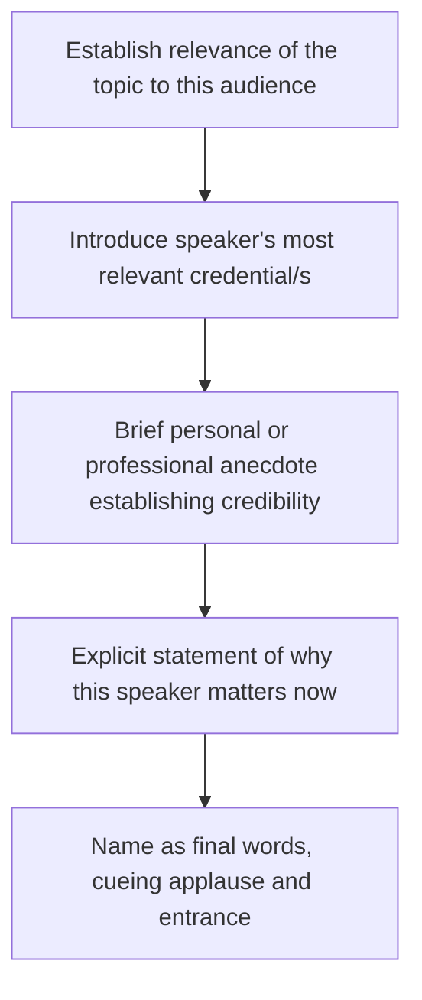

## Introductions, Toasts, and Tributes

### Overview

Introductions, toasts, and tributes form a family of short-form ceremonial speech genres unified by their function: they exist in service of another person or moment rather than to advance the speaker's own argument or narrative. Each is brief by convention, socially ritualized, and judged primarily on whether it appropriately elevates its subject without overreaching into self-focus. This item extends the broader ceremonial-speaking category with technique specific to these three short forms.

### Comparative Overview

| Genre | Subject Being Honored | Primary Function | Typical Length |
| --- | --- | --- | --- |
| Introduction | An upcoming speaker | Build credibility and anticipation for the speaker to come | 1-2 minutes |
| Toast | A person, couple, or occasion | Offer a public tribute, often cued to a shared drink | 1-3 minutes |
| Tribute | A person's character, career, or legacy | Recognize and articulate the significance of a person's contribution | 3-8 minutes |

### Speeches of Introduction: Technical Structure

**Key Points**

- **Function precedes content** — the introducer's job is to make the audience want to hear the next speaker, not to summarize or preempt that speaker's material.
- **Credibility curation** — selecting two or three credentials most relevant to the specific talk, rather than a full biography, keeps the introduction focused and useful to the audience.
- **The "why this, why now" frame** — the strongest introductions briefly explain why this speaker's expertise matters to this particular audience on this particular occasion.
- **Correct and rehearsed proper nouns** — verifying name pronunciation, exact titles, and organizational affiliations in advance; an error here is highly visible and reflects poorly on the introducer's preparation.
- **A clean handoff** — ending with the speaker's name as the final words, timed so the audience begins applauding as the name is said, cueing the incoming speaker's entrance.

#### Introduction Template

**Example**

"Supply chain resilience isn't theoretical for this room — half of you dealt with a shipment delay last quarter. Our next speaker spent twelve years rebuilding logistics networks after natural disasters, most recently leading recovery efforts across three countries in eighteen months. She's going to tell us what she learned that most contingency plans get wrong. Please welcome Elena Vasquez."

### Toasts: Technical Structure and Variants

A toast is a compressed epideictic form where economy of language is the primary technical constraint — most toasts fail by running too long, not too short.

**Standard toast structure:**

1. **Establish standing** — a brief line establishing the speaker's relationship to the honoree, which grounds the audience in why this speaker is toasting.
2. **Core sentiment** — the single central tribute, built around one clear quality, memory, or wish rather than several competing ideas.
3. **Explicit toast cue** — a clear closing phrase that signals the audience to raise glasses, typically beginning with "To..." followed by the honoree's name or the occasion.

#### Toast Variants by Occasion

| Occasion | Tonal Register | Typical Focus |

 

| Wedding | Warm, often lightly humorous | Relationship between the couple, shared history with speaker |

| Retirement | Celebratory, retrospective | Career contribution, personal qualities, transition ahead |

| Anniversary (personal or organizational) | Reflective, appreciative | Endurance, growth, shared milestones |

| Farewell | Bittersweet | Impact made, well-wishes for what's next |

| New Year/holiday | Light, forward-looking | Shared hope or intention for the coming period |

**Example**

Retirement toast: "For thirty years, Raymond has been the person new hires went to when nobody else had an answer — and somehow he always did. The department will run without him, but it won't run the same way. To Raymond — thank you for three decades of patience, and enjoy every minute of not answering your phone on weekends."

### Tributes: Technical Structure

Tributes are longer-form recognition speeches, distinct from eulogies in that the honoree is typically present (or the tribute marks an achievement or retirement rather than a death) and from toasts in their greater length and narrative depth.

**Key elements:**

1. **Framing the significance** — establishing early why this person or contribution merits sustained attention.
2. **Specific, illustrative narrative** — one or two detailed anecdotes rather than a list of accomplishments; specificity produces stronger audience connection than a comprehensive résumé recitation.
3. **Articulating impact beyond the individual** — connecting the honoree's contribution to its effect on others, the organization, or the community.
4. **Direct address** — tributes frequently shift from speaking about the honoree to speaking directly to them, which increases emotional immediacy for both the honoree and audience.
5. **Forward-looking or legacy-oriented closing** — connecting the tribute's subject to ongoing impact or inspiration.

### Delivery Method Considerations Across the Three Genres

- **Introductions** are typically extemporaneous from brief notes; because they are short and formulaic, full memorization is common among frequent public speakers (event hosts, emcees) but not required.
- **Toasts** benefit from memorized or near-memorized delivery of the opening and closing lines specifically, since eye contact with the honoree during the core sentiment and toast cue carries significant social weight; reading a toast from a phone or card is broadly considered to undercut its sincerity.
- **Tributes**, being longer, often use extemporaneous delivery from a structured outline, with the most emotionally significant lines (the direct address, the closing) more heavily rehearsed or memorized.

### Common Pitfalls Across These Genres

- **Length miscalibration** — the single most common failure across all three genres is running long; audiences rarely object to brevity in ceremonial short forms.
- **Centering the speaker** — using the introduction, toast, or tribute as a platform for the speaker's own stories unrelated to the honoree shifts focus away from the genre's purpose.
- **Generic sentiment without specificity** — vague praise ("he's such a great guy") is less effective and less memorable than one concrete, well-chosen anecdote.
- **Mispronounced names or incorrect details** — particularly damaging in introductions, where accuracy signals preparation and respect.
- **Missing or unclear toast cue** — ending a toast without a clear "To..." line leaves the audience uncertain when to raise glasses, undercutting the ritual's closure.
- **Reading unfamiliar or unrehearsed material verbatim** — particularly in toasts and tributes, visible reading during emotionally significant lines can appear distancing precisely when connection matters most.

**Related Topics**

- Special-Occasion and Ceremonial Speaking (broader genre context)
- Delivering Eulogies: Balancing Composure and Emotion
- Master of Ceremonies (Emcee) Technique for Multi-Speaker Events
- Managing Nerves in Short-Form Public Ceremonial Speech
- Cultural Variation in Toast and Tribute Conventions
- Writing Concise, High-Impact Short Speeches