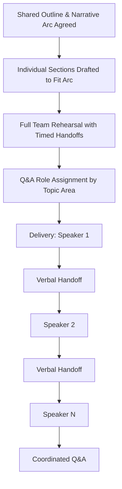

## Group and Panel Presentations

### Overview

Group and panel presentations involve multiple speakers coordinating to deliver content to a shared audience, distinguishing them structurally from solo speech genres. Success depends not only on individual delivery skill but on coordination, role clarity, transition management, and moderation technique. This genre spans several distinct formats — team presentations, panel discussions, symposiums, and forums — each with different coordination demands.

### Format Taxonomy

| Format | Speaker Interaction | Moderator Role | Typical Use |
| --- | --- | --- | --- |
| Team/group presentation | Sequential, coordinated single narrative | Often none (internal coordination only) | Business proposals, project reports, academic group projects |
| Panel discussion | Conversational, responsive to moderator and each other | Central, active | Conference sessions, expert discussions |
| Symposium | Sequential individual speeches on a shared theme | Light, mainly introductory/transitional | Academic conferences, multi-perspective topic coverage |
| Forum | Open audience Q&A following presentation(s) | Active, manages audience participation | Town halls, public consultations |

### Team/Group Presentations: Coordination Technique

**Key Points**

- **Narrative unity over individual segments** — the presentation should read as one coherent argument delivered by multiple voices, not a sequence of disconnected individual talks; this requires shared outlining before individual sections are drafted.
- **Explicit handoffs** — each speaker should verbally bridge to the next ("Now that we've covered the market opportunity, Priya will walk through our go-to-market plan"), preventing jarring transitions and reinforcing structural coherence for the audience.
- **Balanced time allocation** — negotiating speaking time in advance and rehearsing against the clock prevents one section from crowding out others, a common failure mode in under-rehearsed team presentations.
- **Consistent visual and verbal style** — shared slide templates, consistent terminology, and aligned framing prevent the audience from perceiving the team as uncoordinated.
- **Anticipated Q&A role assignment** — deciding in advance which team member fields which category of question prevents awkward silence or cross-talk during audience questions.

#### Team Presentation Coordination Flow

**Example**

A four-person product pitch team might allocate: Speaker A (problem/market, 3 min) → handoff → Speaker B (solution/demo, 4 min) → handoff → Speaker C (business model/traction, 3 min) → handoff → Speaker D (ask/close, 2 min), with each transition explicitly naming what was just covered and what comes next, and a pre-agreed rule that technical questions route to Speaker B and financial questions route to Speaker C.

### Panel Discussions: Roles and Technique

Panels involve a moderator and multiple panelists in a conversational, often unscripted format, requiring distinct technique for each role.

#### Moderator Technique

- **Pre-panel preparation** — briefing panelists on question topics (though not exact scripted answers) in advance reduces dead air and helps panelists prepare relevant examples without making the discussion feel rehearsed.
- **Question design** — open-ended questions that invite substantive response ("What's the biggest misconception about X?") generate more engaging discussion than closed or yes/no questions.
- **Active floor management** — redirecting dominant panelists, drawing out quieter ones, and enforcing rough time balance are core moderator responsibilities; without active management, panels often skew toward whichever panelist is most naturally talkative.
- **Synthesis and bridging** — briefly summarizing or connecting panelist responses before the next question demonstrates active listening and helps the audience track the conversation's throughline.
- **Time and pacing control** — moderators typically track time against a rundown, reserving explicit buffer for audience Q&A at the end.

#### Panelist Technique

- **Concise responses** — panel format rewards answers of roughly 60-90 seconds; monologuing crowds out other panelists and can strain moderator management.
- **Building on other panelists** — explicitly agreeing, disagreeing, or extending a previous panelist's point ("Building on what Marcus said...") creates a more dynamic, conversational feel than isolated individual answers.
- **Concrete example anchoring** — grounding abstract points in specific examples or brief anecdotes, since panel audiences often retain concrete stories better than abstract claims delivered in a conversational format.
- **Reading the moderator's cues** — recognizing when a moderator is signaling a wrap-up (time constraints, redirect) and yielding the floor gracefully.

### Symposium Technique

In a symposium, each speaker delivers an individually prepared speech on a shared overarching theme, more akin to sequential solo speeches than a conversational panel:

- **Thematic coherence without content duplication** — speakers coordinate in advance to avoid substantially overlapping content while still supporting the shared theme.
- **Consistent framing devices** — a moderator or chair typically opens by establishing the shared theme and closes by drawing connections across the individual speeches.
- **Individual delivery method autonomy** — because symposium speakers give fully prepared individual speeches, each may select their own delivery method (manuscript, extemporaneous) independent of other speakers, unlike team presentations which typically require stylistic alignment.

### Forum Technique

Forums prioritize structured audience participation following one or more presentations:

- **Ground rules communication** — moderators typically establish speaking time limits, question format, and any topic scope constraints at the outset to manage a potentially large or diverse audience.
- **Microphone and queue management** — logistics (roaming mic, line management, moderator triage of raised hands) become a meaningful technical component at scale.
- **Neutral restatement** — moderators often paraphrase audience questions before the panel responds, ensuring the full room hears the question and allowing brief clarification of unclear or overly long audience questions.
- **De-escalation technique** — for contentious public forums, moderators need prepared strategies for redirecting hostile or repetitive questioning without appearing dismissive.

### Visual and Logistical Coordination

**Key Points**

- **Single shared deck vs. sequential decks** — team presentations typically use one shared slide deck to reinforce unity; panels and symposiums may forgo slides entirely or use minimal individual visual aids depending on format norms.
- **Physical staging** — seating arrangement (semicircle for panels vs. lectern-and-screen for team presentations) shapes both non-verbal coordination and audience perception of formality.
- **Microphone and technical rehearsal** — multi-speaker formats have substantially higher technical failure risk (mic handoffs, slide advance coordination) than solo speeches, making a technical run-through a higher-priority preparation step.

### Common Pitfalls

- **Uncoordinated narrative** — team presentations that read as disconnected individual segments rather than a unified argument, usually resulting from drafting sections independently without a shared outline first.
- **Uneven time allocation** — one team member or panelist consuming disproportionate time, typically from insufficient rehearsal against a clock or a moderator failing to enforce balance.
- **Weak or absent handoffs** — abrupt speaker transitions without verbal bridging disorient the audience and undercut perceived team coordination.
- **Moderator over-talking** — a moderator who answers their own questions or dominates airtime undermines the panel format's core value of multiple perspectives.
- **Unprepared Q&A routing** — team presentations without pre-assigned question ownership risk cross-talk, contradiction, or awkward silence when fielding audience questions.
- **Rehearsing individually but never together** — the most common root cause of poor group coordination; individual section quality does not guarantee a coherent combined presentation.

**Related Topics**

- Moderating Panel Discussions: Advanced Facilitation Technique
- Managing Q&A Sessions and Handling Hostile Questions
- Slide Deck Coordination for Multi-Speaker Presentations
- Nonverbal Coordination and Staging for Group Speaking
- Structuring Symposium and Multi-Perspective Conference Sessions
- Time Management and Rehearsal Techniques for Team Presentations