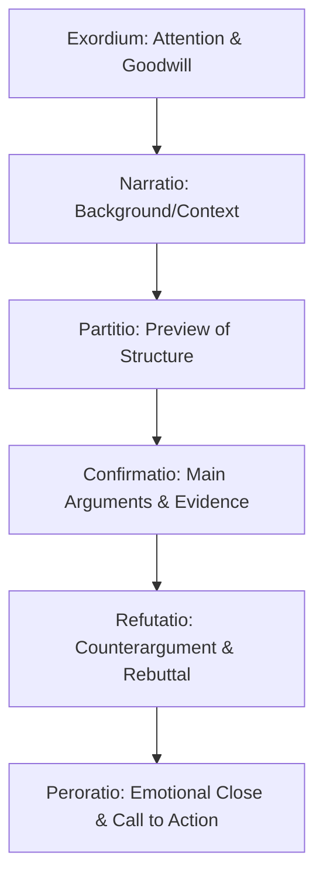

## Classical Speech Structure: Exordium to Peroration

### Overview

The classical rhetorical arrangement (dispositio) divides a persuasive speech into a sequence of functional parts, each with a distinct rhetorical job. Originating in Greco-Roman rhetorical theory (particularly systematized by Roman rhetoricians such as Cicero and Quintilian), this six-part structure remains the underlying skeleton of most formal persuasive speech today, even when speakers do not consciously label the parts.

### The Six Canonical Parts

| Latin Term | Function | Rough English Equivalent |
| --- | --- | --- |
| Exordium | Opens the speech, secures attention and goodwill | Introduction/hook |
| Narratio | Provides background and context | Statement of facts |
| Partitio (Divisio) | Previews the structure of the argument | Roadmap/preview |
| Confirmatio | Presents the main supporting arguments | Proof/body |
| Refutatio | Addresses and rebuts counterarguments | Rebuttal |
| Peroratio | Closes the speech, reinforces the central appeal | Conclusion |

### Structural Flow

### Exordium (Introduction)

**Key Points**

- **Primary function** — securing the audience's attention (*attentum*), goodwill toward the speaker (*benevolum*), and receptiveness to the message (*docilem*), a triad Cicero termed making the audience *attentive, well-disposed, and receptive*.
- **Common techniques** — a striking statistic, a brief anecdote, a provocative question, a relevant quotation, or direct acknowledgment of the occasion.
- **Establishing ethos early** — the exordium is often the primary vehicle for early credibility-building, since audiences form initial trust judgments quickly.
- **Calibrating tone to occasion** — an exordium's register (serious, light, urgent) sets audience expectations for the remainder of the speech; a mismatch here is difficult to correct later.

**Example**

"Three years ago, this district lost its only pediatric emergency room. Tonight, I want to talk about how we get it back." This exordium combines a concrete fact with a foreshadowed thesis, securing both attention and a preview of purpose.

### Narratio (Statement of Facts)

- **Function** — providing the audience with necessary background, context, or factual grounding before argumentation begins; particularly important when the audience may not share the speaker's assumed context.
- **Selectivity** — an effective narratio includes only facts relevant to the argument that follows, avoiding narrative excess that delays the main persuasive content.
- **Neutral framing** — classical theory treats the narratio as primarily factual rather than argumentative; overt advocacy is generally reserved for the confirmatio, though the selection and framing of "facts" inevitably carries some persuasive weight in practice. [Inference] The degree of neutrality achievable in a narratio depends on how contested the underlying facts are; in disputes over factual matters themselves, the narratio can become an early site of argument rather than pure background.

### Partitio (Divisio)

- **Function** — a brief preview stating the main points the confirmatio will cover, functioning similarly to a modern speech's "roadmap" or thesis preview.
- **Audience orientation benefit** — explicitly telling an audience what to expect reduces cognitive load, since listeners can allocate attention across a known structure rather than tracking an unpredictable sequence.
- **Modern equivalent** — this maps directly onto the contemporary practice of stating "I'll cover three things today: X, Y, and Z" early in a presentation.

### Confirmatio (Proof)

**Key Points**

- **Core persuasive content** — this is typically the longest section, containing the main arguments, evidence, and reasoning supporting the speech's thesis.
- **Argument sequencing** — classical theory recommends placing strong arguments early and late, with the weakest or most vulnerable argument in the middle, based on the (empirically supported in some persuasion research) primacy-recency effect on audience memory. [Inference] The optimal argument order can vary depending on audience familiarity and motivation, so this sequencing principle should be treated as a general heuristic rather than a universal rule.
- **Integration of ethos, pathos, logos** — the confirmatio is where the three classical appeals are most heavily deployed in combination, since this section carries the primary argumentative burden of the speech.
- **Use of the Toulmin elements** — modern practice often maps claim, grounds, warrant, and backing onto individual arguments within the confirmatio.

### Refutatio (Rebuttal)

- **Function** — anticipating and addressing counterarguments or objections the audience may hold, which strengthens the speaker's credibility and preempts audience counterarguing.
- **Placement flexibility** — while canonically placed after the confirmatio, refutatio elements are sometimes interwoven throughout the confirmatio in modern practice, particularly when specific counterarguments are closely tied to specific claims.
- **Fair representation requirement** — refuting a strawmanned or unfairly weakened version of the counterargument undermines credibility if the audience recognizes the misrepresentation; effective refutatio states the opposing view in its strongest form before countering it.
- **Audience-dependent necessity** — a refutatio is more critical for skeptical or informed audiences already aware of counterarguments, and less necessary for a uniformly sympathetic audience.

### Peroratio (Conclusion)

- **Dual function** — classical theory identifies two components: the *enumeratio* (a brief recap of main points) and the *affectus* (a final emotional appeal intended to leave a lasting impression).
- **Amplification** — the peroratio often restates the speech's central stakes with heightened intensity, since this is the audience's last impression and thus disproportionately influences overall recall and impact (a pattern consistent with the psychological recency effect).
- **Explicit call to action** — in deliberative (policy-persuasion) speech specifically, the peroratio typically culminates in a clear, actionable request.
- **Memorable closing device** — a callback to the exordium's opening image, a striking final statement, or a quotation are common techniques to create a strong final impression.

**Example**

Returning to the emergency room example: "Three years ago, we lost that emergency room. Tonight, you have the chance to vote to bring it back — not just for the families who remember what we lost, but for the ones who won't remember losing it at all, because we fixed it in time." This peroratio combines enumeration (referencing the earlier point), amplification (raising stakes to future families), and a call to action (the vote).

### Mapping Classical Structure to Modern Speech Genres

| Classical Part | Persuasive Speech | Informative Speech | Business Presentation |
| --- | --- | --- | --- |
| Exordium | Hook + credibility | Attention-getter | Opening hook/context |
| Narratio | Background on the issue | Context-setting | Problem statement/background |
| Partitio | Preview of argument structure | Preview of main points | Agenda slide |
| Confirmatio | Main arguments & evidence | Main content delivery | Data, analysis, recommendation |
| Refutatio | Addressing objections | (Often absent — informative genre avoids advocacy) | Addressing risks/alternatives |
| Peroratio | Emotional close + call to action | Summary + closing thought | Recommendation + next steps |

### Common Pitfalls

- **Omitting the partitio** — skipping the structural preview forces the audience to reconstruct the speech's organization as they listen, increasing cognitive load unnecessarily.
- **Overlong narratio** — excessive background delays the persuasive core of the speech and risks losing audience attention before the confirmatio even begins.
- **Weak or absent refutatio** — failing to address obvious counterarguments, particularly with an informed or skeptical audience, leaves the strongest objection unaddressed and available for the audience to silently hold against the speaker's position.
- **Peroratio that merely restates without amplifying** — a conclusion that flatly repeats prior points without emotional or rhetorical escalation underperforms audience recall and impact compared to a peroratio that intensifies the stakes.
- **Treating the structure as rigid rather than adaptive** — classical dispositio is a flexible analytical framework; forcing modern content into all six parts regardless of fit (e.g., inserting an unnecessary refutatio when no real counterargument exists) can produce padded, unfocused speech.

**Related Topics**

- Toulmin Argumentation Model in Depth
- Monroe's Motivated Sequence as an Alternative Structural Framework
- Ethos, Pathos, and Logos: Classical Appeals in Modern Persuasion
- Primacy-Recency Effects in Speech Organization
- Refutation Technique and Addressing Counterarguments
- Crafting Memorable Openings and Closings